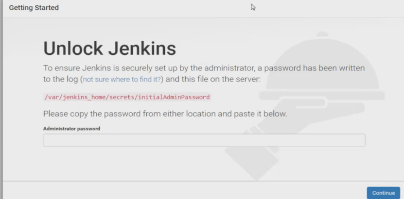
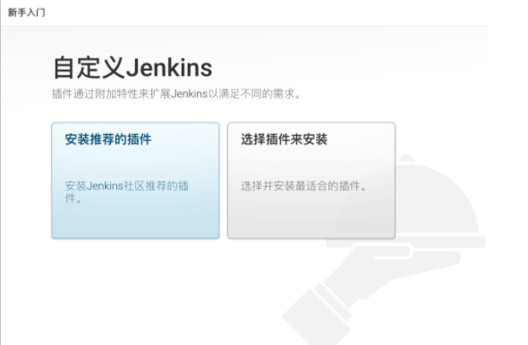
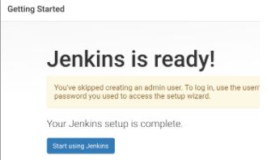
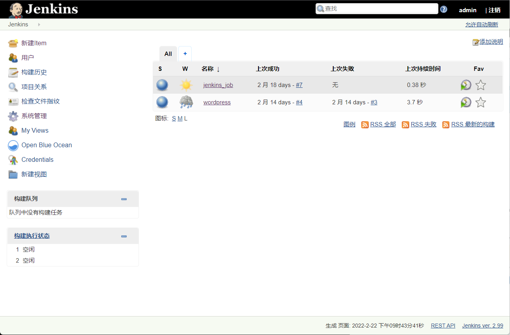

## 下载

Jenkins依赖于Java，所以我们要先安装一个tomcat，然后下载jenkins的包到tomcat的webapp下，改为ROOT.war，启动Tomcat即可。

> Jenkins官方网站 http://jenkins-ci.org/

下载包地址

```
http://mirrors.jenkins.io/war-stable/
```

> wget http://mirrors.jenkins.io/war-stable/latest/jenkins.war

jdk 下载地址

> http://www.oracle.com/technetwork/java/javase/downloads/jdk8-downloads-2133151.html

tomcat下载地址

```
https://tomcat.apache.org/download-80.cgi
```

> wget http://mirrors.tuna.tsinghua.edu.cn/apache/tomcat/tomcat-8/v8.5.41/bin/apache-tomcat-8.5.41.tar.gz

包

```
[root@jenkins jenkins]# ll
total 583236
-rw-r--r-- 1 root root      1357 Dec  5 10:09 java-demo.tar.gz
-rw-r--r-- 1 root root 167733100 Dec  5 10:09 jdk-8u121-linux-x64.rpm
-rw-r--r-- 1 root root  74141787 Dec  5 10:08 jenkins-2.99-1.1.noarch.rpm
drwxr-xr-x 9 root root       163 Dec 10 02:02 nexus-3.13.0-01
-rw-r--r-- 1 root root 122904706 Dec  5 10:09 nexus-3.13.0-01-unix.tar.gz
drwxr-xr-x 2 root root         6 Dec  5 21:49 plugins
-rw-r--r-- 1 root root 232436856 Dec  5 10:09 plugins.tar.gz
drwxr-xr-x 3 root root        20 Dec 10 02:02 sonatype-work

```

### 流程

!>开发 ---提交代码---> 版本库(svn|gitlab) --->  Jenkins ----> 服务器

- 需要用到的软件工具。 代码库（SVN/Git），Jenkins，如果是Java项目，则还可能用到nexus（maven的私服仓库），maven（打包工具）。
- 整套的工作流程是：开发人员进行项目开发—-提交代码到代码库—-在Jenkins上进行部署构建—-原本繁琐的一系列操作，就这么被Jenkins给一条龙服务了。
- 通过Jenkins 自己发布
- 一般公司至少都是有测试与生产环境两种（或者还会有预发的环境），两种环境最好分开部署两个Jenkins， 一方面利于权限管理，另一方面避免掉项目过多的误操作。

- 部署jdk
- 部署tomcat
- 部署Jenkins
- 配置Jenkins

### 配置jdk环境

```
[root@m01 ci_cd_rpm]# rpm -ivh jdk-8u121-linux-x64.rpm
准备中...                          ################################# [100%]
正在升级/安装...
   1:jdk1.8.0_121-2000:1.8.0_121-fcs  ################################# [100%]
Unpacking JAR files...
    tools.jar...
    plugin.jar...
    javaws.jar...
    deploy.jar...
    rt.jar...
    jsse.jar...
    charsets.jar...
    localedata.jar...
[root@m01 ci_cd_rpm]#
[root@m01 ci_cd_rpm]#
[root@m01 ci_cd_rpm]# java -version
java version "1.8.0_121"
Java(TM) SE Runtime Environment (build 1.8.0_121-b13)
Java HotSpot(TM) 64-Bit Server VM (build 25.121-b13, mixed mode)
```

### 安装jenkins

```
[root@m01 ci_cd_rpm]# rpm -ivh jenkins-2.99-1.1.noarch.rpm
警告：jenkins-2.99-1.1.noarch.rpm: 头V4 DSA/SHA1 Signature, 密钥 ID d50582e6: NOKEY
准备中...                          ################################# [100%]
正在升级/安装...
   1:jenkins-2.99-1.1                 ################################# [100%]


# 检查jenkins版本
[root@m01 ci_cd_rpm]# java -jar /usr/lib/jenkins/jenkins.war --version
2.99
```

### 启动jenkins

```
[root@m01 ci_cd_rpm]# systemctl start jenkins
[root@m01 ci_cd_rpm]# systemctl status jenkins

[root@m01 ci_cd_rpm]# netstat -tunlp |grep 8080
tcp6       0      0 :::8080                 :::*                    LISTEN      10819/java


# 注意关闭防火墙
iptables -F
```

### jenkins配置文件

jenkins没有数据库，所有的数据都是以文件的形式存在。

```
[root@m01 ci_cd_rpm]# rpm -ql jenkins
/etc/init.d/jenkins
/etc/logrotate.d/jenkins
/etc/sysconfig/jenkins
/usr/lib/jenkins
/usr/lib/jenkins/jenkins.war
/usr/sbin/rcjenkins
/var/cache/jenkins
/var/lib/jenkins
/var/log/jenkins


jenkins加载插件很多，非常吃内存，且所有操作都是io操作，需要系统IO速度较快，需要机器配置较高
jenkins配置文件：/etc/sysconfig/jenkins
jenkins核心目录：/var/lib/jenkins
/usr/lib/jenkins/jenkins.war WAR包
/etc/sysconfig/jenkins 配置文件
/var/lib/jenkins/ 默认的JENKINS_HOME目录
/var/log/jenkins/jenkins.log Jenkins日志文件
/var/lib/jenkins/secrets/initialAdminPassword 存放初始密码
/var/lib/jenkins/plugins    插件目录
```

## jenkins初始化

jenkins首次启动可能会出现页面访问一直提示：


```
[root@m01 jenkins]# cp hudson.model.UpdateCenter.xml hudson.model.UpdateCenter.xml.bak

# 修改如下配置
[root@m01 jenkins]# cat hudson.model.UpdateCenter.xml
<?xml version='1.0' encoding='UTF-8'?>
<sites>
  <site>
    <id>default</id>
    <url>http://mirror.xmission.com/jenkins/updates/update-center.json</url>
  </site>
</sites>


[root@m01 jenkins]# systemctl reload jenkins
[root@m01 jenkins]# systemctl restart jenkins
```

### 解锁jenkins



```
# 默认账号admin，密码如下
[root@m01 jenkins]# cat /var/lib/jenkins/secrets/initialAdminPassword
98da9a6fe9814531b790fbe125799bf0
```

### 自定义jenkins插件

后期手动安装



### 进入jenkins首页



