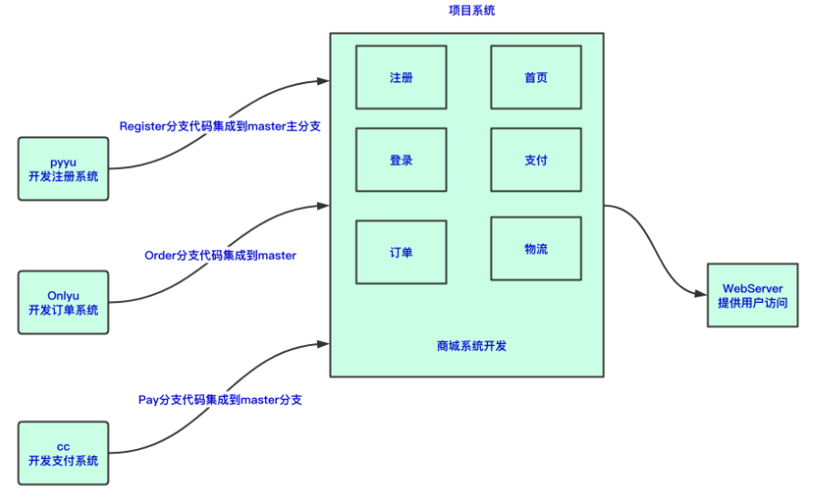
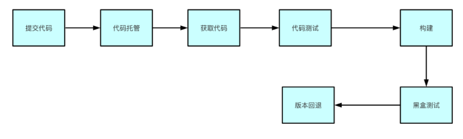

1.持续集成

- 让产品可以快速迭代，同时还能保持高质量，简化工作流程。

2.持续交付

- 让测试通过后的代码，可以准备用于部署
- 持续交付，重复前者所有的操作。

3.持续部署

- 基于交付集成之上，无论何时，代码都确保可以部署，且是自动化的。

4.持续集成实现的思路（git、jenkins、shell）

5.版本控制系统

- 将文件的每一次变化，集中在一个系统中加以版本记录，以便后续查阅文件的历史记录。

## 版本控制系统

- 常见版本控制系统
  - SVN ，集中式
  - Git，分布式
- git版本控制
  - 基本使用
  - git与github关联
- 代码托管平台
  - github
  - gitlab
    - 配置域名
    - 配置邮箱
    - gitlab基本使用
    - gitlab的用户组、用户、项目
    - gitlab基本运维、备份、恢复
- jenkins
  - jenkins是什么，干什么的，为什么要学它
  - jenkins安装、汉化
  - jenkins插件、加速插件、安装插件、导入本地插件
  - jenkins项目创建，自由风格项目，以及jenkins-shell
  - jenkins+gitlab
  - 手动搭建一套集群环境，然后实现代码上线
  - jenkins构建项目，html，php
  - jenkins构建项目脚本开发，部署、回滚
  - jenkins构建Java项目，编译、部署（jar，war）
  - jenkins通知功能
    - 邮件
    - 钉钉
  - 拿到源代码后，对源码进行质量扫描
    - SonarQube
      - 安装
      - 手动推代码至Sonarqube测试
      - jenkins集成SOnarqube
- jenkins流水线pipeline
  - pipeline语法
  - pipeline实现html项目流水线部署
  - pipeline实现java项目流水线部署
- jenkins分布式构建
- jenkins权限控制

## 什么是集成

在实际软件开发中，常会有如下两种场景：

1.现在有一个电商平台需要开发，由于电商平台模块众多，此时就需要不同开发人员开发不同的模块，最红把所有人的代码都集中到一个系统中。集成后对其进行部署上线。

2.随着时间的推移，无论是修复bug还是新功能开发，后续都要对系统进行不断的更新、迭代。



## 什么是持续集成（CI）

持续集成（Continuous integration ，CI）

持续集成就是在于”持续“两字，频繁的（一天多次）的将代码集成到主干(master)，重复如上的工作。

```
程序员
    ↓推代码
git仓库，gitlab
    ↓仓库通知CI服务器，jenkins
jenkins执行脚本，如对代码编译，测试，运行
    ↓通知集成结果
程序员对结果处理
```

### 使用持续集成好处

1.快速发现错误，每完成一点更新，就集成到主干，可以快速发现bug，也容易定位错误。

2.节省人力成本，省去手动反复部署操作

3.加快软件开发进程

4.实时交付

5.防止大幅度偏离主干，如果不经常集成，主干也在更新，会导致后续集成难度增大，或是难以集成。

### 使用持续集成目的

让产品可以快速迭代，同时还能保持高质量。（程序员写了新功能，很可能有bug，快速进行jenkins集成测试，能够快速发现bug，定位、解决bug，再次集成操作，整个过程自动化，非常高效且省时省力）

持续集成核心目的：代码集成到主干之前，对代码进行自动化测试。只要有一个测试用例失败，就不能集成，当然持续集成并不能完全的消除bug，主要目的是让bug更容易发现和改正。

### 什么情况需要持续集成

如果项目开发的规模较小，软件集成不是问题。

如果项目很大，需要不断添加新功能，或不断的升级产品，则需要进行反复集成，因此必须使用持续集成来简化工作。

# 持续交付（CD）

Continuous Delivery

交付，产品从开始到结束诞生的产物，在服务器上健康运行。

持续交付指的是在持续集成的环境基础之上，将代码部署到预生产环境。

- 持续集成对代码进行集成测试
- 持续交付，对代码进行部署

### 持续交付过程

- 代码开发
  - 开发自己单元测试
- 代码合并到主干
- 测试人员介入，功能测试、自动化测试
- 代码进行生产部署，jenkins一键自动化部署

## 持续部署(CD)

> Continuous Deployment

持续部署是持续交付的下一步，指代码在任何时刻都是可部署的，最后将部署到生产环境的过程自动化。

持续部署和持续交付的区别就在于最终部署到生产环境`是自动化的`。

当有人提交了代码,就自动的通知jenkins对代码进行构建 > 测试 > 确认代码可运行  > 构建到生产服务器 
整个过程全自动化，但是有可能出现难以预料的问题
最好的是半自动化，使用持续交付

## 持续集成实施流程

根据持续集成的设计，代码从提交到进入生产环境，整个过程如下：



## 版本控制系统解决了什么问题

1.追溯文件历史变更记录

2.多人团队协同开发

3.代码集中统一管理