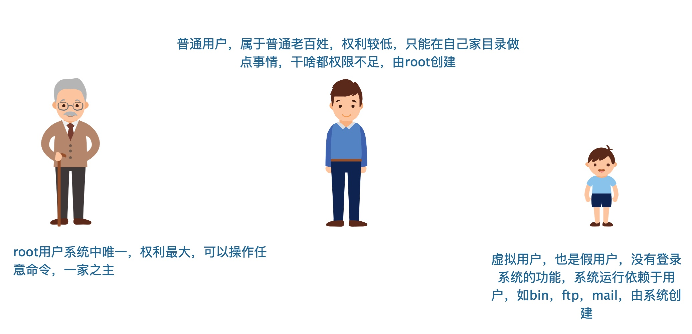
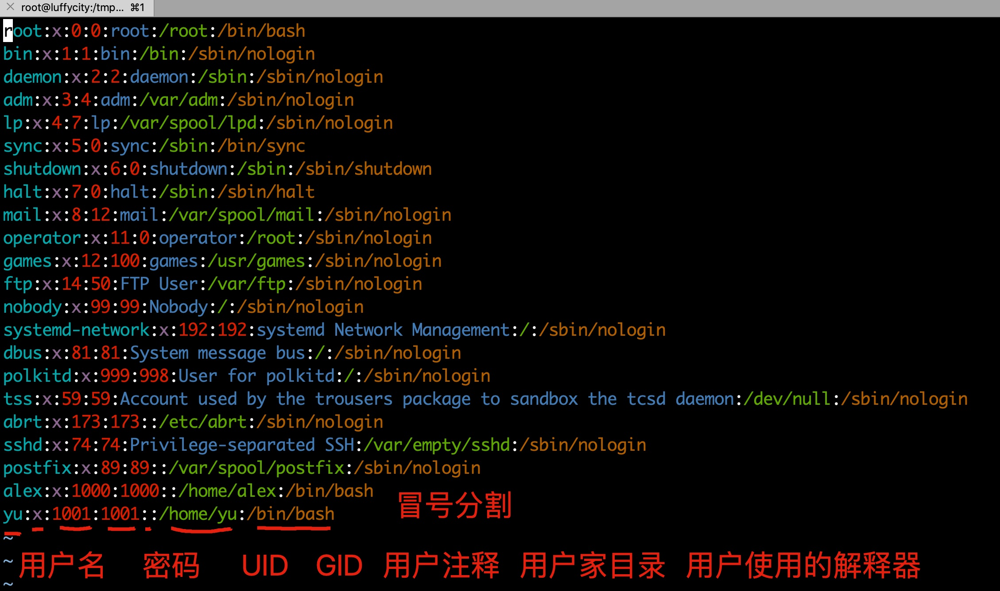
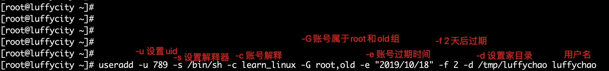

> 用户角色划分



- root
- 普通用户
- 虚拟用户

### root 的权利

Linux 系统的特性就是可以满足多个用户，同时工作，因此 Linux 系统必须具备很好的安全性。

在安装 RHEL7 时设置的 root 管理员密码，这个 root 管理员就是所有 UNIX 系统中的超级用户，它拥有最高的系统所有权，能够管理系统的各项功能，如添加/删除用户，启动/关闭进程，开启/禁用硬件设备等等。

因此“能力越大，责任越大”，root 权限必须很好的掌握，否则一个错误的命令可能会摧毁整个系统。

### root 为什么叫 root？

- UID，user Identify，好比身份证号
- GID，group Identify，好比户口本的家庭编号
- 在 Linux 系统中，用户也有自己的 UID 身份账号且唯一
- 在 Linux 中 UID 为 0，就是超级用户，如要设置管理员用户，可以改 UID 为 0，建议用 sudo
- 系统用户 UID 为 1~999 Linux 安装的服务程序都会`创建独有的用户`负责运行。
- 普通用户 UID 从 1000 开始：由管理员创建（centos7），最大值 1000~60000 范围
- centos6 创建普通用户是 500 开始

```
UID 用户id号，身份证号
GID 用户组id号，部门编号
root 用户、组、id都为0，属于老板
```

### 用户组 group

> 为了方便管理属于同一组的用户，Linux 系统中还引入了用户组的概念。通过使用用 户组号码(GID，Group IDentification)，我们可以把多个用户加入到同一个组中，从而方便为组中的用户统一规划权限或指定任务

Linux/unix 是一个多用户、多任务的操作系统。

root：默认在 Unix/linux 操作系统中拥有最高的管理权限。可以理解为 qq 群的群主

普通用户：是管理员或者具备管理权限的用户所创建的，只能读、看，不能增、删、改。

### 用户和组的关系

- 一对一，一个用户可以存在一个组里，组里就一个成员
- 一对多，一个用户呆在多个组里面
- 多对一，多个用户在一个组里，这些用户和组有相同的权限
- 多对多，多个用户存在多个组里

### 常用命令解释器

```
/bin/sh 默认
/bin/bash 默认
/sbin/nologin 虚拟用户
/dash ubuntu
csh unix
tsh unix
```

### 用户信息配置文件

```
/etc/passwd文件内容
```



```
/etc/passwd 用户信息
/etc/shadow  用户密码信息
/etc/group 用户组信息
/etc/gshadow 用户组密码信息
/etc/skel
```

### /etc/passwd 字段信息解释

| 字段名       | 解释                                                                                                            |
| ------------ | --------------------------------------------------------------------------------------------------------------- |
| 用户名       | 对应 UID，是用户登录系统的名字，系统中唯一不得重复                                                              |
| 用户密码     | 存放在/etc/shadow 文件中进行保护密码                                                                            |
| 用户 UID     | 用户 ID 号，由一个整数表示                                                                                      |
| 用户组 GID   | 范围、最大值和 UID 一样，默认创建用户会创建用户组                                                               |
| 用户说明     | 对此用户描述                                                                                                    |
| 用户家目录   | 用户登录后默认进去的家目录，一般是【/home/用户名】                                                              |
| shell 解释器 | 当前登录用户使用的解释器。centos/redhat 系统中，默认的都是 bash。若是禁止此用户登录机器，改为/sbin/nologin 即可 |

### 用户/密码文件权限

```
#用户信息文件，权限是644，所有人可读，有一定安全隐患
[root@pylinux ~]# ll /etc/passwd
-rw-r--r-- 1 root root 1698 10月 13 2021 /etc/passwd

#用户密码文件，除了root用户，其他用户默认是没有任何权限，
[root@pylinux ~]# ll /etc/shadow
---------- 1 root root 892 10月 20 2021 /etc/shadow

#用户密码文件
[root@pylinux ~]# tail -5 /etc/shadow
mysql:!!:17980::::::
yzh:$1$Kx9cz6sK$GE3jiHtjJikn9Ai4ECINn/:18031:0:99999:7:::
epmd:!!:18074::::::
rabbitmq:!!:18074::::::
py:!!:18182:0:99999:7:::
```

### 用户组/组密码文件

```
#用户组信息文件
/etc/group

#用户组密码文件
/etc/gshadow

对于大型服务器，用户和用户组数量较多，需要定制复杂的权限控制，会用到组密码
```

### 用户管理的命令

| 命令     | 作用                      |
| -------- | ------------------------- |
| useradd  | 创建用户                  |
| usermod  | 修改用户信息              |
| userdel  | 删除用户及配置文件        |
| passwd   | 更改用户密码              |
| chpasswd | 批量更新用户密码          |
| chage    | 修改用户密码属性          |
|          |                           |
| id       | 查看用户 UID、GID、组信息 |
| su       | 切换用户                  |
| sudo     | 用 root 身份执行命令      |
| visudo   | 编辑 sudoers 配置文件     |

_用户创建家目录过程_

```
1.命令创建
useradd yzh

2.系统把/etc/skel目录下的内容复制到创建的用户家目录
[root@docker01 skel]# pwd
/etc/skel
[root@docker01 skel]# ls -la
total 24
drwxr-xr-x.  3 root root   78 Oct 17 13:59 .
drwxr-xr-x. 85 root root 8192 Oct 17 14:03 ..
-rw-r--r--.  1 root root   18 Apr 11  2021 .bash_logout
-rw-r--r--.  1 root root  193 Apr 11  2021 .bash_profile
-rw-r--r--.  1 root root  231 Apr 11  2021 .bashrc
drwxr-xr-x.  4 root root   39 Oct 13 17:42 .mozilla

3.修改权限拥有者
[root@docker01 skel]# ls /home/yzh/ -la
total 16
drwx------. 3 yzh   yzh    99 Oct 16 18:36 .
drwxr-xr-x. 4 root root  28 Oct 16 18:35 ..
-rw-------. 1 yzh   yzh    77 Oct 16 18:36 .bash_history
-rw-r--r--. 1 yzh   yzh    18 Apr 11  2021 .bash_logout
-rw-r--r--. 1 yzh   yzh   193 Apr 11  2021 .bash_profile
-rw-r--r--. 1 yzh   yzh   231 Apr 11  2021 .bashrc
drwxr-xr-x. 4 yzh   yzh    39 Oct 13 17:42 .mozilla
```

### Centos7 忘记 root 密码

1.重启 linux，进入系统的 GRUB 菜单界面，按下小写字母 e 进入编辑界面

2.按下方向键，找到以字符串 Linux16 开头的行，光标移动到结尾，然后输入 init=/bin/bash enforcing=0 代表登录系统后，加载 bash 解释器，然后关闭 selinux


3.按下 ctrl+x 组合键以单用户模式启动 Linux

4.输入如下命令，重新挂载根目录，进入可写状态，因为默认单用户模式是只读的

```
mount -o rw,remount / #重新挂载
passwd root                        #修改密码
exec /sbin/init                #重启
```

5.改完毕密码后,重启系统

```
如果在第二步，没有添加enforcing参数的话，则需要额外的再添加命令
touch /.autorelabel
告诉系统下次启动重新标记系统所有相关文件，因为selinux在开启时，修改root密码引发安全报错
如果加了enforcing=0，则代表关闭了selinux，不需要再创建 /.autorelabel文件了
```

6.重启机器，验证新的密码

### useradd

useradd 命令用于 Linux 中创建的新的系统用户。

useradd 可用来建立用户帐号。帐号建好之后，再用 passwd 设定帐号的密码，而可用 userdel 删除帐号。

使用 useradd 指令所建立的帐号，实际上是保存在/etc/passwd 文本文件中。

```
-c<备注>：加上备注文字。备注文字会保存在passwd的备注栏位中；
-d<登入目录>：指定用户登入时的启始目录；
-D：变更预设值；
-e<有效期限>：指定帐号的有效期限；
-f<缓冲天数>：指定在密码过期后多少天即关闭该帐号；
-g<群组>：指定用户所属的群组；
-G<群组>：指定用户所属的附加群组；
-m：自动建立用户的登入目录；
-M：不要自动建立用户的登入目录；
-n：取消建立以用户名称为名的群组；
-r：建立系统帐号；
-s<shell>：指定用户登入后所使用的shell；
-u<uid>：指定用户id。
```

**创建用户流程**

- 1.useradd yzh
- 2.系统读取/etc/login.defs（用户定义文件），和/etc/default/useradd（用户默认配置文件）俩文件中定义的规则创建新用户
- 3.向/etc/passwd 和/etc/group 文件中添加用户和组信息，向/etc/shadow 和/etc/gshadow 中添加密码信息
- 4.根据/etc/default/useradd 文件中配置的信息创建用户家目录
- 5.把/etc/skel 中所有的文件复制到新用户家目录中

文件/etc/login.defs

```
[root@pylinux ~]# grep -v "^#" /etc/login.defs |grep -v "^$"
MAIL_DIR    /var/spool/mail        #用户的邮件存放位置
PASS_MAX_DAYS    99999                    #密码最长使用天数
PASS_MIN_DAYS    0                            #更换密码最短时间
PASS_MIN_LEN    8                        #密码最小长度
PASS_WARN_AGE    7                            #密码失效前几天开始报警
UID_MIN                  1000        #UID开始位置
UID_MAX                 60000        #UID结束位置
SYS_UID_MIN               201
SYS_UID_MAX               999
GID_MIN                  1000
GID_MAX                 60000
SYS_GID_MIN               201
SYS_GID_MAX               999
CREATE_HOME    yes                    #是否创建家目录
UMASK           077            #家目录的umask值
USERGROUPS_ENAB yes
ENCRYPT_METHOD MD5            #密码加密算法
MD5_CRYPT_ENAB yes
```

文件/etc/default/useradd

```
[root@pylinux ~]# grep -v "^#" /etc/default/useradd | grep -v "^$"
GROUP=100
HOME=/home                    #在/home目录下创建家目录
INACTIVE=-1                    #开启用户过期
EXPIRE=                            #用户终止日期
SHELL=/bin/bash            #新用户默认解释器
SKEL=/etc/skel            #用户环境变量文件存放目录
CREATE_MAIL_SPOOL=yes
```

创建用户有关的目录/etc/skel

此目录存放新用户需要的基础环境变量文件，添加新用户的时候，这个目录下所有文件自动被复制到新家目录下，且默认是隐藏文件，以点开头。

```
[root@pylinux ~]# ls -la /etc/skel/
总用量 28
drwxr-xr-x.  2 root root  4096 4月  11 12:59 .
drwxr-xr-x. 97 root root 12288 7月  11 05:14 ..
-rw-r--r--.  1 root root    18 4月  11 08:53 .bash_logout        #用户环境变量文件，退出加载
-rw-r--r--.  1 root root   193 4月  11 08:53 .bash_profile        #环境变量文件，登录加载
-rw-r--r--.  1 root root   231 4月  11 08:53 .bashrc                    #环境变量文件，登录加载
```

#### 如何恢复用户命令提示符

```
1.正常切换用户
su - yzh

[root@pylinux ~]# su - yzh
[yzh@pylinux ~]$

2.删除用户家目录下环境变量文件
[yzh@pylinux ~]$ rm -rf .bash*

3.退出登录，再次登录，发现命令提示符故障
[yzh@pylinux ~]$ logout
[root@pylinux ~]#
[root@pylinux ~]#
[root@pylinux ~]# su - yzh
上一次登录：三 7月 11 06:19:08 CST 2021pts/1 上
-bash-4.2$

4.恢复方法
-bash-4.2$ cp /etc/skel/.bash*  ~/
-bash-4.2$ logout
[root@pylinux ~]# su - yzh
上一次登录：三 7月 11 06:20:10 CST 2021pts/1 上
[yzh@pylinux ~]$
```

#### 用户管理命令案例

普通创建用户

```
[root@docker01 ~]# useradd yzh

[root@docker01 ~]# ls -l /home/
total 0
drwx------. 3 yzh yzh  78 Oct 17 14:42 yzh

[root@docker0` ~]# grep -w yzh /etc/passwd        #  grep过滤 -w必须全字符串匹配
yzh:x:1002:1002::/home/yzh:/bin/bash

[root@docker01 ~]# grep -w yzh  /etc/shadow        #默认没密码，通过passwd设置密码
yzh:!!:18186:0:99999:7:::

[root@docker01 ~]# grep -w yzh  /etc/group
yzh:x:1002:

[root@docker01 ~]# id yzh        #查看用户信息
uid=1002(yzh) gid=1002(yzh) groups=1002(yzh)
```

用户且指定 uid 和属组

```
1.创建用户组
groupadd -g 801 old

2.创建新用户
useradd -g old -u 888 oldchao

3.检查用户信息
[root@docker01 ~]# id oldchao
uid=888(oldchao) gid=801(old) groups=801(old)
```

-M -s 参数用法

```
#创建用户禁止登陆，且不创建家目录
[root@docker01 ~]# useradd -M -s /sbin/nologin oldyzh
[root@docker01 ~]# grep -w oldyzh /etc/passwd
oldyzh:x:1003:1003::/home/oldyzh:/sbin/nologin
[root@docker01 ~]# ls /home/    #没有oldyzh
alex  yzh  oldchao  yzh
```

多个参数用法，指定用户信息

```
[root@docker01 ~]# useradd -u 789 -s /bin/sh -c learn_linux -G root,old -e "2021/10/18" -f 2 -d /tmp/luffychao luffychao

[root@docker01 ~]# id luffychao    #检查用户信息
uid=789(luffychao) gid=1004(luffychao) groups=1004(luffychao),0(root),801(old)
```



_-D 参数用来修改配置文件/etc/default/useradd 文件的默认值_

```
useradd -D 参数选项

-e default_expire_date 用户停止日期
-s default_shell  用户登录后使用的解释器
```

-D 使用案例

```
[root@pylinux ~]# grep -i "shell" /etc/default/useradd        #检查默认创建用户的登录解释器
SHELL=/bin/bash
[root@pylinux ~]#
[root@pylinux ~]#
[root@pylinux ~]# useradd -D -s /sbin/nologin        #修改默认解释为禁止登录
[root@pylinux ~]# grep -i "shell" /etc/default/useradd        #检查配置文件参数
SHELL=/sbin/nologin
[root@pylinux ~]#
[root@pylinux ~]# useradd testyzh                                #此时创建新用户
[root@pylinux ~]# grep "testyzh" /etc/passwd            #检查信息，发现是禁止登录
testyzh:x:1002:1002::/home/testyzh:/sbin/nologin
[root@pylinux ~]# useradd -D -s /bin/bash                #最好还是改回去，防止后面出错
[root@pylinux ~]# grep -i "shell" /etc/default/useradd     #验证是否修改回来
SHELL=/bin/bash
```

### usermode 

usermod 命令用于修改系统已存在的用户信息，只能修改未使用中的用户

```
语法
usermod(选项)(参数)
选项
-c<备注>：修改用户帐号的备注文字；
-d<登入目录>：修改用户登入时的目录；
-e<有效期限>：修改帐号的有效期限；
-f<缓冲天数>：修改在密码过期后多少天即关闭该帐号；
-g<群组>：修改用户所属的群组；
-G<群组>；修改用户所属的附加群组；
-l<帐号名称>：修改用户帐号名称；
-L：锁定用户密码，使密码无效；
-s<shell>：修改用户登入后所使用的shell；
-u<uid>：修改用户ID；
-U:解除密码锁定。
```

案例

```
[root@docker01 ~]# usermod -u 788 -s /sbin/nologin  -c changeUser -G old -e "2020/10/10" -f 10 -d /home/luffychao luffychao
[root@docker01 ~]#
[root@docker01 ~]#
[root@docker01 ~]# id luffychao
uid=788(luffychao) gid=1004(luffychao) groups=1004(luffychao),801(old)
[root@docker01 ~]#
[root@docker01 ~]# grep -w luffychao /etc/passwd
luffychao:x:788:1004:changeUser:/home/luffychao:/sbin/nologin
```

### userdel 

删除用户与相关文件

- 建议注释/etc/passwd 用户信息而非直接删除用户

```
语法
userdel(选项)(参数)
选项
-f：强制删除用户，即使用户当前已登录；
-r：删除用户的同时，删除与用户相关的所有文件。
```

案例

```
[root@docker01 ~]# userdel oldyzh        #保留家目录
[root@docker01 ~]# userdel -rf oldchao    #强制删除用户与家目录
```

### groupadd 

**groupadd 命令**用于创建一个新的工作组，新工作组的信息将被添加到系统文件中。

```
语法
groupadd - 建立新群组
groupadd [ -ggid [ -o ]] [ -r ] [ -f ] group [[ ]]

选项
-g：指定新建工作组的id；
-r：创建系统工作组，系统工作组的组ID小于500；
-K：覆盖配置文件“/ect/login.defs”；
-o：允许添加组ID号不唯一的工作组。
```

案例

```
group -g 801 old
```

### groupmod

Linux groupmod命令用于更改群组识别码或名称。需要更改群组的识别码或名称时，可用groupmod指令来完成这项工作。


**语法**

```
groupmod [-g <群组识别码> <-o>][-n <新群组名称>][群组名称]
```

**参数**：

- -g <群组识别码> 　设置欲使用的群组识别码。
- -o 　重复使用群组识别码。
- -n <新群组名称> 　设置欲使用的群组名称。

```
修改组名
[root@docker01 ~]# grep yuezenghui /etc/group
yuezenghui:x:1003:
[root@docker01 ~]# groupmod -n yuezenghui2 yuezenghui
[root@docker01 ~]# grep yuezenghui /etc/group
yuezenghui2:x:1003:
```

### groupdel

删除用户组

```
groupdel 组名
```

### passwd

passwd 命令修改用户密码和过期时间等，root 可以改普通用户，反之不可以

```
语法
passwd(选项)(参数)
选项
-d：删除密码，仅有系统管理者才能使用；
-f：强制执行；
-k：设置只有在密码过期失效后，方能更新；
-l：锁住密码；
-s：列出密码的相关信息，仅有系统管理者才能使用；
-u：解开已上锁的帐号。
-i：密码过期多少天后禁用账户
-x：设置x天后可以修改密码
-n：设置n天内不得改密码
-e：密码立即过期，强制用户修改密码
-w：用户在密码过期前收到警告信息的天数
```

案例

_改自己的密码_

```
[root@docker01 ~]# passwd            #对当前用户改密
Changing password for user root.
New password:
BAD PASSWORD: The password is shorter than 8 characters
Retype new password:
passwd: all authentication tokens updated successfully.        #即使密码太简单，也能改
```

_修改普通用户密码_

```
[root@docker01 ~]# passwd luffychao
Changing password for user luffychao.
New password:
BAD PASSWORD: The password is shorter than 8 characters
Retype new password:
passwd: all authentication tokens updated successfully.
```

_列出用户密码信息_

```
[root@docker01 ~]# passwd -S luffychao
luffychao PS 2021-10-17 0 99999 7 10 (Password set, SHA512 crypt.)
```

_一条命令设置密码，企业常用_

```
[root@docker01 ~]# echo "123123" |passwd --stdin luffychao        #--stdin从标准输入中获取123123
Changing password for user luffychao.
passwd: all authentication tokens updated successfully.
```

**passwd 实际场景**

7 天内用户不得改密码，60 天后可以修改，过期前 10 天通知用户，过期 30 天后禁止用户登录

```
[root@docker01 ~]# passwd -n 7 -x 60 -w 10 -i 30 luffychao
Adjusting aging data for user luffychao.
passwd: Success

[root@docker01 ~]# passwd -S luffychao
luffychao PS 2021-10-17 7 60 10 30 (Password set, SHA512 crypt.)
```

### chpasswd

批量更新密码命令

```
1.查看当前机器的用户信息
tail /etc/passwd

2.批量改密码，ctrl+d结束输入
[root@pylinux ~]# chpasswd
yzh:123
py:456
testyzh:789
```

### id

id 命令用于检查用户和组以及对应的 UID，GID 等信息

```
[root@pylinux ~]# id yzh
uid=1000(yzh) gid=1000(yzh) 组=1000(yzh)

[root@pylinux ~]# id -u yzh    #显示用户id
1000
[root@pylinux ~]# id -g yzh    #显示组id
1000
[root@pylinux ~]# id -un yzh    #显示用户名
yzh
[root@pylinux ~]# id -gn yzh    #显示组名
yzh
```

### whoami 

显示可用于查看当前登录的用户，我是谁

```
[root@pylinux ~]# whoami
root
```

### w

显示当前以登录的用户

```
[root@pylinux ~]# w
 04:15:01 up 15 days, 18:03,  1 user,  load average: 0.00, 0.01, 0.05
USER     TTY      FROM             LOGIN@   IDLE   JCPU   PCPU WHAT
root     pts/0    122.71.x5.xx     04:05    5.00s  0.07s  0.00s w

1.显示当前系统时间、系统从启动到运行的时间、系统运行中的用户数量和平均负载（1、5、15分钟平均负载）
2.第二行信息
user：用户名
tty:用户使用的终端号
from：表示用户从哪来，远程主机的ip信息
login：用户登录的时间和日期
IDLE：显示终端空闲时间
JCPU：该终端所有进程以及子进程使用系统的总时间
PCPU：活动进程使用的系统时间
WHAT：用户执行的进程名称
```

### who

```
[root@pylinux ~]# who
root     pts/0        2021-07-12 04:05 (122.71.x5.xx)

名称      用户终端            用户登录的系统时间  从哪来的机器ip
```

### last、lastlog 

命令查看用户详细的登录信息

```
#last命令显示已登录的用户列表和登录时间
[root@pylinux ~]# last
root     pts/0        122.71.x5.xx     Thu Jul 12 04:05   still logged in
root     pts/0        122.71.x5.xx     Thu Jul 12 04:02 - 04:05  (00:02)
root     pts/1        122.71.x5.xx     Wed Jul 11 16:56 - 16:57  (00:00)

wtmp begins Sun Jul  8 06:23:25 2021
lastlog命令显示当前机器所有用户最近的登录信息

[root@pylinux ~]# lastlog
用户名           端口     来自             最后登陆时间
root             pts/0    122.71.65.73     四 7月 12 04:05:09 +0800 2021
bin                                        **从未登录过**

yzh               pts/0                     四 7月 12 04:05:51 +0800 2021
epmd                                       **从未登录过**
rabbitmq                                   日 9月 29 03:42:01 +0800 2021
py               pts/0                     四 7月 12 04:06:02 +0800 2021
testyzh                                     **从未登录过**
```

### su

su 命令用于切换到指定用户

```
语法
su(选项)(参数)
选项
-c<指令>或--command=<指令>：执行完指定的指令后，即恢复原来的身份；
-f或——fast：适用于csh与tsch，使shell不用去读取启动文件；
-l或——login：改变身份时，也同时变更工作目录，以及HOME,SHELL,USER,logname。此外，也会变更PATH变量；
-m,-p或--preserve-environment：变更身份时，不要变更环境变量；
-s<shell>或--shell=<shell>：指定要执行的shell；
--help：显示帮助；
--version；显示版本信息。
```

案例

root 切换普通用户，无须密码

su - 用户

```
#用户切换
[root@docker01 ~]# su - yzh
[yzh@docker01 ~]$ pwd
/home/yzh

[yzh@docker01 ~]$ env|egrep "USER|MAIL|PWD|LOGNAME"
USER=yzh
MAIL=/var/spool/mail/yzh
PWD=/home/yzh
LOGNAME=yzh
```

普通用户切换其他用户，需要输入用户密码

```
[yzh@docker01 root]$ su - root
Password:
Last login: Thu Oct 17 09:39:35 CST 2021 from 192.168.178.1 on pts/1
[root@docker01 ~]#
```

### visudo

visudo 用于编辑/etc/sudoers 文件，且提供语法检测，用于配置 sudo 命令

_给 yzh 用户配置 sudo 使用权_

```
1.直接输入visudo命令，相当于打开vim /etc/sudoers
找到如下行
 89 ## The COMMANDS section may have other options added to it.
 90 ##
 91 ## Allow root to run any commands anywhere
 92 root    ALL=(ALL)       ALL

 2.添加你想让执行sudo命令的用户
 89 ## The COMMANDS section may have other options added to it.
 90 ##
 91 ## Allow root to run any commands anywhere
 92 root    ALL=(ALL)       ALL
 93 yzh  ALL=(ALL)       ALL

 3.保存退出，使用vim/vi的模式，此时已经可以用yzh用户，使用sudo命令了
```

sudo 配置文件

| 用户或组 | 机器=（角色） | 允许执行命令                         |
| -------- | ------------- | ------------------------------------ |
| User     | machine=      | Commands                             |
| oldboy   | ALL=(ALL)     | /usr/sbin/useradd、/usr/sbin/userdel |

**配置 sudo 目的在于即能让运维方便干活（权限不足问题），又不威胁系统安全（权限把控）**

### sudo

**sudo 命令**用来以其他身份来执行命令，预设的身份为 root。在`/etc/sudoers`中设置了可执行 sudo 指令的用户。

普通用户不需要 root 密码即可用 root 权限执行命令。

```
语法
sudo(选项)(参数)
选项
-b：在后台执行指令；
-h：显示帮助；
-H：将HOME环境变量设为新身份的HOME环境变量；
-k：结束密码的有效期限，也就是下次再执行sudo时便需要输入密码；。
-l：列出目前用户可执行与无法执行的指令；
-p：改变询问密码的提示符号；
-s<shell>：执行指定的shell；
-u<用户>：以指定的用户作为新的身份。若不加上此参数，则预设以root作为新的身份；
-v：延长密码有效期限5分钟；
-V ：显示版本信息。
```

案例

```
使用sudo命令

[root@docker01 ~]# su - yzh
Last login: Thu Oct 17 16:55:26 CST 2021 on pts/0

[yzh@docker01 ~]$ ls /root/
ls: cannot open directory /root/: Permission denied

[yzh@docker01 ~]$ sudo ls /root

We trust you have received the usual lecture from the local System
Administrator. It usually boils down to these three things:

    #1) Respect the privacy of others.
    #2) Think before you type.
    #3) With great power comes great responsibility.

[sudo] password for yzh:
123  123456  456  anaconda-ks.cfg
```

- 配置了/etc/sudoers 文件后，可以对用户命令提权，sudo 命令
- 想要切换 root 执行操作，可以 sudo su - ，需要输入当前用户密码

