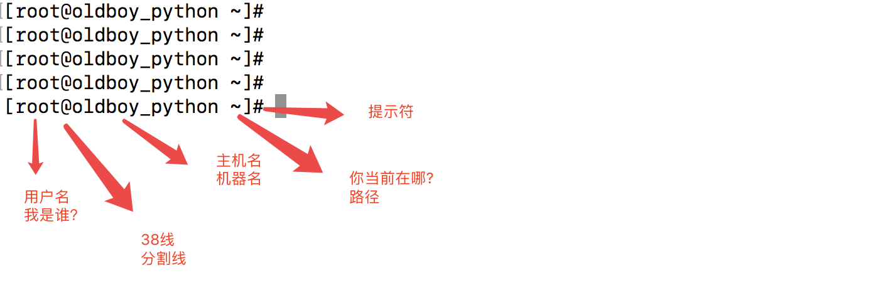

## Linux命令行



```bash
命令提示符
[py@pylinux ~]$            普通用户py，登陆后

[root@pylinux ~]#        超级用户root，登录后

root代表当前登录的用户

@ 分隔符

pylinux 主机名

~  当前的登录的位置，此时是家目录

# 超级用户身份提示符
$ 普通用户身份提示符
```

## 操作系统目录分隔符

windows(反斜杠)

```
C:\Users\Mechrevo>
```

linux(正斜杠)

```
[root@sql 6379]# pwd
/data/6379
```

## linux中重要的目录

- **/etc：**这个目录用来存放所有的系统管理所需要的配置文件和子目录
- **/var：** 这是一个非常重要的目录，系统上跑了很多程序，那么每个程序都会有相应的日志产生，而这些日志就被记录到这个目录下，具体在/var/log 目录下，另外mail的预设放置也是在这里

- **bin, /sbin, /user, /usr/bin, /usr/sbin:** 这是系统预设的执行文件的放置目录，比如 ls 就是在/bin/ls 目录下的

  /bin, /usr/bin 是给系统用户使用的指令（除root外的通用户），而/sbin, /usr/sbin 则是给root使用的指令

## cd

- 变更目录

```bash
#切换家目录
cd ~
cd
#进入上一级目录
cd ..
#进入根目录
cd /
```

## tree

- 树状图现实目录内容(yum install -y tree)

```bash
常用参数
-C 在文件和目录清单加上色彩，便于区分各种类型。
-d 显示目录名称而非内容。
-D 列出文件或目录的更改时间。
-f 在每个文件或目录之前，显示完整的相对路径名称。
-F 在条目后加上文件类型的指示符号(* ， /， = ， @ ， | ，其中的一个) 目录/
```

## ls

- 显示目录下内容及属性信息

```bash
常用参数
-a 显示指定目录下所有子目录与文件，包括以.开头的隐藏文件
-l 以列表方式显示文件的详细信息   ls -l 等于ll 用法
-h, --human-readable          与-l 一起，以易于阅读的格式输出文件大小
                                (例如 1K 234M 2G)
-t 根据最后修改时间排序，默认是以文件名排序，通常与-l 连用
-F 在条目后加上文件类型的指示符号(* ， /， = ， @ ， | ，其中的一个)
    注:可以标识文件类型
    加上 * 代表可执行的普通文件
    加上 = 表示套接字
    加上 | 表示FIFOS(队列系统)
  加上 @表示符号链接
  加上 / 表示文件夹

-d 显示目录本身的信息 而不是显示目录的内容
-r, --reverse                 逆序排列
-S                            根据文件大小排序,从大到小排序
-i 显示索引节点信息(索引节点相当于身份证号)
--full-time 以完整的时间格式输出(也就是按照中国的时间日期显示)
```

案例

```bash
ls -lt 按照时间进行排序
ls -lrt 找出最新的文件
ls -d */    列出当前所有目录
ll -hS    ./*    显示出当前目录下所有内容详细，且以kb,mb,gb单位从大到小排序
```

## mkdir

- 创建文件夹

```bash
-m, --mode=模式       设置权限模式(类似chmod)，而不是rwxrwxrwx 减umask
-p, --parents         需要时创建目标目录的上层目录，但即使这些目录已存在也不当作错误处理
mkdir {1..3}加花括号创建连续的目录，用..隔开 花括号内可以是连续的数字、连续的字母mkdir {a..e}
```

案例

```bash
mkdir {alex,pyyu,mjj}  创建三个文件夹，逗号隔开
mkdir alex{1..5}    创建连续的目录
mkdir cunzhang longting  创建少量连续目录
```

## touch

- 创建文件或修改时间戳

```bash
touch {连续数字或字母} 创建多个文件序列
touch {1..10}
touch {a..z}

  -c, --no-create       不创建任何文件
  -t STAMP              使用[[CC]YY]MMDDhhmm[.ss] 格式的时间替代当前时间
  -r, --reference=文件  使用指定文件的时间属性替代当前文件时间
```

```bash
修改文件时间
touch -t 06010808 alex1    #修改alex1文件的时间是 6月1号8点8分
touch -r alex1 alex2        #把alex2的时间改成alex1一样
```

## cp

- 复制

```bash
-r 递归式复制目录，即复制目录下的所有层级的子目录及文件 -p 复制的时候 保持属性不变
-d 复制的时候保持软连接(快捷方式)
-a 等于-pdr
-p                等于--preserve=模式,所有权,时间戳，复制文件时保持源文件的权限、时间属性
-i, --interactive        覆盖前询问提示
```

案例

```
#移动xxx.py到/tmp目录下
cp xxx.py /tmp/
#移动xxx.py顺便改名为chaoge.py
cp xxx.py /tmp/chaoge.py

cp -r 递归,复制目录以及目录的子孙后代
cp -p 复制文件，同时保持文件属性不变    可以用stat
cp -a 相当于-pdr
#递归复制test文件夹，为test2
cp -r test test2

#cp是个好命令，操作文件前，先备份
cp main.py main.py.bak

#移动多个文件，放入文件夹c中
cp -r  文件1  文件2  文件夹a   文件夹c

[root@pylinux opt]# cp luffy_boy.zip  luffy_boy.zip.bak2
cp：是否覆盖"luffy_boy.zip.bak2"？ y

[root@pylinux opt]# cp luffy_boy.zip  luffy_boy.zip.bak2 -i
cp：是否覆盖"luffy_boy.zip.bak2"？ y

cp确认是否覆盖是-i参数作用，默认alias因为添加了别名
[root@pylinux opt]# alias
alias cp='cp -i'

[root@pylinux opt]# cp luffyCity/ luffyCity2    #必须添加-r参数才可以复制递归目录
cp: omitting directory 'luffyCity/'

[root@pylinux opt]# cp -r luffyCity/ luffyCity2
[root@pylinux opt]#
```

取消cp别名的方式

- 使用命令绝对路径
- 命令开头用反斜线 \
- 取消cp命令别名
- 写入环境变量配置文件

```
1.
[root@pylinux opt]# which cp
alias cp='cp -i'
    /usr/bin/cp
[root@pylinux opt]# /usr/bin/cp luffy_boy.zip luffy_boy.zip.bak

2.
[root@pylinux opt]# \cp luffy_boy.zip luffy_boy.zip.bak

3.
[root@pylinux opt]# unalias cp
[root@pylinux opt]#
[root@pylinux opt]# cp luffy_boy.zip luffy_boy.zip.bak

4.
[root@pylinux opt]# vim ~/.bashrc  #可以注释掉如下配置
# .bashrc

# User specific aliases and functions

alias rm='rm -i'
#alias cp='cp -i'
alias mv='mv -i'
```

**快速备份**

```bash
[root@sql 6379]# cp redis.conf{,.bak}
[root@sql 6379]# ls
appendonly.aof  dump.rdb  redis.conf  redis.conf.bak  redis.log
```

## mv

- 移动

```bash
-f, --force                  覆盖前不询问
-i, --interactive            覆盖前询问
-n, --no-clobber             不覆盖已存在文件如果您指定了-i、-f、-n 中的多个，仅最后一个生效。
-t, --target-directory=DIRECTORY      将所有参数指定的源文件或目录移动至 指定目录
-u, --update                  只在源文件文件比目标文件新，或目标文件不存在时才进行移动
```

案例

```bash
移动命令 > move > mv

1.给文件重命名
mv abc  abc.py  
2.如果目标文件存在，-i参数则提示是否覆盖
mv test1.txt  test2.txt 

3.使用反斜杠命令屏蔽别名
\mv kunkun wuyifan

4.取消别名
5.移动单个文件
mv file1.txt  dir/
6.移动多个文件
mv file1.txt file2.txt dir/
7.通配符移动多个文件
mv dir/file*   ../
```

## rm

- 删除命令

```bash
-f, --force           强制删除。忽略不存在的文件，不提示确认
-i                    在删除前需要确认
-I                    在删除超过三个文件或者递归删除前要求确认。
-d, --dir    		  删除空目录
-r, -R, --recursive   递归删除目录及其内容
-v, --verbose         详细显示进行的步骤
	--help            显示此帮助信息并退出
	--version         显示版本信息并退出
```

案例

```bash
#1.删除普通文件,需要确认提示,默认添加了-i参数
rm file1.txt

#2.强制删除文件，不提示
rm -f file2.txt

#3.递归删除文件夹
[root@pylinux tmp]# rm -r heh/
rm：是否进入目录"heh/"? y
rm：是否删除普通空文件 "heh/kuanmian2"？y
rm：是否删除普通空文件 "heh/kuanmian"？y
rm：是否删除目录 "heh/"？y
```

**危险命令**

务必看清楚敲打的命令，是否正确、不得有空格

```bash
#1.强制删除且不让用户确认
rm -rf 文件夹

#2.强制删除且显示过程
[root@pylinux tmp]# rm -rfv ./*
已删除"./456.txt"
已删除目录："./q/w/e/r/t/yt"
已删除目录："./q/w/e/r/t"
已删除目录："./q/w/e/r"
已删除目录："./q/w/e"
已删除目录："./q/w"
已删除目录："./q"
```

**文件恢复**

rm命令删除文件后可以通过如ext3grep工具恢复数据，若是想要粉碎文件，还有其他方式

## 帮助命令

- man

```bash
#语法
man 命令  

如：
man  ls  

进入man帮助文档后，按下q退出
```

- --help

```bash
#语法：
命令 --help

#帮助命令的精简版
如 ls --help
```

- help

```bash
#语法：
help  命令  

只针对bash内置命令
```

- info

```bash
#语法：
info 命令
```

## 开关机

- shutdown

关机

```bash
语法：
shutdown -h    --halt  停止的含义

shutdown -h 10 #十分钟后关机
shutdown -h 0  
shutdown -h now #立即关机
```

重启

```bash
语法：
shutdown -r参数    -r --reboot    Reboot the machine

shutdown -r 10    #十分钟后重启
shutdown -r 0        #立刻重启
shutdown -r now #立刻重启
```

- poweroff
- reboot
- halt

```bash
#重启
reboot 
#关机
poweroff
halt
```

## 常用快捷键

````bash
ctrl + c     cancel取消当前操作
ctrl + l    清空屏幕内容
ctrl + d    退出当前用户
ctrl + a     光标移到行首
ctrl + e    光标移到行尾
ctrl + u  删除光标到行首的内容
````

## 路径

- 绝对路径：由根目录/为开始写起的文件名或者目录名称，如/home/oldboy/test.py;
- 相对路径：相对于目前路径的文件名写法。例如./home/oldboy/exam.py或../../home/oldboy/exam.py，简单来说只要开头不是/，就是属于相对路径

举例

例如在/home 这个目录下，如要进入/var/log这个路径，如何写呢？

1. cd /var/log (绝对路径)
2. cd ../var/log(相对路径)

