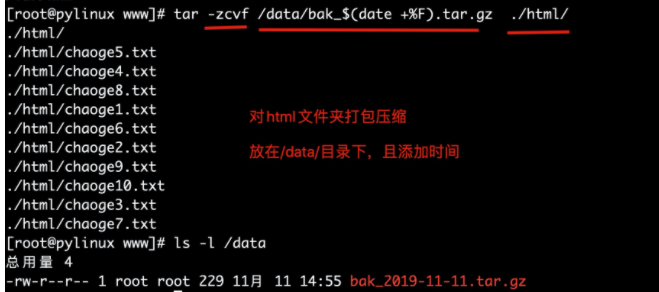

## 定时任务

**什么是计划任务：** 后台运行，到了预定的时间就会自动执行的任务，前提是：事先手动将计划任务设定好。

- 周期性任务执行
- 清空/tmp目录下的内容
- mysql数据库备份
- redis数据备份

这就用到了crond服务

**检查crond服务相关的软件包**

```
[root@MiWiFi-R3-srv ~]# rpm -qa |grep cron
cronie-anacron-1.4.11-14.el7.x86_64        
crontabs-1.11-6.20121102git.el7.noarch     
cronie-1.4.11-14.el7.x86_64    #定时任务主程序包，提供crond守护进程等工具

rpm -ivh  安装rpm软件
rpm -qa 查看软件是否安装
rpm -ql 查看软件详细信息s
rpm -qf 查看命令属于的安装包
rpm -e  卸载软件
```

**检查crond服务是否运行**

```
systemctl status crond.service  #centos7
service crond status    #centos6
```

## crond定时任务服务应用

Cron是Linux系统中以后台进程模式周期性执行命令或指定程序任务的服务软件名。

Linux系统启动后，cron软件便会启动，对应的进程名字叫做crond，默认是定期（每分钟检查一次）检查系统中是否有需要执行的任务计划，如果有，则按计划进行，好比我们平时用的闹钟。

- crond定时任务默认最快的频率是每分钟执行
- 若是需要以秒为单位的计划任务，则编写shell脚本更格式，crond不适用了

```
#秒级shell脚本
[root@pylinux tmp]# cat test_cron.sh
#!/bin/bash
while true
do
echo "test"
sleep 1
done
```

### 为什么需要crond定时任务

- 夜间数据库定时备份
- 夜间网站数据（用户上传、文件、图片、程序）备份
- 备份等待时间过长
- 任务重复性高

利用Linux的定时任务cron工具可以解决重复性、周期性的、自动备份等运维工作

### 定时任务cron实践

**cron任务分为两类**

- **系统定时任务**

crond服务除了会在工作时查看`/var/spool/cron`文件夹下的定时任务文件以外，还会查看`/etc/cron.d`目录以及`/etc/anacrontab`下面的文件内容，里面存放`每天、每周、每月需要执行的系统任务`

```
[root@pylinux ~]# ls -l /etc/|grep cron*
-rw-------.  1 root  root      541 4月  11 2018 anacrontab
drwxr-xr-x.  2 root  root     4096 8月  30 11:08 cron.d        #系统定时任务
drwxr-xr-x.  2 root  root     4096 8月   8 2018 cron.daily    #每天的任务
-rw-------.  1 root  root        0 4月  11 2018 cron.deny
drwxr-xr-x.  2 root  root     4096 8月   8 2018 cron.hourly    #每小时执行的任务
drwxr-xr-x.  2 root  root     4096 6月  10 2014 cron.monthly    #每月的定时任务
-rw-r--r--   1 root  root      507 5月  10 2019 crontab
drwxr-xr-x.  2 root  root     4096 6月  10 2014 cron.weekly    #每周的定时任务
```

系统定时任务配置文件`/etc/crontab`

```
[root@docker01 data]# cat /etc/crontab
SHELL=/bin/bash
PATH=/sbin:/bin:/usr/sbin:/usr/bin        #路径信息很少，因此定时任务用绝对路径
MAILTO=root            #执行结果发送邮件给用户

# For details see man 4 crontabs

# Example of job definition:
# .---------------- minute (0 - 59)
# |  .------------- hour (0 - 23)
# |  |  .---------- day of month (1 - 31)
# |  |  |  .------- month (1 - 12) OR jan,feb,mar,apr ...
# |  |  |  |  .---- day of week (0 - 6) (Sunday=0 or 7) OR sun,mon,tue,wed,thu,fri,sat
# |  |  |  |  |
# *  *  *  *  * user-name  command to be executed

#每一行，就是一条周期性任务
user-name 是以某一个用户身份运行任务
command to be executed  任务是什么
```

- **用户定时任务计划**

当系统管理员或是普通用户创建了需要定期执行的任务，可以使用`crontab`命令配置，

crond服务在启动时，会每分钟查看`/var/spool/cron`路径下以`系统用户名`命名的`定时任务文件`，以确定是否有需要执行的任务。

```
#root用户有一个定时任务文件
[root@pylinux ~]# ls -l /var/spool/cron/
总用量 4
-rw------- 1 root root 141 10月  9 14:42 root

#查看此root定时任务文件的内容
[root@pylinux ~]# cat /var/spool/cron/root
*/1 * * * * /usr/local/qcloud/stargate/admin/start.sh > /dev/null 2>&1 &
0 0 * * * /usr/local/qcloud/YunJing/YDCrontab.sh > /dev/null 2>&1 &

#等同于如下命令
[root@pylinux ~]# crontab -l
*/1 * * * * /usr/local/qcloud/stargate/admin/start.sh > /dev/null 2>&1 &
0 0 * * * /usr/local/qcloud/YunJing/YDCrontab.sh > /dev/null 2>&1 &
```

### crontab命令

crontab命令被用来提交和管理用户的需要周期性执行的任务，与windows下的计划任务类似

| 参数    | 解释                                                   | 使用示例             |
| ------- | ------------------------------------------------------ | -------------------- |
| -l      | list查看定时任务                                       | crontab -l           |
| -e      | edit编辑定时任务，建议手动编辑                         | crontab -e           |
| -i      | 删除定时任务，提示用户确认删除，避免出错               | crontab -i           |
| -r      | 删除定时任务，移除/var/spool/cron/username文件，全没了 | crontab -r           |
| -u user | 指定用户执行任务，root可以管理普通用户计划任务         | crontab -u chaoge -l |

crontab命令就是在修改`/var/spool/cron`中的定时任务文件

用户查看定时任务

```
crontab -l #列出用户设置的定时任务，等于cat var/spool/cron/root
crontab -e  #编辑用户的定时任务，等于如上命令编辑的是 vi /var/spool/cron/root文件
```

*检查crond服务是否运行*

```
[root@pylinux ~]# systemctl is-active crond
active

[root@pylinux ~]# ps -ef|grep crond
root       711     1  0 10月20 ?      00:00:01 /usr/sbin/crond -n
```

定时任务相关的文件

```
/var/spool/cron  定时任务的配置文件所在目录
/var/log/cron  定时任务日志文件
/etc/cron.deny  定时任务黑名单
```

查看定时任务配置文件

```
[root@docker01 ~]# cat /etc/crontab
```

### 定时任务符号

```
crontab任务配置基本格式：
*  *　 *　 *　 *　　command
分钟(0-59)　小时(0-23)　日期(1-31)　月份(1-12)　星期(0-6,0代表星期天)　 命令

第1列表示分钟1～59 每分钟用*或者 */1表示
第2列表示小时1～23（0表示0点）
第3列表示日期1～31
第4列表示月份1～12
第5列标识号星期0～6（0表示星期天）
第6列要运行的命令

（注意：day of month和day of week一般不同时使用）
（注意：day of month和day of week一般不同时使用）
（注意：day of month和day of week一般不同时使用）
```

时间表示法：

- 特定值，时间点有效取值范围内的值
- 通配符，某时间点有效范围内的所有值，表示"每"的意思

| 特殊符号 | 含义                                                         |
| -------- | ------------------------------------------------------------ |
| *        | 号，表示"每"的意思，如 00 23 cmd表示每月每周每日的23:00整点执行命令 |
| -        | 减号表示时间范围分隔符，如17-19，代表每天的17、18、19点      |
| ,        | 逗号，表示分隔时段，如30 17,18,19 * cmd 表示每天的17、18、19的半点执行命令 |
| /n       | n表示可以整除的数字，每隔n的单位时间，如每隔10分钟表示 */10* * cmd |

示例

```
0 * * * *   每小时执行，每小时的整点执行
1 2 * * 4   每周执行，每周四的凌晨2点1分执行
1 2 3 * *   每月执行，每月的3号的凌晨2点1分执行
1 2 3 4 *    每年执行，每年的4月份3号的凌晨2点1分执行
1 2 * * 3,5   每周3和周五的2点1分执行
* 13,14 * * 6,0  每周六、周日的下午1点和2点的每一分钟都执行
0 9-18 * * 1-5   周一到周五的每天早上9点一直到下午6点的每一个整点(工作日的每个小时整点)
*/10 * * * *  每隔10分钟执行一次任务
*7 * * * *    如果没法整除，定时任务则没意义,可以自定制脚本控制频率
定时任务最小单位是分钟，想完成秒级任务，只能通过其他方式（编程语言）
```

### 案例1

```
*/1 * * * * /bin/sh  /scripts/data.sh      #每分钟执行命令

30 3,12 * * *  /bin/sh  /scripts/data.sh  #每天的凌晨3点半，和12点半执行脚本

30 */6 * * *    /bin/sh  /scripts/data.sh     #每隔6小时，相当于6、12、18、24点的半点时刻，执行脚本

30 8-18/2  * * * /bin/sh  /scripts/data.sh  #  30代表半点，8-18/2表示早上8点到下午18点之间每隔两小时也就是8、10、12、14、16、18的半点时刻执行脚本

30 21 * * *  /opt/nginx/sbin/nginx -s reload  #每天晚上9点30重启nginx

45 4 1,10 * *  /bin/sh  /scripts/data.sh   #每月的1、10号凌晨4点45执行脚本

10 1  * 6,0  /bin/sh  /scripts/data.sh   #每周六、周日的凌晨1点10分执行命令

0,30 18-23 * * *  #每天的18点到23点之间，每隔30分钟执行一次

00 */1 * * *  /bin/sh  /scripts/data.sh   #每隔一小时执行一次

00 11 * 4 1-3 /bin/sh  /scripts/data.sh        #4月份的周一到周三的上午11点执行脚本
```

### 案例2

```
# 每天早上7点到上午11点，每2小时运行cmd命令
00 07-11/2 * * * CMD


0 6 * * * /var/www/test.sh        #每天6点执行脚本
0 4 * * 6 /var/www/test.sh    #每周六凌晨4:00执行
5 4 * * 6 /var/www/test.sh    #每周六凌晨4:05执行
40 8 * * * /var/www/test.sh    #每天8:40执行
31 10-23/2 * * *    /var/www/test.sh    #在每天的10:31开始，每隔2小时重复一次
0 2 * * 1-5 /var/www/test.sh    #每周一到周五2:00
0 8,9 * * 1-5  /var/www/test.sh   #每周一到周五8:00，每周一到周五9:00
0 10,16 * * *  /var/www/test.sh   #每天10:00、16:00执行
```

### 生产环境用户配置定时任务流程

需求：每分钟向`/testcron/hello.txt` 文件中写入一句话“linux”

第一步：确保任务正确执行，要检查测试一下

第二步：编辑定时任务文件，写入需要定时执行的任务

```
crontab -e 

* * * * * /usr/bin/  echo "linux" >> /testcron/hello.txt
保存后
[root@pylinux ~]# crontab -e
crontab: installing new crontab
```

第三步：检查定时任务

```
crontab -l
* * * * * /usr/bin/  echo "linux" >> /testcron/hello.txt
```

第四步：可以检测文件内容

```
tail -f /testcron/hello.txt
```

### 每5分钟让服务器进行时间同步

```
crontab -e 
*/5 * * * * /usr/sbin/ntpdate  ntp1.aliyun.com &> /dev/null
```

### 每晚0点整，把站点目录/var/www/html下的内容打包备份到/data目录下

!>提醒，tar命令不建议使用绝对路径打包，特殊情况可以使用-P参数

```
1.检查文件夹是否存在，不存在则创建
[root@pylinux ~]# ls -d /var/www/html /data
ls: 无法访问/var/www/html: 没有那个文件或目录
ls: 无法访问/data: 没有那个文件或目录

2.创建文件夹
[root@pylinux ~]# mkdir -p /var/www/html  /data
[root@pylinux ~]# ls -d /var/www/html /data
/data  /var/www/html

3.创建测试文件
[root@pylinux ~]# touch /var/www/html/chaoge{1..10}.txt
[root@pylinux ~]# ls /var/www/html/
chaoge10.txt  chaoge1.txt  chaoge2.txt  chaoge3.txt  chaoge4.txt  chaoge5.txt  chaoge6.txt  chaoge7.txt  chaoge8.txt  chaoge9.txt

4.打包压缩命令
[root@pylinux www]# tar -zcvf /data/bak_$(date +%F).tar.gz  ./html/
```



**编写shell脚本，丢给定时任务定期执行**

```
[root@pylinux scripts]# cat bak.sh
#!/bin/bash
cd /var/www && \
/bin/tar -zcf /data/bak_$(date +%F).tar.gz ./html
```

**创建定时任务**

```
crontab -e

00 00 * * * /bin/sh  /server/scripts/bak.sh > /dev/null 2>&1

#解释 >/dev/null 2>&1 代表把所有输出信息重定向到黑洞文件
> 是重定向符号
/dev/null是黑洞文件
2>&1 代表让标准错误和标准输出一样

此命令表示将脚本执行的正常或者错误日志都重定向到/dev/null，也就是什么都不输出

>/dev/null 2>&1 等价于  1>/dev/null 2>/dev/null  等价于 &> /dev/null
```

### 取消定时任务发邮件功能

```
1.定时任务的命令 >  /dev/null   #命令的执行正确结果输出到黑洞，标准错误还是报错

2.定时任务的命令 &>  /dev/null  #组合符  &> 正确和错误的输出，都写入黑洞，危险命令，有风险，慎用
```

### 补充anacron

如果由于机器故障关机，定时任务未执行，下次开机也不会执行任务

使用anacron下次开机会扫描定时任务，将未执行的，全部执行，服务器很少关机重启，所以忽略。