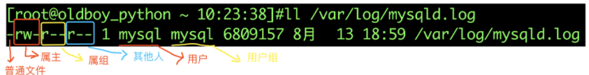
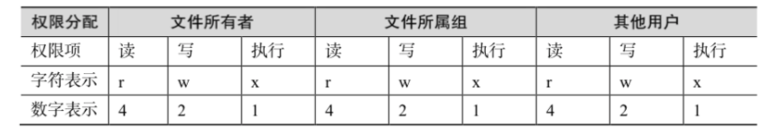
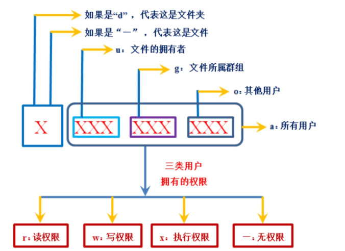
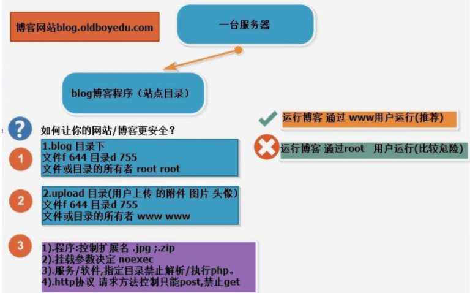

### 文件权限

```
r    read可读，可以用cat等命令查看
w    write写入，可以编辑或者删除这个文件
x    executable    可以执行
-    没有权限
```

### 文件夹权限

普通用户测试

```
r    可以对此目录执行ls列出所有文件
w    可以在这个目录创建文件
x    可以cd进入这个目录，或者查看详细信息
```

### 文件权限数字转化



```
rwx权限表示
r 	read 		读取 4
w  	write 		写  2
x  	execute  	执行 1
-           	无权限  0
```

常见权限对应

```
444 r--r--r--
600 rw-------
644 rw-r--r--
666 rw-rw-rw-
700 rwx------
744 rwxr--r--
755 rwxr-xr-x
777 rwxrwxrwx
```

## chmod

**chmod命令**用来变更文件或目录的权限。

在UNIX系统家族里，文件或目录权限的控制分别以读取、写入、执行3种一般权限来区分，另有3种特殊权限可供运用。

用户可以使用chmod指令去变更文件与目录的权限，设置方式采用文字或数字代号皆可。

符号连接的权限无法变更，如果用户对符号连接修改权限，其改变会作用在被连接的原始文件。



```
权限范围：
操作对像

   u 文件属主权限
   g 同组用户权限
   o 其它用户权限
   a 所有用户（包括以上三种）

权限设定

   + 增加权限
   - 取消权限
   =  唯一设定权限

权限类别

   r 读权限
   w 写权限
   x 执行权限
   X 表示只有当该档案是个子目录或者该档案已经被设定过为可执行。
   s 文件属主和组id
   i 给文件加锁，使其它用户无法访问

   r-->4
   w-->2
   x-->1
```

案例

设置文件所有人可读

```
[root@docker01 tmp]# chmod ugo+r data.zip    #第一写法
[root@docker01 tmp]# chmod a+r data.zip        #第二种
```

文件属主和属组内成员可写，其他人不可写

```
[root@docker01 tmp]# chmod ug+w,o-w data.zip
```

文件属主可以执行

```
[root@docker01 tmp]# chmod u+x data.zip
```

设置data目录所有资料，任何人可读取

```
[root@docker01 tmp]# chmod -R a+r data/
```

所有人都可以读、写、执行

```
chmod 777 filename.txt
```

**使用数字权限转化**

```
chmod 755 alex.txt
chmod 644 alex.txt
chmod 777 alex.txt
chmod 0 alex.txt  #所有人无权限
chmod 65  alex.txt  #属主是0权限，group权限6，其他人权限5
chmod 4    alex.txt        #其实是004，只有其他人可读
```

**实际效果，r w x对于文件的操作**

| 权限 | 效果                                                         |
| ---- | ------------------------------------------------------------ |
| r    | 可以读取、阅读文件内容                                       |
| w    | 可以新增、修改文件内容，删除文件的权限由父目录权限控制，删除权限又父目录的w控制 |
| x    | 1.可读取文件内容并执行 如 . luffy.sh source luffy.sh sh luffy.sh 2.普通用户必须对文件有r权限才可执行 3.root只需要任意u,g,o存在x权限即可执行 |

**rwx对于目录的权限**

| 权限 | 效果                                                         |
| ---- | ------------------------------------------------------------ |
| r    | 1.可以浏览目录下内容，如ls 2.没有x无法进入目录 3.可以看到目录下文件名，无法访问文件信息（内容，权限） |
| w    | 【有x权限前提下】文件夹有增加、删除、修改文件夹中文件名的权限 |
| x    | 1.进入文件夹，如cd 2.没有r无法查看列表 3.没有w无法创建文件   |

## chown

修改文件属主、属组信息

```
语法：

chown alex    test.txt    #文件属于alex
chown :组     test.txt        #修改文件属组
chown 用户:组             #修改

参数
  -R, --recursive               递归处理所有的文件及子目录
  -v, --verbose                 为处理的所有文件显示诊断信息
```

案例

```
chown alex:alex nginx.conf         #将nginx.conf所属用户和组改为alex,alex
chown -R  alex:alex   data            #将data目录下所有内容属主和属组改为alex

chown .alex  test.txt            #test.txt的属组改为alex
```

## chgrp

**chgrp命令**用来改变文件或目录所属的用户组。

该命令用来改变指定文件所属的用户组。

其中，组名可以是用户组的id，也可以是用户组的组名。

案例

```
-c或——changes：效果类似“-v”参数，但仅回报更改的部分；
-f或--quiet或——silent：不显示错误信息；
-h或--no-dereference：只对符号连接的文件作修改，而不是该其他任何相关文件；
-R或——recursive：递归处理，将指令目录下的所有文件及子目录一并处理；
-v或——verbose：显示指令执行过程；
--reference=<参考文件或目录>：把指定文件或目录的所属群组全部设成和参考文件或目录的所属群组相同；


chgrp -R  alex  /data   #把/data目录下所有文件的属组改为alex
```

## umask

**umask 命令用来限制新文件权限的掩码。**

也称之为遮罩码，防止文件、文件夹创建的时候，权限过大

**当新文件被创建时，其最初的权限由文件创建掩码决定。**

**用户每次注册进入系统时，umask命令都被执行，并自动设置掩码改变默认值，新的权限将会把旧的覆盖。**

- umask默认配置在/etc/profile 61-64行

```
umask值就是指“Linux文件的默认属性需要减掉的权限”。
比如Linux普通文件的最大默认属性是666，目录文件的最大属性是777。但是我们不想要用户在新建立文件时，文件的属性是666或777，那么我们就要设置umask值。
Linux系统预置的umask值是022，那么用户在新建立普通文件时，普通文件的属性就是666-022=644，新建立目录文件时，目录文件的属性就是777-022=755。
```

```
语法参数

-S:以字符的形势显示当前的掩码。
-p：带umask开头以数字的形势显示当前掩码
```

计算umask文件权限

系统默认umask数值对应的权限

```
记住公式
默认的文件、文件夹权限，减去umaks的值等于最终的权限值

文件最大777  文件夹最大777
```

默认umask值,root和普通用户不一样

```
#root用户umask
[root@localhost ~]# umask        #查看当前用户预设权限
0022

[root@localhost ~]# umask -S     #以字母的形势显示权限，7-0 7-2 7-2
u=rwx,g=rx,o=rx

[root@localhost ~]# umask -p     
umask 0022

#普通用户umask
[chaoge@docker01 tmp]$ umask
0002
[chaoge@docker01 tmp]$ umask -S
u=rwx,g=rwx,o=rx
[chaoge@docker01 tmp]$ umask -p
umask 0002
```

案例

root登录系统默认创建文件，文件夹的权限

```
[root@docker01 tmp]# touch file.txt            #文件是644
[root@docker01 tmp]# mkdir luffy                    #文件夹是755
[root@docker01 tmp]# ll
total 0
-rw-r--r--. 1 root root 0 Oct 18 11:19 file.txt
drwxr-xr-x. 2 root root 6 Oct 18 11:19 luffy
```

普通用户

```
[chaoge@docker01 tmp]$ touch chao.txt                #权限664
[chaoge@docker01 tmp]$ mkdir chao                        #权限775
[chaoge@docker01 tmp]$ ll
total 0
drwxrwxr-x. 2 chaoge chaoge 6 Oct 18 11:27 chao
-rw-rw-r--. 1 chaoge chaoge 0 Oct 18 11:27 chao.txt
```

- 操作系统创建文件，默认最大权限是666(-rw-rw-rw-)
- 创建普通文件权限是

```
#文件默认起始权限666，减去umask默认值022，等于创建文件的权限
666
022
-----
644            #系统创建文件权限默认是644   -  rw-  r-- r--
```

- umask值不得大于6
- umask计算出的文件权限不得拥有执行权限x，如果计算结果中有执行权限，则需要将其加一

```
#文件默认权限666，假设umask值设置为045
666
045
-----
621   #存在执行权限，必须+1，默认文件不得执行
----
622        #最终文件权限
```

演示

```
#临时修改默认umask变量值
[root@docker01 tmp]# umask 045
[root@docker01 tmp]# umask
0045

#创建文件，查看权限，此时默认已经是644的权限
[root@docker01 tmp]# touch chao.txt
[root@docker01 tmp]# ll
total 0
-rw--w--w-. 1 root root 0 Oct 18 11:43 chao.txt
```

计算目录umask权限

- 系统创建目录默认权限最大777

```
#目录最大权限777，减去umask值，得到目录创建后的权限
777
022
------
755
```

案例

```
[root@docker01 tmp]# umask
022

[root@docker01 tmp]# mkdir chao
[root@docker01 tmp]# ll
total 0
drwxr-xr-x. 2 root root 6 Oct 18 11:54 chao
```

> Linux默认权限

- 文件644 rw- r-- r--
- 目录655rwx r-x r-x



## chattr

chattr命令用于更改文件的扩展属性，比chmod更改的rwx权限更底层

```
参数

a：只能向文件中添加数据，不得删除
-R：递归更改目录属性
-V：显示命令执行过程

模式
+ 增加参数
- 移除参数
= 更新为指定参数
A 不让系统修改文件最后访问时间
a 只能追加文件数据，不得删除
i 文件不能被删除、改名、修改内容
```

案例

```
[root@docker01 tmp]# chattr +i chao.txt

[root@docker01 tmp]# lsattr chao.txt
----i----------- chao.txt

[root@docker01 tmp]# rm -rf chao.txt
rm: cannot remove 'chao.txt': Operation not permitted

[root@docker01 tmp]# echo qqqq > chao.txt

[root@docker01 tmp]# chattr -i chao.txt

[root@docker01 tmp]# rm -rf chao.txt
```

-a参数，只能追加内容

```
[root@docker01 tmp]# chattr +a test.txt
[root@docker01 tmp]# lsattr test.txt
-----a---------- test.txt
[root@docker01 tmp]#
[root@docker01 tmp]#
[root@docker01 tmp]# echo "qwe" > test.txt
-bash: test.txt: Operation not permitted
[root@docker01 tmp]# echo "qwe" >> test.txt
[root@docker01 tmp]#
[root@docker01 tmp]#
[root@docker01 tmp]# cat test.txt
happy
qweqe
qwe
```

## lsattr

**lsattr命令**用于查看文件的第二扩展文件系统属性，结合chattr一起用

```
-R
    递归地列出目录以及其下内容的属性.
-V
    显示程序版本.
-a
    列出目录中的所有文件,包括以`.'开头的文件的属性.
-d
    以列出其它文件的方式那样列出目录的属性, 而不列出其下的内容.
-v
    显示文件版本.
```

案例

```
[root@localhost ~]# chattr +i nginx.conf                     #设置该文件不能进行任何形势的修改

[root@localhost ~]# mv nginx.conf nginx.conf_bak
mv: 无法将"nginx.conf" 移动至"nginx.conf_bak": 不允许的操作

[root@localhost ~]# lsattr nginx.conf                       #查看chattr设置的权限
----i--------e- nginx.conf

[root@localhost ~]# chattr -i nginx.conf                    #取消-i的权限设置

[root@localhost ~]# lsattr nginx.conf                      #查看chattr设置的权限
-------------e- nginx.conf
```