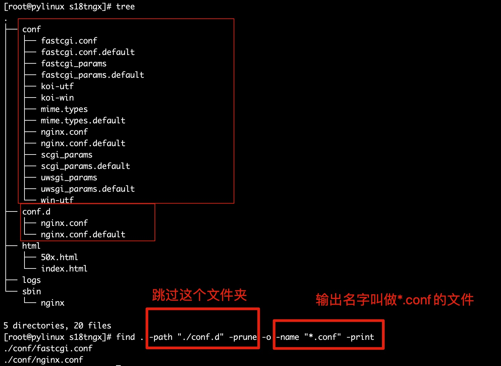
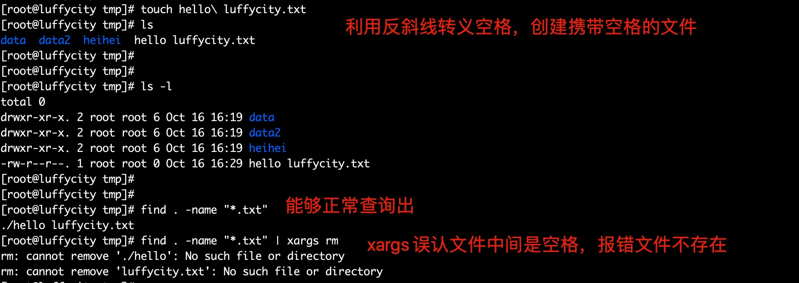

## cat

- cat 命令用于查看纯文本文件（常用于内容较少的）， 可以理解为是`猫`，瞄一眼文件内容

  其单词是`concatenate`，指的是可以连接多个文件且打印到屏幕，或是重定向到文件中

_cat 功能_

| 功能                   | 说明                                                           |
| ---------------------- | -------------------------------------------------------------- |
| 查看文件内容           | cat file.txt                                                   |
| 多个文件合并           | cat file.txt file2.txt > file3.tx                              |
| 非交互式编辑或追加内容 | cat >> file.txt << EOF 欢迎来到路飞学城 EOF                    |
| 清空文件内容           | cat /dev/null > file.txt 【/dev/null 是 linux 系统的黑洞文件】 |

```
用法：cat [选项] [文件]...
将[文件]或标准输入组合输出到标准输出。

清空文件内容,慎用
> 文件名


-A, --show-all           等价于 -vET
-b, --number-nonblank    对非空输出行编号
-e                       等价于 -vE
-E, --show-ends          在每行结束处显示 $
-n, --number             对输出的所有行编号
-s, --squeeze-blank      不输出多行空行
-t                       与 -vT 等价
-T, --show-tabs          将跳格字符显示为 ^I
-u                       (被忽略)
-v, --show-nonprinting   使用 ^ 和 M- 引用，除了 LFD 和 TAB 之外
--help     显示此帮助信息并退出
--version  输出版本信息并退出

如果[文件]缺省，或者[文件]为 - ，则读取标准输入。
```

案例

```
#猫,查看文件
cat xxx.sh

#查看文件，显示行号
[root@sql tmp]# cat -n aaa.txt

#在每一行的结尾加上$符
[root@master tmp]# cat -E 1.txt

#追加文字到文件
cat >>/tmp/oldboy.txt << EOF
唧唧复唧唧
木兰开飞机
开的什么机
波音747
EOF

#输出非空行的编号
[root@sql tmp]# cat -b aaa.txt

#输出所有行的编号
[root@sql tmp]# cat -n file.txt

#显示出每行的结束符，$符号
[root@sql tmp]# cat -E file.txt

[root@sql tmp]# cat -s file.txt   # -s参数把多个空行，换成一个，可以让文件更精炼阅读
```

tac

- 与 cat 命令作用相反，反向读取文件内容

```
[root@sql tmp]# cat alex.txt
我是金角老妖怪alex
我是老妖怪alex
[root@sql tmp]#
[root@sql tmp]# tac alex.txt
我是老妖怪alex
我是金角老妖怪alex
```

## |

```
Linux提供的管道符“|”讲两条命令隔开，管道符左边命令的输出会作为管道符右边命令的输入。
常见用法：
#检查python程序是否启动
ps -ef|grep "python"

#找到/tmp目录下所有txt文件
ls /tmp|grep '.txt'

#检查nginx的端口是否存活
netstat -tunlp |grep nginx
```

## more

- More 是一个过滤器, 用于分页显示 (一次一屏) 文本，以当前屏幕窗口尺寸为准

```bash
语法
more 参数  文件

-num 指定屏幕显示大小为num行
+num 从num行开始显示

交互式more的命令：
空格     向下滚动一屏
Enter 向下显示一行
=            显示当前行号
q            退出
```

案例

```
#显示5行内容
[root@sql tmp]# more -5 alex.txt
root:x:0:0:root:/root:/bin/bash
root:x:0:0:root:/root:/bin/bash
root:x:0:0:root:/root:/bin/bash
root:x:0:0:root:/root:/bin/bash
root:x:0:0:root:/root:/bin/bash
--More--(0%)

#从6行开始输出内容到屏幕
more +6 alex.txt


#将显示结果分页输出，需控制窗口大小
[root@sql tmp]# netstat -tunlp |more -3
```

## less

- less 命令是 more 的反义词

```bash
语法：
less 参数 文件

-N 显示每行编号
-e 到文件结尾自动退出，否则得手动输入q退出

子命令

整个的翻页
b    向前一页
f 	 向后一页

空格         查看下一行，等于 ↓
y            查看上一行，等于↑

q退出
```

## head

- 用于显示文件内容头部，默认显示开头 10 行

```bash
用法：head [选项]... [文件]...
将每个指定文件的头10 行显示到标准输出。
如果指定了多于一个文件，在每一段输出前会给出文件名作为文件头。
如果不指定文件，或者文件为"-"，则从标准输入读取数据。

  -c,  --bytes=[-]K     显示每个文件的前K 字节内容；
                        如果附加"-"参数，则除了每个文件的最后K字节数据外
                        显示剩余全部内容
  -n, --lines=[-]K      显示每个文件的前K 行内容；
                        如果附加"-"参数，则除了每个文件的最后K 行外显示
                        剩余全部内容
  -q, --quiet, --silent 不显示包含给定文件名的文件头
  -v, --verbose         总是显示包含给定文件名的文件头
      --help            显示此帮助信息并退出
      --version         显示版本信息并退出
```

案例

```
[root@sql ~]# head -5 /etc/passwd        #显示前五行
root:x:0:0:root:/root:/bin/bash
bin:x:1:1:bin:/bin:/sbin/nologin
daemon:x:2:2:daemon:/sbin:/sbin/nologin
adm:x:3:4:adm:/var/adm:/sbin/nologin
lp:x:4:7:lp:/var/spool/lpd:/sbin/nologin


[root@sql ~]# head -c 6 /etc/passwd        #显示文件前6个字节
root:x[root@sql ~]#


#显示多个文件
[root@sql tmp]# echo 你就是金角大王吧 > alex.txt
[root@sql tmp]#
[root@sql tmp]#
[root@sql tmp]# echo 你就是银角大王吧 > peiqi.txt
[root@sql tmp]#
[root@sql tmp]#
[root@sql tmp]# head alex.txt  peiqi.txt
==> alex.txt <==
你就是金角大王吧

==> peiqi.txt <==
你就是银角大王吧
```

## tail

- 显示文件内容的末尾，默认输出后 10 行

```bash
-c 数字                            指定显示的字节数
-n 行数                            显示指定的行数
-f                                  实时刷新文件变化
-F 等于 -f --retry                 不断打开文件，与-f合用
--pid=进程号                 进程结束后自动退出tail命令
-s 秒数                            检测文件变化的间隔秒数
```

案例

```
#显示文件后10行
tail alex.txt

#显示文件后5行
tail -5 alex.txt

#从文件第3行开始显示文件
tail -n +3 alex.txt

#检测文件变化
tail -f alex.txt

# -F与-f参数的用法
[root@sql tmp]# tail -f alex.txt            #    -f文件不存在，直接报错，退出
tail: cannot open 'alex.txt' for reading: No such file or directory
tail: no files remaining

[root@sql tmp]# tail -F alex.txt            # -F    文件不存在报错，等待文件生成
tail: cannot open 'alex.txt' for reading: No such file or directory

tail: 'alex.txt' has appeared;  following end of new file
qwe
```

## cut

cut - 在文件的每一行中提取片断

在每个文件 FILE 的各行中, 把提取的片断显示在标准输出。

```bash
语法

cut 参数  文件

-b         以字节为单位分割
-n         取消分割多字节字符，与-b一起用
-c         以字符为单位
-d         自定义分隔符，默认以tab为分隔符
-f         与-d一起使用，指定显示哪个区域
N       第 N 个 字节, 字符 或 字段, 从 1 计数 起
N-       从 第 N 个 字节, 字符 或 字段 直至 行尾
N-M     从 第 N 到 第 M (并包括 第M) 个 字节, 字符 或 字段
-M       从 第 1 到 第 M (并包括 第M) 个 字节, 字符 或 字段
```

案例

以字节作为分隔符 -b 参数

```
[root@sql tmp]# cat alex.txt
My name is alex and i like da xi gua

#切割出第四个字符
[root@sql tmp]# cut -b 4  alex.txt
n

[root@sql tmp]# cut -b 4-6 alex.txt        #输出第4到6的字符
nam
[root@sql tmp]# cut -b 4,6 alex.txt        #输出第4和6的字符
nm

[root@sql tmp]# cut -b -5  alex.txt        #输出第一个到第五个的字符
My na

[root@sql tmp]# cut -b 5- alex.txt        #输出第五个字符到结尾的字符
ame is alex and i like da xi gua
```

以字符作为分隔符 -c 参数，区别在于中英文

```
[root@sql tmp]# cut -b 3-7 alex.txt        #字节切割
 name
[root@sql tmp]#
[root@sql tmp]# cut -c 3-7 alex.txt        #字符切割，没有区别，因为1个英文字母是1个字节存储
 name
[root@sql tmp]# cat alex.txt
My name is alex and i like da xi gua

#注意点如下
[root@sql tmp]# cat peiqi.txt
我是小猪佩奇
i am xiao zhu pei qi

[root@sql tmp]# cut -c 6- peiqi.txt        #从第六个字符开始切割到结尾
奇                                      #由于当前机器是utf-8编码，一个汉字等于一个字符
xiao zhu pei qi            #英文字符正常
[root@sql tmp]# cut -b  6- peiqi.txt    #从第六个字节开始切割到结尾
�小猪佩奇                         #乱码，-b以二进制字节计算
xiao zhu pei qi

#加上-n参数，取消切割多字节的字符
[root@sql tmp]# cut -nc 6- peiqi.txt
奇
xiao zhu pei qi
[root@sql tmp]# cut -nb 6- peiqi.txt
奇
```

自定义分隔符

```
cut -f7 -d : /etc/passwd |head -5       #以冒号切割，显示第七区域信息

[root@sql tmp]# cut -f6-7 -d : /etc/passwd |head -5        #以冒号切割，显示第6-7的区域信息
/root:/bin/bash
/bin:/sbin/nologin
/sbin:/sbin/nologin
/var/adm:/sbin/nologin
/var/spool/lpd:/sbin/nologin
```

## sort

sort 命令将输入的文件内容按照规则排序，然后输出结果

```bash
用法：sort [选项]... [文件]...
　或：sort [选项]... --files0-from=F
串联排序所有指定文件并将结果写到标准输出。

 -b, --ignore-leading-blanks   忽略前导的空白区域
 -n, --numeric-sort            根据字符串数值比较
 -r, --reverse                 逆序输出排序结果
 -u, --unique          配合-c，严格校验排序；不配合-c，则只输出一次排序结果
 -t, --field-separator=分隔符  使用指定的分隔符代替非空格到空格的转换
 -k, --key=位置1[,位置2]       在位置1 开始一个key，在位置2 终止(默认为行尾)
```

案例

```
#sort 是默认以第一个数据来排序，而且默认是以字符串形式来排序,所以由字母 a 开始升序排序

[root@sql tmp]# cat /etc/passwd | sort

[root@sql tmp]# sort -n sort.txt        #按照数字从大到小排序

[root@sql tmp]# sort -nr sort.txt        #降序排序

[root@sql tmp]# sort -u sort.txt        #去重排序

[root@sql tmp]# sort -t " " -k 2 sort.txt            #指定分隔符，指定序列
10.0.0.15 a
10.0.0.12 e
10.0.0.22 e
10.0.0.54 f
10.0.0.34 q
10.0.0.63 q
10.0.0.3 r
10.0.0.34 r
10.0.0.4 v
10.0.0.44 w
10.0.0.5 x

[root@sql tmp]# cat /etc/passwd| sort -t ":" -k 3     #以分号分割，对第三列排序，以第一位数字排序

#以分号分割，对第一个区域的第2到3个字符排序
[root@sql tmp]# cat /etc/passwd | sort -t ":" -k 1.2,1.3
```

## uniq

uniq 命令可以输出或者忽略文件中的重复行，常与 sort 排序结合使用

```bash
用法：uniq [选项]... [文件]
从输入文件或者标准输入中筛选相邻的匹配行并写入到输出文件或标准输出。

不附加任何选项时匹配行将在首次出现处被合并。

-c, --count           在每行前加上表示相应行目出现次数的前缀编号
-d, --repeated        只输出重复的行
-u, --unique          只显示出现过一次的行,注意了，uniq的只出现过一次，是针对-c统计之后的结果
```

案例

```
#测试数据文件
[root@sql tmp]# cat luffy.txt
10.0.0.1
10.0.0.1
10.0.0.51
10.0.0.51
10.0.0.1
10.0.0.1
10.0.0.51
10.0.0.31
10.0.0.21
10.0.0.2
10.0.0.12
10.0.0.2
10.0.0.5
10.0.0.5
10.0.0.5
10.0.0.5

[root@sql tmp]# uniq luffy.txt            #仅仅在首次出现的时候合并，最好是排序后去重
10.0.0.1
10.0.0.51
10.0.0.1
10.0.0.51
10.0.0.31
10.0.0.21
10.0.0.2
10.0.0.12
10.0.0.2
10.0.0.5

[root@sql tmp]# sort luffy.txt |uniq -c            #排序后去重且显示重复次数
      4 10.0.0.1
      1 10.0.0.12
      2 10.0.0.2
      1 10.0.0.21
      1 10.0.0.31
      4 10.0.0.5
      3 10.0.0.51


[root@sql tmp]# sort luffy.txt |uniq -c  -d            #找出重复的行，且计算重复次数
      4 10.0.0.1
      2 10.0.0.2
      4 10.0.0.5
      3 10.0.0.51


[root@sql tmp]# sort luffy.txt |uniq -c -u        #找到只出现一次的行
      1 10.0.0.12
      1 10.0.0.21
      1 10.0.0.31
```

## wc

wc 命令用于统计文件的行数、单词、字节数

```bash
-c, --bytes打印字节数
-m, --chars  打印字符数
-l, --lines  打印行数
-L, --max-line-length  打印最长行的长度
-w, --words 打印单词数
```

案例

```
[root@sql tmp]# wc -l luffy.txt        #统计文本有多少行，如同cat -n 看到的行数
21 luffy.txt

#统计单词数量，以空格区分
[root@sql tmp]# echo "alex peiqi  yuchao  mjj  cunzhang" | wc -w
5

[root@sql tmp]# echo "alex" |wc -m        #统计字符数，由于结尾有个$
5

[root@sql tmp]# echo "alex" |cat -E        #证明结尾有个$
alex$

[root@sql tmp]# wc -L alex.qq            #统计最长的行，字符数
9 alex.qq

[root@sql tmp]# who|wc -l        #当前机器有几个登录客户端
```

## tr

tr 命令从标准输入中替换、缩减或删除字符，将结果写入到标准输出

```bash
用法：tr [选项]... SET1 [SET2]
从标准输入中替换、缩减和/或删除字符，并将结果写到标准输出。

字符集1：指定要转换或删除的原字符集。

当执行转换操作时，必须使用参数“字符集2”指定转换的目标字符集。

但执行删除操作时，不需要参数“字符集2”；

字符集2：指定要转换成的目标字符集。

-c或——complerment：取代所有不属于第一字符集的字符；
-d或——delete：删除所有属于第一字符集的字符；
-s或--squeeze-repeats：把连续重复的字符以单独一个字符表示；
-t或--truncate-set1：先删除第一字符集较第二字符集多出的字符。
```

案例

```
#将输入字符由小写换为大写：
[root@sql ~]# echo "My name is alex" | tr 'a-z' 'A-Z'
MY NAME IS ALEX

#tr删除字符或数字，只要匹配上属于第一个字符串的字符，都被删掉
[root@sql ~]# echo "My name is alex and i am 30 years old." | tr -d "0-9"
My name is alex and i am  years old.

[root@sql ~]# echo "My name is alex and i am 33456 years old." | tr -d "1234"
My name is alex and i am 56 years old.

#删除字符，所有的数字，以及小写字符
[root@sql ~]# echo "My name is alex and i am 33456 years old." | tr -d "0-9","a-z"
```

```
[root@sql tmp]# tr "[a-z]" "[A-Z]" < alex.txt            #全部换成大写
I AM LUFFYCITY CTO.
I AM 30 YEARS OLD.
I LIKE EAT DA XI GUA .


#删除文中出现的换行符、制表符（tab键）
tr -d "\n\t" < alex.txt

#去重连续的字符，tr是挨个匹配" ia" 每一个字符，包括空格去重
[root@sql tmp]# echo "iiiii      am  aaaaalex,iiii like  hot girl" | tr -s " ia"
i am alex,i like hot girl

#-c取反结果，将所有除了'a'以外的全部替换为'A'
[root@sql tmp]# echo 'i am alex' | tr -c 'a' 'A'
AAaAAaAAAA
```

## stat

**stat 命令**用于显示文件的状态信息。stat 命令的输出信息比 ls 命令的输出信息要更详细。

语法

```
stat(选项)(参数)
```

选项

```
  -L, --dereference     跟随链接
  -f, --file-system     显示文件系统状态而非文件状态
  -c --format=格式      使用指定输出格式代替默认值，每用一次指定格式换一新行
      --printf=格式     类似 --format，但是会解释反斜杠转义符，不使用换行作
                                输出结尾。如果您仍希望使用换行，可以在格式中
                                加入"\n"
  -t, --terse           使用简洁格式输出
      --help            显示此帮助信息并退出
      --version         显示版本信息并退出

 有效的文件格式序列(不使用 --file-system)：
  %a    八进制权限
```

参数

文件：指定要显示信息的普通文件或者文件系统对应的设备文件名。

```
[root@sql ~]#stat abc.ph
  文件："abc.ph"
  大小：0               块：0          IO 块：4096   普通空文件
设备：801h/2049d        Inode：1200314     硬链接：1
权限：(0644/-rw-r--r--)  Uid：(    0/    root)   Gid：(    0/    root)
最近访问：2013-05-14 13:24:30.830729223 +0800
最近更改：2013-05-14 13:24:30.830729223 +0800
最近改动：2013-05-14 13:24:30.830729223 +0800
创建时间：-

[root@sql tmp]# stat test.txt
  File: 'test.txt'
  Size: 16            Blocks: 8          IO Block: 4096   regular file
Device: fd00h/64768d    Inode: 17540200    Links: 1
Access: (0644/-rw-r--r--)  Uid: (    0/    root)   Gid: (    0/    root)
Context: unconfined_u:object_r:user_tmp_t:s0
Access: 2019-10-18 14:58:59.465647961 +0800
Modify: 2019-10-18 14:58:57.799636638 +0800
Change: 2019-10-18 14:58:57.799636638 +0800
 Birth: -


#显示文件权限
[root@sql test_find]# stat -c  %a alex.txt
644
```

**stat 的时间戳**

```
Access: 2019-10-18 14:58:59.465647961 +0800
Modify: 2019-10-18 14:58:57.799636638 +0800
Change: 2019-10-18 14:58:57.799636638 +0800

access、最近访问，文件每次被cat之后，时间变化，由于操作系统特性，做了优化，频繁访问，时间不变
modify，最近更改，更改文件内容，vim等
change，最近改动，文件元数据改变，如文件名
```

## find

**find 命令**用来在指定目录下查找文件。任何位于参数之前的字符串都将被视为欲查找的目录名。

如果使用该命令时，不设置任何参数，则 find 命令将在当前目录下查找子目录与文件。

并且将查找到的子目录和文件全部进行显示。

语法

```
find 查找目录和文件，语法：

find 路径 -命令参数 [输出形式]

参数说明：
路径：告诉find在哪儿去找你要的东西，
```

| 参数                     | 解释                                                                                                                                                                                                                                          |     |
| ------------------------ | --------------------------------------------------------------------------------------------------------------------------------------------------------------------------------------------------------------------------------------------- | --- |
| pathname                 | 要查找的路径                                                                                                                                                                                                                                  |     |
| **options 选项**         |                                                                                                                                                                                                                                               |     |
| -maxdepth                | <目录层级>：设置最大目录层级；                                                                                                                                                                                                                |     |
| -mindepth                | <目录层级>：设置最小目录层级；                                                                                                                                                                                                                |     |
| **tests 模块**           |                                                                                                                                                                                                                                               |     |
| -atime                   | 按照文件访问 access 的时间查找，单位是天                                                                                                                                                                                                      |     |
| -ctime                   | 按照文件的改变 change 状态来查找文件，单位是天                                                                                                                                                                                                |     |
| -mtime                   | 根据文件修改 modify 时间查找文件【最常用】                                                                                                                                                                                                    |     |
| -name                    | 按照文件名字查找，支持\* ? [] 通配符                                                                                                                                                                                                          |     |
| -group                   | 按照文件的所属组查找                                                                                                                                                                                                                          |     |
| -perm                    | 按照文件的权限查找                                                                                                                                                                                                                            |     |
| -size n[cwbkMG]          | 按照文件的大小 为 n 个由后缀决定的数据块。 其中后缀为： b: 代表 512 位元组的区块（如果用户没有指定后缀，则默认为 b） c: 表示字节数 k: 表示 kilo bytes （1024 字节） w: 字 （2 字节） M:兆字节（1048576 字节） G: 千兆字节 （1073741824 字节） |     |
| -type 查找某一类型的文件 | b - 块设备文件。 d - 目录。 c - 字符设备文件。 p - 管道文件。 l - 符号链接文件。 f - 普通文件。 s - socket 文件                                                                                                                               |     |
| -user                    | 按照文件属主来查找文件。                                                                                                                                                                                                                      |     |
| -path                    | 配合-prune 参数排除指定目录                                                                                                                                                                                                                   |     |
| **Actions 模块**         |                                                                                                                                                                                                                                               |     |
| -prune                   | 使 find 命令不在指定的目录寻找                                                                                                                                                                                                                |     |
| -delete                  | 删除找出的文件                                                                                                                                                                                                                                |     |
| **-exec 或-ok**          | **对匹配的文件执行相应 shell 命令**                                                                                                                                                                                                           |     |
| -print                   | 将匹配的结果标准输出                                                                                                                                                                                                                          |     |
| **OPERATORS**            |                                                                                                                                                                                                                                               |     |
| !                        | 取反                                                                                                                                                                                                                                          |     |
| -a -o                    | 取交集、并集，作用类似&&和\                                                                                                                                                                                                                   | \   |

案例

**根据名字查找**

```
[root@sql tmp]# ls
alex.txt
[root@sql tmp]# find . -name "alex.txt" -delete        #找出名为alex.txt且删除
[root@sql tmp]# ls    #已经找不到

[root@sql tmp]# touch python{1..10}.pid
[root@sql tmp]# ls
python1.pid  python10.pid  python2.pid  python3.pid  python4.pid  python5.pid  python6.pid  python7.pid  python8.pid  python9.pid
[root@sql tmp]#
[root@sql tmp]#
[root@sql tmp]# find . -name "*.pid"        #找出所有的pid
./python1.pid
./python2.pid
....

[root@sql tmp]# find . -name "[0-9]*.pid"        #找到所以以数字开头的pid文件
./123a.pid
./123b.pid
.....
```

UNIX/Linux 文件系统每个文件都有三种时间戳：

- **访问时间**（-atime/天，-amin/分钟）：用户最近一次访问时间（文件修改了，还未被读取过，则不变）。
- **修改时间**（-mtime/天，-mmin/分钟）：文件最后一次修改时间（数据变动）。
- **变化时间**（-ctime/天，-cmin/分钟）：文件数据元（例如权限等）最后一次修改时间。

- 文件任何数据改变，change 变化，无论是元数据变动，或是对文件 mv，cp 等
- 文件内容被修改时，modify 和 change 更新
- 当 change 更新后，第一次访问该文件（cat，less 等），access time 首次会更新，之后则不会

```
touch -a ：仅更新Access time（同时更新Change为current time）
touch -m：仅更新Modify time（同时更新Change为current time）
touch -c：不创建新文件
touch -t：使用指定的时间更新时间戳（仅更改Access time与Modify time，Change time更新为current time）
```

**find 根据修改时间查找文件**

```
#一天以内，被访问access过的文件
find . -atime -1

#一天以内，内容变化的文件
find . -mtime -1

#恰好在7天内被访问过的文件
[root@sql home]# find /  -maxdepth 3  -type f -atime 7
```

时间说明

- -atime -2 **搜索在 2 天内被访问过的文件**
- -atime 2 **搜索恰好在 2 天前被访问过的文件**
- -atime +2 **超过 2 天内被访问的文件**

**find 反向查找**

```
[root@sql opt]# find . -maxdepth 1  -type d      #在opt目录下 查找最大目录深度为1 文件夹类型的数据

[root@sql opt]# find . -maxdepth 1  ! -type d    # 加上感叹号，后面接条件，代表取除了文件夹以外类型
```

**根据权限查找**

```
[root@sql opt]# find . -maxdepth 2  -perm 755 -type f  #寻找权限类型是755的文件
```

**按照文件大小查**

```
[root@sql opt]# du -h `find . -maxdepth 2 -size +10M`        #找出超过10M大小的文件
14M    ./Python-3.7.3/python
24M    ./Python-3.7.3/libpython3.7m.a
322M    ./s21-centos-vim.tar.gz
```

**查找文件时忽略目录**



```
[root@pylinux s18tngx]# find . -path "./conf.d" -prune -o -name "*.conf" -print
```

**根据用户组匹配**

```
[root@pylinux home]# find / -maxdepth 3 -group yu        #全局搜索深度为3，用户组是yu的文件
/home/yu
/home/yu/.bashrc
/home/yu/.bash_profile
/home/yu/.bash_history
/home/yu/.cache
/home/yu/.bash_logout
/home/yu/.config
```

**使用-exec 或是-ok 再次处理**

-ok 比-exec 更安全，存在用户提示确认

```
#找出以.txt结尾的文件后执行删除动作且确认
[root@pylinux opt]# find /opt/luffy_boy  -type f -name "*.txt" -ok  rm  {}  \;

备注
-exec 跟着shell命令，结尾必须以;分号结束，考虑系统差异，加上转义符\;
{}作用是替代find查阅到的结果
{}前后得有空格
#找到目录中所有的.txt文件，且将查询结果写入到all.txt文件中
[root@pylinux opt]# find ./mydj2/ -type f -name "*.txt" -exec cat {} \; > all.txt
#把30天以前的日志，移动到old文件夹中
find . -type f -mtime +30 -name "*.log" -exec cp {} old \;
```

## xargs

xargs 又称管道命令，构造参数等。

是给命令传递参数的一个过滤器,也是组合多个命令的一个工具它把一个数据流分割为一些足够小的块,以方便过滤器和命令进行处理 。

简单的说就是`把其他命令的给它的数据，传递给它后面的命令作为参数`

```
-d 为输入指定一个定制的分割符，默认分隔符是空格
-i 用 {} 代替 传递的数据
-I string 用string来代替传递的数据-n[数字] 设置每次传递几行数据
-n 选项限制单个命令行的参数个数
-t 显示执行详情
-p 交互模式
-P n 允许的最大线程数量为n
-s[大小] 设置传递参数的最大字节数(小于131072字节)
-x 大于 -s 设置的最大长度结束 xargs命令执行
-0，--null项用null分隔，而不是空白，禁用引号和反斜杠处理
```

案例

多行输入变单行

```
[root@sql tmp]# cat mjj.txt
1 2 3 4
5 6 7 8
9 10
[root@sql tmp]# xargs < mjj.txt
1 2 3 4 5 6 7 8 9 10
```

-n 参数限制每行输出个数

```
[root@sql tmp]# xargs -n 3 < mjj.txt        #每行最多输出3个
1 2 3
4 5 6
7 8 9
10
```

自定义分隔符-d 参数

```
[root@sql tmp]# echo "alex,alex,alex,alex,alex," |xargs -d ","
alex alex alex alex alex

#定义分隔符后，限制每行参数个数
[root@sql tmp]# echo "alex,alex,alex,alex,alex," |xargs -d "," -n 2
alex alex
alex alex
alex
```

-i 参数的用法，用{}替换传递的数据

-I 参数用法，用 string 代替数据

```
#找到当前目录所有的.txt文件，然后拷贝到其他目录下
[root@sql tmp]# find . -name "*.txt" |xargs -i  cp {} heihei/

[root@sql tmp]# find . -name "*.txt" |xargs -I data cp data  heihei/

#找到当前目录下所有txt文件，然后删除
[root@luffycity tmp]# find . -name "*.txt" |xargs -i rm -rf {}
```

**重点**

xargs 识别字符串的标识是空格或是换行符，因此如果遇见文件名有空格或是换行符，xargs 就会识别为两个字符串，就会报错

- -print0 在 find 中表示每一个结果之后加一个 NULL 字符，而不是换行符（find 默认在结果后加上\n，因此结果是换行输出的）
- Xargs -0 表示 xargs 用 NULL 作为分隔符



```
#修改find的输出结果，-print0可以改结尾为null
[root@sql tmp]# find . -name "*.txt" -print
./hello luffycity.txt
[root@sql tmp]# find . -name "*.txt" -print0
./hello luffycity.txt[root@sql tmp]#


#修改xargs，理解默认分隔符是NULL
find . -name "*.txt" -print0 |xargs -0 rm
```

## md5sum

MD5算法常常被用来验证网络文件传输的完整性，防止文件被人篡改。MD5 全称是报文摘要算法（Message-Digest Algorithm 5），此算法对任意长度的信息逐位进行计算，产生一个二进制长度为128位（十六进制长度就是32位）的“指纹”（或称“报文摘要”），不同的文件产生相同的报文摘要的可能性是非常非常之小的。

md5sum命令采用MD5报文摘要算法（128位）计算和检查文件的校验和。一般来说，安装了Linux后，就会有md5sum这个工具，直接在命令行终端直接运行。

语法

```
md5sum (选项) (参数)
```

选项

```
-b或--binary:  把输入文件作为二进制文件看待。
-t或--text:    把输入的文件作为文本文件看待（默认）。
-c或--check:   用来从文件中读取md5信息检查文件的一致性。(不细说了参见info)
--status:      这个选项和check一起使用,在check的时候，不输出，而是根据返回值表示检查结果。
-w或--warn:    在check的时候，检查输入的md5信息又没有非法的行，如果有则输出相应信息。
```

参数

```
文件：指定保存着文件名和校验和的文本文件
```

1. 查看一个字符串的md5值 在线查看字符串的md5值地址: https://md5jiami.51240.com/ linux终端里查看出来的md5值都是"32位小写"格式的值

```
[root@localhost ~]# echo -n "hello yuezenghui"|md5sum
bcc15ba11c8240d82df666fce63fc579  -
[root@localhost ~]# echo -n "hello yuezenghui"|md5sum|awk '{print $1}'
bcc15ba11c8240d82df666fce63fc579
```

> md5sum: 显示或检查 MD5(128-bit) 校验和,若没有文件选项，或者文件处为"-"，则从标准输入读取。 echo **-n** : 不打印换行符。(注意: echo -n 后面的-n参数必须加上, 这样算出的字符串的md5值才正确) cut: cut用来从标准输入或文本文件中剪切列或域。剪切文本可以将之粘贴到一个文本文件。 -d 指定与空格和tab键不同的域分隔符。-f1 表示第一个域。

1. 查看一个文件的md5值

```
[root@localhost ~]# echo "hello cmz" > demo.txt
[root@localhost ~]# #查看并获取这个文件的md5值
[root@localhost ~]# md5sum demo.txt 
8a8a190fbb32bd1e18016104530e3e63  demo.txt
[root@localhost ~]# md5sum demo.txt >demo.txt.md5
[root@localhost ~]# # 检查两个文件是否一样，可以通过比较两个文件的md5值
[root@localhost ~]# md5sum demo.txt
8a8a190fbb32bd1e18016104530e3e63  demo.txt
[root@localhost ~]# cat demo.txt.md5 
8a8a190fbb32bd1e18016104530e3e63  demo.txt

后续可以用这个方法来检验demo.txt文件是否被修改
[root@localhost ~]# echo "123">> demo.txt
[root@localhost ~]# md5sum demo.txt
e30c5c08f49953456ec76e0b88efb799  demo.txt
[root@localhost ~]# cat demo.txt.md5 
8a8a190fbb32bd1e18016104530e3e63  demo.txt
> 此时就可以看到文件被篡改后，md5的值不一样
```
