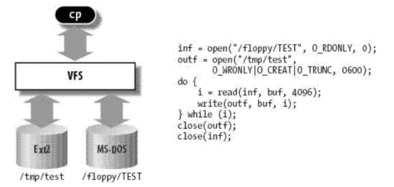
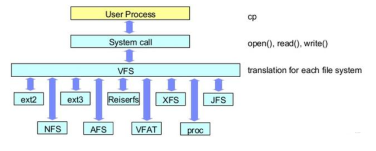
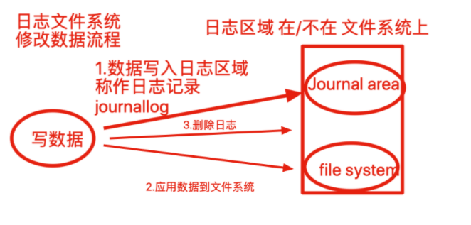
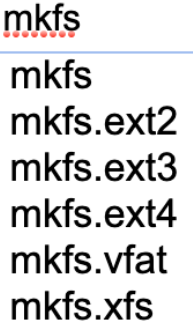
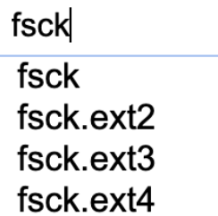

## Linux支持的文件系统

### VFS

文件系统的种类有很多。

除了Linux标准的文件系统Ext2/Ext3/Ext4外，还有很多种文件系统 。linux通过叫做VFS的中间层对这些文件系统提供了完美的支持。

**Virtualenv File System虚拟文件系统**

虚拟文件系统（VFS）是一个处于用户进程和各类文件系统之间的抽象接口层，VFS提供访问 文件系统对象的通用对象模型（例如，i-node、文件对象、页缓存、）和方法，它对用户进程 隐藏了各种文件系统的差别。

正是因为有VFS，所以用户进程不用关心使用的是那种文件系 统，也更不需要知道各个文件系统应该使用哪个系统调用。

**案例**

```
$ cp /floppy/TEST /tmp/test
```

其中/floppy是MS-DOS磁盘的一个安装点

而/tmp是一个标准的第二扩展文件系统（second Extended Filesystom, Ext2）的目录。

如图VFS是用户的应用程序与文件系统实现之间的抽象层。

cp程序并不需要知道/floppy/TEST 和 /tmp/test是什么文件系统类型。

相反，cp程序直接与VFS交互，这是通过Unix程序设计人员都熟悉的普通系统调用来进行的。



VFS概况：



磁盘分区完毕后，还得进行格式化（format）方可使用，好比家里的房子，打好隔断后，还得装修完毕才能使用。

磁盘格式化是因为`不同的操作系统`设置的文件属性、权限各不相同，还得将分区格式化后，称为操作系统能够识别、兼容的文件系统（filesystem）

不同的操作系统、使用的文件系统各不相同，如：

windows 98

- FAT
- FAT16

windows 2000

- NTFS

Linux自带文件系统

- Ext2
- ext3 、centos 5
- ext4、 centos 6
- xfs、 centos 7

*网络文件系统*

- Smb，Server Message Block、服务消息块，文件共享协议
- NFS，Network File System(*NFS*)，网络文件系统，访问网络中其他主机的文件就像是自己计算机一样

*集群文件系统*

- Gfs， google File System，Google公司为了存储海量搜索数据而设计的专用文件系统。
- ocfs，Oracle Cluster File System是由Oracle开发并在GNU通用公共许可证下发布的共享磁盘文件系统。主要是为了适应使用集群计算的Oracle数据库管理系统。

*分布式文件系统*

- Ceph 是一个统一的分布式存储系统，设计初衷是提供较好的性能、可靠性和可扩展性。

*交换文件系统*

- swap

### 日志文件系统

journaling fs就是我们常说的： 日志型文件系统。

比较典型的有： ext3, ext4, xfs等， 而ext2是不支持 日志的文件系统，该文件系统基本上已经不再使用；

**简单介绍其实现原理**： 在磁盘上有一块区域专门用来保存日志，叫做journaling 区域，在更新磁盘上特定的block之前，首先把要做的变更 记录到 journaling 区域，然后才去更新相应的block。

这样在系统崩溃的时候，可以通过journaling区域的信息，进行replay, 从而实现 恢复；



如果是非日志文件系统，进行读写操作，内核直接修改文件元数据，如果在写入过程异常崩溃，文件一致性就会出错，且修复过程很漫长，因此必须使用日志类型文件系统。

## 文件系统创建工具

- 创建文件系统

```
mkfs命令
mkfs把分区格式化为某种文件系统
```



- 修复文件系统

```
fsck
检查并修复Linux文件系统
```



- 查看文件系统属性

```
dumpe2fs命令用于打印文件系统的超级块和块组信息,用于ext2 ext3 ext4文件
然而centos7使用的xfs文件系统，更换xfs_info命令查看分区信息
```

- 调整文件系统特性

```
tune2fs 
调整/查看ext2/ext3文件系统的文件系统参数，Windows下面如果出现意外断电死机情况，下次开机一般都会出现系统自检。
Linux系统下面也有文件系统自检，而且是可以通过tune2fs命令，自行定义自检周期及方式。

-c max-mount-counts 设置强制自检的挂载次数  -1表示关闭
# tune2fs -c 30 /dev/hda1           #设置强制检查前文件系统可以挂载的次数
# tune2fs -c -l /dev/hda1           #关闭强制检查挂载次数限制。
```

- 列出所有设备的关系、文件系统

> lsblk  列出所有的块设备，而且还能显示他们之间的依赖关系

```
[root@sql ~]# lsblk -f
NAME            FSTYPE     LABEL           UUID                                   MOUNTPOINTsda                                                                               
├─sda1          xfs                        66e76240-cabd-4b0c-8407-ec3ff4ee7163   /boot
└─sda2          LVM2_membe                 2ei20l-Umzc-fW4J-hGR6-KcyI-IsYQ-uOuEjD 
  ├─centos-root xfs                        0ed0df24-595e-4991-8b41-edfa4e804ebe   /
  └─centos-swap swap                       b7d85e55-f8d9-47a5-949d-50dc3f52ca4c   [SWAP]
sr0             iso9660    CentOS 7 x86_64 2020-11-03-14-55-29-00 
```

### 格式化文件系统

给刚打好隔断的房间，装修------给刚分区号的磁盘格式化文件系统

> 格式化为xfs文件系统

```
[root@sql ~]# mkfs.xfs -f /dev/sdb5
meta-data=/dev/sdb5              isize=512    agcount=4, agsize=327680 blks
         =                       sectsz=512   attr=2, projid32bit=1
         =                       crc=1        finobt=0, sparse=0
data     =                       bsize=4096   blocks=1310720, imaxpct=25
         =                       sunit=0      swidth=0 blks
naming   =version 2              bsize=4096   ascii-ci=0 ftype=1
log      =internal log           bsize=4096   blocks=2560, version=2
         =                       sectsz=512   sunit=0 blks, lazy-count=1
realtime =none                   extsz=4096   blocks=0, rtextents=0

[root@sql ~]# lsblk -f -a
NAME            FSTYPE      LABEL UUID                                   MOUNTPOINT
sda
├─sda1          xfs               2cf87472-f9c2-43cd-aa0e-1d8827ac307f   /boot
└─sda2          LVM2_member       VWePn4-g5RI-mWqG-6ted-DpQf-JU5Y-2OGJwi
  ├─centos-root xfs               d417666c-9823-47db-b69d-f0c9318304c4   /
  └─centos-swap swap              ce7999ab-4ffc-455a-9849-af8aa3ed2975   [SWAP]
sdb
├─sdb1          xfs               5a912c96-90ec-4769-900c-53900a153ed4
├─sdb2
└─sdb5          xfs               5db9857c-4ea6-4819-a265-89b2eb41396d
sr0
```

格式化为ext4

```
[root@sql ~]# mkfs.ext4 /dev/sdb5
mke2fs 1.42.9 (28-Dec-2013)
文件系统标签=
OS type: Linux
块大小=4096 (log=2)
分块大小=4096 (log=2)
Stride=0 blocks, Stripe width=0 blocks
327680 inodes, 1310720 blocks
65536 blocks (5.00%) reserved for the super user
第一个数据块=0
Maximum filesystem blocks=1342177280
40 block groups
32768 blocks per group, 32768 fragments per group
8192 inodes per group
Superblock backups stored on blocks:
    32768, 98304, 163840, 229376, 294912, 819200, 884736

Allocating group tables: 完成
正在写入inode表: 完成
Creating journal (32768 blocks): 完成
Writing superblocks and filesystem accounting information: 完成
```

关闭文件系统自检

```
[root@sql ~]# tune2fs -c -1 /dev/sdb5
tune2fs 1.42.9 (28-Dec-2013)
Setting maximal mount count to -1
```

**如有需要将GPT改为MBR，还得用parted命令，fdisk命令无用**

修改命令如下

```
parted /dev/sdb
(parted)mktable   #输入格式化命令
New disk label type? msdos   #这里是更换为MBR格式
Warning: The existing disk label on /dev/vdb will be destroyed and all data on
this disk will be lost. Do you want to continue?
Yes/No?Yes    #确认格式化
```

### fsck

**fsck命令**被用于检查并且试图修复文件系统中的错误。当文件系统发生错误四化，可用fsck指令尝试加以修复。

Linux在开机的时候，系统会自动调用fsck命令进行需要自检的磁盘检查

```
fsck命令
-a：自动修复文件系统，不询问任何问题；
-A：依照/etc/fstab配置文件的内容，检查文件内所列的全部文件系统；
-N：不执行指令，仅列出实际执行会进行的动作；
-P：当搭配"-A"参数使用时，则会同时检查所有的文件系统；
-r：采用互动模式，在执行修复时询问问题，让用户得以确认并决定处理方式；
-R：当搭配"-A"参数使用时，则会略过/目录的文件系统不予检查；
-s：依序执行检查作业，而非同时执行；
-t<文件系统类型>：指定要检查的文件系统类型；
-T：执行fsck指令时，不显示标题信息；
-V：显示指令执行过程。
```

系统开机过程会读取/etc/fstab文件，最后一列为1或2，磁盘在开机时候就会调用fsck自检

```
cat /etc/fstab

# /etc/fstab
# Created by anaconda on Fri Aug 18 03:51:14 2017
#
# Accessible filesystems, by reference, are maintained under '/dev/disk'
# See man pages fstab(5), findfs(8), mount(8) and/or blkid(8) for more info
#
UUID=59d9c*********933****76b5 /                       ext4    defaults        1 1

最后一列为0表示不对磁盘检查，1是检查
[root@www ~]# fsck -t ext3 /dev/sda1 #检查ext3 类型的分区/dev/sad1
```

## 总结

```
xfs文件系统   用xfs_info显示信息
                        用xfs_admin修改信息

ext3 ext4  用dumpe2fs显示信息  
            用tune2fs修改信息
```