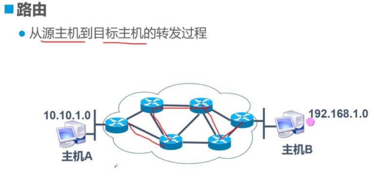

## ifconfig

用于配置网卡ip地址信息等网络参数或显示网络接口状态，类似于windows的ipconfig命令。

可以用这个工具来临时性的配置网卡的IP地址、掩码、广播地址、网关等。

注意只能用root使用此命令，且系统如果没有此命令，需要单独安装

```
yum install net-tools -y

语法：

ifconfig [网络设备][down up -allmulti -arp -promisc][add<地址>][del<地址>][<hw<网络设备类型><硬件地址>][io_addr<I/O地址>][irq<IRQ地址>][media<网络媒介类型>][mem_start<内存地址>][metric<数目>][mtu<字节>][netmask<子网掩码>][tunnel<地址>][-broadcast<地址>][-pointopoint<地址>][IP地址]
```

参数

```
up 启动指定网络设备/网卡
down 关闭指定网络设备/网卡
-arp 设置指定网卡是否支持ARP协议
-promisc 设置是否支持网卡的promiscuous模式，如果选择此参数，网卡将接收网络中发给它所有的数据包
-allmulti 设置是否支持多播模式，如果选择此参数，网卡将接收网络中所有的多播数据包
-a 显示全部接口信息
-s 显示摘要信息（类似于 netstat -i）
add 给指定网卡配置IPv6地址
del 删除指定网卡的IPv6地址
<硬件地址> 配置网卡最大的传输单元
mtu<字节数> 设置网卡的最大传输单元 (bytes)
netmask<子网掩码> 设置网卡的子网掩码
tunel 建立隧道
dstaddr 设定一个远端地址，建立点对点通信
-broadcast<地址> 为指定网卡设置广播协议
-pointtopoint<地址> 为网卡设置点对点通讯协议
multicast 为网卡设置组播标志
为网卡设置IPv4地址
txqueuelen<长度> 为网卡设置传输列队的长度
```

**ifconfig案例**


MAC地址，称为局域网地址，以太网地址或物理地址，它是一个用来确认网上设备位置的地址。在OSI模型中，第三层网上层负责IP地址，第二层数据链接层则负责MAC地址。

```
[root@docker01 ~]# ifconfig
ens33: flags=4163<UP,BROADCAST,RUNNING,MULTICAST>  mtu 1500
        inet 192.168.6.22  netmask 255.255.255.0  broadcast 192.168.6.255  #ipv4
        inet6 fe80::861d:e784:8c15:7d6a  prefixlen 64  scopeid 0x20<link>
        ether 00:0c:29:66:90:b0  txqueuelen 1000  (Ethernet)               #mac地址
        RX packets 31310  bytes 2543435 (2.4 MiB)
        RX errors 0  dropped 0  overruns 0  frame 0
        TX packets 18166  bytes 1510546 (1.4 MiB)
        TX errors 0  dropped 0 overruns 0  carrier 0  collisions 0
```


**给网卡设置别名、添加多个ip地址**

```
#添加并启动新ip
ifconfig ens33:0 192.168.178.111 netmask 255.255.255.0 up

#第二种方式添加
ifconfig ens33:0 192.168.178.115/24 up
```

**修改MAC地址**

```
ifconfig ens33 hw ether 00:0c:29:13:10:CF
ifconfig ens33 hw ether 00:0c:29:1f:ea:9e  #再改回去
```

**修改网卡配置文件**


以上命令重启网卡或是机器后，网卡信息会还原，想要永久修改网卡信息，还得修改配置文件

网卡路径

```
ls /etc/sysconfig/network-scripts/ |grep ifcfg
ifcfg-ens33
ifcfg-lo

别名也可以设置配置文件
例如/etc/sysconfig/network-scripts/ifcfg-ens33:0
```

## route

route程序对内核的IP选路表进行操作。它主要用于通过已用ifconfig(8)程序配置好的接口来指定的主机或网络设置静态路由。

路由概念：

计算机之间的数据传输必须经过网络，网络可以直接连接两台计算机，或者通过一个一个的节点构成。

路由器理解为互联网的中转站，网络中的数据包就是通过一个一个路由器转发到达目的地。



**路由的分类**


路由分为静态路由和动态路由。

Linux上配置的都是静态路由，是系统管理员使用route命令假如，也就是通过手动输入的方式添加路由规则。

动态路由是无需人为干预，是本机与不同机器之间经过路由的顺序，相互交换路由规则而来。

```

-v
    选用细节操作模式
-A family
    用指定的地址族(如`inet'，`inet6')。
-n
    以数字形式代替解释主机名形式来显示地址。此项对试图检测对域名服务器进行路由发生故障的原因非常有用。
-e
    用netstat(8)的格式来显示选路表。-ee将产生包括选路表所有参数在内的大量信息。
-net
    路由目标为网络。
-host
    路由目标为主机。
-F
    显示内核的FIB选路表。其格式可以用-e 和 -ee选项改变。
-C
    显示内核的路由缓存。
del
    删除一条路由。
add
    添加一条路由。
target
    指定目标网络或主机。可以用点分十进制形式的IP地址或主机/网络名。
netmask Nm
    为添加的路由指定网络掩码。
gw Gw
    为发往目标网络/主机的任何分组指定网关。注意：指定的网关首先必须是可达的。也就是说必须为该网关预先指定一条静态路由。如果你为本地接口之一指定这个网关地址的话，那么此网关地址将用于决定此接口上的分组将如何进行路由。这是BSD风格所兼容的。
metric M
    把选路表中的路由值字段(由选路进程使用)设为M。
mss M
    把基于此路由之上的连接的TCP最大报文段长度设为M字节。这通常只用于优化选路设置。默认值为536。
window W
    把基于此路由之上的连接的TCP窗口长度设为W字节。这通常只用于AX.25网络和不能处理背对背形式的帧的设备。
irtt I
    把基于此路由之上的TCP连接的初始往返时间设为I毫秒(1-12000)。这通常也只用于AX.25网络。如果省略此选项，则使用RFC1122的缺省值300ms。
reject
    设置一条阻塞路由以使一条路由查找失败。这用于在使用缺省路由前先屏蔽掉一些网络。但这并不起到防火墙的作用。
mod, dyn, reinstate
    设置一条动态的或更改过的路由。这些标志通常只由选路进程来设置。这只用于诊断目的，
dev If
    强制使路由与指定的设备关联，因为否则内核会自己来试图检测相应的设备(通常检查已存在的路由和加入路由的设备的规格)。在多数正常的网络上无需使用。
    如果dev If是命令行上最后一个指定的选项，那么可以省略关键字dev，因为它是缺省值。否则路由修改对象(metric - netmask- gw - dev)无关紧要。
```

**route案例**

```
#route 添加-n参数，不解析dns
[root@docker01 ~]# route -n
Kernel IP routing table
Destination     Gateway         Genmask         Flags Metric Ref    Use Iface
0.0.0.0         192.168.6.2     0.0.0.0         UG    100    0        0 ens33
192.168.6.0     0.0.0.0         255.255.255.0   U     100    0        0 ens33
# route将IP地址进行DNS解析成主机名
[root@docker01 ~]# route
Kernel IP routing table
Destination     Gateway         Genmask         Flags Metric Ref    Use Iface
default         gateway         0.0.0.0         UG    100    0        0 ens33
192.168.6.0     0.0.0.0         255.255.255.0   U     100    0        0 ens33
```

解释

- Destination：表示网络号，network的意思
- Gateway：网关地址，网络是通过该IP连接出去的，如果显示0.0.0.0代表该路由是直接本机传送出去的，如果有ip表示本条路由必须经过该IP才能连接出去。
- Genmask：子网掩码地址，也就是netmask，IP+NETMASK组成一个完整的网络
- Flags：路由标记信息，标记当前网络节点的状态
  - U Up表示此路由当前为启动状态。
  - H Host，表示此网关为一主机
  - G Gateway，表示此网关为一路由器。
  - R Reinstate Route，使用动态路由重新初始化的路由。
  - D Dynamically,此路由是动态性地写入。
  - M Modified，此路由是由路由守护程序或导向器动态修改。
  - ! 表示此路由当前为关闭状态，用于禁止不安全的网络
- Metric：需要经过几个网络节点才能到达路由的目标地址
- Ref：参考到此路由规则的数目
- Iface：路由对应的网络设备接口

```
192.168.178.0   0.0.0.0         255.255.255.0   U     102    0        0 ens33
表示主机所在网段是192.168.178.0
若数据传送目标在同一网段，可以直接通过ens33转发数据包

0.0.0.0         192.168.178.2   0.0.0.0         UG    102    0        0 ens33
是系统默认网关，表示去任何地方的请求，都转发给192.168.178.2网关去处理
```

**添加和删除默认网关**


默认网关就是数据包不匹配任何设定的路由规则最后流经的地址关口。

网关网关，网络的关口，就好比家里的门，外出就得经过访问，数据也是一样。

```
#此时我的机器，路由信息
[root@docker01 network-scripts]# route
Kernel IP routing table
Destination     Gateway         Genmask         Flags Metric Ref    Use Iface
default         bogon           0.0.0.0         UG    102    0        0 ens33
192.168.178.0   0.0.0.0         255.255.255.0   U     102    0        0 ens33
```

**删除网关**

```
[root@docker01 network-scripts]# route del default
[root@docker01 ~]# route
Kernel IP routing table
Destination     Gateway         Genmask         Flags Metric Ref    Use Iface
192.168.178.0   0.0.0.0         255.255.255.0   U     100    0        0 ens33
```

**添加网关**

```
[root@docker01 ~]# route add default gw 192.168.178.2
[root@docker01 ~]# route -n
Kernel IP routing table
Destination     Gateway         Genmask         Flags Metric Ref    Use Iface
0.0.0.0         192.168.178.2   0.0.0.0         UG    0      0        0 ens33
192.168.178.0   0.0.0.0         255.255.255.0   U     100    0        0 ens33

以上方式等同于
route add -net 0.0.0.0 gw 192.168.178.2
```

## arp

arp是地址解析协议（ARP、Address Resolution Protocol），主要功能是根据IP地址获取物理地址（MAC地址）

```
[描述]
    用来管理系统的arp缓存，常用的命令包括：
    arp: 显示所有的表项。
    arp  -d  address: 删除一个arp表项。
    arp  -s address hw_addr: 设置一个arp表项。

常用参数：
    -a 使用bsd形式输出。（没有固定的列）
    -n 使用数字形式显示ip地址，而不是默认的主机名形式。
    -D 不是指定硬件地址而是指定一个网络接口的名称，表项将使用相应接口的MAC地址。一般用来设置ARP代理。
    -H type, --hw-type type: 指定检查特定类型的表项，默认type为ether，还有其他类型。
    -i If, --device If: 指定设置哪个网络接口上面的arp表项。
    -f filename: 作用同'-s',不过它通过文件来指定IP地址和MAC地址的绑定。文件中每行分别是主机和MAC，中间以空格分割。如果没有指定文件名称，则使用/etc/ethers文件。
```

**arp案例**

```
显示arp缓存区的所有条目
[root@docker01 ~]# arp
Address                  HWtype  HWaddress           Flags Mask            Iface
gateway                  ether   00:50:56:fc:38:7f   C                     ens33
192.168.6.1              ether   00:50:56:c0:00:08   C                     ens33
192.168.6.80             ether   00:50:56:34:de:ca   C                     ens33


Address：主机地址或是主机名
HWtype：硬件类型
HWaddress：硬件地址
Flags Mask：记录标志，C表示是arp缓存中的条目，M表示静态arp条目
Iface：网络接口

#不解析dns
[root@docker01 ~]# arp -n
Address                  HWtype  HWaddress           Flags Mask            Iface
192.168.6.2              ether   00:50:56:fc:38:7f   C                     ens33
192.168.6.1              ether   00:50:56:c0:00:08   C                     ens33
192.168.6.80             ether   00:50:56:34:de:ca   C                     ens33
```

## ip

ip是iproute软件包里面的一个强大的网络配置工具，用于显示或管理Linux系统的路由、网络设备、策略路由等。

```
ip命令的用法如下：

ip [OPTIONS] OBJECT [COMMAND [ARGUMENTS]]

其中，OPTIONS是一些修改ip行为或者改变其输出的选项。所有的选项都是以-字符开头，分为长、短两种形式。目前，ip支持如下选项：

-V,-Version 打印ip的版本并退出。

-s,-stats,-statistics 输出更为详尽的信息。如果这个选项出现两次或者多次，输出的信息将更为详尽。

-f,-family 这个选项后面接协议种类，包括：inet、inet6或者link，强调使用的协议种类。如果没有足够的信息告诉ip使用的协议种类，ip就会使用默认值inet或者any。link比较特殊，它表示不涉及任何网络协议。

-4 是-family inet的简写。

-6 是-family inet6的简写。

-0 是-family link的简写。

-o,-oneline 对每行记录都使用单行输出，回行用字符代替。如果你需要使用wc、grep等工具处理ip的输出，会用到这个选项。

-r,-resolve 查询域名解析系统，用获得的主机名代替主机IP地址。
```

object对象

```
OBJECT是你要管理或者获取信息的对象。目前ip认识的对象包括：

link 网络设备

address 一个设备的协议（IP或者IPV6）地址

neighbour ARP或者NDISC缓冲区条目

route 路由表条目

rule 路由策略数据库中的规则

maddress 多播地址

mroute 多播路由缓冲区条目

tunnel IP上的通道

另外，所有的对象名都可以简写，例如：address可以简写为addr，甚至是a。
```

command

```
COMMAND设置针对指定对象执行的操作，它和对象的类型有关。一般情况下，ip支持对象的增加(add)、删除(delete)和展示(show或者list)。有些对象不支持所有这些操作，或者有其它的一些命令。对于所有的对象，用户可以使用help命令获得帮助。这个命令会列出这个对象支持的命令和参数的语法。如果没有指定对象的操作命令，ip会使用默认的命令。一般情况下，默认命令是list，如果对象不能列出，就会执行help命令。
```

arguments

```
ARGUMENTS是命令的一些参数，它们倚赖于对象和命令。ip支持两种类型的参数：flag和parameter。flag由一个关键词组成；parameter由一个关键词加一个数值组成。为了方便，每个命令都有一个可以忽略的默认参数。例如，参数dev是ip link命令的默认参数，因此ip link ls eth0等于ip link ls dev eth0。我们将在后面的章节详细介绍每个命令的使用，命令的默认参数将使用default标出。
link支持：set、show
address支持：add、del、flush、show
```

**ip案例**


**显示ens33网卡信息**

```
[root@docker01 ~]# ip link show dev ens33
2: ens33: <BROADCAST,MULTICAST,UP,LOWER_UP> mtu 1500 qdisc pfifo_fast state UP mode DEFAULT group default qlen 1000
    link/ether 00:0c:29:66:90:b0 brd ff:ff:ff:ff:ff:ff
```

**-s参数显示详细信息**

```
[root@docker01 ~]# ip -s link show dev ens33
2: ens33: <BROADCAST,MULTICAST,UP,LOWER_UP> mtu 1500 qdisc pfifo_fast state UP mode DEFAULT group default qlen 1000
    link/ether 00:0c:29:66:90:b0 brd ff:ff:ff:ff:ff:ff
    RX: bytes  packets  errors  dropped overrun mcast   
    2868096    35637    0       0       0       0       
    TX: bytes  packets  errors  dropped carrier collsns 
    1701557    20736    0       0       0       0 
```

**开关网络设备**

```
[root@docker01 ~]# ip link set ens33 down
[root@docker01 ~]# ip link set ens33 up
```

**修改网卡MAC地址**

```
[root@docker01 ~]# ip link set ens33 address 0:0c:29:13:10:11
[root@docker01 ~]# ip link show dev ens33
2: ens33: <BROADCAST,MULTICAST,UP,LOWER_UP> mtu 1500 qdisc pfifo_fast state UP mode DEFAULT group default qlen 1000
    link/ether 00:0c:29:13:10:11 brd ff:ff:ff:ff:ff:ff
```

**查看网卡信息**

```
[root@docker01 ~]# ip address show
1: lo: <LOOPBACK,UP,LOWER_UP> mtu 65536 qdisc noqueue state UNKNOWN group default qlen 1000
    link/loopback 00:00:00:00:00:00 brd 00:00:00:00:00:00
    inet 127.0.0.1/8 scope host lo
       valid_lft forever preferred_lft forever
    inet6 ::1/128 scope host
       valid_lft forever preferred_lft forever
2: ens33: <BROADCAST,MULTICAST,UP,LOWER_UP> mtu 1500 qdisc pfifo_fast state UP group default qlen 1000
    link/ether 00:0c:29:13:10:11 brd ff:ff:ff:ff:ff:ff
    inet 192.168.178.180/24 brd 192.168.178.255 scope global noprefixroute ens33
       valid_lft forever preferred_lft forever
    inet6 fe80::d2d8:6d71:84a:bacd/64 scope link noprefixroute
       valid_lft forever preferred_lft forever

也可以用缩减命令 
[root@docker01 ~]# ip a
```

**添加或删除IP地址**


添加ip

```
[root@docker01 ~]# ip a add 192.168.178.111/24 dev ens33
[root@docker01 ~]#
[root@docker01 ~]# ip a
1: lo: <LOOPBACK,UP,LOWER_UP> mtu 65536 qdisc noqueue state UNKNOWN group default qlen 1000
    link/loopback 00:00:00:00:00:00 brd 00:00:00:00:00:00
    inet 127.0.0.1/8 scope host lo
       valid_lft forever preferred_lft forever
    inet6 ::1/128 scope host
       valid_lft forever preferred_lft forever
2: ens33: <BROADCAST,MULTICAST,UP,LOWER_UP> mtu 1500 qdisc pfifo_fast state UP group default qlen 1000
    link/ether 00:0c:29:13:10:11 brd ff:ff:ff:ff:ff:ff
    inet 192.168.178.180/24 brd 192.168.178.255 scope global noprefixroute ens33
       valid_lft forever preferred_lft forever
    inet 192.168.178.111/24 scope global secondary ens33
       valid_lft forever preferred_lft forever
    inet6 fe80::d2d8:6d71:84a:bacd/64 scope link noprefixroute
       valid_lft forever preferred_lft forever

[root@docker01 ~]# ip link set ens33 up
[root@docker01 ~]# ping 192.168.178.111
PING 192.168.178.111 (192.168.178.111) 56(84) bytes of data.
64 bytes from 192.168.178.111: icmp_seq=1 ttl=64 time=0.012 ms
```

删除ip

```
[root@docker01 ~]# ip a del 192.168.178.180/24 dev ens33  #此时ip已经被删掉，远程终端会断开

可以用另一个ip连接
yumac:~ yuchao$ ssh root@192.168.178.111
```

**ip命令添加别名**

```
[root@docker01 ~]# ip a add 192.168.178.120/24 dev ens33 label ens33:1

#通过ifconfig命令检查
[root@docker01 ~]# ifconfig
```

**ip检查路由表**

```
[root@docker01 ~]# ip route
default via 192.168.178.2 dev ens33 proto static metric 100
192.168.178.0/24 dev ens33 proto kernel scope link src 192.168.178.111
```

**ip检查arp缓存（显示网络邻居信息）**

```
[root@docker01 ~]# ip neighbour
192.168.178.2 dev ens33 lladdr 00:50:56:eb:26:44 REACHABLE

192.168.178.1 dev ens33 lladdr 00:50:56:c0:00:08 DELAY
```

## netstat

netstat - 显示网络连接，路由表，接口状态，伪装连接，网络链路信息和组播成员组。


描述

```
语法参数
Netstat 程序显示Linux网络子系统的信息。 输出信息的类型是由第一个参数控制的，就像这样： [[ ]]

(none)
无选项时, netstat 显示打开的套接字. 如果不指定任何地址族，那么打印出所有已配置地址族的有效套接字。 [[ ]]

--route , -r
显示内核路由表。 [[ ]]

--groups , -g
显示IPv4 和 IPv6的IGMP组播组成员关系信息。 [[ ]]

--interface=iface , -i
显示所有网络接口列表或者是指定的 iface 。 [[ ]]

--masquerade , -M
显示一份所有经伪装的会话列表。 [[ ]]

--statistics , -s
显示每种协议的统计信息。 [[ ]]
```

选项 OPTIONS

```
--verbose , -v
详细模式运行。特别是打印一些关于未配置地址族的有用信息。 [[ ]]

--numeric , -n
显示数字形式地址而不是去解析主机、端口或用户名。 [[ ]]

--numeric-hosts
显示数字形式的主机但是不影响端口或用户名的解析。 [[ ]]

--numeric-ports
显示数字端口号，但是不影响主机或用户名的解析。 [[ ]]

--numeric-users
显示数字的用户ID，但是不影响主机和端口名的解析。 [[ ]]

--protocol=family , -A
指定要显示哪些连接的地址族(也许在底层协议中可以更好地描述)。 family 以逗号分隔的地址族列表，比如 inet , unix , ipx , ax25 , netrom , 和 ddp 。 这样和使用 --inet , --unix ( -x ), --ipx , --ax25 , --netrom, 和 --ddp 选项效果相同。 地址族 inet 包括raw, udp 和tcp 协议套接字。 [[ ]]

-c, --continuous
将使 netstat 不断地每秒输出所选的信息。 [[ ]]

-e, --extend
显示附加信息。使用这个选项两次来获得所有细节。 [[ ]]

-o, --timers
包含与网络定时器有关的信息。 [[ ]]

-p, --programs
显示套接字所属进程的PID和名称。 [[ ]]

-l, --listening
只显示正在侦听的套接字(这是默认的选项) [[ ]]

-a, --all
显示所有正在或不在侦听的套接字。加上 --interfaces 选项将显示没有标记的接口。 [[ ]]

-F
显示FIB中的路由信息。(这是默认的选项) [[ ]]

-C
显示路由缓冲中的路由信息。 [[ ]]

delay
netstat将循环输出统计信息，每隔 delay 秒。 [[ ]]
```

输出解释

活动的Internet网络连接 (TCP, UDP, raw)

```
Proto
套接字使用的协议。 [[ ]]

Recv-Q
连接此套接字的用户程序未拷贝的字节数。 [[ ]]

Send-Q
远程主机未确认的字节数。 [[ ]]

Local Address
套接字的本地地址(本地主机名)和端口号。除非给定-n --numeric ( -n ) 选项，否则套接字地址按标准主机名(FQDN)进行解析，而端口号则转换到相应的服务名。 [[ ]]

Foreign Address
套接字的远程地址(远程主机名)和端口号。 Analogous to "Local Address." [[ ]]

State
套接字的状态。因为在RAW协议中没有状态，而且UDP也不用状态信息，所以此行留空。通常它为以下几个值之一：

ESTABLISHED
套接字有一个有效连接。
SYN_SENT
套接字尝试建立一个连接。
SYN_RECV
从网络上收到一个连接请求。
FIN_WAIT1
套接字已关闭，连接正在断开。
FIN_WAIT2
连接已关闭，套接字等待远程方中止。
TIME_WAIT
在关闭之后，套接字等待处理仍然在网络中的分组
CLOSED
套接字未用。
CLOSE_WAIT
远程方已关闭，等待套接字关闭。
LAST_ACK
远程方中止，套接字已关闭。等待确认。
LISTEN
套接字监听进来的连接。如果不设置 --listening (-l) 或者 --all (-a) 选项，将不显示出来这些连接。
CLOSING
套接字都已关闭，而还未把所有数据发出。
UNKNOWN
套接字状态未知。
```

State

```
此字段包含以下关键字之一：

FREE
套接字未分配。
LISTENING
套接字正在监听一个连接请求。除非设置 --listening (-l) 或者 --all (-a) 选项，否则不显示。
CONNECTING
套接字正要建立连接。
CONNECTED
套接字已连接。
DISCONNECTING
套接字已断开。
(empty)
套接字未连。
```

**netstat案例**


常用组合参数

```
[root@docker01 ~]# netstat -tunlp
Active Internet connections (only servers)
Proto Recv-Q Send-Q Local Address           Foreign Address         State       PID/Program name    
tcp        0      0 0.0.0.0:111             0.0.0.0:*               LISTEN      788/rpcbind         
tcp        0      0 0.0.0.0:22              0.0.0.0:*               LISTEN      1249/sshd           
tcp        0      0 0.0.0.0:873             0.0.0.0:*               LISTEN      792/rsync 
```

参数解释


- -l：显示所有Listen监听中的网络连接
- -n：显示IP地址，不进行DNS解析成主机名、域名
- -t：显示所有tcp连接
- -u：显示所有udp连接
- -p：显示进程号与进程名


**显示网络的接口情况**

```
[root@docker01 ~]# netstat -i
Kernel Interface table
Iface             MTU    RX-OK RX-ERR RX-DRP RX-OVR    TX-OK TX-ERR TX-DRP TX-OVR Flg
ens33            1500    36896      0      0 0         21528      0      0      0 BMRU
lo              65536        0      0      0 0             0      0      0      0 LRU
```

- Iface：网络设备的接口名
- MTU：最大传输单元，单位是字节
- RX-OK/TX-OK：正确接收，发送了多少数据包
- RX-ERR/TX-ERR：接收、发送数据包时丢弃了多少数据包
- RX-OVR/TX-OVR：由于错误遗失了多少数据包
- Flg：接口标记
  - L：是回环地址
  - B：设置了广播地址
  - M：接收所有数据包
  - R：接口正在运行
  - U：接口正处于活动状态
  - O：表示在该接口上禁止arp
  - P：表示一个点到点的连接

正常丢包、错误包的数值如果不为0，说明网络存在问题，性能会下降


**netstat实战**


检测rsync服务是否开启

```
[root@docker01 ~]# netstat -tunlp|grep rsync
tcp        0      0 0.0.0.0:873             0.0.0.0:*               LISTEN      792/rsync           
tcp6       0      0 :::873                  :::*                    LISTEN      792/rsync 
```

统计服务器各状态的网络连接个数，利用awk的数组功能

```
[root@web ~]# netstat -n |awk '/^tcp/{++yzh[$NF]} END {for(i in yzh)print i,yzh[i]}'
LAST_ACK 2
CLOSE_WAIT 151
ESTABLISHED 47
FIN_WAIT2 2
TIME_WAIT 59
```

## ss

ss命令是在centos7之后目的在于替代netstat的工具，用来查看网络状态信息，包括TCP、UDP、连接、端口等。优点在于能够显示更多详细的网络状态信息

如果系统没有ss命令，则需要安装下

```
yum install iproute -y
```

ss命令参数

```
-a  显示所有网络连接
-l  显示LISTEN状态的连接(连接打开)
-m 显示内存信息(用于tcp_diag)
-o  显示Tcp 定时器x
-p  显示进程信息
-s  连接统计
-n  显示ip地址，不进行dns解析
-d  只显示 DCCP信息 (等同于 -A dccp)
-u  只显示udp信息 (等同于 -A udp)
-w 只显示 RAW信息 (等同于 -A raw)
-t 只显示tcp信息 (等同于 -A tcp)
-x 只显示Unix通讯信息 (等同于 -A unix)

-4 只显示 IPV4信息
-6 只显示 IPV6信息
--help 显示帮助信息
--version 显示版本信息
```

**ss案例**

```
#显示所有的socket连接
[root@docker01 ~]# ss -an

#格式化输出
[root@docker01 ~]# ss -an|column -t
```

显示正在监听的TCP和UDP连接

```
[root@docker01 ~]# ss -tunlp |column -t
```

显示socket统计

可以用于统计服务器链接数的宏观数据统计

```
ss -s
```

## ping

ping命令用于检测主机之间网络的连通性，执行ping命令使用ICMP传输协议，发出要求回应的信息。


参数

```
-c
    count 在发送(和接收)了正好数量为 count 的回显应答分组后停止操作。在发送了 count 个分组后没有收到任何分组的特别情况是发送导致了终止(选程主机或网关不可达)。
-d      
    在所用的套接字上使用SO_DEBUG 选项。
-f      
    以高速方式来作ping 。以分组返回的速度来输出其它分组或每秒输出百次。当收到每个回显应答并打印一个退格符时，对每个回显请求都打印一个句点``.。这可以快速显示出丢弃了多少个分组，只有超级用户可以用这个选项。这（操作）对网络要求非常苛刻，应该慎重使用。
-i
    wait 在发送每个分组时等待 wait 个秒数。缺省值为每个分组等待一秒。此选项与-f选项不能同时使用。
-l
    preload 如果指定 preload ，那么 ping 程序在开始正常运行模式前尽可能快地发送分组。同样只有超级用户可以用这个选项。
-n      
    只以数字形式输出信息。这样就不尝试去查找主机名了。
-p
    pattern 可以指定最多16个填充字节用于保持分组长度为16的整数倍。在网络上诊断与数据相关问题时此选项很有用。例如``-p ff将使发出的分组都用全1填充数据区。
-q      
    静态输出。在程序启动和结束时只显示摘要行。
-R      
    记录路由。在回显请求分组中包含记录路由选项并在相应的分组返回时显示路由缓冲区。注意IP首部的容量只能存放9条这样的路由。很多主机忽略或禁用此选项。
-r      
    在所连接的网络上旁路正常的选路表，直接向主机发送分组。如果主机未处于直接相连的网络上，那么返回一个错误。此选项可用来通过无路由接口对一台主机进行检测(例如当接口已被routed 程序丢弃后)。
-s
    packetsize 指定要发送数据的字节量。缺省值为 56 ，这正好在添加了 8 字节的 ICMP 首部后组装成 64 字节的 ICMP 数据报。
    详细模式输出。打印接收到的回显应答以外的ICMP分组。
-t
    设置存活数值TTL的大小-v      
-w
    waitsecs 在 waitsecs 秒后停止 ping 程序的执行。当试图检测不可达主机时此选项很有用。
```

**ping案例**


测试到目标及其的网络连通性

```
[root@docker01 ~]# ping baidu.com
PING baidu.com (220.181.38.251) 56(84) bytes of data.
64 bytes from 220.181.38.251 (220.181.38.251): icmp_seq=1 ttl=128 time=18.6 ms
64 bytes from 220.181.38.251 (220.181.38.251): icmp_seq=2 ttl=128 time=17.2 ms
64 bytes from 220.181.38.251 (220.181.38.251): icmp_seq=3 ttl=128 time=18.7 ms
64 bytes from 220.181.38.251 (220.181.38.251): icmp_seq=4 ttl=128 time=16.8 ms

#ping命令跟着域名或是ip地址，会一直刷新ping的结果
#ping发送了56字节的数据
#从目标及其收到的数据是64字节，icmp_seq是收到的序列包，ttl是数据包的生存期，time是延迟
#直到ctrl + c 终止ping

--- baidu.com ping statistics ---                                #ping命令的统计结果
4 packets transmitted, 4 received, 0% packet loss, time 3009ms   #发了2个包，收到2个包
rtt min/avg/max/mdev = 16.859/17.874/18.763/0.839 ms             #最小/平均/最大/平均差
```

扩展

```
ping命令的输出信息中含有TTL值，Time To Life（生存期），指的是ICMP报文在网络中的存活时间。不同的操作系统发出的ICMP报文生存期不同，有32、64、128、255等。
```

ping不通的情况

```
1.pign不存在的网址
[root@docker01 ~]# ping test.cn
ping: test.cn: Name or service not known  #未知的名称或服务

2.ping的时候出现”Destination Host Unreachable“
```

ping命令组合

```
[root@docker01 ~]# ping -c 3 -i 3 -s 1024 -t 255 baidu.com
PING baidu.com (220.181.38.148) 1024(1052) bytes of data.
1032 bytes from 220.181.38.148 (220.181.38.148): icmp_seq=1 ttl=128 time=18.2 ms
1032 bytes from 220.181.38.148 (220.181.38.148): icmp_seq=2 ttl=128 time=17.6 ms
^C
--- baidu.com ping statistics ---
2 packets transmitted, 2 received, 0% packet loss, time 3001ms
rtt min/avg/max/mdev = 17.626/17.941/18.257/0.342 ms


#参数解释
-c 3 发送3次ICMP包
-i 3 每隔3秒发包
-s 1024 发送1024字节的数据包
-t 255 设置数据包存活值255
```

## telnet

telnet主要用于判断服务器是否打开了远程端口。


telnet使用

```
yum install telnet -y

1.检测ssh端口是否开放
[root@docker01 ~]# telnet 192.168.6.22 22
Trying 192.168.6.22...
Connected to 192.168.6.22.
Escape character is '^]'.
SSH-2.0-OpenSSH_7.4

Protocol mismatch.

进入telnet后，ctrl+c也无法退出，根据输入，按下ctrl+]，然后进入telnet命令行，输入quit结束

2.端口未打开
[root@docker01 ~]# telnet 192.168.6.210 22
Trying 192.168.6.210...
telnet: connect to address 192.168.6.210: No route to host

连接不上，表示端口服务未开启，或是端口禁止访问等问题
```

## ssh

SSH(远程连接工具)连接原理：ssh服务是一个守护进程(demon)，系统后台监听客户端的连接，ssh服务端的进程名为sshd,负责实时监听客户端的请求(IP 22端口)，包括公共秘钥等交换等信息。

ssh服务端由2部分组成： openssh(提供ssh服务) openssl(提供加密的程序)

ssh的客户端可以用 XSHELL，Securecrt, Mobaxterm等工具进行连接

```
参数
-p port
    指定远程主机的端口. 可以在配置文件中对每个主机单独设定这个参数.
-t
    强制分配伪终端. 可以在远程机器上执行任何全屏幕(screen-based)程序, 所以非常有用, 例如菜单服务。即使没有本地终端，多个-t选项也会强制分配终端
    
-v 
	调试模式，打印关于运行情况的调试信息. 在调试连接, 认证和配置问题时非常有用
```

案例

```
#远程登录服务器

PS C:\Users\Mechrevo> ssh root@192.168.6.22
root@192.168.6.22's password:
Last login: Wed Mar  2 23:12:07 2022 from 192.168.6.1
```

指定端口用户登录服务器

```
ssh yzh@192.168.6.22 -p 22
```

远程执行服务器的命令

```
ssh root@192.168.6.22 "free -m"
```

```
1.登录                   
  ssh -p22 omd@192.168.25.137               
2.直接执行命令  -->最好全路径                   
  ssh root@192.168.25.137 ls -ltr /backup/data                       
  ==>ssh root@192.168.25.137 /bin/ls -ltr /backup/data               
3.查看已知主机                    
  cat /root/.ssh/known_hosts
4.ssh远程执行sudo命令
  ssh -t omd@192.168.25.137 sudo rsync hosts /etc/

5.scp               
 1.功能   -->远程文件的安全(加密)拷贝                   
     scp -P22 -r -p /home/omd/h.txt omd@192.168.25.137:/home/omd/               
 2.scp知识小结                   
     scp是加密远程拷贝，cp为本地拷贝                   
     可以推送过去，也可以拉过来                   
     每次都是全量拷贝(效率不高，适合第一次)，增量拷贝用rsync

6.ssh自带的sftp功能               
 1.Window和Linux的传输工具                   
      wincp   filezip                   
   sftp  -->基于ssh的安全加密传输                   
   samba   
 2.sftp客户端连接                   
    sftp -oPort=22 root@192.168.25.137                   
    put /etc/hosts /tmp                   
    get /etc/hosts /home/omd   
3.sftp小结：                   
    1.linux下使用命令： sftp -oPort=22 root@x.x.x.x                   
    2.put加客户端本地路径上传                  
    3.get下载服务器端内容到本地                   
    4.远程连接默认连接用户的家目录
```


## wget

- wget是一个下载文件的工具，它用在命令行下。对于Linux用户是必不可少的工具，我们经常要下载一些软件或从远程服务器恢复备份到本地服务器。

  wget支持HTTP，HTTPS和FTP协议，可以使用HTTP代理。所谓的自动下载是指，wget可以在用户退出系统的之后在后台执行。这意味这你可以登录系统，启动一个wget下载任务，然后退出系统，wget将在后台执行直到任务完成

  wget 可以跟踪HTML页面上的链接依次下载来创建远程服务器的本地版本，完全重建原始站点的目录结构。这又常被称作”递归下载”。

  wget 非常稳定，它在带宽很窄的情况下和不稳定网络中有很强的适应性.如果是由于网络的原因下载失败，wget会不断的尝试，直到整个文件下载完毕。如果是服务器打断下载过程，它会再次联到服务器上从停止的地方继续下载。这对从那些限定了链接时间的服务器上下载大文件非常有用。

```
用法： wget [选项]... [URL]...

长选项所必须的参数在使用短选项时也是必须的。

启动：
  -V,  --version           显示 Wget 的版本信息并退出。
  -h,  --help              打印此帮助。
  -b,  --background        启动后转入后台。
  -e,  --execute=COMMAND   运行一个“.wgetrc”风格的命令。

日志和输入文件：
  -o,  --output-file=FILE    将日志信息写入 FILE。
  -a,  --append-output=FILE  将信息添加至 FILE。
  -d,  --debug               打印大量调试信息。
  -q,  --quiet               安静模式 (无信息输出)。
  -v,  --verbose             详尽的输出 (此为默认值)。
  -nv, --no-verbose          关闭详尽输出，但不进入安静模式。
  -i,  --input-file=FILE     下载本地或外部 FILE 中的 URLs。
  -F,  --force-html          把输入文件当成 HTML 文件。
  -B,  --base=URL            解析与 URL 相关的
                             HTML 输入文件 (由 -i -F 选项指定)。
       --config=FILE         Specify config file to use.

下载：
  -t,  --tries=NUMBER            设置重试次数为 NUMBER (0 代表无限制)。
       --retry-connrefused       即使拒绝连接也是重试。
  -O,  --output-document=FILE    将文档写入 FILE。
  -nc, --no-clobber              skip downloads that would download to
                                 existing files (overwriting them).
  -c,  --continue                断点续传下载文件。
       --progress=TYPE           选择进度条类型。
  -N,  --timestamping            只获取比本地文件新的文件。
  --no-use-server-timestamps     不用服务器上的时间戳来设置本地文件。
  -S,  --server-response         打印服务器响应。
       --spider                  不下载任何文件。
  -T,  --timeout=SECONDS         将所有超时设为 SECONDS 秒。
       --dns-timeout=SECS        设置 DNS 查寻超时为 SECS 秒。
       --connect-timeout=SECS    设置连接超时为 SECS 秒。
       --read-timeout=SECS       设置读取超时为 SECS 秒。
  -w,  --wait=SECONDS            等待间隔为 SECONDS 秒。
       --waitretry=SECONDS       在获取文件的重试期间等待 1..SECONDS 秒。
       --random-wait             获取多个文件时，每次随机等待间隔
                                 0.5*WAIT...1.5*WAIT 秒。
       --no-proxy                禁止使用代理。
  -Q,  --quota=NUMBER            设置获取配额为 NUMBER 字节。
       --bind-address=ADDRESS    绑定至本地主机上的 ADDRESS (主机名或是 IP)。
       --limit-rate=RATE         限制下载速率为 RATE。
       --no-dns-cache            关闭 DNS 查寻缓存。
       --restrict-file-names=OS  限定文件名中的字符为 OS 允许的字符。
       --ignore-case             匹配文件/目录时忽略大小写。
  -4,  --inet4-only              仅连接至 IPv4 地址。
  -6,  --inet6-only              仅连接至 IPv6 地址。
       --prefer-family=FAMILY    首先连接至指定协议的地址
                                 FAMILY 为 IPv6，IPv4 或是 none。
       --user=USER               将 ftp 和 http 的用户名均设置为 USER。
       --password=PASS           将 ftp 和 http 的密码均设置为 PASS。
       --ask-password            提示输入密码。
       --no-iri                  关闭 IRI 支持。
       --local-encoding=ENC      IRI (国际化资源标识符) 使用 ENC 作为本地编码。
       --remote-encoding=ENC     使用 ENC 作为默认远程编码。
       --unlink                  remove file before clobber.

目录：
  -nd, --no-directories           不创建目录。
  -x,  --force-directories        强制创建目录。
  -nH, --no-host-directories      不要创建主目录。
       --protocol-directories     在目录中使用协议名称。
  -P,  --directory-prefix=PREFIX  以 PREFIX/... 保存文件
       --cut-dirs=NUMBER          忽略远程目录中 NUMBER 个目录层。

HTTP 选项：
       --http-user=USER        设置 http 用户名为 USER。
       --http-password=PASS    设置 http 密码为 PASS。
       --no-cache              不在服务器上缓存数据。
       --default-page=NAME     改变默认页
                               (默认页通常是“index.html”)。
  -E,  --adjust-extension      以合适的扩展名保存 HTML/CSS 文档。
       --ignore-length         忽略头部的‘Content-Length’区域。
       --header=STRING         在头部插入 STRING。
       --max-redirect          每页所允许的最大重定向。
       --proxy-user=USER       使用 USER 作为代理用户名。
       --proxy-password=PASS   使用 PASS 作为代理密码。
       --referer=URL           在 HTTP 请求头包含‘Referer: URL’。
       --save-headers          将 HTTP 头保存至文件。
  -U,  --user-agent=AGENT      标识为 AGENT 而不是 Wget/VERSION。
       --no-http-keep-alive    禁用 HTTP keep-alive (永久连接)。
       --no-cookies            不使用 cookies。
       --load-cookies=FILE     会话开始前从 FILE 中载入 cookies。
       --save-cookies=FILE     会话结束后保存 cookies 至 FILE。
       --keep-session-cookies  载入并保存会话 (非永久) cookies。
       --post-data=STRING      使用 POST 方式；把 STRING 作为数据发送。
       --post-file=FILE        使用 POST 方式；发送 FILE 内容。
       --content-disposition   当选中本地文件名时
                               允许 Content-Disposition 头部 (尚在实验)。
       --auth-no-challenge     发送不含服务器询问的首次等待
                               的基本 HTTP 验证信息。

HTTPS (SSL/TLS) 选项：
       --secure-protocol=PR     选择安全协议，可以是 auto、SSLv2、
                                SSLv3 或是 TLSv1 中的一个。
       --no-check-certificate   不要验证服务器的证书。
       --certificate=FILE       客户端证书文件。
       --certificate-type=TYPE  客户端证书类型，PEM 或 DER。
       --private-key=FILE       私钥文件。
       --private-key-type=TYPE  私钥文件类型，PEM 或 DER。
       --ca-certificate=FILE    带有一组 CA 认证的文件。
       --ca-directory=DIR       保存 CA 认证的哈希列表的目录。
       --random-file=FILE       带有生成 SSL PRNG 的随机数据的文件。
       --egd-file=FILE          用于命名带有随机数据的 EGD 套接字的文件。

FTP 选项：
       --ftp-user=USER         设置 ftp 用户名为 USER。
       --ftp-password=PASS     设置 ftp 密码为 PASS。
       --no-remove-listing     不要删除‘.listing’文件。
       --no-glob               不在 FTP 文件名中使用通配符展开。
       --no-passive-ftp        禁用“passive”传输模式。
       --retr-symlinks         递归目录时，获取链接的文件 (而非目录)。

递归下载：
  -r,  --recursive          指定递归下载。
  -l,  --level=NUMBER       最大递归深度 (inf 或 0 代表无限制，即全部下载)。
       --delete-after       下载完成后删除本地文件。
  -k,  --convert-links      让下载得到的 HTML 或 CSS 中的链接指向本地文件。
  -K,  --backup-converted   在转换文件 X 前先将它备份为 X.orig。
  -m,  --mirror             -N -r -l inf --no-remove-listing 的缩写形式。
  -p,  --page-requisites    下载所有用于显示 HTML 页面的图片之类的元素。
       --strict-comments    用严格方式 (SGML) 处理 HTML 注释。

递归接受/拒绝：
  -A,  --accept=LIST               逗号分隔的可接受的扩展名列表。
  -R,  --reject=LIST               逗号分隔的要拒绝的扩展名列表。
  -D,  --domains=LIST              逗号分隔的可接受的域列表。
       --exclude-domains=LIST      逗号分隔的要拒绝的域列表。
       --follow-ftp                跟踪 HTML 文档中的 FTP 链接。
       --follow-tags=LIST          逗号分隔的跟踪的 HTML 标识列表。
       --ignore-tags=LIST          逗号分隔的忽略的 HTML 标识列表。
  -H,  --span-hosts                递归时转向外部主机。
  -L,  --relative                  只跟踪有关系的链接。
  -I,  --include-directories=LIST  允许目录的列表。
  --trust-server-names             use the name specified by the redirection
                                   url last component.
  -X,  --exclude-directories=LIST  排除目录的列表。
  -np, --no-parent                 不追溯至父目录。
```

使用wget -O下载并以不同的文件名保存(-O：下载文件到对应目录，并且修改文件名称)

```
wget -O wordpress.zip http://www.minjieren.com/download.aspx?id=1080
```

使用`wget -b`后台下载

```
wget -b <a href="http://www.minjieren.com/wordpress-3.1-zh_CN.zip">http://www.minjieren.com/wordpress-3.1-zh_CN.zip</a>
```

> 备注： 可以使用以下命令来察看下载进度：tail -f wget-log


利用-spider: 模拟下载，不会下载，只是会检查是否网站是否好着

```
wget --spider  www.baidu.com    #不下载任何文件
```

设定指定次数

```
wget -r --tries=2  www.baidu.com       (指定尝试2次，2次后不再尝试)
wget -r --tries=2 -q www.baidu.com    (指定尝试，且不打印中间结果)
```

断点续传 -c

```
1.使用-c参数断点续传下载文件，可以直接强制中断
wget -c  https://mirrors.aliyun.com/centos/7/os/x86_64/Packages/lrzsz-0.12.20-36.el7.x86_64.rpm

2.断开之后可以继续执行命令
[root@docker01 tmp]# wget -c  --limit-rate=1k https://mirrors.aliyun.com/centos/7/os/x86_64/Packages/lrzsz-0.12.20-36.el7.x86_64.rpm

3.看到HTTP状态码 206 partial content 代表客户端请求一个未完成的资源，继续下载
```

后台下载 -b

```
wget -b  --limit-rate=1k https://mirrors.aliyun.com/centos/7/os/x86_64/Packages/lrzsz-0.12.20-36.el7.x86_64.rpm
继续在后台运行，pid 为 6475。
将把输出写入至 “wget-log”。

可以实时监测日志内容
tail -f wget-log
```

检测网站url是否正常

```
#检测$0的返回值，是0正常，非零表示网站有问题了
[root@docker01 tmp]# wget -q -T 3 --tries=1 --spider www.pythonav.cn
[root@docker01 tmp]# echo $?
0
```