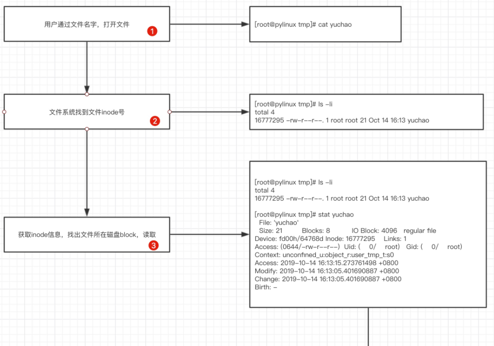
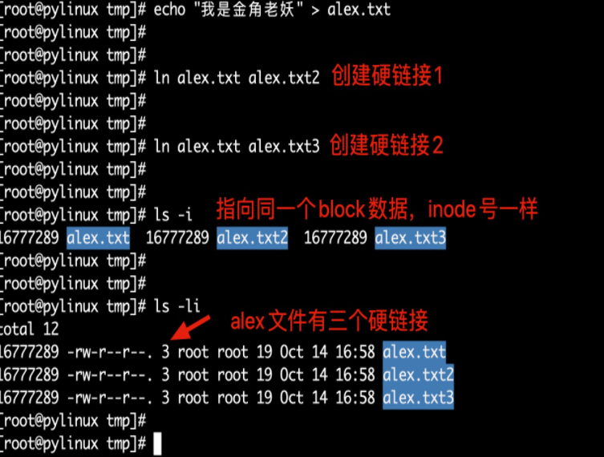
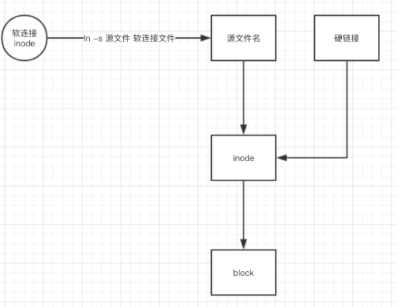

## ln命令

硬链接与软链接

ln命令是单词link缩写，功能是创建文件之间的链接（make links between files），链接类型包括

- 硬链接 hard link
- 软链接 symbolic link

| 命令参数 | 解释                   |
| -------- | ---------------------- |
| ln无参数 | 创建硬链接             |
| -s       | 创建软链接（符号链接） |

**细说链接知识**

- 硬链接，创建语法`ln 源文件 目标文件`，硬链接生成的是普通文件
- 软链接/符号链接，创建语法是`ln -s 源文件 目标文件`，生成符号链接文件

ln命令实践

```
[root@pylinux tmp]# touch alex.txt
[root@pylinux tmp]#
[root@pylinux tmp]#
[root@pylinux tmp]# ln alex.txt alex_hardlink                    #创建硬链接
[root@pylinux tmp]# ln -s alex.txt   alex_softlink        #创建软连接
[root@pylinux tmp]#
[root@pylinux tmp]# ls -lih
总用量 0
2370 -rw-r--r-- 2 root root 0 10月 14 15:25 alex_hardlink
7979 lrwxrwxrwx 1 root root 8 10月 14 15:25 alex_softlink -> alex.txt
2370 -rw-r--r-- 2 root root 0 10月 14 15:25 alex.txt
[root@pylinux tmp]# echo "我是金角大王" > alex.txt
[root@pylinux tmp]#
[root@pylinux tmp]#
[root@pylinux tmp]# cat alex_hardlink
我是金角大王
[root@pylinux tmp]# cat alex_softlink
我是金角大王
[root@pylinux tmp]#
[root@pylinux tmp]#
[root@pylinux tmp]# echo "我是金角大王的一根白头发" >> alex.txt
[root@pylinux tmp]# cat alex_hardlink
我是金角大王
我是金角大王的一根白头发
[root@pylinux tmp]# cat alex_softlink
我是金角大王
我是金角大王的一根白头发
```

### readlink

查看软链接文件的内容

```
使用cat查看软连接文件，只能看到源文件的内容
软链接文件存储的是源文件的路径

[root@pylinux tmp]# echo "我是金角老妖怪" > heihei.txt
[root@pylinux tmp]# ln -s /tmp/heihei.txt /tmp/yg.txt
[root@pylinux tmp]# readlink yg.txt
/tmp/heihei.txt
[root@pylinux tmp]# cat yg.txt
我是金角老妖怪

#硬链接看不到信息
[root@pylinux tmp]# readlink hh2.txt
[root@pylinux tmp]# readlink hh.txt
/tmp/hehe.txt
```

## inode与硬链接

操作系统中专门用于管理和存储文件的信息软件称之为`文件系统`，**文件系统将文件的`元信息(文件创建者，日期，大小等,可以通过stat命令查看元信息)`存储在一个称之为inode的区域**，中文是**索引节点**

查看文件inode号

```
[root@pylinux tmp]# ls -li
总用量 43356
  2370 -rw-r--r-- 1 root root 43523616 7月   7 2018 alex.txt.gz
   434 -rw-r--r-- 1 root root   855682 7月   7 2018 alltmp.zip
 13331 -rw-r--r-- 2 root root       14 11月  5 11:44 hehe.txt
 13331 -rw-r--r-- 2 root root       14 11月  5 11:44 hh2.txt
  7917 lrwxrwxrwx 1 root root       13 11月  5 11:45 hh.txt -> /tmp/hehe.txt
144495 drwxr-xr-x 2 root root     4096 7月   7 2018 各位今天也要好好学习哦.txt
```

通过ls -l查看到的数据，唯独文件名不是Inode存储的数据信息

Inode存储的信息不限于

- 文件大小
- 属主
- 用户组
- 文件权限
- 文件类型
- 修改时间

还包括了文件的文件的实体指针（指向Block的位置，也就是Inode和Block的关系）

### inode大小

硬盘格式化的时候，系统自动分为2个区，一个数据区，存放数据，一个是inode区（inode table）存放inode信息

每个inode节点大小，一般是128字节或是256字节，inode节点的总数在格式化的时候就决定了，

```
[root@docker01 ~]# dumpe2fs -h /dev/vda1 |grep -i 'inode size'
dumpe2fs 1.42.9 (28-Dec-2013)
Inode size:              256
```

### Block磁盘块

Block是存放实际文件数据的单元，例如图片，视频，文本等数据，单个的文件占用多个block来存储。

操作系统标识文件并非以以文件名，而是以inode号码识别，文件名只是一个绰号而已。

文件系统读取文件



比如一本书，存储设备或分区就相当于这本书，block 相当于书中的每一页内容，而inode 就相当于这本书前面的目录，一本书有很多内容，一个知识点可能有多页，如果想查找某部分或某知识点的内容，一般先查 书的目录，通过目录能更快的找到想要看的内容。

inode 为每个文件进行信息索引，所以就有了 inode的数值，（书的目录提供简单信息描述，inode也描述了文件的一些元信息）操作系统根据指令，能通过 inode 值最快的找到相应 的文件。

**硬链接**

一般情况，文件名与inode号是一对一的，linux系统允许`多个文件路径`指向`同一个inode号码`（一个超市有多个门）

特性：

- 目录不支持硬链接
- 不得跨文件系统
- 硬链接数会增加Inode引用计数

这意味着：

- 用不同的文件名字可以访问一样的内容
- 修改文件内容，影响所有文件名
- 删除一个文件名，不影响另一个文件名正常操作



**软连接**

软连接就类似windows的快捷方式了，是指向一个文件路径的另一个文件路径。

特性：

- 软连接是两个独立的文件，有各自的inode，创建软连接不会增加符号引用计数
- 支持目录软连接，可以跨文件系统
- 软链接有自己的inode号
- 软链接文件类型是l
- 软链接指向源文件，若源文件不存在，软链接失效(白字红底闪烁报错)

```
硬链接文件类型是普通文件 - 
软链接文件类型是链接类型 l 

语法：

ln -s 源文件绝对路径 目标文件绝对路径

[root@pylinux tmp]# ls -li
total 12
16777289 -rw-r--r--. 3 root root 19 Oct 14 16:58 alex.txt
16777289 -rw-r--r--. 3 root root 19 Oct 14 16:58 alex.txt2
16777289 -rw-r--r--. 3 root root 19 Oct 14 16:58 alex.txt3
[root@pylinux tmp]#
[root@pylinux tmp]# ln -s /tmp/alex.txt  /opt/alex.txt.softlink
[root@pylinux tmp]#
[root@pylinux tmp]#
[root@pylinux tmp]# ls -li /opt/alex.txt.softlink
461 lrwxrwxrwx. 1 root root 8 Oct 14 17:09 /opt/alex.txt.softlink -> /tmp/alex.txt
```

**软硬链接原理图**



**软硬链接总结**

- 删除`软链接`对`源文件`，`硬链接`无影响
- 删除`硬链接`，对`软链接`，`源文件`无影响
- 删除`源文件`，对`硬链接`无影响，`软连接`失效
- 只有删除`源文件`，`硬链接`，`文件硬链接`数为0，文件失效
- 许多硬件的快照功能就是`硬链接`道理
- 源文件和硬链接有相同inode号，理解为`同一个文件`或是`一个文件多个入口`
- `软链接`与源文件inode号不同，是不同的文件，是源文件的快捷方式

**文件夹的链接数**

- 文件夹创建后，默认有.和..两个目录
  - .的inode号就是当前目录的inode号,如同`硬链接`
  - ..的inode号是上级目录的inode号，如同父目录的`硬链接`
  - 因此任意一个目录，硬链接基数都是2（目录名+当前目录名）
- 文件夹系统禁止创建硬链接

### 查看和管理Inode

无论是硬盘、U盘等在linux中被格式化为ext系列的文件系统后，都分为两部分

- Inode，默认128或256字节
- Block，默认1~4k
- 一般磁盘分区都很大，inode和block都会有很多个

查看文件系统Inode总数以及剩余数量

```
df -i   如果满了，删除大量小文件，存储了过多的元信息，小于1kb的文件
df -h        如果满了，删除大容量的文件
```