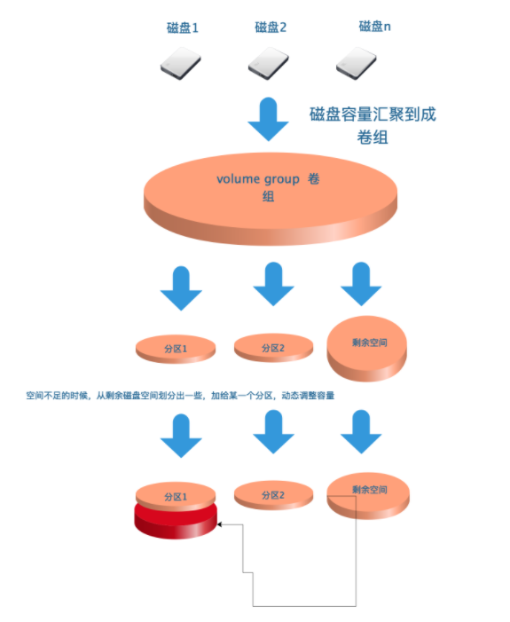
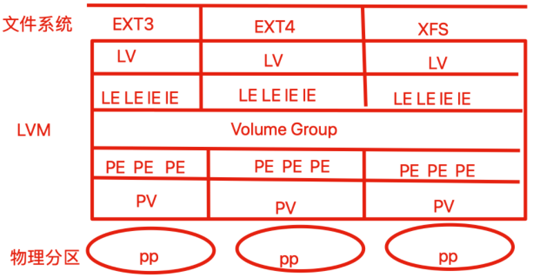
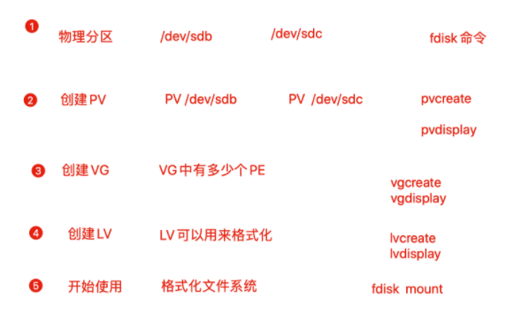

## 逻辑卷

服务器上的磁盘管理，我们可以用RAID技术提高硬盘读写速度，以及保证数据安全性

```
[root@docker01 docker01RAID5]# df -h |grep md
/dev/md0                  10G  108M  9.9G    2% /docker01RAID5
```

但是磁盘分区或是配置好raid后，磁盘容量就已经确定了，如果存储数据业务较多，磁盘容量不够了，再想调整磁盘空开就比较麻烦了。

- 不同的分区相对独立，没有关系，可能空间利用率很低
- 某一个分区满了的时候，无法扩充，只能重新分区、设置容量、 新建文件系统，很是麻烦
- 如果要合并分区使用，还得考虑再分区，且要进行数据备份

## 使用lvm

LVM(Logical Volume Manager)逻辑卷管理，是一种将一个或多个硬盘的分区在逻辑上集合，相当于一个大硬盘来使用，当硬盘的空间不够使用的时候，可以继续将其它的硬盘的分区加入其中，这样可以事项一种磁盘空间的动态管理，相对于普通的磁盘分区有很大的灵活性，使用普通的磁盘分区，当一个磁盘的分区空间不够使用的时候，可能就会带来很大的麻烦。

基于分区创建lvm

- 硬盘的多个分区由lvm统一为`卷组`，可以弹性的调整卷组的大小，充分利用硬盘容量
- 文件系统创建在逻辑卷上，逻辑卷可以根据需求改变大小（卷组总容量范围内）

基于硬盘创建lvm

- 多块硬盘做成逻辑卷，将整个逻辑卷同意管理，可以动态对分区进行扩缩空间容量

## 图解lvm



## lvm名词

- PP（Physical Parttion）：物理分区，LVM建立在物理分区之上
- PV（Physical Volume）：物理卷，处于LVM最底层，一般一个PV对应一个PP
- PE（physical Extends）：物理区域，PV中可以用于分配的最小存储单元，同一个VG中所有的PV的PE大小相同，如1M、2M
- VG（Volume Group）：卷组，建立在PV之上，可以划分多个PV
- LE（Logical Extends）：逻辑扩展单元，组成LV的基本单元，一个LE对应一个PE
- LV（Logical Volume）：逻辑卷，建立在VG之上，是一个可以动态改变大小的分区



### LVM原理

LVM是通过`交换PE`的方式，达到弹性变更文件系统大小的

- 剔除原本LV中的PE，就可以减少LV的容量
- 把其他PE添加到LV，就可以扩容LV容量
- 一般默认PE大小是4M，LVM最多有65534个PE，所以LVM最大的VG是256G单位
- PE是LVM最小的存存储单位，类似文件系统的block单位，因此PE大小影响VG容量
- LV如同/dev/sd[a-z]的分区概念

### LVM优点

- 文件系统可以跨多个磁盘，大小不会受到磁盘限制
- 可在系统运行的情况下，动态扩展文件系统大小
- 可以增加新的磁盘到LVM的存储池中

### LVM配置流程

1. 物理分区阶段：将物理磁盘`fdisk`格式化修改System ID为LVM标记（8e）
2. PV阶段：通过`pvcreate`、`pvdisplay`将Linux分区处理为物理卷PV
3. VG阶段：接下来通过`vgcreate`、`vgdisplay`将创建好的物理卷PV处理为卷组VG
4. LV阶段：通过`lvcreate`将卷组分成若干个逻辑卷LV
5. 开始使用：通过`mkfs`对LV格式化，最后挂载LV使用



### 物理卷管理命令

|   命令    |           功能           |
| :-------: | :----------------------: |
| pvcreate  |        创建物理卷        |
|  pvscan   |      查看物理卷信息      |
| pvdisplay | 查看各个物理卷的详细参数 |
| pvremove  |        删除物理卷        |

**pvcreate**

```bash
# 将普通的分区加上PV属性
# 例如：将分区/dev/sda6创建为物理卷
pvcreate /dev/sda6
```

**pvremove**

```bash
# 删除分区的PV属性
# 例如：删除分区/dev/sda6的物理卷属性
pvremove /dev/sda6
```

**pvscan、pvdisplay**

- 都是用来查看PV的信息
- `pvdisplay`更为详细

```
[root@docker01 ~]# pvscan  |grep sd[b-c]
  PV /dev/sdb    VG storage         lvm2 [<5.00 GiB / <5.00 GiB free]
  PV /dev/sdc    VG storage         lvm2 [<5.00 GiB / <5.00 GiB free]
```

### 卷组（VG）管理相关命令

|   命令    |                功能                |
| :-------: | :--------------------------------: |
| vgcreate  |              创建卷组              |
|  vgscan   |            查看卷组信息            |
| vgdisplay |         查看卷组的详细参数         |
| vgreduce  |   缩小卷组，把物理卷从卷组中删除   |
| vgextend  | 扩展卷组，把某个物理卷添加到卷组中 |
| vgremove  |              删除卷组              |

### 逻辑卷（LV）管理相关命令

```
lvcreate 
-L 指定逻辑卷的大小，单位为“kKmMgGtT”字节
-l 指定逻辑卷的大小（LE个数）
-n 后面跟逻辑卷名 
-s 创建快照
```

|   命令    |         功能         |
| :-------: | :------------------: |
| lvcreate  |      创建逻辑卷      |
|  lvscan   |    查看逻辑卷信息    |
| lvdisplay | 查看逻辑卷的具体参数 |
| lvextend  |    增大逻辑卷大小    |
| lvreduce  |    减小逻辑卷大小    |
| lvremove  |      删除逻辑卷      |

## 创建LVM案例

*1.选择两块硬盘，创建pv*

```
[root@docker01 ~]# pvcreate /dev/sdb /dev/sdc
  Physical volume "/dev/sdb" successfully created.
  Physical volume "/dev/sdc" successfully created.
```

*2.创建卷组*

```
[root@docker01 ~]# vgcreate storage /dev/sdb /dev/sdc
  Volume group "storage" successfully created
```

*3.查看卷组信息*

```
[root@docker01 ~]# vgdisplay
  --- Volume group ---
  VG Name               storage
  System ID
  Format                lvm2
  Metadata Areas        2
  Metadata Sequence No  1
  VG Access             read/write
  VG Status             resizable
  MAX LV                0
  Cur LV                0
  Open LV               0
  Max PV                0
  Cur PV                2
  Act PV                2
  VG Size               9.99 GiB
  PE Size               4.00 MiB
  Total PE              2558
  Alloc PE / Size       0 / 0
  Free  PE / Size       2558 / 9.99 GiB
  VG UUID               0P4fJW-YtM0-eWn4-PsPy-ftoI-8qJz-AF0ogi
```

*4.扩展、缩减卷组VG*

```
1.添加新的PV到卷组
[root@docker01 ~]# pvcreate /dev/sdd
  Physical volume "/dev/sdd" successfully created.

2.扩展卷组容量
[root@docker01 ~]# vgextend storage /dev/sdd
  Volume group "storage" successfully extended

3.检查卷组容量，此时扩展到15G
[root@docker01 ~]# vgdisplay
  --- Volume group ---
  VG Name               storage
  System ID
  Format                lvm2
  Metadata Areas        3
  Metadata Sequence No  2
  VG Access             read/write
  VG Status             resizable
  MAX LV                0
  Cur LV                0
  Open LV               0
  Max PV                0
  Cur PV                3
  Act PV                3
  VG Size               <14.99 GiB
  PE Size               4.00 MiB
  Total PE              3837
  Alloc PE / Size       0 / 0
  Free  PE / Size       3837 / <14.99 GiB
  VG UUID               0P4fJW-YtM0-eWn4-PsPy-ftoI-8qJz-AF0ogi

4.移除卷组，把新物理卷从卷组中删除
[root@docker01 ~]# vgreduce storage /dev/sdd
  Removed "/dev/sdd" from volume group "storage"

5.把pv从vg中删除
[root@docker01 ~]# pvremove /dev/sdd
  Labels on physical volume "/dev/sdd" successfully wiped.
```

*5.创建逻辑卷*

```
[root@docker01 ~]# lvcreate -n lv1 -L 200M storage
  Logical volume "lv1" created.
```

*6.检查逻辑卷信息*

```
[root@docker01 ~]# lvdisplay
  --- Logical volume ---
  LV Path                /dev/storage/lv1
  LV Name                lv1
  VG Name                storage
  LV UUID                BoaU79-cd8Z-ZWVQ-EBWT-KTjd-AOrK-Xh3J61
  LV Write Access        read/write
  LV Creation host, time docker01, 2019-12-08 17:20:14 +0800
  LV Status              available
  # open                 0
  LV Size                200.00 MiB
  Current LE             50
  Segments               1
  Allocation             inherit
  Read ahead sectors     auto
  - currently set to     8192
  Block device           253:2
```

*7.对新生成的逻辑卷格式化，然后挂载使用*

```
#格式化文件系统
[root@docker01 ~]# mkfs.xfs /dev/storage/lv1
meta-data=/dev/storage/lv1       isize=512    agcount=4, agsize=12800 blks
         =                       sectsz=512   attr=2, projid32bit=1
         =                       crc=1        finobt=0, sparse=0
data     =                       bsize=4096   blocks=51200, imaxpct=25
         =                       sunit=0      swidth=0 blks
naming   =version 2              bsize=4096   ascii-ci=0 ftype=1
log      =internal log           bsize=4096   blocks=855, version=2
         =                       sectsz=512   sunit=0 blks, lazy-count=1
realtime =none                   extsz=4096   blocks=0, rtextents=0

#挂载使用
[root@docker01 ~]# mkdir /docker01_lvm
[root@docker01 ~]# mount /dev/storage/lv1 /docker01_lvm/

#检查此时的分区使用量
[root@docker01 ~]# df -h -T |grep docker01
文件系统                类型      容量  已用  可用 已用% 挂载点
/dev/mapper/storage-lv1 xfs       197M   11M  187M    6% /docker01_lvm
```

*8.向lvm中写入数据*

```
[root@docker01 docker01_lvm]# pwd
/docker01_lvm
[root@docker01 docker01_lvm]# echo {1..10000000} > 超哥带你学lvm.txt

[root@docker01 docker01_lvm]# df -h -T |grep docker01
/dev/mapper/storage-lv1 xfs       197M   86M  112M   44% /docker01_lvm
```

## LVM逻辑卷扩容

实验中，我们使用两块硬盘，创建物理卷，然后创建出10G的卷组，且创建了200M的逻辑卷，此时感觉逻辑卷空间不够，可以进行动态扩容，只要卷组中的资源足够，就可以一直扩容。

```
[root@docker01 docker01_lvm]# pvs
  PV         VG      Fmt  Attr PSize   PFree
  /dev/sda2  centos  lvm2 a--  <19.00g     0
  /dev/sdb   storage lvm2 a--   <5.00g  4.80g
  /dev/sdc   storage lvm2 a--   <5.00g <5.00g
[root@docker01 docker01_lvm]# vgs
  VG      #PV #LV #SN Attr   VSize   VFree
  centos    1   2   0 wz--n- <19.00g     0
  storage   2   1   0 wz--n-   9.99g <9.80g
[root@docker01 docker01_lvm]# lvs
  LV   VG      Attr       LSize   Pool Origin Data%  Meta%  Move Log Cpy%Sync Convert
  root centos  -wi-ao---- <17.00g
  swap centos  -wi-ao----   2.00g
  lv1  storage -wi-ao---- 200.00m
```

*1.第一步要卸载挂载的设备*

**提示：此处也可以不用卸载，LVM支持无需停机的情况下，方便调整各个分区大小**

```
[root@docker01 /]# umount /docker01_lvm/
```

*2.把逻辑卷扩容大小*

```
[root@docker01 /]# lvextend -L 1G /dev/storage/lv1
  Size of logical volume storage/lv1 changed from 200.00 MiB (50 extents) to 1.00 GiB (256 extents).
  Logical volume storage/lv1 successfully resized.
```

*3.调整xfs文件系统的容量大小，xfs只支持增大*

```
[root@docker01 ~]# xfs_growfs /dev/storage/lv1
meta-data=/dev/mapper/storage-lv1 isize=512    agcount=4, agsize=12800 blks
         =                       sectsz=512   attr=2, projid32bit=1
         =                       crc=1        finobt=0 spinodes=0
data     =                       bsize=4096   blocks=51200, imaxpct=25
         =                       sunit=0      swidth=0 blks
naming   =version 2              bsize=4096   ascii-ci=0 ftype=1
log      =internal               bsize=4096   blocks=855, version=2
         =                       sectsz=512   sunit=0 blks, lazy-count=1
realtime =none                   extsz=4096   blocks=0, rtextents=0
data blocks changed from 51200 to 262144

xfs文件系统只支持增大分区空间的情况，不支持减小的情况（切记！！！！！）。
硬要减小的话，只能在减小后将逻辑分区重新通过mkfs.xfs命令重新格式化才能挂载上，这样的话这个逻辑分区上原来的数据就丢失了。
```

*4.重新挂载分区，检查分区大小*

```
[root@docker01 ~]# mount /dev/storage/lv1 /docker01_lvm/
[root@docker01 ~]# df -h -T |grep docker01
文件系统                类型      容量  已用  可用 已用% 挂载点
/dev/mapper/storage-lv1 xfs      1021M  108M  913M   11% /docker01_lvm
```

## 删除逻辑卷

删除逻辑卷，需要提前备份好重要的数据，然后依次删除逻辑卷、卷组、物理卷。

1.取消挂载，删除自动挂载的配置

```
[root@docker01 ~]# umount /docker01_lvm/
```

2.删除逻辑卷

```
[root@docker01 ~]# lvremove /dev/storage/lv1
Do you really want to remove active logical volume storage/lv1? [y/n]: y
  Logical volume "lv1" successfully removed
```

3.删除卷组

```
[root@docker01 ~]# vgremove storage
  Volume group "storage" successfully removed
```

4.删除物理卷设备

```
[root@docker01 ~]# pvs
  PV         VG     Fmt  Attr PSize   PFree
  /dev/sda2  centos lvm2 a--  <19.00g    0
  /dev/sdb          lvm2 ---    5.00g 5.00g
  /dev/sdc          lvm2 ---    5.00g 5.00g

  [root@docker01 ~]# pvremove /dev/sdb /dev/sdc
  Labels on physical volume "/dev/sdb" successfully wiped.
  Labels on physical volume "/dev/sdc" successfully wiped.
```

5.此时可以检查下lvm相关信息

```
lvs
pvs
vgs
```