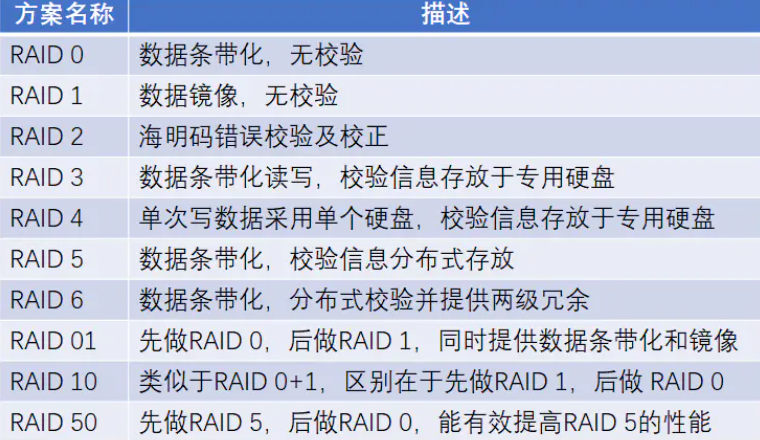
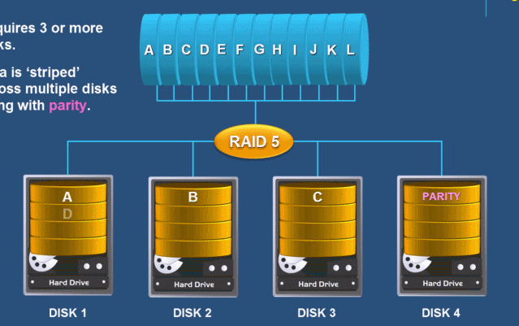
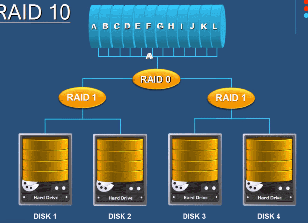

## Raid

RAID，全称为Redundant Arrays of Independent Drives，即磁盘冗余阵列。

这是由多块独立磁盘（多为硬盘）组合的一个超大容量磁盘组。

计算机一直是在飞速的发展，更新，整体计算机硬件也得到极大的提升，由于磁盘的特性，需要持续、频繁、大量的读写操作，相比较于其他硬件设备，很容易损坏，导致数据丢失。

Raid历史

1988年，在美国加州大学伯克利分校提出且定义了RAID技术。RAID技术意为将多个硬盘设备组成一个容量更大、安全性更好的磁盘阵列组，将数据切割为多个区段后分别存放在不同的物理硬盘上，利用分散读写技术提升磁盘阵列组的整体性能，并且数据同步在不同的多个物理硬盘，也起到了数据冗余备份的作用。

*Raid特性*

Raid磁盘阵列组能够提升数据冗余性，当然也增加了硬盘的价格成本，只不过数据本身的价值是超过硬盘购买的价格的，Raid除了能够保障数据丢失造成的严重损失，还能提升硬盘读写效率，被应用在广泛的企业中。

## RAID等级

标准的RAID等级包含RAID0 、 RAID1 、 RAID2 、 RAID3 、 RAID4 、 RAID5 、 RAID6 七个等级，另外，也可以对单个RAID等级进行组合，形成RAID 01 、RAID 10 、RAID 50等组合等级



## raid 0

将`两个或两个`以上`相同型号`、`容量`的硬盘`组合`，磁盘阵列的总容量便是多个硬盘的总和。

数据`依次`写入物理硬盘，理想状态下，硬盘读写性能会翻倍

但是raid 0 任意一块硬盘故障都会导致整个系统数据被破坏，数据分别写入两个硬盘设备，没有数据备份的功能。

**Raid 0 适用于对于数据安全性不太关注，追求性能的场景。**

## raid 1

由于raid 0的特性，数据依次写入到各个物理硬盘中，数据是分开放的，因此损坏任意一个硬盘，都会对完整的数据破坏，对于企业数据来说，肯定是不允许。

Raid 1技术，是将`两块以上`硬盘绑定，数据写入时，同时写入多个硬盘，因此即使有硬盘故障，也有数据备份。

但是这种方式，无疑极大降低磁盘利用率，假设两块硬盘一共4T，真实数据只有2TB，利用率50%，如果是三块硬盘组成raid 1，利用率只有33%，也是不可取的。

## raid 3

至少需要三块硬盘，只要校验盘没坏，坏了一块数据盘可以反推数据来恢复，虽然也浪费了一块硬盘但是比raid1节约了不少。

## raid 5

Raid 5规则下，校验码会均匀放在每一块硬盘，磁盘1存放磁盘2、3、4的校验码



这样任意一块挂了都能够恢复，提升了容错率，但是也仅仅是只能挂掉一块

## Raid 1+0

Raid 5技术是在读写速度和数据安全性上做了一定的妥协，对于企业来说，最核心的就是数据，成本不是问题。

Raid 10 其实是raid 0 加上raid 1，吸收了raid 0的效率，raid 1的安全性，因此至少需要四块硬盘搭建raid 10。

1.通过raid 1两两镜像复制，保障数据安全性

2.针对两个raid 1部署raid 0，进一步提升磁盘读写速度

3.只要坏的不是同一组中所有硬盘，那么就算坏掉一半硬盘都不会丢失数据



## 硬RAID、软RAID

由CPU去控制硬盘驱动器进行数据转换、计算的过程就是软件RAID

由专门的RAID卡上的主控芯片操控，就是硬件RAID

软件RAID和硬件RAID的差异如下

- 软件RAID额外消耗CPU资源，性能弱
- 硬件RAID更加稳定，软件RAID可能造成磁盘发热过量，造成威胁
- 兼容性问题，软件RAID依赖于操作系统，硬件RAID胜出

## 部署RAID 10

额外添加4块硬盘，用于搭建RAID 10

检查linux的磁盘

```
[root@local-pyyu ~]# fdisk -l |grep '/dev/sd[a-z]'
磁盘 /dev/sda：21.5 GB, 21474836480 字节，41943040 个扇区
/dev/sda1   *        2048     2099199     1048576   83  Linux
/dev/sda2         2099200    41943039    19921920   8e  Linux LVM
磁盘 /dev/sdb：5368 MB, 5368709120 字节，10485760 个扇区
磁盘 /dev/sdc：5368 MB, 5368709120 字节，10485760 个扇区
磁盘 /dev/sde：5368 MB, 5368709120 字节，10485760 个扇区
磁盘 /dev/sdd：5368 MB, 5368709120 字节，10485760 个扇区
```

### mdadm命令

```
mdadm 用于建设，管理和监控软件RAID阵列
可能需要单独安装
yum install mdadm -y
```

参数

| 参数 | 解释                                     |
| ---- | ---------------------------------------- |
| -C   | 用未使用的设备，创建raid                 |
| -a   | yes or no，自动创建阵列设备              |
| -A   | 激活磁盘阵列                             |
| -n   | 指定设备数量                             |
| -l   | 指定raid级别                             |
| -v   | 显示过程                                 |
| -S   | 停止RAID阵列                             |
| -D   | 显示阵列详细信息                         |
| -f   | 移除设备                                 |
| -x   | 指定阵列中备用盘的数量                   |
| -s   | 扫描配置文件或/proc/mdstat，得到阵列信息 |

**创建RAID10，且命名为/dev/md0**

已知现有四块新的磁盘

```
磁盘 /dev/sdb：5368 MB, 5368709120 字节，10485760 个扇区
磁盘 /dev/sdc：5368 MB, 5368709120 字节，10485760 个扇区
磁盘 /dev/sde：5368 MB, 5368709120 字节，10485760 个扇区
磁盘 /dev/sdd：5368 MB, 5368709120 字节，10485760 个扇区
```

创建raid 10命令

```
mdadm -Cv /dev/md0  -a yes -n 4 -l 10 /dev/sdb /dev/sdc /dev/sdd /dev/sde

-C 表示创建RAID阵列卡
-v 显示创建过程
/dev/md0 指定raid阵列的名字
-a  yes  自动创建阵列设备文件
-n 4 参数表示用4块盘部署阵列
-l 10 代表指定创建raid 10级别
最后跟着四块磁盘设备名
```

创建raid10

```
[root@local-pyyu ~]# mdadm -Cv /dev/md0  -a yes -n 4 -l 10 /dev/sdb /dev/sdc /dev/sdd /dev/sde
mdadm: layout defaults to n2
mdadm: layout defaults to n2
mdadm: chunk size defaults to 512K
mdadm: size set to 5237760K
mdadm: Fail create md0 when using /sys/module/md_mod/parameters/new_array
mdadm: Defaulting to version 1.2 metadata
mdadm: array /dev/md0 started.
```

检查raid 10分区

```
[root@local-pyyu ~]# fdisk -l |grep /dev/md
磁盘 /dev/md0：10.7 GB, 10726932480 字节，20951040 个扇区
```

格式化磁盘阵列文件系统

```
[root@local-pyyu ~]# mkfs.xfs /dev/md0
meta-data=/dev/md0               isize=512    agcount=16, agsize=163712 blks
         =                       sectsz=512   attr=2, projid32bit=1
         =                       crc=1        finobt=0, sparse=0
data     =                       bsize=4096   blocks=2618880, imaxpct=25
         =                       sunit=128    swidth=256 blks
naming   =version 2              bsize=4096   ascii-ci=0 ftype=1
log      =internal log           bsize=4096   blocks=2560, version=2
         =                       sectsz=512   sunit=8 blks, lazy-count=1
realtime =none                   extsz=4096   blocks=0, rtextents=0
```

新建文件夹，用于挂载分区

```
[root@local-pyyu ~]# mkdir /chaogeRAID10
[root@local-pyyu ~]# mount /dev/md0 /chaogeRAID10/
[root@local-pyyu ~]# mount |grep md0
/dev/md0 on /chaogeRAID10 type xfs (rw,relatime,attr2,inode64,sunit=1024,swidth=2048,noquota)
```

检查挂载分区使用情况

```
[root@local-pyyu ~]# df -hT |grep md0
/dev/md0                xfs        10G   33M   10G    1% /chaogeRAID10
```

检查raid 10磁盘阵列的信息

```
[root@local-pyyu ~]# mdadm -D /dev/md0
/dev/md0:
           Version : 1.2
     Creation Time : Thu Dec  5 16:44:18 2019
        Raid Level : raid10
        Array Size : 10475520 (9.99 GiB 10.73 GB)
     Used Dev Size : 5237760 (5.00 GiB 5.36 GB)
      Raid Devices : 4
     Total Devices : 4
       Persistence : Superblock is persistent

       Update Time : Thu Dec  5 17:49:29 2019
             State : clean
    Active Devices : 4
   Working Devices : 4
    Failed Devices : 0
     Spare Devices : 0

            Layout : near=2
        Chunk Size : 512K

Consistency Policy : resync

              Name : local-pyyu:0  (local to host local-pyyu)
              UUID : 9eb470b5:4dc5b8c9:8c0568c3:6bfdebf6
            Events : 17

    Number   Major   Minor   RaidDevice State
       0       8       16        0      active sync set-A   /dev/sdb
       1       8       32        1      active sync set-B   /dev/sdc
       2       8       48        2      active sync set-A   /dev/sdd
       3       8       64        3      active sync set-B   /dev/sde
```

此时可以向磁盘中写入数据，检查分区使用情况

```
[root@local-pyyu chaogeRAID10]# df -h|grep md0
/dev/md0                  10G  190M  9.8G    2% /chaogeRAID10

[root@local-pyyu chaogeRAID10]# pwd
/chaogeRAID10
[root@local-pyyu chaogeRAID10]# ll -h
总用量 158M
-rw-r--r-- 1 root root 158M 12月  6 11:08 ceshi.txt
```

raid10加入开机挂载配置文件，让其永久生效

```
vim /etc/fstab  #添加如下配置

/dev/md0 /chaogeRAID10 xfs defaults 0 0
```

### 故障一块硬盘怎么办

模拟一块硬盘故障，剔除一块磁盘

```
磁盘 /dev/sdb：5368 MB, 5368709120 字节，10485760 个扇区
磁盘 /dev/sdc：5368 MB, 5368709120 字节，10485760 个扇区
磁盘 /dev/sde：5368 MB, 5368709120 字节，10485760 个扇区
磁盘 /dev/sdd：5368 MB, 5368709120 字节，10485760 个扇区
```

移除一块硬盘设备

```
[root@local-pyyu chaogeRAID10]# mdadm /dev/md0 -f /dev/sdd
mdadm: set /dev/sdd faulty in /dev/md0
```

检查RAID10状态

```
[root@local-pyyu chaogeRAID10]# mdadm -D /dev/md0
/dev/md0:
           Version : 1.2
     Creation Time : Thu Dec  5 16:44:18 2019
        Raid Level : raid10
        Array Size : 10475520 (9.99 GiB 10.73 GB)
     Used Dev Size : 5237760 (5.00 GiB 5.36 GB)
      Raid Devices : 4
     Total Devices : 4
       Persistence : Superblock is persistent

       Update Time : Fri Dec  6 13:45:10 2019
             State : clean, degraded
    Active Devices : 3
   Working Devices : 3
    Failed Devices : 1
     Spare Devices : 0

            Layout : near=2
        Chunk Size : 512K

Consistency Policy : resync

              Name : local-pyyu:0  (local to host local-pyyu)
              UUID : 9eb470b5:4dc5b8c9:8c0568c3:6bfdebf6
            Events : 19

    Number   Major   Minor   RaidDevice State
       0       8       16        0      active sync set-A   /dev/sdb
       1       8       32        1      active sync set-B   /dev/sdc
       -       0        0        2      removed
       3       8       64        3      active sync set-B   /dev/sde

       2       8       48        -      faulty   /dev/sdd
```

RAID10磁盘阵列，挂掉一块硬盘并不影响使用，只需要购买新的设备，替换损坏的磁盘即可

```
先取消RAID10阵列的挂载，注意必须没有人在使用挂载的设备
[root@local-pyyu /]# umount /chaogeRAID10/


重启操作系统
reboot

添加新设备
[root@local-pyyu ~]# mdadm /dev/md0 -a /dev/sdd
mdadm: added /dev/sdd

会有一个修复中的过程
[root@local-pyyu ~]# mdadm -D /dev/md0
/dev/md0:
           Version : 1.2
     Creation Time : Thu Dec  5 16:44:18 2019
        Raid Level : raid10
        Array Size : 10475520 (9.99 GiB 10.73 GB)
     Used Dev Size : 5237760 (5.00 GiB 5.36 GB)
      Raid Devices : 4
     Total Devices : 4
       Persistence : Superblock is persistent

       Update Time : Fri Dec  6 13:58:06 2019
             State : clean, degraded, recovering
    Active Devices : 3
   Working Devices : 4
    Failed Devices : 0
     Spare Devices : 1

            Layout : near=2
        Chunk Size : 512K

Consistency Policy : resync

    Rebuild Status : 27% complete

              Name : local-pyyu:0  (local to host local-pyyu)
              UUID : 9eb470b5:4dc5b8c9:8c0568c3:6bfdebf6
            Events : 41

    Number   Major   Minor   RaidDevice State
       0       8       16        0      active sync set-A   /dev/sdb
       1       8       32        1      active sync set-B   /dev/sdc
       4       8       48        2      spare rebuilding   /dev/sdd
       3       8       64        3      active sync set-B   /dev/sde


等待RAID 10 修复完毕
[root@local-pyyu ~]# mdadm -D /dev/md0
/dev/md0:
           Version : 1.2
     Creation Time : Thu Dec  5 16:44:18 2019
        Raid Level : raid10
        Array Size : 10475520 (9.99 GiB 10.73 GB)
     Used Dev Size : 5237760 (5.00 GiB 5.36 GB)
      Raid Devices : 4
     Total Devices : 4
       Persistence : Superblock is persistent

       Update Time : Fri Dec  6 13:58:25 2019
             State : clean
    Active Devices : 4
   Working Devices : 4
    Failed Devices : 0
     Spare Devices : 0

            Layout : near=2
        Chunk Size : 512K

Consistency Policy : resync

              Name : local-pyyu:0  (local to host local-pyyu)
              UUID : 9eb470b5:4dc5b8c9:8c0568c3:6bfdebf6
            Events : 54

    Number   Major   Minor   RaidDevice State
       0       8       16        0      active sync set-A   /dev/sdb
       1       8       32        1      active sync set-B   /dev/sdc
       4       8       48        2      active sync set-A   /dev/sdd
       3       8       64        3      active sync set-B   /dev/sde
```

### 重启软RAID

**注意要配置软RAID的配置文件，否则如果停止软RAID后就无法激活了，严格按照笔记来**

```
#手动创建配置文件
[root@local-pyyu ~]# echo DEVICE /dev/sd[b-e] > /etc/mdadm.conf

#扫描磁盘阵列信息，追加到/etc/mdadm.conf配置文件中
[root@local-pyyu /]# mdadm -Ds >> /etc/mdadm.conf
[root@local-pyyu /]# cat /etc/mdadm.conf
DEVICE /dev/sdb /dev/sdc /dev/sdd /dev/sde
ARRAY /dev/md/0 metadata=1.2 name=local-pyyu:0 UUID=9eb470b5:4dc5b8c9:8c0568c3:6bfdebf6
```

1.取消软RAID的挂载

```
umount /chaogeRAID10/
```

2.停止软RAID

```
[root@local-pyyu ~]# mdadm -S /dev/md0
mdadm: stopped /dev/md0

[root@local-pyyu /]# mdadm -D /dev/md0   #看不到结果了
mdadm: cannot open /dev/md0: No such file or directory
```

3.在有配置文件情况下，可以正常启停RAID

```
[root@local-pyyu /]# mdadm -A /dev/md0        #重新激活RAID
mdadm: Fail create md0 when using /sys/module/md_mod/parameters/new_array
mdadm: /dev/md0 has been started with 4 drives.

[root@local-pyyu /]# mdadm -D /dev/md0   #此时可以看到RAID 10 正常了
```

### 删除软件RAID

1.先卸载磁盘

```
[root@local-pyyu /]# umount /dev/md0
```

2.停止raid服务

```
mdadm -S /dev/md0
```

3.卸载raid中所有硬盘

```
mdadm --misc --zero-superblock /dev/sdb
mdadm --misc --zero-superblock /dev/sdc
mdadm --misc --zero-superblock /dev/sdd
mdadm --misc --zero-superblock /dev/sde
```

4.删除raid配置文件

```
rm -f /etc/mdadm.conf
```

5.删除开机自动挂载配置文件中相关的内容

```
vim /etc/fstab 

/dev/md0 /chaogeRAID10 xfs defaults 0 0  #删除
```

### 软RAID与备份盘

1.此处我们还用刚才的4块盘做演示，三块盘做raid，一块盘做备份盘，防止磁盘故障

```
我们以raid 5 来配置三块磁盘 加上一块备份盘

[root@local-pyyu tmp]# mdadm -Cv /dev/md0 -n 3 -l 5 -x 1 /dev/sdb /dev/sdc /dev/sdd /dev/sde
mdadm: layout defaults to left-symmetric
mdadm: layout defaults to left-symmetric
mdadm: chunk size defaults to 512K
mdadm: size set to 5237760K
mdadm: Fail create md0 when using /sys/module/md_mod/parameters/new_array
mdadm: Defaulting to version 1.2 metadata
mdadm: array /dev/md0 started.
```

2.检查raid状态

```
[root@local-pyyu tmp]# mdadm -D /dev/md0
/dev/md0:
           Version : 1.2
     Creation Time : Fri Dec  6 15:47:46 2019
        Raid Level : raid5
        Array Size : 10475520 (9.99 GiB 10.73 GB)
     Used Dev Size : 5237760 (5.00 GiB 5.36 GB)
      Raid Devices : 3
     Total Devices : 4
       Persistence : Superblock is persistent

       Update Time : Fri Dec  6 15:48:12 2019
             State : clean
    Active Devices : 3
   Working Devices : 4
    Failed Devices : 0
     Spare Devices : 1

            Layout : left-symmetric
        Chunk Size : 512K

Consistency Policy : resync

              Name : local-pyyu:0  (local to host local-pyyu)
              UUID : 76645a7d:74bc7aca:6b5c214d:f72ecb0f
            Events : 18

    Number   Major   Minor   RaidDevice State
       0       8       16        0      active sync   /dev/sdb
       1       8       32        1      active sync   /dev/sdc
       4       8       48        2      active sync   /dev/sdd

       3       8       64        -      spare   /dev/sde
```

格式化磁盘文件系统

```
[root@local-pyyu tmp]# mkfs.xfs -f /dev/md0
meta-data=/dev/md0               isize=512    agcount=16, agsize=163712 blks
         =                       sectsz=512   attr=2, projid32bit=1
         =                       crc=1        finobt=0, sparse=0
data     =                       bsize=4096   blocks=2618880, imaxpct=25
         =                       sunit=128    swidth=256 blks
naming   =version 2              bsize=4096   ascii-ci=0 ftype=1
log      =internal log           bsize=4096   blocks=2560, version=2
         =                       sectsz=512   sunit=8 blks, lazy-count=1
realtime =none                   extsz=4096   blocks=0, rtextents=0
```

挂载文件系统，开始使用分区

```
[root@local-pyyu tmp]# mount /dev/md0 /chaogeRAID5/
```

检查挂载情况

```
[root@local-pyyu tmp]# mount |grep md0
/dev/md0 on /chaogeRAID5 type xfs (rw,relatime,attr2,inode64,sunit=1024,swidth=2048,noquota)

[root@local-pyyu chaogeRAID5]# df -h|grep md0
/dev/md0                  10G   33M   10G    1% /chaogeRAID5
```

写入数据

```
[root@local-pyyu chaogeRAID5]# echo {1..10000000} > ceshi.txt
[root@local-pyyu chaogeRAID5]# df -h
```

### 见证备份磁盘的作用

1.此时raid中的磁盘情况

```
[root@local-pyyu chaogeRAID5]# mdadm -D /dev/md0 |grep sd
       0       8       16        0      active sync   /dev/sdb
       1       8       32        1      active sync   /dev/sdc
       4       8       48        2      active sync   /dev/sdd
       3       8       64        -      spare   /dev/sde
```

2.剔除一块磁盘

```
[root@local-pyyu chaogeRAID5]# mdadm /dev/md0 -f /dev/sdb
mdadm: set /dev/sdb faulty in /dev/md0
```

3.惊喜的发现，备份磁盘上来了

```
[root@local-pyyu chaogeRAID5]# mdadm -D /dev/md0 |grep sd
       3       8       64        0      spare rebuilding   /dev/sde
       1       8       32        1      active sync   /dev/sdc
       4       8       48        2      active sync   /dev/sdd
       0       8       16        -      faulty   /dev/sdb
```

4.磁盘已然可以用
