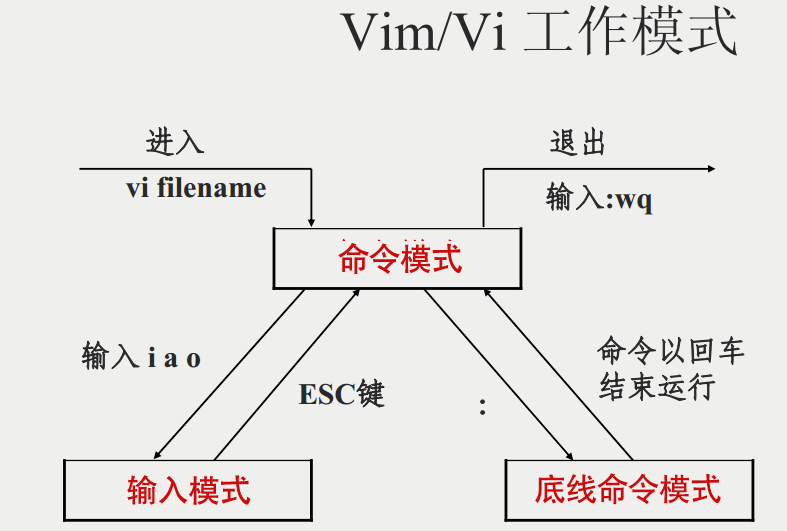
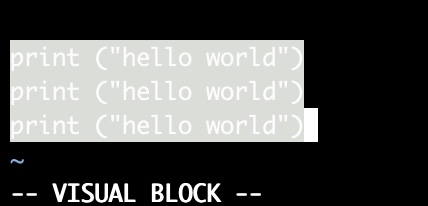
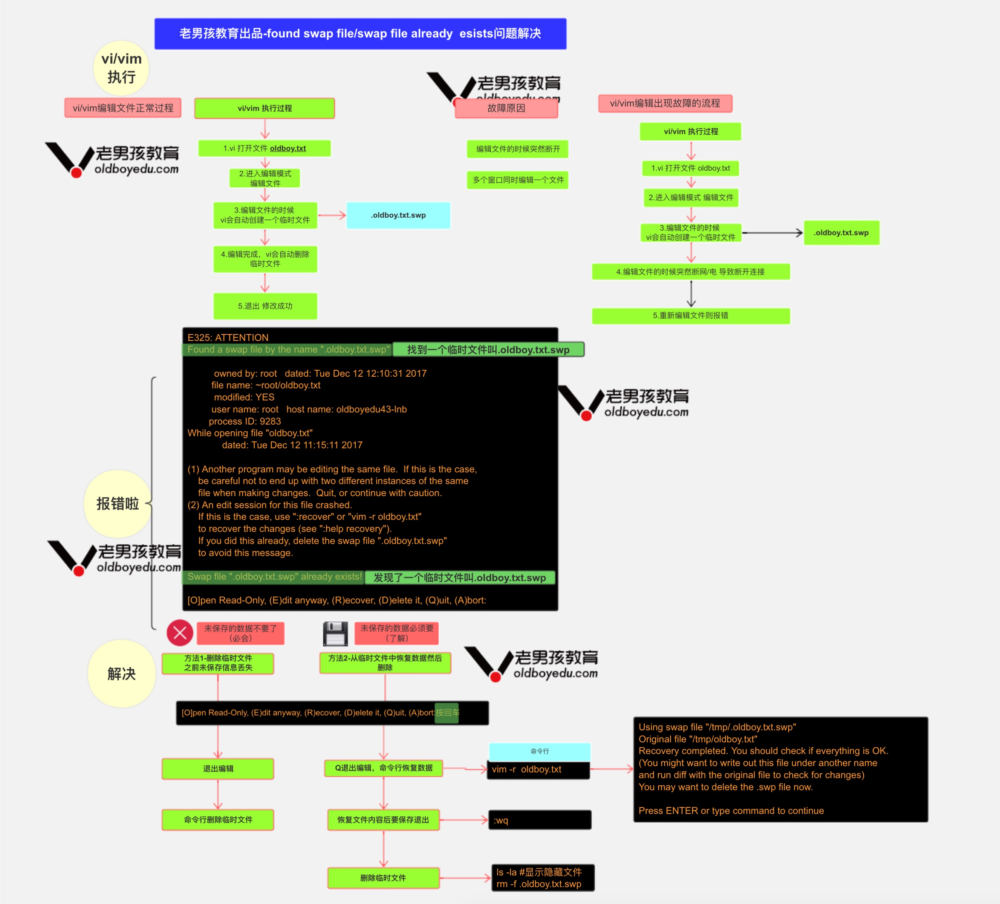

## 介绍

所有的 Unix Like 系统都会内建 vi 文书编辑器，其他的文书编辑器则不一定会存在。

但是目前我们使用比较多的是 vim 编辑器。

vim 具有程序编辑的能力，可以主动的以字体颜色辨别语法的正确性，方便程序设计。

**什么是 vim**

Vim 是从 vi 发展出来的一个文本编辑器。代码补完、编译及错误跳转等方便编程的功能特别丰富，在程序员中被广泛使用。

简单的来说， vi 是老式的字处理器，不过功能已经很齐全了，但是还是有可以进步的地方。 vim 则可以说是程序开发者的一项很好用的工具。

**vi/vim 的使用**

基本上 vi/vim 共分为三种模式，分别是**命令模式（Command mode）**，**输入模式（Insert mode）**和**底线命令模式（Last line mode）**。 这三种模式的作用分别是：

**vim 工作模式**

命令模式:进入 vim 默认的模式

编辑模式:按 i 进入的 a i o 也可以进入

底行模式: 按下:(冒号)之后进入到的模式



**vim 基础用法**

- vi oldboy.txt #打开文件
- 打开后无法直接编辑，需要按 i 进入编辑模式
- 修改这个文件内容吧
- 修改完后，按 esc 退出编辑模式:wq
- 保存退出 #注意":"必须是英文符号

```
:wq 保存并退出
:q! 强制退出不保存
:wq! 强制保存退出
```

**命令模式**

用户刚刚启动 vi/vim，便进入了命令模式。

此状态下敲击键盘动作会被 Vim 识别为命令，而非输入字符。比如我们此时按下 i，并不会输入一个字符，i 被当作了一个命令

_移动光标_

```
w(e)　　移动光标到下一个单词
b　　　　移动到光标上一个单词

数字0　　移动到本行开头
$　　　　移动光标到本行结尾

H　　　　移动光标到屏幕首行
M　　　　移动到光标到屏幕的中间一行
L　　　　移动光标到屏幕的尾行
gg　　　 移动光标到文档的首行
G　　　　移动光标到文档尾行

ctrl + f　　下一页
ctrl + b　　上一页

`.　　移动光标到上一次的修改行
```

_查找_

```
/chaoge     在整篇文档中搜索chaoge字符串,向下查找
?chaoge     在整篇文档中搜索chaoge字符串,向上查找

*        查找整个文档，匹配光标所在的所有单词,按下n查找下一处,N上一处
#        查找整个文档，匹配光标所在的所有单词,按下n查找下一处,N上一处

gd        找到光标所在单词匹配的单词，并停留在非注释的第一个匹配上

%　　　　找到括号的另一半！！
```

_复制、删除、粘贴_

```
yy    拷贝光标所在行
dd    删除光标所在行
D     删除当前光标到行尾的内容
dG    删除当前行到文档尾部的内容
p     粘贴yy所复制的内容
x　　  向后删除字符
X     先前删除字符
u     撤销上一步的操作
.       重复前一个执行过的动作
```

_数字与命令_

```
3yy　　　　拷贝光标所在的3行
5dd　　　　删除光标所在5行
```

_快捷操作_

```
删除光标所在位置到行尾的内容并进入编辑模式 C(大写字母)
在命令模式下按下字母i，即可进入输入模式，可以编写代码啦。。。
在当前行下面插入一行并进入编辑模式 o(小写字母)
在当前行上面插入一行并进入编辑模式 O(大写字母)
快速到达行尾并进入编辑模式 A
快速保存并退出 ZZ
```

_批量快捷操作_

```
批量删除:
进入批量编辑模式(可视块)
ctrl+v
选择 上下左右
删除 d

批量增加:进入批量编辑模式(可视块)ctrl+v
选择区域
输入大写的 I 进入编辑模式 编辑
按下ESC键

批量去掉注释
1. 进入命令行模式，按ctrl + v进入 visual block模式，按字母l横向选中列的个数，例如 // 需要选中2列
2. 按字母j，或者k选中注释符号
3. 按d键就可全部取消注释
```



**vim 批量缩进**

```
:set tabstop=4 设定tab宽度为4个字符
:set shiftwidth=4 设定自动缩进为4个字符
:set expandtab 用space替代tab的输入
:set noexpandtab 不用space替代tab的输入

1.命令模式，按下v，进入可视模式
2.光标移动选择行，输入 > 大于号，缩进，输入< 缩进

输入行号缩进：
1.显示行号
:set nu        #显示
:set nonu    #关闭

2.行号缩进
:10,20 >    #10到20行，缩进一次
```

**底线命令模式**

在命令模式下输入冒号（英文的:），就进入了底线命令模式，在底线命令模式下可以输入单个或多个字符的命令，常用命令有：

```
:q!     强制退出
:wq!    强制写入退出
:set nu 显示行号
:数字　　调到数字那行
:set nonu 取消显示行号

随时按下esc可以退出底线命令模式
```

### vim 执行流程与常见故障解析



## 重定向符号

| 符号                                 | 解释                          |
| ------------------------------------ | ----------------------------- |
| 重定向的意思是，”将数据传到其他地方“ |                               |
| < 或者<<                             | 标准输入 stdin，代码为 0      |
| >或>>                                | 标准输出 stdout，代码为 1     |
| 2>或 2>>                             | 标准错误输出 stderr，代码为 2 |

## 特殊符号

| 符号 | 解释                                                           |        |                       |     |                                         |
| ---- | -------------------------------------------------------------- | ------ | --------------------- | --- | --------------------------------------- |
| \*   | 匹配任意个字符                                                 |        |                       |     |                                         |
| ?    | 匹配一个字符                                                   |        |                       |     |                                         |
| \    |                                                                | 管道符 |                       |     |                                         |
| &    | 后台进程符                                                     |        |                       |     |                                         |
| &&   | 逻辑与符号，命令 1 && 命令 2 ，当命令 1 执行成功继续执行命令 2 |        |                       |     |                                         |
| \    | \                                                              |        | 逻辑或符号，命令 1 \  | \   | 命令 2，当命令 1 执行失败才会执行命令 2 |
| #    | 注释符                                                         |        |                       |     |                                         |
| " "  | 双引号表示字符串，能够识别，``反引号，$符，\ 转义符            |        |                       |     |                                         |
| ' '  | 单引号表示普通字符串，无特殊含义                               |        |                       |     |                                         |
| $    | 变量符 如 $name                                                |        |                       |     |                                         |
| \    | 转义字符                                                       |        |                       |     |                                         |

## vim编辑器基本操作

### 普通模式

#### 移动光标

```
H 向左
L 向右
J 向下
K 向上
```

#### 移动到单词开头

```
W 移动到前一个单词的开头
B 移动到后一个单词的开头
```

#### 跳转文档开头结尾

```
gg 到文档开头
G  到文档结尾
```

#### 翻页

```
ctrl u 向上翻页
ctrl d 向下翻页
```

#### F快递跳转

```
f + xx 在一行中跳转到某某字符
```

#### 撤销之前的操作

```
u
```

#### 复制

```
yy p复制一行
yaw 复制整行单词
y2j复制向下两行
```

#### 删除

```
dd 删除一行
d2j删除向下两行
```

### 输入模式

#### 输入i进入 ESC退出

```
i 当前光标之前输入a 当前光标之后输入I 一行开头进入输入A 一行结尾进入输入cc 删除当前行进入输入caw 删除当前单词进入输入c4j 删除下4行进入输入
```

### 命令模式

```
: 进入命令模式esc 退出命令模式wq 保存并退出q 退出q! 不保存强制退出/xxx 输入字符来查找单词
```

### 可视模式

```
v 进入可视模式ctrl v 可视块 v d 选中删除一段内容v y 选中复制一段内容v c 删除一段内容并进入输入模式
```

