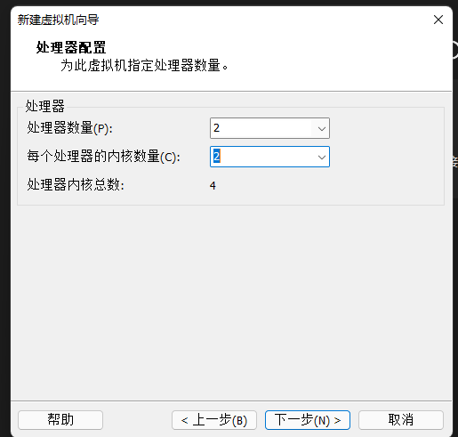
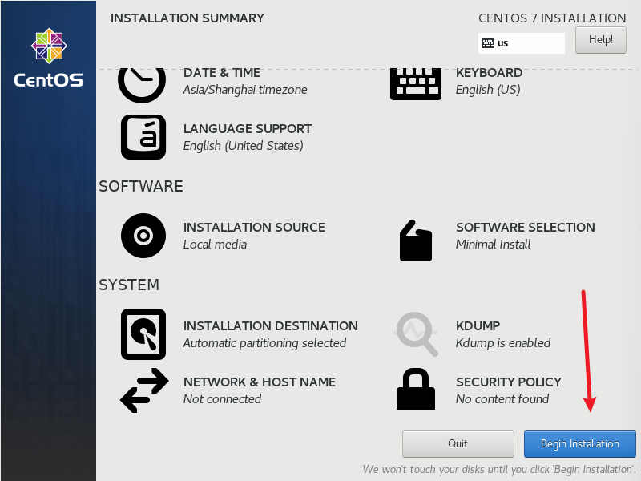

## 系统

​    我们生活中常用的系统有很多，比如Windows XP, Windows 7，Windows 10/11,macos等等，都是我们生活中常见的。还有一个背后比Window更强大的开源（免费试用，windows正版需要买）操作系统，那就是Linux。

​    期中Linux系统又分好多，互联网使用最多的linux操作系统那就是centos和ubuntu[开发用的比较多]。Linux系统也分有桌面系统和无桌面的系统。

## 虚拟机

我们日常用的最多就是windows系统的电脑，而我们要学习linux操作系统要怎么安装呢？

最好的方案就是安装一个虚拟机。然后在虚拟机里安装一个linux操作系统。

**准备一下vmware软件**

> 下载地址：https://www.vmware.com/products/workstation-pro/workstation-pro-evaluation.html

**centos 7**

> 下载地址：http://mirrors.aliyun.com/centos/7/isos/x86_64/

## 安装


> 选择自定义安装


> 选择对应版本


> 选择稍后安装，这个后面再来安装


> 选择linux，版本选择centos 7


> 设置虚拟机名字和存放位置


> 处理器和内存配置按照自己的需求来设置




> 网络设置NAT


> 控制器默认就好


> 磁盘类型也默认


> 创建新虚拟磁盘，按需求分配空间


> 导入镜像


## 开始安装系统

> 选择第一个


> 选择英文，下一步





> 等待安装完毕，Linux有个超级管理员用户就是默认就是root用户[uid=0]


## 配置静态IP

配置静态ip方便链接xshell，tabby远程

重启网卡：systemctl restart network

```
TYPE=Ethernet
PROXY_METHOD=none
BROWSER_ONLY=no
BOOTPROTO=static		#设置静态ip
IPADDR=192.168.6.30    # ip地址
GATEWAY=192.168.6.2    # 路由
NETMASK=255.255.255.0  # 网关
DNS1=114.114.114.114   # dns
DEFROUTE=yes
IPV4_FAILURE_FATAL=no
NAME=ens33
UUID=387b65b4-8fc8-4d0f-ab1f-a162e23b2c56
DEVICE=ens33
ONBOOT=yes			   # 开机网络自启
```

## 修改主机名

```
hostnamectl set-hostname name
```

## centos7系统优化

### 禁用SELINUX

```
sed -i 's@SELINUX=enforcing@SELINUX=disabled@g' /etc/selinux/config 
```

### 关闭防火墙

```
systemctl disable firewalld  # 开机不自启防火墙
systemctl stop firewalld     # 关闭防火墙
```

### 安装基本软件

```
yum install gcc cmake bzip2-devel curl-devel db4-devel libjpeg-devel libpng-devel freetype-devel libXpm-devel gmp-devel libc-client-devel openldap-devel unixODBC-devel postgresql-devel sqlite-devel aspell-devel net-snmp-devel libxslt-devel libxml2-devel pcre-devel mysql-devel pspell-devel libmemcached libmemcached-devel zlib-devel  vim wget   lrzsz  tree -y
```

### 时间矫正

```
yum install -y ntp

#修改为上海时区
cp /usr/share/zoneinfo/Asia/Shanghai /etc/localtime

crontab -e
# 加入一行
*/5 * * * * /usr/sbin/ ntpdate ntp.api.bz > /dev/null 2&>1
```

### 网卡自启动

```
sed -i 's@ONBOOT=no@ONBOOT=yes@g' /etc/sysconfig/network-scripts/ifcfg-ens33
```

### ssh

```
# 禁止ssh反向解析
sed -i 's@UseDNS yes@UseDNS no@' /etc/ssh/sshd_config /etc/ssh/sshd_config
# # 禁止空密码登录
sed -i 's@PermitEmptyPasswords no@PermitEmptyPasswords no@' /etc/ssh/sshd_config
```

### 修改字符集

```csharp
[root@localhost ~]# echo $LANG
zh_CN.UTF-8
[root@localhost ~]# vi /etc/locale.conf
LANG="en_US.UTF-8"
[root@localhost ~]# source  /etc/locale.conf
```

### 更换yum源

1.备份

```
mv /etc/yum.repos.d/CentOS-Base.repo /etc/yum.repos.d/CentOS-Base.repo.backup
```

2.下载新的 CentOS-Base.repo 到 /etc/yum.repos.d/

##### centos8

```
wget -O /etc/yum.repos.d/CentOS-Base.repo https://mirrors.aliyun.com/repo/Centos-vault-8.5.2111.repo
```

**CentOS 7**

```
wget -O /etc/yum.repos.d/CentOS-Base.repo https://mirrors.aliyun.com/repo/Centos-7.repo
```

3.yum 扩展源

centos 7

```
wget -O /etc/yum.repos.d/epel.repo http://mirrors.aliyun.com/repo/epel-7.repo
```

4.清除之前的旧缓存

```
yum clean all
```

5,.生成缓存

```
yum makecache
```

