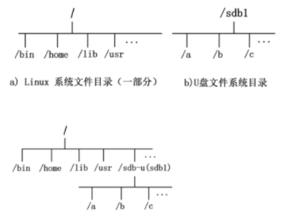
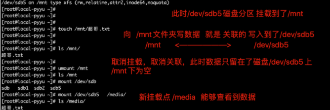
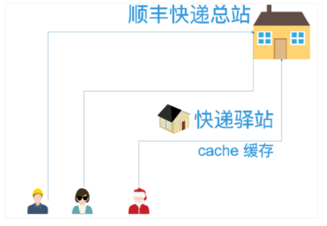
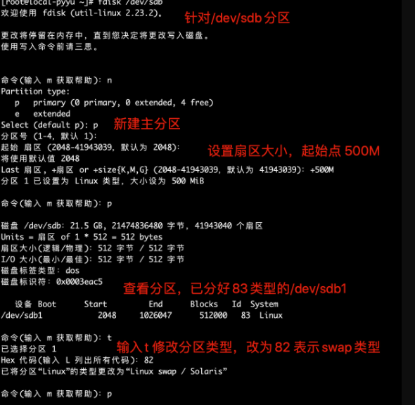
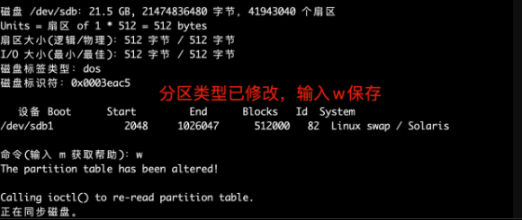
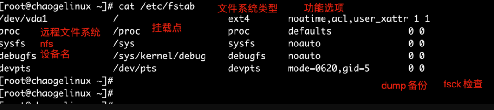

## 挂载

Linux 下设备不挂载不能使用，不挂载的设备相当于没门没窗户的监狱(进不去出不来)，挂载相当于给设备创造了一个入口(挂载点，一般为目录)

例如Linux访问U盘数据



**挂载**通常是将一个`存储设备`挂在到一个已经存在的`目录`上，访问这个`目录`就是访问该存储设备的内容。

对于Linux系统来说，一切皆文件，所有文件都放在以`根目录`为起点的树形目录结构中，任何硬件设备也都是文件形式

如图所示，是U盘存储设备和Linux系统自己的文件系统结构，此时Linux想要使用U盘的硬件设备，必须将Linux`本身的目录`和硬件设备的文件目录合二为一，此过程就称之为`挂载`。

> 挂载操作会隐藏原本Linux目录中的文件，因此选择Linux本身的目录，最好是新建空目录用于挂载
>
> 挂载之后，这个目录被称为挂载点

## mount

mount命令可以`将指定的文件系统`挂载到`指定目录（挂载点）`，在Linux系统下必须先挂载后才能访问设备资料

- 新的硬盘插到机器上，分区、格式化文件系统后，此时可以可以存放数据了
- 此时的硬盘插到linux上，也只是读取出了一个封闭的盒子，无法读写
- 和linux的文件夹进行`关联、挂载`后，即可通过访问`被挂载的文件夹`，访问到硬盘的数据

| 参数 | 解释                                                         |
| ---- | ------------------------------------------------------------ |
| -l   | 显示系统以挂载的设备信息                                     |
| -a   | 加载文件/etc/fstab中设置的所有设备                           |
| -t   | t<文件系统类型> 指定设备的文件系统类型。如果不设置，mount自行选择挂载的文件类型 minix Linux最早使用的文件系统。 ext2 Linux目前的常用文件系统。 msdos MS-DOS 的 FAT。 vfat Win85/98 的 VFAT。 nfs 网络文件系统。 iso9660 CD-ROM光盘的标准文件系统。 ntfs Windows NT的文件系统。 hpfs OS/2文件系统。Windows NT 3.51之前版本的文件系统。 auto 自动检测文件系统。 |
| -o   | 添加挂载选项，是安全、性能优化重要参数                       |
| -r   | 只读，等于-o ro                                              |
| -w   | 读写，等-o rw                                                |

对于mount的-o参数如下

| 参数          | 含义                                                         |
| ------------- | ------------------------------------------------------------ |
| async         | 以异步方式处理文件系统I/O操作，数据不会同步写入磁盘，而是写到缓冲区，提高系统性能，但损失数据安全性 |
| sync          | 所有I/O操作同步处理，数据同步写入磁盘，性能较弱，数据安全性高 |
| atime/noatime | 文件被访问时是否修改时间戳，不更改时间，可以提高磁盘I/O速度  |
| auto/noauto   | 通过-a参数可以自动被挂载/不自动挂载                          |
| defaults      | 默认值包括rw、suid、dev、exec、auto、nouser、async，/etc/fstab大多默认值 |
| exec/noexec   | 是否允许执行二进制程序，取消提供安全性                       |
| suid/nosuid   | 是否允许suid(特殊权限)生效                                   |
| user/nouser   | 是否允许普通用户挂载                                         |
| remount       | 重新挂载                                                     |
| ro            | 只读                                                         |
| rw            | 读写                                                         |

案例

**xfs文件系统，mount多出很多新选项**

```
#显示已经挂载情况
[root@local-pyyu ~]# mount -l
/dev/sda1 on /boot type xfs (rw,relatime,attr2,inode64,noquota)

#分区dev/sda1挂载在 /boot文件夹  文件系统类型是 xfs，参数是(rw,relatime,attr2,inode64,noquota)

rw 读写
relatime   mount 选项 relatime（relative atime 的意思）。relatime 的意思是访问文件时，仅在 atime 早于文件的更改时间时对 atime 进行更新。

attr2   在磁盘上存储内联扩展属性，提升性能
inode64 允许在文件系统的任意位置创建 inode
noquota 强制关闭所有文件系统限额功能
```

mount挂载案例

注意，如果分区未格式化，是无法写入数据的!!!

```
[root@local-pyyu ~]# mount /dev/sdb5 /mnt
mount: /dev/sdb5 写保护，将以只读方式挂载
mount: 未知的文件系统类型“(null)”

如何解决，格式化文件系统即可
[root@local-pyyu ~]# lsblk -f  #看一下文件系统类型
[root@local-pyyu ~]# mkfs.xfs /dev/sdb5  #格式化分区
[root@local-pyyu ~]# mount /dev/sdb5 /mnt  #此时正常挂载
```

默认挂载结果

```
/dev/sdb5 on /mnt type xfs (rw,relatime,attr2,inode64,noquota)  #centos7默认的挂载选项
```

**挂载使用分区，挂载过程图**



只读挂载

```
[root@local-pyyu ~]# mount -o ro /dev/sdb5 /mnt
[root@local-pyyu ~]# mount  
[root@local-pyyu ~]# ls /mnt
超哥.txt
[root@local-pyyu ~]# touch /mnt/超哥强啊.txt
touch: 无法创建"/mnt/超哥强啊.txt": 只读文件系统
```

禁止可执行文件

```
[root@local-pyyu ~]# mount -o noexec /dev/sdb5 /mnt
[root@local-pyyu ~]# cd /mnt
[root@local-pyyu mnt]# echo 'echo 爱的供养' > love.sh
[root@local-pyyu mnt]# chmod 777 love.sh
[root@local-pyyu mnt]# ll
总用量 4
-rwxrwxrwx 1 root root 18 12月  3 16:33 love.sh
-rw-r--r-- 1 root root  0 12月  3 16:02 超哥.txt
[root@local-pyyu mnt]# ./love.sh
-bash: ./love.sh: 权限不够
```

umount取消挂载

umount可卸除目前挂在Linux目录中的文件系统。

```
语法
-f 强制卸载
-l 懒惰的卸载。从文件系统层次分离文件系统,在不繁忙的情况下清理所有对文件系统的引用，常和-f参数共用
```

取消挂载案例

```
umount 设备|文件夹

umount /dev/sdb5 
umount /media
```

取消挂载出错，设备繁忙

- 注意挂载点被使用中无法卸载，如被进程占用

```
[root@local-pyyu mnt]# pwd
/mnt
[root@local-pyyu mnt]# umount /mnt
umount: /mnt：目标忙。
```

解决方案：

- 查看挂载点被哪个进程占用

```
lsof /mnt
```

```
[root@local-pyyu ~]# fuser -v /mnt
                     用户     进程号 权限   命令
/mnt:                root     kernel mount /mnt
                     root       5239 ..c.. bash
```

- 杀死正在使用挂载点的进程

```
[root@local-pyyu ~]# fuser -km /mnt
```

查看系统以挂载的设备

- mount -l
- cat /etc/mtab
- cat /proc/mounts


## df

**df命令列出的是文件系统的可用空间,报告文件系统磁盘空间的使用情况**

```
-i 用inode代替块
-l  只显示本地文件系统
-h 以kb mb gb显示单位
-T 显示每个文件系统的类型
```

df案例

```
[root@local-pyyu ~]# df -T
文件系统                类型        1K-块    已用     可用 已用% 挂载点
/dev/mapper/centos-root xfs      17811456 2601828 15209628   15% /
devtmpfs                devtmpfs  1965092       0  1965092    0% /dev
tmpfs                   tmpfs     1977356       0  1977356    0% /dev/shm
tmpfs                   tmpfs     1977356   11848  1965508    1% /run
tmpfs                   tmpfs     1977356       0  1977356    0% /sys/fs/cgroup
/dev/sda1               xfs       1038336  132684   905652   13% /boot
tmpfs                   tmpfs      395472       0   395472    0% /run/user/0

[root@local-pyyu ~]# df -T -h
文件系统                类型      容量  已用  可用 已用% 挂载点
/dev/mapper/centos-root xfs        17G  2.5G   15G   15% /
devtmpfs                devtmpfs  1.9G     0  1.9G    0% /dev
tmpfs                   tmpfs     1.9G     0  1.9G    0% /dev/shm
tmpfs                   tmpfs     1.9G   12M  1.9G    1% /run
tmpfs                   tmpfs     1.9G     0  1.9G    0% /sys/fs/cgroup
/dev/sda1               xfs      1014M  130M  885M   13% /boot
tmpfs                   tmpfs     387M     0  387M    0% /run/user/0

[root@local-pyyu ~]# df -i -h
文件系统                Inode 已用(I) 可用(I) 已用(I)% 挂载点
/dev/mapper/centos-root  8.5M     82K    8.5M       1% /
devtmpfs                 480K     404    480K       1% /dev
tmpfs                    483K       1    483K       1% /dev/shm
tmpfs                    483K    1.3K    482K       1% /run
tmpfs                    483K      16    483K       1% /sys/fs/cgroup
/dev/sda1                512K     325    512K       1% /boot
tmpfs                    483K       1    483K       1% /run/user/0
```

## du

**统计文件、目录磁盘使用情况**

**linux`操作系统`文件存取的**最小单位是块，且单位是4kb，也就是8个扇区。

```
du(Disk Usage) - 报告磁盘空间使用情况

-a或-all 显示目录中个别文件的大小。
-b或-bytes 显示目录或文件大小时，以byte为单位。
-c或--total 除了显示个别目录或文件的大小外，同时也显示所有目录或文件的总和。
-k或--kilobytes 以KB(1024bytes)为单位输出。
-m或--megabytes 以MB为单位输出。
-s或--summarize 仅显示总计，只列出最后加总的值。
-h或--human-readable 以K，M，G为单位，提高信息的可读性。
-x或--one-file-xystem 以一开始处理时的文件系统为准，若遇上其它不同的文件系统目录则略过。
-L<符号链接>或--dereference<符号链接> 显示选项中所指定符号链接的源文件大小。
-S或--separate-dirs 显示个别目录的大小时，并不含其子目录的大小。
-X<文件>或--exclude-from=<文件> 在<文件>指定目录或文件。
--exclude=<目录或文件> 略过指定的目录或文件。
-D或--dereference-args 显示指定符号链接的源文件大小。
-H或--si 与-h参数相同，但是K，M，G是以1000为换算单位。
-l或--count-links 重复计算硬件链接的文件。
```

案例


显示当前目录下`所有目录，和文件`大小统计

```
[root@chaogelinux testdu]# du -h
4.0K    ./chaoge_nginx/uwsgi_temp
4.0K    ./chaoge_nginx/proxy_temp
4.0K    ./chaoge_nginx/client_body_temp
12K    ./chaoge_nginx/html
64K    ./chaoge_nginx/conf
884K    ./chaoge_nginx/logs
4.0K    ./chaoge_nginx/fastcgi_temp
3.5M    ./chaoge_nginx/sbin
4.0K    ./chaoge_nginx/scgi_temp
4.5M    ./chaoge_nginx
4.6M    .
```

显示所有文件的统计大小

```
du -ah
```

单独统计文件大小

```
[root@chaogelinux testdu]# du  mysql-5.5.15-1-mdv2011.0.x86_64.rpm  -h
88K    mysql-5.5.15-1-mdv2011.0.x86_64.rpm
```

统计/opt目录下，第一层文件夹所有的文件，文件夹大小

```
[root@chaogelinux testdu]# du -ah --max-depth=1 /opt
```

统计/opt下所有文件文件夹大小，且从大到小排序

```
[root@chaogelinux testdu]# du -sh /opt/* | sort -rn
```

统计当前目录下所有文件，文件夹大小，除了`*.conf`文件

```
 du -ah --exclude='*.conf'
```

仅仅统计第一层文件夹的大小

```
[root@chaogelinux testdu]# du -h --max-depth=1 /opt
```

## free

free 命令主要是用来查看内存和 swap 分区的使用情况的，其中：

- total：是指总数；
- used：是指已经使用的；
- free：是指空闲的；
- shared：是指共享的；
- buffers：是指缓冲内存数；
- cached：是指缓存内存数，单位是KB；

```
[root@local-pyyu ~]# free -m
              total        used        free      shared  buff/cache   available
Mem:           3862         140        3552          11         168        3498
Swap:          2047           0        2047
```

> buff和cache

- buffers，缓冲，buffers是给写入数据加速的
- Cached，缓存，Cached是给读取数据时加速的

**cached是指把读取出来的数据保存在内存中，再次读取，不用读取硬盘而直接从内存中读取，加速数据读取过程。**



**buffers是指写入数据时，把分散的写入操作保存到内存，达到一定程度集中写入硬盘，减少磁盘碎片，以及反复的寻道时间，加速数据写入。**

> 总结buffer和cache

- 都是基于内存的中间层
- cache解决时间问题、提高读取速度
- buffer解决空间问题、给数据一个暂存空间
- cache利用内存提供的高速读写特性
- buffer利用内存提供的存储容量

> 内存被吃了

电脑无故提示内存不足，监控报警，新程序无法运行，都是物理内存不足，可能要释放cache缓存

```
释放缓存区的内存
1）清理pagecache（页面缓存）
[root@backup ~]# echo 1 > /proc/sys/vm/drop_caches     或者 # sysctl -w vm.drop_caches=1

2）清理dentries（目录缓存）和inodes
[root@backup ~]# echo 2 > /proc/sys/vm/drop_caches     或者 # sysctl -w vm.drop_caches=2

3）清理pagecache、dentries和inodes
[root@backup ~]# echo 3 > /proc/sys/vm/drop_caches     或者 # sysctl -w vm.drop_caches=3

上面三种方式都是临时释放缓存的方法，要想永久释放缓存，需要在/etc/sysctl.conf文件中配置：vm.drop_caches=1/2/3，然后sysctl -p生效即可！

另外，可以使用sync命令来清理文件系统缓存，还会清理僵尸(zombie)对象和它们占用的内存
sync：将内存缓冲区内的数据写入磁盘。
[root@backup ~]# sync
```

> 启用swap分区

使用swapon命令

```
原本的swap大小
[root@local-pyyu ~]# free -m
              total        used        free      shared  buff/cache   available
Mem:           3862         140        3552          11         168        3498
Swap:          2047           0        2047
```

激活swap分区

```
[root@local-pyyu ~]# swapon /dev/sdb1
```

查看swap空间

```
[root@local-pyyu ~]# free -m
              total        used        free      shared  buff/cache   available
Mem:           3862         141        3552          11         168        3497
Swap:          2547           0        2547
```

关闭swap空间

```
[root@local-pyyu ~]# swapoff /dev/sdb1
```

## 交换分区

swap分区是一块特殊的硬盘空间，当实际内存不够用的时候，操作系统会从内存中取出一部分暂时不用的数据，放在交换内存中，从而使当前的程序腾出更多的内存量。

使用swap交换分区作用是，通过操作系统的调取，程序可以用到的内存远超过实际物理内存。磁盘价格要比内存便宜的多，因此使用swap交换空间是很实惠的，但是由于频繁的读写硬盘，这种方式会降低系统运行效率。

swap分区大小，根据物理内存大小和硬盘容量计算

```
swap交换空间只是用来应急的，容量分配要适量
```

- 内存小于1G，必须用swap提升内存使用量，否则运行不了几个应用
- 内存使用过多的应用，如视频制作等，使用swap防止内存不足，导致的软件崩溃
- 电脑休眠、内存数据断电丢失，因此将内存数据暂时存入swap交换空间，电脑休眠回复后，数据从swap读入内存，继续工作

**centos建议分配swap**

- 内存小于2G，swap分配等同内存大小空间
- 内存大于2G，分配2G交换空间

创建swap分区

第一步：先分区

第二步：格式化（swap命令不同，是mkswap）

第三步：使用swap分区

分区





格式化文件系统

mkswap可将磁盘分区或文件设为Linux的交换区。

```
[root@local-pyyu ~]# mkswap /dev/sdb1
mkswap: /dev/sdb1: warning: wiping old xfs signature.
正在设置交换空间版本 1，大小 = 511996 KiB
无标签，UUID=64fb54dd-9383-44f9-a77f-c899898a9d68
```

开启swap交换分区

```
[root@local-pyyu ~]# swapon /dev/sdc1
[root@local-pyyu ~]# free -m
              total        used        free      shared  buff/cache   available
Mem:           3862         290        1729          11        1842        3170
Swap:          2547           0        2547
```


## 开机自动挂载

/etc/fstab是用来存放文件系统的静态信息的文件，当系统启动的时候，系统会自动地从这个文件读取信息，并且会自动将此文件中指定的文件系统挂载到指定的目录。



```
# <fie sysytem><mount point><type><options><dump><pass>
```

- File system

指定设备名称、或是远程的文件系统NFS

```
mount 192.168.178.100:/home/nfs   /mnt/nfs  -o nolock   #远程挂载不加锁
也可以挂载设备/dev/sda1  或是光盘  /dev/cdrom  或是u盘等
也可以是硬盘的卷标
也可以是用硬盘UUID
```

- mount point挂载点

```
自己创建一个目录，或是已存在的目录，然后挂载文件系统到这个目录，即可访问目录->访问文件系统
注意swap分区没有挂载点，填写none
```

- type类型

```
Linux能够支持的文件系统
ext3、 ext2、ext、swap

nfs、hpfs、ncpfs、ntfs、affs

umsdos、proc、reiserfs、squashfs、ufs。

adfs、befs、cifs、iso9660

kafs、minix、msdos、vfat
```

- options

```
可以通过man mount查看完整的参数
defaults，它代表包含了选项rw,suid,dev,exec,auto,nouser和 async。
```

- dump

```
表示将整个内容备份，一般为0不备份
1，每天备份
2，每隔一天备份
```

- fsck

```
一般为0
0 不自检
1，首要自检，一般只有根分区挂载点为1
2，次级自检
```

自动挂载在/etc/fstab所有定义的设备

```
cat /etc/fstab
/dev/sdb5       /chaoge   xfs  defaults 0 0

mount -a
```

