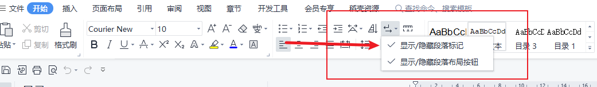
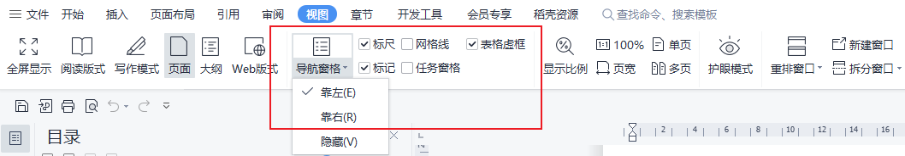

## word

> 我们在学习和工作中少不了会用到word软件来写文档，下面我来总结一下一些常用的功能。

## word排版基础

#### 1.习惯写完标题就保存

```
ctrl + s
```

#### 2.文件命名：

日期-项目名-版本-修改时间

#### 3.标准的编辑环境：





#### 4.鼠标手势

##### 4.1连续选中,文字

```
鼠标点中文字开头 + shift + 点一下结尾
```

##### 4.2跳选

```
按住ctrl + 选中文字
```

##### 4.3矩形选择

```
alt + 选中文字
```

#### 5.键盘手势

##### 5.1跳到文档开头

```
ctrl + home
```

##### 5.2跳到文档结尾

```
ctrl + end
```

