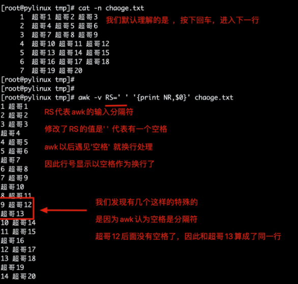

## awk介绍

awk是一个强大的linux命令，有强大的文本格式化的能力，好比将一些文本数据格式化成专业的excel表的样式

awk早期在Unix上实现，我们用的awk是gawk，是GUN awk的意思

```
[root@docker01 ~]# ls -l /usr/bin/awk
lrwxrwxrwx. 1 root root 4 Dec 18 20:08 /usr/bin/awk -> gawk
```

> awk是一门编程语言，支持条件判断、数组、循环等功能

## 再谈三剑客

- grep，擅长单纯的查找或匹配文本内容
- sed，更适合编辑、处理匹配到的文本内容
- awk，更适合格式化文本内容，对文本进行复杂处理

三个命令称之为Linux的三剑客

## awk基础

awk语法

```
awk [option] 'pattern[action]'  file ...

awk 参数   '条件动作'  文件
```


>Action指的是动作，awk擅长文本格式化，且输出格式化后的结果，因此最常用的动作就是`print`和`printf`

## awk场景

取出第二列

```
[root@docker01 ~]# awk '{print $2}' awk.txt 
alex2
alex7
alex12
```

执行的命令是`awk '{print $2}'`，没有使用参数和模式，`$2`表示输出文本的`第二列`信息

awk默认以空格为分隔符，且多个空格也识别为一个空格，作为分隔符

awk是按行处理文件，一行处理完毕，处理下一行，根据用户指定的分割符去工作，没有指定则默认空格

```
指定了分隔符后，awk把每一行切割后的数据对应到内置变量
```

- $0表示整行(默认不写也是整行)
- $NF表示当前分割后的最后一列
- 倒数第二列可以写成$(NF-1)

### awk内置变量

| 内置变量                    | 解释                              |
| --------------------------- | --------------------------------- |
| $n                          | 指定分隔符后，当前记录的第n个字段 |
| $0                          | 完整的输入记录                    |
| FS                          | 字段分隔符，默认是空格            |
| NF(Number of fields)        | 分割后，当前行一共有多少个字段    |
| NR(Number of records)       | 当前记录数，行数                  |
| 更多内置变量可以man手册查看 | man awk                           |

### 一次性输出多列

```
[root@docker01 ~]# awk '{print $1,$2}' awk.txt 
alex1 alex2
alex6 alex7
```

### 自动定义输出内容

awk，必须`外层单引号`，`内层双引号`

内置变量`$1、$2`都不得添加双引号，否则会识别为文本，尽量别加引号

```
[root@docker01 ~]# awk '{print "第一列:",$1,"第二列:",$2,"第三列:",$3}' awk.txt  
第一列: alex1 第二列: alex2 第三列: alex3
第一列: alex6 第二列: alex7 第三列: alex8
```

### 输出整行信息

> 两种写法都可以，我个人喜欢不加$0

```
[root@docker01 ~]# awk '{print}' awk.txt 
[root@docker01 ~]# awk '{print $0}' awk.txt 
```

### awk参数

| 参数 | 解释                        |
| ---- | --------------------------- |
| -F   | 指定分割字段符              |
| -v   | 定义或修改一个awk内部的变量 |
| -f   | 从脚本文件中读取awk命令     |

## awk案例

### 显示文件第五行

> NR在awk中表示行号，NR==5表示行号是5的那一行

```
[root@docker01 ~]# awk 'NR==5' /etc/passwd
lp:x:4:7:lp:/var/spool/lpd:/sbin/nologin
```

### 显示文件2-5行

设置模式（条件）

```
awk 'NR==2,NR==5' /etc/passwd
```

### 给每一行的内容添加行号

添加变量，NR等于行号，$0表示一整行的内容

{print }是awk的动作

```
awk '{print NR,$0}' /etc/passwd
```

### 显示文件3-5行且输出行号

```
awk 'NR==3,NR==5 {print NR,$0}' /etc/passwd
```

### 显示文件的第一列，倒数第二和最后一列

```
awk -F ':' '{print $1,$(NF-1),$NF}' /etc/passwd
```

## awk分隔符

awk的分隔符有两种

- 输入分隔符，awk默认是空格，空白字符，英文是field separator，变量名是FS
- 输出分隔符，output field separator，简称OFS

## FS输入分隔符

awk逐行处理文本的时候，以输入分割符为准，把文本切成多个片段，默认符号是空格

当我们处理特殊文件，没有空格的时候，可以自由指定分隔符特点

```
[root@pylinux tmp]# awk -F '#' '{print $1}' chaoge.txt
超哥c
超哥f
超哥i
超哥l
超哥o
超哥r
超哥u
超哥x
```


- 除了使用-F选项，还可以使用变量的形式，指定分隔符，使用-v选项搭配，修改FS变量

```
[root@pylinux tmp]# awk -v FS='#' '{print $1}' chaoge.txt
超哥c
超哥f
超哥i
超哥l
超哥o
超哥r
超哥u
超哥x
```

### OFS输出分割符

awk执行完命令，默认用空格隔开每一列，这个空格就是awk的默认输出符，例如

```
[root@pylinux tmp]# cat chaoge.txt
超哥c#超哥d#超哥e
超哥f#超哥g#超哥h
超哥i#超哥j#超哥k
超哥l#超哥m#超哥n
超哥o#超哥p#超哥q
超哥r#超哥s#超哥t
超哥u#超哥v#超哥w
超哥x#超哥y#超哥z
[root@pylinux tmp]# awk -v FS='#' '{print $1,$3}' chaoge.txt
超哥c 超哥e
超哥f 超哥h
超哥i 超哥k
超哥l 超哥n
超哥o 超哥q
超哥r 超哥t
超哥u 超哥w
超哥x 超哥z
```


通过OFS设置输出分割符，记住修改变量必须搭配选项 -v

```
[root@pylinux tmp]# cat chaoge.txt
超哥c#超哥d#超哥e
超哥f#超哥g#超哥h
超哥i#超哥j#超哥k
超哥l#超哥m#超哥n
超哥o#超哥p#超哥q
超哥r#超哥s#超哥t
超哥u#超哥v#超哥w
超哥x#超哥y#超哥z
[root@pylinux tmp]#
[root@pylinux tmp]#
[root@pylinux tmp]# awk -v FS='#' -v OFS='---' '{print $1,$3 }' chaoge.txt
超哥c---超哥e
超哥f---超哥h
超哥i---超哥k
超哥l---超哥n
超哥o---超哥q
超哥r---超哥t
超哥u---超哥w
超哥x---超哥z
```


### 输出分隔符与逗号

awk是否存在输出分隔符，特点在于`'{print $1,$3 } 逗号`的区别

- 添加逗号，默认是空格分隔符

```
[root@pylinux tmp]# awk -v FS='#'  '{print $1,$3 }' chaoge.txt
超哥c 超哥e
超哥f 超哥h
超哥i 超哥k
超哥l 超哥n
超哥o 超哥q
超哥r 超哥t
超哥u 超哥w
超哥x 超哥z
```

- 不加逗号

```
[root@pylinux tmp]# awk -v FS='#'  '{print $1$3 }' chaoge.txt
超哥c超哥e
超哥f超哥h
超哥i超哥k
超哥l超哥n
超哥o超哥q
超哥r超哥t
超哥u超哥w
超哥x超哥z
```

- 修改分割符，改为\t(制表符，四个空格)或者任意字符

```
[root@pylinux tmp]# awk -v FS='#' -v OFS='\t\t' '{print $1,$3 }' chaoge.txt
超哥c        超哥e
超哥f        超哥h
超哥i        超哥k
超哥l        超哥n
超哥o        超哥q
超哥r        超哥t
超哥u        超哥w
超哥x        超哥z
```

# awk变量

### awk参数

| 参数 | 解释                        |
| ---- | --------------------------- |
| -F   | 指定分割字段符              |
| -v   | 定义或修改一个awk内部的变量 |
| -f   | 从脚本文件中读取awk命令     |

对于awk而言，变量分为

- 内置变量
- 自定义变量

| 内置变量 | 解释                                                         |
| -------- | ------------------------------------------------------------ |
| FS       | 输入字段分隔符， 默认为空白字符                              |
| OFS      | 输出字段分隔符， 默认为空白字符                              |
| RS       | 输入记录分隔符(输入换行符)， 指定输入时的换行符              |
| ORS      | 输出记录分隔符（输出换行符），输出时用指定符号代替换行符     |
| NF       | NF：number of Field，当前行的字段的个数(即当前行被分割成了几列)，字段数量 |
| NR       | NR：行号，当前处理的文本行的行号。                           |
| FNR      | FNR：各文件分别计数的行号                                    |
| FILENAME | FILENAME：当前文件名                                         |
| ARGC     | ARGC：命令行参数的个数                                       |
| ARGV     | ARGV：数组，保存的是命令行所给定的各参数                     |

## 内置变量

### NR，NF、FNR

- awk的内置变量NR、NF是不用添加$符号的
- 而`$0 $1 $2 $3 ... 是需要添加$符号的`

*输出每行行号，以及字段总个数*

```
[root@pylinux tmp]# cat -n alex.txt
     1    alex1 alex2 alex3 alex4 alex5
     2    alex6 alex7 alex8 alex9 alex10
     3    alex11 alex12 alex13 alex14 alex15
     4    alex16 alex17 alex18 alex19 alex20
     5    alex21 alex22 alex23 alex24 alex25
     6    alex26 alex27 alex28 alex29 alex30
     7    alex31 alex32 alex33 alex34 alex35
     8    alex36 alex37 alex38 alex39 alex40
     9    alex41 alex42 alex43 alex44 alex45
    10    alex46 alex47 alex48 alex49 alex50  alex51
[root@pylinux tmp]#
[root@pylinux tmp]# awk '{print NR,NF}' alex.txt
1 5
2 5
3 5
4 5
5 5
6 5
7 5
8 5
9 5
10 6
```

*输出每行行号，以及指定的列*

```
[root@pylinux tmp]# awk '{print NR,$1,$5}' alex.txt
1 alex1 alex5
2 alex6 alex10
3 alex11 alex15
4 alex16 alex20
5 alex21 alex25
6 alex26 alex30
7 alex31 alex35
8 alex36 alex40
9 alex41 alex45
10 alex46 alex50
```

### 处理多个文件显示行号

```
#  普通的NR变量，会将多个文件按照顺序排序
[root@pylinux tmp]# awk '{print NR,$0}' alex.txt  pwd.txt
#使用FNR变量，可以分别对文件行数计数
[root@pylinux tmp]# awk '{print FNR,$0}' alex.txt  pwd.txt
### 内置变量RS
```

RS变量作用是`输入分隔符`，默认是`回车符`，也就是`回车(Enter键)换行符`

我们也可以自定义`空格`作为`行分隔符`，每遇见一个空格，就换行处理



```
[root@pylinux tmp]# awk -v RS=' ' '{print NR,$0}' chaoge.txt
```

### 内置变量ORS

ORS是输出分隔符的意思，awk默认认为，每一行结束了，就得添加`回车换行符`

ORS变量可以更改输出符

```
awk -v ORS='@@@' '{print NR,$0}' chaoge.txt
```


### 内置变量FILENAME

显示awk正在处理文件的名字

```
[root@pylinux tmp]# awk '{print FILENAME,FNR,$0}' chaoge.txt   alex.txt
chaoge.txt 1 超哥a 超哥b
chaoge.txt 2 超哥c 超哥d 超哥e
chaoge.txt 3 超哥f 超哥g 超哥h
chaoge.txt 4 超哥i 超哥j 超哥k
chaoge.txt 5 超哥l 超哥m 超哥n
chaoge.txt 6 超哥o 超哥p 超哥q
chaoge.txt 7 超哥r 超哥s 超哥t
chaoge.txt 8 超哥u 超哥v 超哥w
chaoge.txt 9 超哥x 超哥y 超哥z
alex.txt 1 alex1 alex2 alex3 alex4 alex5
alex.txt 2 alex6 alex7 alex8 alex9 alex10
alex.txt 3 alex11 alex12 alex13 alex14 alex15
alex.txt 4 alex16 alex17 alex18 alex19 alex20
```

### 变量ARGC、ARGV

ARGV表示的是一个数组，数组中保存的是命令行所给的`参数`

数组是一种数据类型，如同一个盒子

盒子有它的名字，且内部有N个小格子，标号从0开始

给一个盒子起名字叫做months，月份是1~12，那就如图所示


```
[root@pylinux tmp]# awk 'BEGIN{print "超哥教你学内置awk变量呢"}'  chaoge.txt
超哥教你学内置awk变量呢
[root@pylinux tmp]#
[root@pylinux tmp]#
[root@pylinux tmp]#
[root@pylinux tmp]#
[root@pylinux tmp]# awk 'BEGIN{print "超哥教你学内置awk变量呢",ARGV[0]}'  chaoge.txt
超哥教你学内置awk变量呢 awk
[root@pylinux tmp]#
[root@pylinux tmp]#
[root@pylinux tmp]# awk 'BEGIN{print "超哥教你学内置awk变量呢",ARGV[0],ARGV[1]}'  chaoge.txt
超哥教你学内置awk变量呢 awk chaoge.txt
[root@pylinux tmp]#
[root@pylinux tmp]#
[root@pylinux tmp]#
[root@pylinux tmp]# awk 'BEGIN{print "超哥教你学内置awk变量呢",ARGV[0],ARGV[1],ARGV[2]}'  chaoge.txt   alex.txt
超哥教你学内置awk变量呢 awk chaoge.txt alex.txt
```

### 自定义变量

顾名思义，是我们自己定义变量

- 方法一，`-v varName=value`
- 方法二，在程序中直接定义

方法一：

```
[root@pylinux tmp]# awk -v luffyVarName="超哥nb，awk讲的好啊"  'BEGIN{print luffyVarName}' chaoge.txt
超哥nb，awk讲的好啊
```


方法二：

```
[root@pylinux tmp]# awk 'BEGIN{chaogeVar="超哥带你学linux，还怕学不会咋的";chaogeVar2="学的会，必须学得会" ;print chaogeVar,chaogeVar2}'
超哥带你学linux，还怕学不会咋的 学的会，必须学得会
```


方法三：间接引用shell变量

```
[root@pylinux tmp]# studyLinux="超哥讲的linux是真滴好，嘿嘿"
[root@pylinux tmp]#
[root@pylinux tmp]#
[root@pylinux tmp]# awk -v myVar=$studyLinux 'BEGIN{print myVar}' # -v是给awk定义变量
超哥讲的linux是真滴好，嘿嘿
```

## awk模式pattern

再来回顾下awk的语法

```
awk [option] 'pattern[action]'  file ...
```

awk是按行处理文本，刚才讲解了`print`动作，现在讲解特殊的`pattern`：`BEGIN`和`END`

- BEGIN模式是处理文本之前需要执行的操作
- END模式是处理完所有行之后执行的操作

```
[root@pylinux tmp]# awk 'BEGIN{print "超哥教你学awk"}'
超哥教你学awk


#上述操作没有指定任何文件作为数据源，而是awk首选会执行BEGIN模式指定的print操作，打印出如上结果，然后发现没有任何文件需要操作，就结束了
[root@pylinux tmp]# awk 'BEGIN{print "超哥带你学awk"}{print $1}' alex.txt
超哥带你学awk
alex1
alex6
alex11
alex16
alex21
alex26
alex31
alex36
alex41
alex46
```


- 再次总结，BEGIN就是处理文本前，先执行BEGIN模式指定的动作
- 再来看END的作用（awk处理完所有指定的文本后，需要执行的动作）


### awk结合BEGIN和END模式

```
[root@pylinux tmp]# awk 'BEGIN{print "来路飞学城听超哥讲linux"}{print $1,$2}END{print "超哥nb"}' alex.txt
```


## awk模式pattern讲解

再来看一下awk的语法，`模式`也可以理解为是`条件`

```
awk [option] 'pattern[action]'  file ...
```

刚才我们学了两个模式(条件)

- BEGIN
- END

**awk默认是按行处理文本，如果不指定任何模式（条件），awk默认一行行处理**

**如果指定了模式，只有符合模式的才会被处理**

### 模式（条件）案例

```
[root@pylinux tmp]# cat -n alex.txt
     1    alex1 alex2 alex3 alex4 alex5
     2    alex6 alex7 alex8 alex9 alex10
     3    alex11 alex12 alex13 alex14 alex15
     4    alex16 alex17 alex18 alex19 alex20
     5    alex21 alex22 alex23 alex24 alex25
     6    alex26 alex27 alex28 alex29 alex30
     7    alex31 alex32 alex33 alex34 alex35
     8    alex36 alex37 alex38 alex39 alex40
     9    alex41 alex42 alex43 alex44 alex45
    10    alex46 alex47 alex48 alex49 alex50  alex51
[root@pylinux tmp]#
[root@pylinux tmp]#
[root@pylinux tmp]# awk 'NF==5 {print $1}'  alex.txt
alex1
alex6
alex11
alex16
alex21
alex26
alex31
alex36
alex41
[root@pylinux tmp]# awk 'NF==6 {print $1}'  alex.txt
alex46
```


### awk的模式

| 关系运算符 | 解释       | 示例      |
| ---------- | ---------- | --------- |
| <          | 小于       | x<y       |
| <=         | 小于等于   | x<=y      |
| ==         | 等于       | x==y      |
| !=         | 不等于     | x!=y      |
| >=         | 大于等于   | x>=y      |
| >          | 大于       | x>y       |
| ~          | 匹配正则   | x~/正则/  |
| !~         | 不匹配正则 | x!~/正则/ |

案例

```
[root@pylinux tmp]# awk 'NR>3{print $0}' alex.txt
alex16 alex17 alex18 alex19 alex20
alex21 alex22 alex23 alex24 alex25
alex26 alex27 alex28 alex29 alex30
alex31 alex32 alex33 alex34 alex35
alex36 alex37 alex38 alex39 alex40
alex41 alex42 alex43 alex44 alex45
alex46 alex47 alex48 alex49 alex50  alex51
[root@pylinux tmp]#
[root@pylinux tmp]# awk '$1=="alex36"{print $0}' alex.txt
alex36 alex37 alex38 alex39 alex40
```


> BEGIN/END模式（条件设置）


## awk与正则表达式

正则表达式主要与awk的`pattern模式（条件）`结合使用

- 不指定模式，awk每一行都会执行对应的动作
- 指定了模式，只有被模式匹配到的、符合条件的行才会执行动作

### 找出pwd.txt中有以games开头的行

1.用grep过滤

```
[root@pylinux tmp]# cat -n pwd.txt
     1    sync:x:5:0:sync:/sbin:/bin/sync
     2    shutdown:x:6:0:shutdown:/sbin:/sbin/shutdown
     3    halt:x:7:0:halt:/sbin:/sbin/halt
     4    mail:x:8:12:mail:/var/spool/mail:/sbin/nologin
     5    operator:x:11:0:operator:/root:/sbin/nologin
     6    games:x:12:100:games:/usr/games:/sbin/nologin
     7    ftp:x:14:50:FTP User:/var/ftp:/sbin/nologin
     8    nobody:x:99:99:Nobody:/:/sbin/nologin
     9    systemd-network:x:192:192:systemd Network Management:/:/sbin/nologin
    10    dbus:x:81:81:System message bus:/:/sbin/nologin
    11    polkitd:x:999:998:User for polkitd:/:/sbin/nologin
    12    libstoragemgmt:x:998:997:daemon account for libstoragemgmt:/var/run/lsm:/sbin/nologin
    13    rpc:x:32:32:Rpcbind Daemon:/var/lib/rpcbind:/sbin/nologin
    14    ntp:x:38:38::/etc/ntp:/sbin/nologin

[root@pylinux tmp]# grep '^games' pwd.txt
games:x:12:100:games:/usr/games:/sbin/nologin
```

2.awk怎么办？

```
[root@pylinux tmp]# awk '/^games/{print $0}'  pwd.txt
games:x:12:100:games:/usr/games:/sbin/nologin

#省略写法
[root@pylinux tmp]# awk '/^games/'  pwd.txt
games:x:12:100:games:/usr/games:/sbin/nologin
```

### awk使用正则语法


awk命令使用正则表达式，必须把正则放入 "//" 双斜杠中，匹配到结果后执行动作{print $0}，打印整行信息

grep可以过滤，那我还用你awk干啥？

**awk强大的格式化文本**


```
[root@pylinux tmp]# awk -F ":"  'BEGIN{printf "%-10s\t%-10s\n","用户名","用户id"} /^n/ {printf "%-10s\t%-10s\n",$1,$3}' pwd.txt
用户名           用户id
nobody        99
ntp           38
nawerwertp    38
nqwerqstp     38
nqweqsdtp     38
nqwetp        38
```

### awk命令执行流程

解读需求：从pwd.txt文件中，寻找我们想要的信息，按照以下顺序执行

```
awk 'BEGIN{ commands } pattern{ commands } END{ commands }'
```

1. 优先执行`BEGIN{}`模式中的语句
2. 从pwd.txt文件中读取第一行，然后执行`pattern{commands}`进行正则匹配`/^n/` 寻找n开头的行，找到了执行`{print}` 进行打印
3. 当awk读取到文件数据流的结尾时，会执行`END{commands}`

### 找出pwd.txt文件中禁止登录的用户（`/sbin/nologin`）

正则表达式中如果出现了 `"/"`则需要进行转义

找出pwd.txt文件中禁止登录的用户（`/sbin/nologin`）

1.用grep找出

```
grep '/sbin/nologin$' pwd.txt
```

2.awk用正则得用双斜杠`/正则表达式/`

```
[root@pylinux tmp]# awk '/\/sbin\/nologin$/{print $0}' pwd.txt
```


### 找出文件的区间内容

1.找出mail用户到nobody用户之间的内容


```
[root@pylinux tmp]# awk '/^mail/,/^nobody/ {print $0}' pwd.txt
mail:x:8:12:mail:/var/spool/mail:/sbin/nologin
operator:x:11:0:operator:/root:/sbin/nologin
games:x:12:100:games:/usr/games:/sbin/nologin
ftp:x:14:50:FTP User:/var/ftp:/sbin/nologin
nobody:x:99:99:Nobody:/:/sbin/nologin
```

2.关系表达式模式

```
[root@pylinux tmp]# awk 'NR>=4 && NR<=8 {print $0}' pwd.txt
mail:x:8:12:mail:/var/spool/mail:/sbin/nologin
operator:x:11:0:operator:/root:/sbin/nologin
games:x:12:100:games:/usr/games:/sbin/nologin
ftp:x:14:50:FTP User:/var/ftp:/sbin/nologin
nobody:x:99:99:Nobody:/:/sbin/nologin
```

### awk企业实战nginx日志

Access.log

```
39.96.187.239 - - [11/Nov/2019:10:08:01 +0800] "GET / HTTP/1.1" 302 0 "-" "Zabbix"
211.162.238.91 - - [11/Nov/2019:10:08:02 +0800] "GET /api/v1/course_sub/category/list/?belong=1 HTTP/1.1" 200 363 "https://www.luffycity.com/free" "Mozilla/5.0 (Windows NT 10.0; WOW64) AppleWebKit/537.36 (KHTML, like Gecko) Chrome/69.0.3497.100 Safari/537.36"
211.162.238.91 - - [11/Nov/2019:10:08:02 +0800] "GET /api/v1/degree_course/ HTTP/1.1" 200 370 "https://www.luffycity.com/free" "Mozilla/5.0 (Windows NT 10.0; WOW64) AppleWebKit/537.36 (KHTML, like Gecko) Chrome/69.0.3497.100 Safari/537.36"
```

### 统计日志的访客ip数量

```
#sort -n 数字从大到小排序
#wc -l 统计行数，也就是ip的条目数
[root@pylinux tmp]# awk '{print $1}' 500access.log |sort -n|uniq|wc -l
75
```

### 查看访问最频繁的前10个ip

```
#uniq -c 去重显示次数
#sort -n 从大到小排序

1.先找出所有ip排序，排序，然后去重统计出现次数
awk '{print $1}' 500access.log |sort -n |uniq -c

2.再次从大到小排序，且显示前100个ip
[root@pylinux tmp]# awk '{print $1}' 500access.log |sort -n |uniq -c |sort -nr |head -10
     32 113.225.0.211
     22 119.123.30.32
     21 116.30.195.155
     20 122.71.65.73
     18 163.142.211.160
     16 39.96.187.239
     16 124.200.147.165
     16 101.249.53.64
     14 120.228.193.218
     14 113.68.155.221
```


