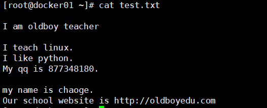
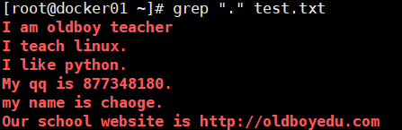
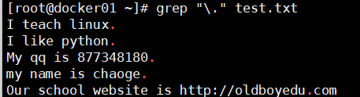
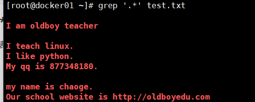
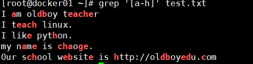
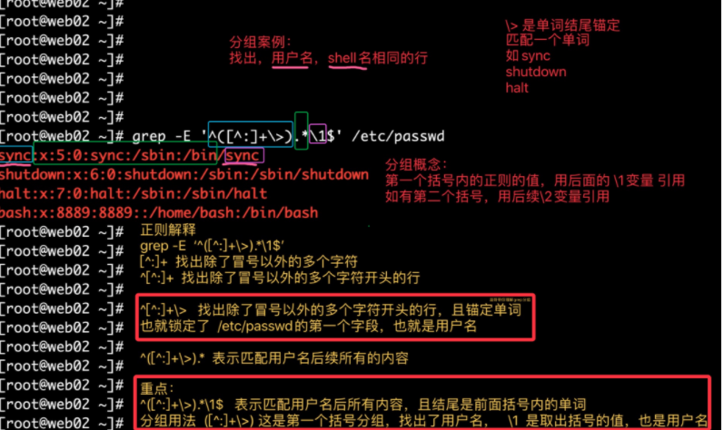

## 介绍

`grep`命令用于查找文件里符合条件的字符串。作为linux中最为常用的三大文本（awk，sed，grep）处理工具之一。


语法

```
grep [-abcEFGhHilLnqrsvVwxy][-A<显示列数>][-B<显示列数>][-C<显示列数>][-d<进行动作>][-e<范本样式>][-f<范本文件>][--help]    [范本样式][文件或目录...]
首先谈一下grep命令的常用格式为：grep  [选项]  ”模式“  [文件]
```

> grep命令的常用格式为：grep  [选项]  ”模式“  [文件]


> `grep`家族总共有三个：`grep`，`egrep`，`fgrep`
>
> grep -E=egrep


常用参数：

```
-E ：开启扩展（Extend）的正则表达式。
-i ：忽略大小写（ignore case）。
-v ：反过来（invert），只打印没有匹配的，而匹配的反而不打印。
-n ：显示行号
-w ：被匹配的文本只能是单词，而不能是单词中的某一部分，如文本中有liker，而我搜寻的只是like，就可以使用-w选项来避免匹配liker
-c ：显示总共有多少行被匹配到了，而不是显示被匹配到的内容，注意如果同时使用-cv选项是显示有多少行没有被匹配到。
-o ：只显示被模式匹配到的字符串。
-A  n：显示匹配到的字符串所在的行及其后n行，after
-B  n：显示匹配到的字符串所在的行及其前n行，before
-C  n：显示匹配到的字符串所在的行及其前后各n行，context
```

## 例子

```
grep -c "root" /etc/passwd 统计所有以“root”字符开头的行有多少
grep -i "root" /etc/passwd 不区分大小写查找“root”所有的行
grep -n "root" /etc/passwd 显示行号
grep -v "root" test.txt 显示输出没有字符“root”所有的行
grep "root" /etc/passwd 显示输出字符“root”所在的行
grep "root;" /etc/passwd 显示输出以字符“root”开头，并在字符“root”后是一个tab键所在的行
grep "ro[ot]" test.txt 显示输出以字符“ro”开头，第三个字符是“o”或是“t”的所有的行）
grep "^[^root]" /etc/passwd 显示输出行首不是字符“root”的行
grep "[Ro]ot" /etc/passwd 设置大小写查找：显示输出第一个字符以“R”或“o”开头，以字符“ot”结束的行
grep "r...t" /etc/passwd 显示输出第一个字符是“r”，第二、三、四是任意字符，第五个字符是“t”所在的行
grep -i "[a-d][9]d" /etc/passwd 显示输出第一个字符的范围是“A-D”，第二个字符是“9”，第三个字符的是“D”的所有的行
grep "[35]..1998" /etc/passwd 显示第一个字符是3或5，第二三个字符是任意，以1998结尾的所有行
grep "root\{2,\}" /etc/passwd 模式出现几率查找：显示输出字符“root”至少重复出现两次的所有行
grep "9\{2,3\}" /etc/passwd 模式出现几率查找：显示输出字符“9”重复出现的次数在一定范围内，重复出现2次或3次所有行
grep -n "^$" /etc/passwd 显示输出空行的行号

ls -l |grep "^d" 如果要查询目录列表中的目录 同：ls -d *
ls -l |grep "^d[d]" 在一个目录中查询不包含目录的所有文件
ls -l |grpe "^d…..x..x" 查询其他用户和用户组成员有可执行权限的目录集合
```

### 准备元数据

```
[root@yzh ~]# cat >> info.txt <<EOF
root:x:0:0:root:/root:/bin/bash
ROOT:x:0:0:root:/root:/bin/bash
bin:x:1:1:bin:/bin:/sbin/nologin
ntp:x:38:38::/etc/ntp:/sbin/nologin
nscd:x:28:28:NSCD Daemon:/:/sbin/nologin
yzh:x:1000:1000::/home/cmz:/bin/bash
yzc:x:1001:1000::/home/yzc:/bin/bash
YZC:x:1001:1000::/home/yzc:/bin/bash
YZC123:x:1001:1000::/home/yzc123:/bin/bash
EOF
```

### 不带参数

```
[root@yzh ~]# grep yzc info.txt 
yzc:x:1001:1000::/home/yzc:/bin/bash
YZC:x:1001:1000::/home/yzc:/bin/bash
YZC123:x:1001:1000::/home/yzc123:/bin/bash
```

### 显示行号 -n

```
[root@yzh ~]# grep -n yzc info.txt 
32:yzc:x:1001:1000::/home/yzc:/bin/bash
33:YZC:x:1001:1000::/home/yzc:/bin/bash
34:YZC123:x:1001:1000::/home/yzc123:/bin/bash
```

### 显示匹配到的总行数 -c

```
[root@yzh ~]# grep -c yzc info.txt 
3
```

### 只显示匹配的元素 -o

```
[root@yzh ~]# grep -o yzc info.txt 
yzc
yzc
yzc
yzc
```

### 精确匹配 -w

```
[root@yzh ~]# grep -w yzc info.txt 
yzc:x:1001:1000::/home/yzc:/bin/bash
YZC:x:1001:1000::/home/yzc:/bin/bash
```

### 忽略大小写 -i

```
[root@yzh ~]# grep -i ROOT info.txt 
root:x:0:0:root:/root:/bin/bash
ROOT:x:0:0:root:/root:/bin/bash
```

### 排除 -v

```
[root@yzh ~]# grep -v yzc info.txt 
root:x:0:0:root:/root:/bin/bash
ROOT:x:0:0:root:/root:/bin/bash
bin:x:1:1:bin:/bin:/sbin/nologin
ntp:x:38:38::/etc/ntp:/sbin/nologin
nscd:x:28:28:NSCD Daemon:/:/sbin/nologin
yzh:x:1000:1000::/home/cmz:/bin/bash

```

### 显示匹配到后N行 -A

```
[root@yzh ~]# grep -A1 yzh info.txt 
yzh:x:1000:1000::/home/cmz:/bin/bash
yzc:x:1001:1000::/home/yzc:/bin/bash
```

### 显示匹配到前N行 -B

```
[root@yzh ~]# grep -B1 yzh info.txt 
nscd:x:28:28:NSCD Daemon:/:/sbin/nologin
yzh:x:1000:1000::/home/cmz:/bin/bash
```

### 显示匹配到前后N行 -C

```
[root@yzh ~]# grep -C1 yzh info.txt 
nscd:x:28:28:NSCD Daemon:/:/sbin/nologin
yzh:x:1000:1000::/home/cmz:/bin/bash
yzc:x:1001:1000::/home/yzc:/bin/bash
```

### 空行 ^$

```
[root@yzh ~]# grep "^$" info.txt -n
3:
```

### 多参数匹配

```
[root@yzh ~]# egrep "yzc|yzh" info.txt 
yzh:x:1000:1000::/home/cmz:/bin/bash
yzc:x:1001:1000::/home/yzc:/bin/bash
YZC:x:1001:1000::/home/yzc:/bin/bash
YZC123:x:1001:1000::/home/yzc123:/bin/bash
```

## 正则表达式

```


^ 锚定行的开始 如：'^grep'匹配所有以grep开头的行。 
$ 锚定行的结束 如：'grep$'匹配所有以grep结尾的行。 
. 匹配一个非换行符的字符 如：'gr.p'匹配gr后接一个任意字符，然后是p。 
+ 匹配前面的子表达式一次或多次。
? 匹配前面的子表达式，最多一次。
* 匹配零个或多个先前字符 如：'*grep'匹配所有一个或多个空格后紧跟grep的行。 .*一起用代表任意字符。
[] 匹配一个指定范围内的字符，如'[Gg]rep'匹配Grep和grep。 
[^] 匹配一个不在指定范围内的字符，如：'[^A-FH-Z]rep'匹配不包含A-R和T-Z的一个字母开头，紧跟rep的行。 
\(..\) 标记匹配字符，如'\(love\)'，love被标记为1。 
\ 锚定单词的开始，如:'\匹配包含以grep开头的单词的行。 
\> 锚定单词的结束，如'grep\>'匹配包含以grep结尾的单词的行。 
x\{m\} 重复字符x，m次，如：'0\{5\}'匹配包含5个o的行。 
x\{m,\} 重复字符x,至少m次，如：'o\{5,\}'匹配至少有5个o的行。 
x\{m,n\}重复字符x，至少m次，不多于n次，如：'o\{5,10\}'匹配5--10个o的行。
\w 匹配文字和数字字符，也就是[A-Za-z0-9]，如：'G\w*p'匹配以G后跟零个或多个文字或数字字符，然后是p。
\b 单词锁定符，如: '\bgrep\b'只匹配grep。
```

## grep实践

准备一个测试文件



### ^符号

1.输出所有以m开头的行

```
[root@docker01 ~]# grep -in "^m" test.txt   # -i忽略大小写  -n 显示仪行号
6:My qq is 877348180.
8:my name is chaoge.
```

2.输出所有以i开头的行

```
[root@docker01 ~]# grep -in "^i" test.txt 
2:I am oldboy teacher
4:I teach linux.
5:I like python.
```

### $符

1.输出所有以r结尾的行

```
[root@docker01 ~]# grep -in "r$" test.txt 
2:I am oldboy teacher
```

TIP

```
注意在Linux平台下，所有文件的结尾都有一个$符
可以用cat -A 查看文件
```

2.输出所有以"."结尾的行，注意用转义符

```
[root@docker01 ~]# grep -i "\.$" test.txt 
I teach linux.
I like python.
My qq is 877348180.
my name is chaoge.
```

### ^$组合符

1.找出文件的空行，以及行号

```
[root@docker01 ~]# grep "^$" test.txt  -n
1:
3:
7:

```

### .点符号

"."点表示任意一个字符，有且只有一个，不包含空行



匹配出 ".ac"，找出任意一个三位字符，包含ac

```
[root@docker01 ~]# grep ".ac" test.txt -in
2:I am oldboy teacher
4:I teach linux.
```

### \转义符

1.找出文中所有的点"."



### *符

1.找出前一个字符0次或多次，找出文中出现"i"的0次或多次

```
[root@docker01 ~]# grep "i*" test.txt 

I am oldboy teacher

I teach linux.
I like python.
My qq is 877348180.

my name is chaoge.
Our school website is http://oldboyedu.com

```

### .*组合符

.表示任意一个字符，*表示匹配前一个字符0次或多次，因此放一起，代表匹配所有内容，以及空格



### ^.*o符

^以某字符为开头

.任意0或多个字符

.*代表匹配所有内容

o普通字符，一直到字母o结束

这种匹配相同字符到最后一个字符的特点，称之为贪婪匹配

```
[root@docker01 ~]# grep "I.*o" test.txt 
I am oldboy teacher
I like python.
```

### `[abc]中括号`

中括号表达式，[abc]表示匹配中括号中任意一个字符，a或b或c，常见形式如下

- [a-z]匹配所有小写单个字母
- [A-Z]匹配所有单个大写字母
- [a-zA-Z]匹配所有的单个大小写字母
- [0-9]匹配所有单个数字
- [a-zA-Z0-9]匹配所有数字和字母



### -o参数

使用"-o"选项，可以只显示被匹配到的关键字，而不是讲整行的内容都输出。

显示文件中有多少个字符a

```
[root@docker01 ~]# grep -o "a" test.txt |wc -l
5
```

### `[^abc]中括号中取反`

`[^abc]`或`[^a-c]`这样的命令，"^"符号在中括号中第一位表示排除，就是排除字母a或b或c

**出现在中括号里的尖角号表示取反**

1.找出除了小写字母以外的字符

```
[root@docker01 ~]# grep '[^a-z]' test.txt
```

## 扩展正则表达式实践

> 此处使用grep -E进行实践扩展正则，egrep官网已经弃用
>
> 我个人还是觉得egrep方便一些，只要可以正常用就没问题

### +号

+号表示匹配前一个字符1次或多次，必须使用grep -E 扩展正则

```
[root@docker01 ~]# egrep 'l+' test.txt 
```

### ?符

匹配前一个字符0次或1次

1.找出文件中包含gd或god的行

```
[root@docker01 ~]# egrep "go?d" test.txt
```

### |符

竖线|在正则中是或者的意思

1.找出系统中的txt文件，且名字里包含a或b的字符

```
[root@docker01 ~]# find / -maxdepth 3 -name "*.txt"|egrep -i "a|b"
/home/yzh/aa.txt
/opt/srcblog/requirements.txt
```

### ()小括号

将一个或多个字符捆绑在一起，当作一个整体进行处理；

- 小括号功能之一是`分组过滤被括起来的内容`，`括号内的内容表示一个整体`

- 括号()内的内容可以`被后面的"\n"正则引用`，`n为数字`，表示`引用第几个括号`的内容
  - `\1`：表示从左侧起，第一个括号中的模式所匹配到的字符
  - `\2`：从左侧起，第二个括号中的模式所匹配到的字符

1.找出包含good和glad的行

```
egrep "g(oo|la)d" test.txt
```

**分组之后向引用**

```
[root@docker01 ~]# cat lovers.txt 
I like my lover.
I love my lover.
He likes his lovers.
He love his lovers.

```

```
[root@docker01 ~]# egrep '(l..e).*\1' lovers.txt 
I love my lover.
He love his lovers.
```

案例2

```
[root@docker01 ~]# egrep '(r..t).*\1' /etc/passwd
root:x:0:0:root:/root:/bin/bash

```

案例3

```
[root@docker01 ~]# egrep '^([^:]+\>).*\1$' /etc/passwd
sync:x:5:0:sync:/sbin:/bin/sync
shutdown:x:6:0:shutdown:/sbin:/sbin/shutdown
halt:x:7:0:halt:/sbin:/sbin/halt
```

### 分组解释



### {n,m}匹配次数

重复前一个字符各种次数，可以通过-o参数显示明确的匹配过程

匹配a字母最少1次，最多3次

```
egrep "a{1,3}" test.txt
```

匹配最少2个，最多3个

```
egrep "a{2,3}" test.txt -o
```

匹配最少4个a

```
egrep -o "a{4,}" test.txt
```

匹配最多4个a

```
egrep -o "a{,4}" test.txt
```

