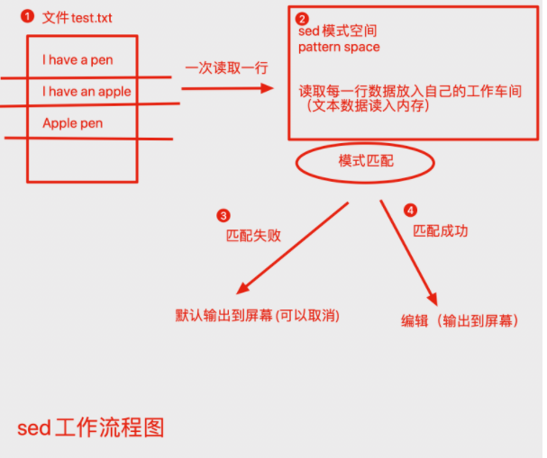
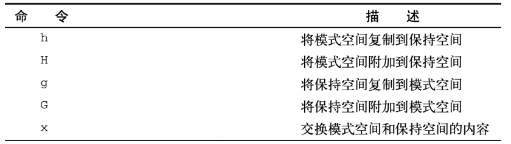
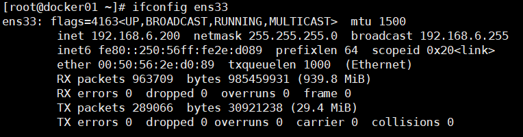
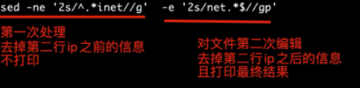

## sed介绍

sed是Stream Editor（字符流编辑器）的缩写，简称流编辑器。

sed是操作、过滤和转换文本内容的强大工具。

常用功能包括结合正则表达式对文件实现快速增删改查，其中查询的功能中最常用的两大功能是过滤（过滤指定字符串）、取行（取出指定行）

> 注意sed和awk使用单引号，双引号有特殊解释



语法：

```
sed [选项] [sed内置命令字符] [输入文件]
```

常用选项：

| 参数选项 | 解释                                                |
| -------- | --------------------------------------------------- |
| -n       | 取消默认sed的输出，常与sed内置命令p一起用           |
| -i       | 直接将修改结果写入文件，不用-i，sed修改的是内存数据 |
| -e       | 多次编辑,不需要管道符了                             |
| -r       | 支持正则扩展                                        |

sed的`内置命令字符`用于对文件进行不同的操作功能，如对文件增删改查

sed常用`内置命令字符`：

| sed的内置命令字符 | 解释                                                      |
| ----------------- | --------------------------------------------------------- |
| a                 | append，对文本追加，在指定行后面添加一行/多行文本         |
| d                 | Delete，删除匹配行                                        |
| i                 | insert，表示插入文本，在指定行前添加一行/多行文本         |
| p                 | Print ，打印匹配行的内容，通常p与-n一起用                 |
| s/正则/替换内容/g | 匹配正则内容，然后替换内容（支持正则），结尾g代表全局匹配 |

sed匹配范围

| 范围        | 解释                                                         |
| ----------- | ------------------------------------------------------------ |
| 空地址      | 全文处理                                                     |
| 单地址      | 指定文件某一行                                               |
| `/pattern/` | 被模式匹配到的每一行                                         |
| 范围区间    | `10,20 十到二十行`，`10,+5第10行向下5行`，`/pattern1/,/pattern2/` |
| 步长        | `1~2，表示1、3、5、7、9行`，`2~2两个步长，表示2、4、6、8、10、偶数行` |

## sed进阶

### 多行命令

N: 将数据流中的下一行加进来，创建一个多行组处理，multiline group

D：删除多行组的一行

P：打印多行组的一行

### n(next)命令

sed小写的n命令会告诉sed编辑器移动到数据流中的下一行文本。

```
# 数据文件
cat <<EOF>> data.txt
This is an apple.

This is a boy.

This is a gril.
EOF


删除空行
[root@docker scripts]# sed '/^$/d' data.txt 
This is an apple.
This is a boy.
This is a gril.

删除apple下一行的空格
[root@docker scripts]# sed '/apple/{n;d}' data.txt 
This is an apple.
This is a boy.

This is a gril.
```

### 合并文本行

大写的N指令将下一行文本添加到模式空间中已经有的文本的后面，实现多行文本处理。

```
cat <<EOF>>data2.txt
This is the header line.
This is the first data line.
This is the second data line.
This is the last line.
EOF

#sed找到first一行后，用N指令把下一行合并到first该行，并且执行s替换指令，结果是如上合并了一行。
[root@docker scripts]# sed '/first/{N;s/\n/ /}' data2.txt 
This is the header line.
This is the first data line. This is the second data line.
This is the last line.


[root@docker scripts]# cat <<EOF>> data3.txt
> On Tuesday, the Linux System
> Administrator's group meeting will be held.
> All System Administrators should attend.
> Thank you for your attendance.
> EOF

#查找一个可能分散两行的文本
[root@docker scripts]# sed 'N;s/System.Administrator/Desktop User/' data3.txt
On Tuesday, the Linux Desktop User's group meeting will be held.
All Desktop Users should attend.
Thank you for your attendance.
```

### 多行删除

D，只删除模式空间里的第一行，该指令会删除到换行符位置的所有字符。

```
[root@docker scripts]# sed 'N;/System\nAdministrator/D' data3.txt 
Administrator's group meeting will be held.
All System Administrators should attend.
Thank you for your attendance.
```

删除文件空白行

```
[root@docker scripts]# cat data2.txt 

This is the header line.
This is the first data line.
This is the second data line.
This is the last line.

[root@docker scripts]# sed '/^$/{N;/header/D}' data2.txt 
This is the header line.
This is the first data line.
This is the second data line.
This is the last line.
```

sed编辑器会查找空白行，然后用N命令把下一行的文本添加到模式空间，如果新的模式空间里有单词header，D指令就删除模式空间的第一行，也就删除了空白行。

### 保持空间

保持空间命令





```
[root@docker scripts]# cat data2.txt 

This is the header line.
This is the first data line.
This is the second data line.
This is the last line.
[root@docker scripts]# sed -n '/first/{h;p;n;p;g;p}' data2.txt 
This is the first data line.
This is the second data line.
This is the first data line.
```

解释：

1. sed过滤含有first的单词的行
2. 当出现含有first单词的行，h指令将该行复制到保持空间
3. p命令此时打印模式空间第一行的数据，也就是first的行
4. n命令提取数据流的下一行，并且也放到了模式空间
5. p命令再次打印模式空间的内容，也就是打印了second那一行。
6. g命令此时将保持空间的内容放回模式空间，替换当前文本
7. p命令再次打印模式空间的内容，又打印了first内容。

```
[root@docker scripts]# sed -n '/first/{h;n;p;g;p}' data2.txt 
This is the second data line.
This is the first data line.
```

### 排除命令

sed支持用`!`来排除命令，让某个命令不起作用。

```
[root@docker scripts]# sed -n '/header/p' data2.txt 
This is the header line.
[root@docker scripts]# sed -n '/header/!p' data2.txt 

This is the first data line.
This is the second data line.
This is the last line.
```

## sed案例

#### 1.输出文件第2，3行的内容

```
[root@docker01 ~]# sed '2,3p' test.txt -n
```

#### 2.过滤出含有linux的字符串行

```
[root@docker01 ~]# sed '/linux/p' test.txt -n
```

#### 3.删除含有game的行

**注意sed想要修改文件内容，还得用-i参数**

```
[root@docker01 ~]# sed '/game/d' test.txt -i
```

删掉2，3两行

```
[root@docker01 ~]# sed '2,3d' test.txt -i
```

删除5行到结尾

```
[root@docker01 ~]# sed '5,$d' test.txt -i
```

#### 4.将文件中的My全部替换为His

> s内置符配合g，代表全局替换，中间的"/"可以替换为"#@/"等
>
> 我个人喜欢用 /

```
[root@docker01 ~]# sed 's/My/His/g' test.txt -i
```

#### 5.替换所有My为His，同时换掉QQ号为8888888

```
[root@docker01 ~]# sed -e 's/My/His/g' -e 's/877348180/88888/g' test.txt -i
```

#### 6.在文件第二行追加内容 a字符功能，写入到文件，还得添加 -i

```
[root@docker01 ~]# sed '2a aaa' test.txt -i
```

> 添加多行信息，用换行符"\n"

```
[root@docker01 ~]# sed '1a this is sed word\ntest sed' test.txt -i
```

> 在每一行下面插入新内容

```
[root@docker01 ~]# sed 'a -----------' test.txt -i
```

#### 7.在第二行上面插入内容

```
[root@docker01 ~]# sed '1i i am yzh' test.txt -i
```

#### 8.取出linux的IP地址

> 删除网卡信息



> 第一种方式：去头去尾法

```
1.首先去掉ip之前的内容
[root@docker01 ~]# ifconfig ens33 | sed -n '2s/^.*inet//gp'
 192.168.6.200  netmask 255.255.255.0  broadcast 192.168.6.255
2.再用管道符处理一次去掉ip后面的内容
[root@docker01 ~]# ifconfig ens33 | sed -n '2s/^.*inet//gp'|sed -n'1s/net.*$//gp'

# -n是取消默认输出  
# 2s是处理第二行内容
# gp代表全局替换且打印替换结果
```

!>第二种：-e多次编辑(推荐)

```
[root@docker01 ~]# ifconfig ens33|sed -ne '2s/^.*inet//g' -e '2s/net.*$//gp'
 192.168.6.200  
```




#### 9.向文本中插入空白行

```
G 获得内存缓冲区的内容，并追加到当前模板块文本的后面

[root@docker scripts]# sed 'G' data2.txt 


This is the header line.

This is the first data line.

This is the second data line.

This is the last line.

```

#### 10.向文本中插入空白行，去掉最后一行的空白

```
#找到最后一行
[root@docker scripts]# sed '$p' data2.txt -n
This is the last line.
# 使用排除符号! 和尾行符号$确保sed不会在最后一行添加空白行
[root@docker scripts]# sed '$!G' data2.txt 


This is the header line.

This is the first data line.

This is the second data line.

This is the last line.
```

#### 11.对可能存在空白行的文件，加倍行间距

```
#先删除数据流所有的空白行，然后再用G加入新行。
[root@docker scripts]# sed '/^$/d;$!G' data2.txt 
This is the header line.

This is the first data line.

This is the second data line.

This is the last line.
```

#### 12.给文件中行编号

```
[root@docker scripts]# sed '=' data2.txt |sed 'N;s/\n/ /'
1 
2 This is the header line.
3 This is the first data line.
4 This is the second data line.
5 This is the last line.
```

#### 13.删除行

```
#1 删除空白行
[root@docker scripts]# sed '/^$/d' data2.txt 
This is the header line.
This is the first data line.
This is the second data line.
This is the last line.

#2 删除连续的空白行
区间是/./到/^$/
sed '/./,/^$/!d'   !d这表示不删除该区间
这就好比sed '1,3p' 打印1到3行一样

[root@docker scripts]# cat <<EOF>> data6.txt
This is the header line.


This is the first data line.


This is the second data line.

This is the last line.
EOF

#这条命令就是删除多余的空行,无论多少行都只会保留一个空行
[root@docker scripts]# sed '/./,/^$/!d' data6.txt 
This is the header line.

This is the first data line.

This is the second data line.

This is the last line.

#3 删除开头的空白行
/./,$!d
该sed命令表示不删除有益内容，删除开头空白行。
[root@docker scripts]# sed '/./,$!d' data2.txt 
This is the header line.
This is the first data line.
This is the second data line.
This is the last line.

```

#### 14.删除HTML标签

```
#测试数据
#sed编辑器忽略掉，嵌入在原始标签里的大于号，排除写法[^>]
[root@docker scripts]# cat <<EOF>> html.html
<html>
<head>
<title>This is the page title</title> </head>
<body>
<p>
This is the <b>first</b> line in the Web page.
This should provide some <i>useful</i>
information to use in our sed script.
</body>
</html>
EOF

[root@docker scripts]# sed 's/<[^>]*>//g;/^$/d' html.html 
This is the page title 
This is the first line in the Web page.
This should provide some useful
information to use in our sed script.
```

#### 15.以行为单位添加/删除

```
#将/etc/passwd的内容输出并且打印行号，同时在第1行之前插入两行文本，第一行内容为"How are you?"，第二行内容为"How old are you?"：
[root@docker scripts]# nl /etc/passwd | sed '1i How are you?\nHow old are you?' | head -5
How are you?
How old are you?
     1	root:x:0:0:root:/root:/bin/bash
     2	bin:x:1:1:bin:/bin:/sbin/nologin
     3	daemon:x:2:2:daemon:/sbin:/sbin/nologin

#在/etc/passwd第2行之后追加文本"Drink tea?"：
[root@docker scripts]# nl /etc/passwd|sed '2a Drink Tea?'  | head -5
     1	root:x:0:0:root:/root:/bin/bash
     2	bin:x:1:1:bin:/bin:/sbin/nologin
Drink Tea?
     3	daemon:x:2:2:daemon:/sbin:/sbin/nologin
     4	adm:x:3:4:adm:/var/adm:/sbin/nologin

#删除/etc/passwd第2行至第5行内容：
[root@docker scripts]#  nl /etc/passwd|sed '2,5d' | head -5
     1	root:x:0:0:root:/root:/bin/bash
     6	sync:x:5:0:sync:/sbin:/bin/sync
     7	shutdown:x:6:0:shutdown:/sbin:/sbin/shutdown
     8	halt:x:7:0:halt:/sbin:/sbin/halt
     9	mail:x:8:12:mail:/var/spool/mail:/sbin/nologin

#把文本第二行之后的空白行删除
#测试文件
[root@docker scripts]# cat <<EOF>> data2.txt
<html>

<head>
<title>This is the page title</title> </head>
<body>


<p>


This is the <b>first</b> line in the Web page.


This should provide some <i>useful</i>
information to use in our sed script.
</body>
</html>
EOF

[root@docker scripts]# sed '2n;/^$/d' data2.txt 
<html>

<head>
<title>This is the page title</title> </head>
<body>
<p>
This is the <b>first</b> line in the Web page.
This should provide some <i>useful</i>
information to use in our sed script.
</body>
</html>

```

### 16.以行为单环替换/打印

{}提示
对某一行执行多次处理，用{}将命令扩起来，花括号内每个命令用分号分割。

```
# c \TEXT：将指定行的内容替换为文本TEXT；
[root@docker scripts]# nl /etc/passwd|sed '3c this is the third line'
     1	root:x:0:0:root:/root:/bin/bash
     2	bin:x:1:1:bin:/bin:/sbin/nologin
this is the third line
```

```
#使用编辑命令y实现对应转换字符，例如 a > A b > B，注意字符数对应
 #测试数据
[root@docker scripts]# cat <<EOF>> data.txt
On Tuesday, the Linux System
Administrator's group meeting will be held.
All System Administrators should attend.
Thank you for your attendance.
EOF

[root@docker scripts]# sed 'y/abc/ABC/' data.txt 
On TuesdAy, the Linux System
AdministrAtor's group meeting will Be held.
All System AdministrAtors should Attend.
ThAnk you for your AttendAnCe.
```

```
#显示/etc/passwd前十行，q：读取匹配到的行后退出；
[root@docker scripts]# nl /etc/passwd|sed '10q'
     1	root:x:0:0:root:/root:/bin/bash
     2	bin:x:1:1:bin:/bin:/sbin/nologin
     3	daemon:x:2:2:daemon:/sbin:/sbin/nologin
     4	adm:x:3:4:adm:/var/adm:/sbin/nologin
     5	lp:x:4:7:lp:/var/spool/lpd:/sbin/nologin
     6	sync:x:5:0:sync:/sbin:/bin/sync
     7	shutdown:x:6:0:shutdown:/sbin:/sbin/shutdown
     8	halt:x:7:0:halt:/sbin:/sbin/halt
     9	mail:x:8:12:mail:/var/spool/mail:/sbin/nologin
    10	operator:x:11:0:operator:/root:/sbin/nologin
```

```
#搜索/etc/passwd中root用户对应的一行，将'bash'改为'blueshell'，再输出该行

# -n 不自动打印模式空间的内容
[root@docker scripts]# nl /etc/passwd|sed '/^root/{s/bash/blueshell/;p}' /etc/passwd -n
root:x:0:0:root:/root:/bin/blueshell

#替换后立即退出
[root@docker scripts]# nl /etc/passwd|sed '/^root/{s/bash/blueshell/;q}' /etc/passwd 
root:x:0:0:root:/root:/bin/blueshell
```

```
#在两个数字之间添加 : 符号
	# -r, --regexp-extended  在脚本中使用扩展正则表达式

#测试数据
[root@docker scripts]# cat num.txt 
789

345

[root@docker scripts]# sed -r 's/([0-9])([0-9])([0-9])/\1:\2:\3/' num.txt
7:8:9

3:4:5
```

```
#将/etc/passwd第1到第5行中shell为/bin/bash的用户的shell改为'/bin/greenshell'，再输出
[root@docker scripts]# sed '1,5{s@/bin/bash@/bin/greenshell@;p}' /etc/passwd -n
root:x:0:0:root:/root:/bin/greenshell
bin:x:1:1:bin:/bin:/sbin/nologin
daemon:x:2:2:daemon:/sbin:/sbin/nologin
adm:x:3:4:adm:/var/adm:/sbin/nologin
lp:x:4:7:lp:/var/spool/lpd:/sbin/nologin
```

## 正则表达式练习

1.计算PATH目录下的文件数

PATH目录下的都是二进制命令文件

```shell
1查看PATH值
[root@docker ~]# echo $PATH
/data/redis/src:/usr/local/sbin:/usr/local/bin:/usr/sbin:/usr/bin:/root/bin
2获取每个目录的字符串，利用sed替换
[root@docker ~]# echo $PATH|sed 's/:/ /g'
/data/redis/src /usr/local/sbin /usr/local/bin /usr/sbin /usr/bin /root/bin
3.分离目录可以利用for循环来遍历取值
[root@docker ~]# my_path=$(echo $PATH|sed 's/:/ /g')
[root@docker ~]# for dir in $my_path;do echo $dir;done
/data/redis/src
/usr/local/sbin
/usr/local/bin
/usr/sbin
/usr/bin
/root/bin
4.利用sed计算文件脚本
 #!/bin/bash
 
 my_path=$(echo $PATH|sed 's/:/ /g')
 count=0
 for dir in $my_path
 do
     check_dir=$(ls $dir)
     for item in $check_dir
     do
         count=$[ $count + 1 ]
     done
     echo "$dir ---- $count"
     count=0
 done
```

2.验证电话号码

```shell
# 对于一些数据表单的输入，例如电话号码，输入错误，需要进行检测
以下是美国电话号码格式
(123)456-7890
(123) 456-7890
123-456-7890 
123.456.7890

这也就表明了电话输入的格式，可以有四种，因此你的正则必须完美的校验上述电话形式。

1.正则构建，最好从左边开始，先判断是否有空格
^\(?   脱字符后面跟着转义符和括号,问号表示括号，可有可无 

2.紧接着是三位区号，美国区号从2开始，没有0或1，最大到9结束
[2-9][0-9]{2}  这表示第一个数字是2-9，第二个是0-9，第三个同样

3.区号后面的括号，也是可有可无的，因此
\)?

4.从上述的电话看出，区号后面，可能有单破折线，或者空格，或者什么都没有，或者小数点，可以这么写
(| |-|\.) 
如此的写法表示，首先括号分组，后面也是同样的规则
然后用管道符进行表示，四种状态，空，空格，横杠，小数点

5.再接着是三位电话交换机号码，数字即可
[0-9]{3}

6.在电话交换机号码后面，必须有一个空格，一个单破折现，或者一个点。（这次不存在没有空格的情况），因此
( |-|\.)

7.最后就是尾部匹配4位本地电话分机号
[0-9]{4}$

完整的匹配模式
^\(?[2-9][0-9]{2}\)?(| |-|\.)[0-9]{3}( |-|\.)[0-9]{4}$

集合sed ，awk来对电话号码过滤验证
[root@docker ~]# cat <<EOF >>phone_list
> 000-000-0000
> 123-456-7890
> 212-555-1234
> (317)555-1234
> (202) 555-9876
> 33523
> 1234567890
> 234.123.4567
> EOF

[root@docker ~]# cat phone_list |awk '/^\(?[2-9][0-9]{2}\)?(| |-|\.)[0-9]{3}( |-|\.)[0-9]{4}$/{print $0}'
212-555-1234
(317)555-1234
(202) 555-9876
234.123.4567
```

3.解析邮件地址

邮件地址是手机号之外的另一大通信方式，也存在千奇百怪的格式

> username@hostname，点号，单破折线，加号，下划线

有效的邮件用户名里，这些字符都有可能存在组合

> 邮件地址hostname格式是 一个或多个域名和一个服务器名字组成，也有一定的规则。点号,下划线

```
1.左侧的用户名正则，用户名里可以有多个有效字符
^([a-zA-Z0-9_\-\.\+]+)@. 中括号里的字符，匹配一次或者任意多次
这个分组指定了用户名中允许出现的字符，正则加号，确保至少有一个字符

2.hostname的匹配规则
([a-zA-Z0-9_\-\.]+)

这样的模式，可以匹配，例如
server
server.subdomain
server.subdomain.subdomain

3.顶级域名的匹配规则，也就是例如.cn .com .org此类
顶级域名只能是字母，不少于二个字符，长度不搞过五个字符。
\.([a-zA-Z]{2,5})$

4.因此整个的匹配邮箱的规则，可以是
^([a-zA-Z0-9_\-\.\+]+)@([a-zA-Z0-9_\-\.]+)\.([a-zA-Z]{2,5})$

[root@docker ~]# cat <<EOF>> email_list
> yuchao@163.com
> yy@163.com.
> yy@ee.n
> yy.city@163.now
> yy_city@163.cn
> yy#city@163.cc
> yy+city@163.cc
> yy*city@163.org
> EOF

cat email_list | awk '/^([a-zA-Z0-9_\-\.\+]+)@([a-zA-Z0-9_\-\.]+)\.([a-zA-Z]{2,5})$/{print $0}'
```

