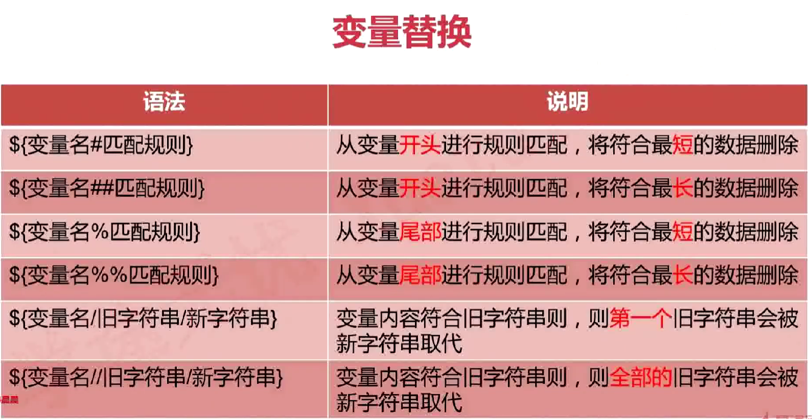

### 变量替换




```
[root@docker ~]# var1="i love you,do you love me?"
[root@docker ~]# echo $var1
i love you,do you love me? 

#最短匹配
[root@docker ~]# var2=${var1#*ov}
[root@docker ~]# echo $var2
e you,do you love me?
#最长匹配(贪婪匹配)
[root@docker ~]# var2=${var1##*ov}
[root@docker ~]# echo $var2
e me?

```

