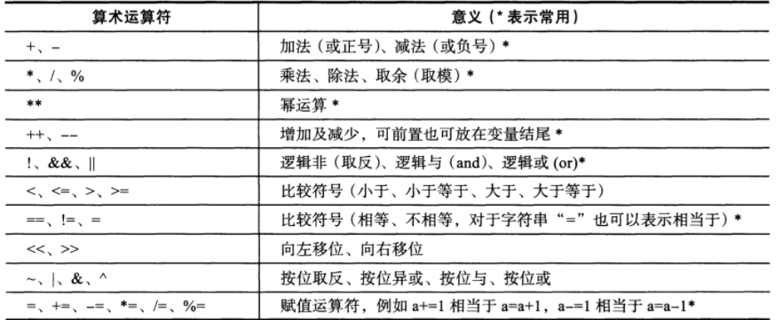
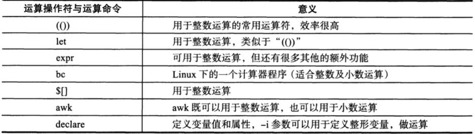
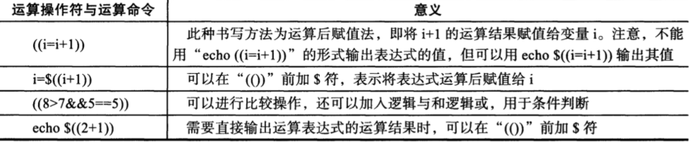
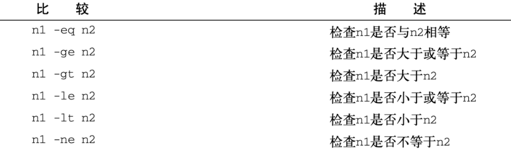
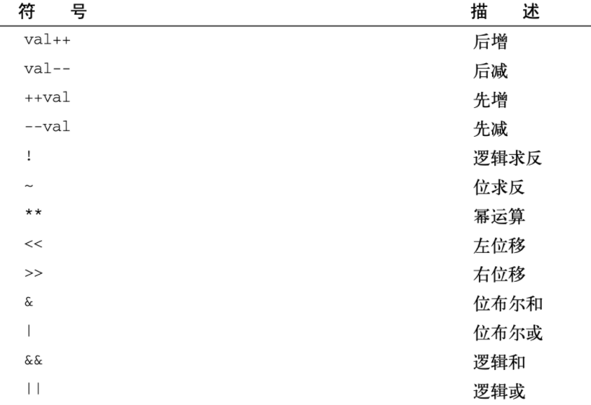

## shell基础知识

- shell在系统的作用
  - ctrl + alt + f1~f7切换终端
  - `echo $SHELL`，查看当前linux用的是哪一个版本的shell

- 编辑、执行命令
  - linux的命令是通过C语言开发的，例如`ls /opt`，看不到发生了什么，但是可以阅读bash源代码
  - linux命令提示符变量`$PS1`

- 找到命令的帮助信息
  - `help ls`
  - `man ls`
  - `info ls`

- 如何执行shell脚本

  - 前面登录Linux、都是执行交互的命令，最后exit退出系统

  - shell还可以通过非交互式操作，也就是脚本形式，从文件读取命令执行

    - `source hello.sh`

    - `. hello.sh`

    - `bash/sh hello.sh`

    - shell脚本就是一个文件，写入你想执行的命令，就能执行、以及添加注释

    - > 注意，通过bash 命令运行脚本，会开启一个子shell
      >
      > 然而source和点，是内置命令，不会产生子shell

    - 给脚本添加权限，使得像普通命令一样执行`chmod +x hello.sh`

    - vim编辑器

    - 远程执行服务器命令

      ```
      ssh root@192.168.11.12 free -m
      ```

## 文件操作

> linux下的文件、目录管理

> 查看目录、文件内容、统计行数、删除、移动、重命名等

```
ls
pwd
cd
tree
cat
head、tail
wc
touch
mkdir
rm
mv
ln
cp
权限chmod、chown

#重定向、管道符号

bash command 1> output 重定向标准输出完整写法

#例如，每次执行都会覆盖现有内容，这是shell语法，花括号，用分号隔开多个命令
	{date;df -h;uptime;} > cc.output

#因此需要重定向追加输出符 command 1 >> output 
	例如 echo "date" >> ./date.file
	
#标准输入 command < inputfile
 	cat < date.file 2021年 03月 01日 星期一 15:38:04 CST

#标准错误输出 常用对错误输出的处理 
 	command 1> standard.output 2>standard.error
 	
#管道符号 |
ss -tunlp |grep command1 | grep command2
```

## 常用echo

在shell脚本里，shell命令会有自己的输出，若是你想要自定义内容打印，以告知用户，当前脚本在做什么事。

可以通过echo命令来实现，注意`单引号`、`双引号`。

```
[root@redis scripts]# cat test01.sh 
#!/bin/bash
#Author:yzh
echo "aa"
[root@redis scripts]# sh test01.sh 
aa
```

### 使用变量与echo

脚本里，可以在环境变量名称前加上`$`来使用环境变量。

```
[root@redis scripts]# cat test01.sh 
#!/bin/bash
#Author:yzh
echo "$UID"
echo "$HOME"
echo "$USER"
[root@redis scripts]# bash test01.sh 
0
/root
root
```

### 转义符

当一些情况，我们不希望shell解析一些符号，可以使用`单引号`和`\`对符号不做解析。

```
[root@web01 ~]# echo "The cost of the item is \$15"
The cost of the item is $15
```

### 变量应用

```
[root@redis scripts]# cat test01.sh 
#!/bin/bash
#Author:yzh
day=4
guest="yuezenghui"
echo "$guest 在周$day 出去理发了"
[root@redis scripts]# sh test01.sh 
yuezenghui 在周4 出去理发了
```

变量被引用时会输出赋予给它的值，变量会在shell脚本退出后消失。

### 变量再赋值

变量每次被引用的时候，都会输出赋予的值，需要加上`$`符

```
[root@redis scripts]# cat test01.sh 
#!/bin/bash
#Author:yzh
day=4
day2=$day
guest="yuezenghui"
echo "$guest 在周$day2 出去理发了"
[root@redis scripts]# sh test01.sh 
yuezenghui 在周4 出去理发了

```

## 命令替换

有两个方式将命令输出赋予给变量

> 反引号 ``
>
> $() 格式

```
[root@redis scripts]# cat test01.sh 
#!/bin/bash
#Author:yzh
date=`date`
echo "$date"
[root@redis scripts]# sh test01.sh 
Thu Mar 10 01:30:21 CST 2022
```

$()和``用法一样

## 数值计算

> 算数运算符



> 运算符命令



## Shell if参数

```perl
shell 编程中使用到得if语句内判断参数
–b 当file存在并且是块文件时返回true
-c 当file存在并且是字符文件时返回true
-d 当pathname存在并且是一个目录时返回true
-e 当pathname指定的文件或目录存在时返回true
-f 当file存在并且是文件时返回true
-g 当由pathname指定的文件或目录存在并且设置了SGID位时返回为true
-h 当file存在并且是符号链接文件时返回true，该选项在一些老系统上无效
-k 当由pathname指定的文件或目录存在并且设置了“粘滞”位时返回true
-p 当file存在并且是命令管道时返回为true
-r 当由pathname指定的文件或目录存在并且可读时返回为true
-s 当file存在文件大小大于0时返回true
-u 当由pathname指定的文件或目录存在并且设置了SUID位时返回true
-w 当由pathname指定的文件或目录存在并且可执行时返回true。一个目录为了它的内容被访问必然是可执行的。
-o 当由pathname指定的文件或目录存在并且被子当前进程的有效用户ID所指定的用户拥有时返回true。

UNIX Shell 里面比较字符写法：
-eq 等于
-ne 不等于
-gt 大于
-lt 小于
-le 小于等于
-ge 大于等于
-z 空串
= 两个字符相等
!= 两个字符不等
-n 非空串
```

## 用于数值计算的命令

### (())

常用，双括号不支持浮点数，浮点数需要其他命令计算



```
[root@redis scripts]# echo $((1+1))
2
[root@redis scripts]# echo $((10-9))
1
[root@redis scripts]# echo $((10*9))
90
[root@redis scripts]# echo $((10/9))  取商
1
[root@redis scripts]# echo $((20%9))  取余
2


[root@redis scripts]# ((i=5))
[root@redis scripts]# ((i=i*i))
[root@redis scripts]# echo $i
25

```

> ++a 是先计算加一，然后赋值a
>
> a++ 是先对变量a操作，再加一

```
[root@redis scripts]# a=6
[root@redis scripts]# echo $((++a))
7

[root@redis scripts]# echo $((a++))
7
[root@redis scripts]# echo $a
8

```

### let命令

> let命令等同于双括号计算，`"((赋值表达式))"`
>
> 但是双括号效率更高

```
[root@redis scripts]# i=2
[root@redis scripts]# i=i+8
[root@redis scripts]# echo $i
i+8

[root@redis scripts]# i=2
[root@redis scripts]# let i=i+8
[root@redis scripts]# echo $i
10
```

### expr命令

expr命令允许在命令行处理数学表达式，简单的计算器命令

查看帮助

```bash
expr --help
```

参数间要有空格

```
[root@redis scripts]# expr 6 + 6
12

# 很多符号在shell里有特殊含义因此必须得转义使用
[root@redis scripts]# expr 5 \* 2
10

# 求长度
[root@redis scripts]# expr length jfkasjkfs
9

# 逻辑判断，必须加上引号
[root@redis scripts]# expr 6 '>' 3
1


[root@redis scripts]# expr 80 / 8
10

```

#### expr模式匹配

```
expr支持模式匹配，也就是如同正则的作用

有2个模式符号

: 冒号，计算字符串中的字符数

.* 任意字符串重复0次或多次

语法

统计字符串的字符个数

expr 字符串 : ".*"

# 统计yc.jpg字符个数
[root@redis ~]# expr yc.jpg ":"  ".*"
6

# 统计jpg后缀的文件，字符个数，找不到符合的就为0
# 无论jpg后面有多少个字符，只匹配到jpg这3个字符结尾
[root@redis ~]# expr yc.jpg   ":"  ".*\.jpg"
6
[root@redis ~]# expr yc.jpg123123   ":"  ".*\.jpg"
6
# 找不到的情况
[root@redis ~]# expr yc.jpwg123123   ":"  ".*\.jpg"
0

#案例expr判断文件名是否符合要求
[root@redis scripts]# cat expr1.sh
#!/bin/bash

if expr "$1" : ".*\.jpg" &> /dev/null
    then
        echo "This is jpg file"
else
    echo "这不是jpg文件"
fi

# 找出字符长度不大于6的单词
[root@redis scripts]# cat word_length.sh
#!/bin/bash
for str in I am yzh, I teach you to learn linux
do
    if [ `expr length $str` -le 6  ]
        then
            echo $str
    fi
done
```

### bc命令

bc命令可以当作计算器来用，当作命令行计算器用。

```
交互式计算
[root@redis scripts]# bc
bc 1.06.95
Copyright 1991-1994, 1997, 1998, 2000, 2004, 2006 Free Software Foundation, Inc.
This is free software with ABSOLUTELY NO WARRANTY.
For details type `warranty'. 
1+1
2

管道符计算
[root@redis scripts]# echo 2*10|bc
20

[root@redis scripts]# num=6
[root@redis scripts]# result=`echo $num+6|bc`
[root@redis scripts]# echo $result
12


#案例 一条命令，算出1～10的总和。
[root@redis scripts]# echo {1..10}|tr " " "+"|bc
55

[root@redis scripts]# echo $((`seq -s + 10`))
55

#xargs 又称管道命令，构造参数等。是给命令传递参数的一个过滤器,也是组合多个命令的一个工具 它把一个数据流分割为一些足够小的块,以方便过滤器和命令进行处理 。简单的说 就是把 其他命令的给它的数据 传递给它后面的命令作为参数
[root@redis scripts]# seq -s ' + ' 10 |xargs expr
55

```

> 整数的计算，用双小括号，let，expr,带有小数的计算，用bc

### awk数值计算

```
[root@redis scripts]# echo "2 10" |awk '{print ($1+$2)}'
12

```

### []

> $[表达式] 语法如此,加减乘除

```
[root@redis scripts]# echo $[2-1]
1
[root@redis scripts]# echo $[2+1]
3
[root@redis scripts]# echo $[2*1]
2
[root@redis scripts]# echo $[2/1]
2

```

## 读取用户输入read

shell变量除了直接赋值，或者脚本传参，还有就是read命令读取。

read也是内置命令。

> -p 设置提示信息
>
> -t 等待用户输入超时，timeout
>
> read -p "请输入: " vars

```
[root@redis scripts]# read -t 5 -p "5秒内输入密码：" pwd
5秒内输入密码：123
```

## shell逻辑控制

许多程序要求对于shell脚本可以进行逻辑流程控制，这类命令称之为`结构化命令（structured command）`

结构化命令允许你修改程序执行的顺序。

## if-then语句

语法

```
if command
then
    command
fi
```

bash的if语句会直接运行if后面的命令，如果该命令执行正确（状态码为0），处于then的命令就会被执行。否则就不会执行，或者执行其他逻辑的语句，最后到fi结束逻辑控制。

```
[root@redis scripts]# cat test01.sh 
#!/bin/bash
#Author:yzh
if pwd
then
    echo "it worked"
fi
[root@redis scripts]# sh test01.sh 
/root/scripts
it worked
```

## if-then-else语句

在这里，增加了一个逻辑的选择

```
if command
then 
    command
else
    command
fi

如果 ..
那么
    执行...
否则
    执行...
结束
```

```
[root@redis scripts]# cat test01.sh 
#!/bin/bash
#Author:yzh
testuser=someone
if grep $testuser /etc/passwd
then
    echo "the bash file for user $testuser are:"
    ls -a /home/$testuser/.b*
else
    echo "the use $testuser does not exist on this system."
fi
[root@redis scripts]# sh test01.sh 
the use someone does not exist on this system.

```

## elif

语法

```
if command1
then
    commands
elif command2
then
    more commands
fi


如果 ...
    那么
        执行..
又如果...
    那么
        执行...
结束
```

```
[root@redis scripts]# cat test01.sh 
#!/bin/bash
#Author:yzh
testuser=cccc
if grep $testuser /etc/passwd
then
    "The user $testuser exists on this system."
elif ls -d /home/$testuser
then
    echo "The user $testuser does not exist on this system."
    echo "However,$testuser has a directory."
fi
[root@redis scripts]# sh test01.sh 
ls: cannot access /home/cccc: No such file or directory

```

## test命令

```
test 命令最短的定义可能是评估一个表达式；如果条件为真，则返回一个 0 值。如果表达式不为真，则返回一个大于 0 的值 — 也可以将其称为假值。检查最后所执行命令的状态的最简便方法是使用 $? 值。

参数：

1. 关于某个文件名的『类型』侦测(存在与否)，如 test -e filename 

-e 该『文件名』是否存在？(常用) 
-f 该『文件名』是否为文件(file)？(常用) 
-d 该『文件名』是否为目录(directory)？(常用) 
-b 该『文件名』是否为一个 block device 装置？ 
-c 该『文件名』是否为一个 character device 装置？ 
-S 该『文件名』是否为一个 Socket 文件？ 
-p 该『文件名』是否为一个 FIFO (pipe) 文件？ 
-L 该『文件名』是否为一个连结档？ 

2. 关于文件的权限侦测，如 test -r filename 

-r 侦测该文件名是否具有『可读』的属性？ 
-w 侦测该文件名是否具有『可写』的属性？ 
-x 侦测该文件名是否具有『可执行』的属性？ 
-u 侦测该文件名是否具有『SUID』的属性？ 
-g 侦测该文件名是否具有『SGID』的属性？ 
-k 侦测该文件名是否具有『Sticky bit』的属性？ 
-s 侦测该文件名是否为『非空白文件』？ 

3. 两个文件之间的比较，如： test file1 -nt file2 

-nt (newer than)判断 file1 是否比 file2 新 
-ot (older than)判断 file1 是否比 file2 旧 
-ef 判断 file2 与 file2 是否为同一文件，可用在判断 hard link 的判定上。 主要意义在判定，两个文件是否均指向同一个 inode 哩！ 

4. 关于两个整数之间的判定，例如 test n1 -eq n2 

-eq 两数值相等 (equal) 
-ne 两数值不等 (not equal) 
-gt n1 大于 n2 (greater than) 
-lt n1 小于 n2 (less than) 
-ge n1 大于等于 n2 (greater than or equal) 
-le n1 小于等于 n2 (less than or equal) 

5. 判定字符串的数据 

test -z string 判定字符串是否为 0 ？若 string 为空字符串，则为 true 
test -n string 判定字符串是否非为 0 ？若 string 为空字符串，则为 false。
注： -n 亦可省略 
test str1 = str2 判定 str1 是否等于 str2 ，若相等，则回传 true 
test str1 != str2 判定 str1 是否不等于 str2 ，若相等，则回传 false 

6. 多重条件判定，例如： test -r filename -a -x filename 

-a (and)两状况同时成立！例如 test -r file -a -x file，则 file 同时具有 r 与 x 权限时，才回传 true。 
-o (or)两状况任何一个成立！例如 test -r file -o -x file，则 file 具有 r 或 x 权限时，就可回传 true。 
! 反相状态，如 test ! -x file ，当 file 不具有 x 时，回传 true
```

test命令对于shell脚本是重要的命令，提供了在`if-then`语句里测试不同条件的路径。

用法：条件为真，返回`0`，条件不成立，返回`大于0`的值。

```
1.判断文件存在
[root@web01 ~]# test hello.sh
[root@web01 ~]# echo $?
0

2.判断目录
[root@web01 ~]# test -d data
[root@web01 ~]# echo $?
0

3.测试可写权限
[root@web01 ~]# test -w hello.sh
[root@web01 ~]# echo $?
0

4.测试执行权限
[root@web01 ~]# test -x hello.sh
[root@web01 ~]#
[root@web01 ~]#
[root@web01 ~]# echo $?
1

5.测试文件是否有内容，有则0，无则1
[root@web01 ~]# cat hello.sh
#!/bin/bash
echo 'hello 真有意思'
[root@web01 ~]#
[root@web01 ~]# test -s hello.sh
[root@web01 ~]#
[root@web01 ~]# echo $?
0
```

结合控制语句

```
[root@redis scripts]# cat test01.sh 
#!/bin/bash
#Author:yzh
my_var="Full"
if test $my_var
then
    echo "The $my_var expression returns a True."
else
    echo "The $my_var expression returns a False."
fi
[root@redis scripts]# bash test01.sh 
The Full expression returns a True.

删除my_var变量，该脚本，就False了。
```

## 简洁的测试方法

bash提供了可以不用test命令的写法，进行判断

```
if [ 条件 ]
then
    commands
fi

在中括号里，写入测试条件。
```

### 数值比较

test命令常见用法是数值比较。



```
[root@redis scripts]# cat test01.sh 
#!/bin/bash
#Author:yzh
value1=10
value2=11
if [ $value1 -gt 5 ]
then
    echo "The test value $value1 is greater than 5"
fi
if [ $value1 -eq $value2 ]
then
    echo "The values are equal."
else
    echo "The values are different."
fi
[root@redis scripts]# bash test01.sh 
The test value 10 is greater than 5
The values are different.

```

!> bash只能处理整数

### -d

> -d 测试目录是否存在，在目录操作时，判断下是否存在是个好习惯。

```
[root@redis scripts]# cat test01.sh 
#!/bin/bash
#Author:yzh
dir=/home/yzh
if [ -d $dir ];then
    echo "the $dir exit."
    cd $dir
    ls
else
    echo "the $dir does not exist."
fi
[root@redis scripts]# bash test01.sh 
the /home/yzh does not exist.

```

## 符合条件测试

> [ 条件 ] && [ 条件2 ]
>
> [ 条件 ] || [ 条件2 ]
>
> 布尔运算符

```
[root@redis scripts]# cat test01.sh 
#!/bin/bash
#Author:yzh
if [ -d $HOME ] && [ -w $HOME/testing ]
then
    echo "The file exists and you can write to it."
else
    echo "I cannot wirte to the file."
fi
[root@redis scripts]# bash test01.sh 
I cannot wirte to the file.

# 对文件创建，修改权限测试
```

## 双括号特性

### 双小括号

bash支持双括号，写入高级数学表达式



```
# 可以在if语句里使用双括号，可以用在普通的命令。
[root@redis scripts]# cat test01.sh 
#!/bin/bash
#Author:yzh
val_01=10
if (( $val_01 ** 2 > 90 ))
then
    (( val_02 = $val_01**2  ))
    echo "the square of $val_01 is $val_02"
fi
[root@redis scripts]# bash test01.sh 
the square of 10 is 100

```

### 双方括号

双方括号提供了针对字符串的高级特性，模式匹配，正则表达式的匹配。

```
[root@redis scripts]# cat test01.sh 
#!/bin/bash
#Author:yzh
if [[ $USER == r*  ]]
then
    echo "hello $USER"
else
    echo "sorry,i do not know you."
fi
[root@redis scripts]# bash test01.sh 
hello root

```

在双中括号里，进行了`==`双等号，进行字符串匹配`r*`，也就找到了`root`。

## case语句

语法

```
case "变量" in 
值1)
    命令
    ;;
值2)
    命令2
    ;;
*)
    命令3
esac
```

```
[root@redis scripts]# cat test01.sh 
#!/bin/bash
#Author:yzh
case $1 in
    s|start)
        echo "start..."
        ;;
    stop)
        echo "stop..."
        ;;
    reload)
        echo "reload..."
        ;;
    *)
        echo "usage:$name{start|stop|reload}"
        exit 1
        ;;
esac
exit
```

有一个场景，在计算后，要进行多个组的值判断，用if来写

```
[root@redis scripts]# cat test01.sh 
#!/bin/bash
#Author:yzh
if [[ $USER = "root" ]]
then
    echo "Welcome $USER"
    echo "Please enjoy your visit"
elif [ $USER = "yzh" ]
then
    echo "Welcome $USER"
    echo "Please enjoy your visit"
elif [ $USER = "testing" ]
then
    echo "Special testing account"
elif [ $USER = "cc" ]
then
    echo "Do not forget to logout when you're done."
else
    echo "Sorry,you are not allowed here."
fi


[root@redis scripts]# bash test01.sh 
Welcome root
Please enjoy your visit

```

if可以完成，但是有点复杂了，用case实现一下

```
[root@redis scripts]# cat test01.sh 
#!/bin/bash
#Author:yzh
case $USER in
    root | yzh)
        echo "Welcome,$USER"
        echo "Please enjoy your visit"
        ;;
    cc)
        echo "Welcome cc"
        ;;
    enjoy)
        echo "Welcome yuchao"
        ;;
    *)
        echo "Sorry,you are not allowed here"
        ;;
esac
[root@redis scripts]# bash test01.sh 
Welcome,root
Please enjoy your visit

```

## for循环命令

for语句提供了重复一些过程的作用，也就是循环执行一组命令，直到某个特定条件结束。

```
#语法

for var in list
do 
    commands
done
```

for循环在list变量值里，反复迭代，第一次迭代，使用第一个值，第二次用第二个值，以此类推，直到所有元素都过一遍。

```
[root@redis scripts]# cat cycle.sh 
#!/bin/bash
#Author:yzh
for test in apple orange banana
do
    echo "the next is $test"
done
[root@redis scripts]# bash cycle.sh 
the next is apple
the next is orange
the next is banana
```

### for循环注意点：

想着是空格区分，循环出每个单词，这里shell被单引号给误导了，这里得进行转义。

```
[root@redis scripts]# cat cycle.sh 
#!/bin/bash
#Author:yzh
for test in I don't know if this'll word     <----------
do
    echo "word:$test"
done

[root@redis scripts]# bash cycle.sh 
word:I
word:dont know if thisll
word:word

```

解决方法：

- 转义符，双引号

```
# 转义符
[root@redis scripts]# cat cycle.sh 
#!/bin/bash
#Author:yzh
for test in I don\'t know if this\'ll word
do
    echo "word:$test"
done


# 双引号
[root@redis scripts]# cat cycle.sh 
#!/bin/bash
#Author:yzh
for test in I "don't" know if "this'll" word
do
    echo "word:$test"
done
```

for默认循环是以空格区分，如果你的数据包含了空格

```
[root@redis scripts]# cat cycle.sh 
#!/bin/bash
#Author:yzh
for test in china new york
do
    echo "now going to $test"
done
[root@redis scripts]# bash cycle.sh 
now going to china
now going to new
now going to york
```

解决方法：

- 双引号

```
[root@redis scripts]# cat cycle.sh 
#!/bin/bash
#Author:yzh
for test in china "new york"
do
    echo "now going to $test"
done
```

### 从变量遍历

```
[root@redis scripts]# cat cycle.sh 
#!/bin/bash
#Author:yzh
list="apple orange banana"
for state in $list
do
    echo "hello $state"
done
[root@redis scripts]# bash cycle.sh 
hello apple
hello orange
hello banana
```

### 从文件里遍历

```
[root@redis scripts]# cat friuts.txt 
apple
banana
orange

[root@redis scripts]# cat cycle.sh 
#!/bin/bash
#Author:yzh

file="/root/scripts/friuts.txt"

for state in $(cat $file)
do
    echo "hello $state"
done

[root@redis scripts]# bash cycle.sh 
hello apple
hello banana
hello orange

```

### 通配符遍历

可以使用for命令自动遍历目录中的文件，得使用`通配符`支持匹配。

**遍历判断文件/目录**

```
[root@redis scripts]# cat cycle.sh 
#!/bin/bash
#Author:yzh

for file in /root/*
do
    if [ -d "$file" ];then
        echo "$file is a directory"
    elif [ -f "$file" ];then
        echo "$file is a file"
    fi
done

[root@redis scripts]# bash cycle.sh 
/root/1 is a file
/root/anaconda-ks.cfg is a file
/root/scripts is a directory


# 遍历多个目录
[root@redis scripts]# cat cycle.sh 
#!/bin/bash
#Author:yzh

for file in /root/* /tmp/*
do
    if [ -d "$file" ];then
        echo "$file is a directory"
    elif [ -f "$file" ];then
        echo "$file is a file"
    fi
done
```

for循环在/root目录下挨个遍历，因为`*`就已经匹配了所有的内容，然后`-d`参数进行判断目录，`-f`参数判断文件。

## While循环

## While循环

while循环命令可以理解是`if-then`和`for`循环的组合体。

```
语法
while test command
do
    other command
done
```

while语句的`test command`和`if-then`语句格式一样，可以使用任何的普通bash shell命令。

注意的是while的`test command`的退出状态码，必须随着循环里的命令改变，否则状态码如果不变化，循环会不停止的继续下去。

```
[root@redis scripts]# cat cycle.sh 
#!/bin/bash
#Author:yzh
var1=10
while [ $var1 -gt 0 ]
do
    echo $var1
    var1=$[ $var1 -1 ]
done

[root@redis scripts]# bash cycle.sh 
10
9
8
7
6
5
4
3
2
1
```

只要条件成立，while命令就会不断的循环下去，直到条件不成立，结束循环。

### while多个测试命令

while可以写入多个测试命令，只有最后一个测试命令的退出状态码会被决定是否退出循环。

```
#注意写法，换行，多个测试命令要单独的出现在一行,这里是先显示var1变量的值，第二个测试是方括号里判断var1是否大于0,在循环体内部，先打印消息，然后进行变量计算。

[root@redis scripts]# cat cycle.sh 
#!/bin/bash
#Author:yzh
var1=10
while echo $var1
    [ $var1 -ge 0 ]
do
    echo "this is inside the loop"
    var1=$[ $var1 -1 ]
done


[root@redis scripts]# bash cycle.sh 
10
this is inside the loop
9
this is inside the loop
8
this is inside the loop
7
this is inside the loop
6
this is inside the loop
5
this is inside the loop
4
this is inside the loop
3
this is inside the loop
2
this is inside the loop
1
this is inside the loop
0
this is inside the loop
-1

```

## 嵌套循环

也就是在循环体内，再写上循环语句命令，使用嵌套循环要小心了

### C语言风格for循环

```
[root@redis scripts]# cat cycle.sh 
#!/bin/bash
#Author:yzh

for (( i=1;i<=10;i++ ))
do
    echo "the next number is $i"
done

[root@redis scripts]# bash cycle.sh 
the next number is 1
the next number is 2
the next number is 3
the next number is 4
the next number is 5
the next number is 6
the next number is 7
the next number is 8
the next number is 9
the next number is 10
```

### for使用多个变量

C语言风格的for循环允许迭代多个变量，循环会单独的处理每个变量，可以为每个变量定义不同的迭代过程。

```
[root@redis scripts]# cat cycle.sh 
#!/bin/bash
#Author:yzh

for (( a=1,b=10;a<=10;a++,b-- ))
do
    echo "$a - $b"
done

[root@redis scripts]# bash cycle.sh 
1 - 10
2 - 9
3 - 8
4 - 7
5 - 6
6 - 5
7 - 4
8 - 3
9 - 2
10 - 1

```

每次迭代，a在增加的同时，减小了b变量。

### **嵌套循环案例**

```
[root@redis scripts]# cat cycle.sh 
#!/bin/bash
#Author:yzh

for (( a = 1;a <=3;a++ ))
do
    echo "Starting loop $a:"
    for (( b = 1; b <=3; b++ ))
    do
        echo "    Inside loop:$b"
    done
done

[root@redis scripts]# bash cycle.sh 
Starting loop 1:
    Inside loop:1
    Inside loop:2
    Inside loop:3
Starting loop 2:
    Inside loop:1
    Inside loop:2
    Inside loop:3
Starting loop 3:
    Inside loop:1
    Inside loop:2
    Inside loop:3

```

### 九九乘法表

```
[root@redis scripts]# cat cycle.sh 
#!/bin/bash
#Author:yzh

for ((a=1;a<=9;a++))
do
    for ((b=1;b<=9;b++))
    do
        if [[ a -ge b ]];then
            echo -e -n "$b * $a = $[a*b]\t"
        fi
    done
    echo " "
done

```

## 循环处理文件数据

遍历读取文件内的数据

- 嵌套循环
- 修改IFS环境变量

修改IFS环境变量，是因为文件里的数据都是单独的每一行

### IFS字段分隔符

IFS是一个特殊的环境变量，叫做内部字段分隔符，IFS环境变量定义了bash shell用作字段分隔符的一系列字符，bash shell将如下字段当作分隔符

- 空格
- 制表符
- 换行符

案例

```
[root@redis shell]# cat test.sh
#!/bin/bash

IFS.OLD=$IFS
IFS=$'\n'
for entry in $(cat /etc/passwd)
do
    echo "Value in $entry ."
    IFS=:
    for value in $entry
    do
        echo "    $value"
    done
done
```

这里修改了两个不同的IFS变量，来进行解析文件数据

- 第一个IFS=$'\n'，用于解析文件的每一行
- 第二个IFS=: ，是修改IFS的值为冒号，然后解析每一行单独的值。

## 控制循环

- break
- continue

break用于强制退出任意类型的循环。

```
[root@redis shell]# cat test.sh
#!/bin/bash
for var1 in `seq 10`
do
    if [ $var1 -eq 5 ]
    then
        break
    fi
    echo "Iteration number: $var1"
done
echo "The for loop is completed"

[root@chaogelinux shell]# bash test.sh
Iteration number: 1
Iteration number: 2
Iteration number: 3
Iteration number: 4
The for loop is completed
```

break也适用于while，untile循环。

### 终止内部循环break

跳出多个循环时，break会自动终止你在的最内层循环。

```
[root@chaogelinux shell]# cat test.sh
#!/bin/bash

for (( a = 1; a < 4 ; a++ ))
do
    echo "Outer loop: $a"
    for (( b = 1; b < 100; b++ ))
    do
        if [ $b -eq 5 ]
        then
            break
        fi
        echo "    Inner loop: $b"
    done
done


[root@chaogelinux shell]# bash test.sh
Outer loop: 1
    Inner loop: 1
    Inner loop: 2
    Inner loop: 3
    Inner loop: 4
Outer loop: 2
    Inner loop: 1
    Inner loop: 2
    Inner loop: 3
    Inner loop: 4
Outer loop: 3
    Inner loop: 1
    Inner loop: 2
    Inner loop: 3
    Inner loop: 4
```

外层循环是执行结束了，内部循环到了5立即结束了。

### 终止外层循环break

语法

```
break n 
n表示跳出的循环层级，默认是1，下一层就是2
```

案例

```
[root@redis shell]# cat test.sh
#!/bin/bash

for (( a = 1; a < 4; a++ ))
do
    echo "Outer loop: $a"
    for (( b = 1;b < 100; b++ ))
    do
        if [ $b -gt 4 ]
        then
            break 2
        fi
        echo "    Inner loop: $b"
    done
done

[root@reids shell]# bash test.sh
Outer loop: 1
    Inner loop: 1
    Inner loop: 2
    Inner loop: 3
    Inner loop: 4
```

当内层`$b`等于4的时候，立即停止外层，也就结束了。

### continue

continue用于跳过某次循环，当条件满足时，然后继续循环。

```
[root@reids shell]# cat test.sh
#!/bin/bash

for (( var1 = 1;var1<15;var1++ ))
do
    if [ $var1 -gt 5 ] && [ $var1 -lt 10 ]
    then
        continue
    fi
    echo "Iteration number: $var1"
done


[root@redis shell]# bash test.sh
Iteration number: 1
Iteration number: 2
Iteration number: 3
Iteration number: 4
Iteration number: 5
Iteration number: 10
Iteration number: 11
Iteration number: 12
Iteration number: 13
Iteration number: 14
```

当条件是大于5且小于10的时候，shell会执行continue命令，跳过此阶段的循环条件。

## 处理循环的输出

在shell脚本里，循环输出后的结果，可以进行重定向输出

```
[root@redis shell]# cat test.sh
#!/bin/bash

for (( a = 1;a<10;a++ ))
do
    echo "The number is $a"
done > test.txt
echo "Finished"


[root@redis shell]# bash test.sh
Finished

[root@redis shell]# cat test.txt
The number is 1
The number is 2
The number is 3
The number is 4
The number is 5
The number is 6
The number is 7
The number is 8
The number is 9
```

## 函数

函数的作用与在于，当你需要重复的使用一段代码，如果是一小段代码重复还好，若是大段重复代码就太麻烦了。函数就可以解决这个问题。

函数是定义一个代码块，且命名，然后可以在脚本里任何位置调用。

### 创建函数

```
创建函数语法
function name {
    commands
}

name(){
	commands
}
```

```
[root@redis scripts]# cat fun1.sh 
#!/bin/bash
#Author:yzh
func1(){
    echo "这是个函数块"
}
count=1
while [ $count -le 5 ]
do
    func1
    count=$[ $count + 1 ]
done
echo "这是函数外的数据"

func1

[root@redis scripts]# bash fun1.sh 
这是个函数块
这是个函数块
这是个函数块
这是个函数块
这是个函数块
这是函数外的数据
这是个函数块

```

每次应用函数名`func1`，shell就会执行func1里定义好的命令。

### 返回值

```
[root@redis scripts]# cat fun1.sh 
#!/bin/bash
#Author:yzh
func1(){
    echo "这是个函数块"
    ls -l /tmp
}

echo "这个函数是："
func1
echo "这个函数的返回值是:$?"

[root@redis scripts]# bash fun1.sh 
这个函数是：
这是个函数块
total 4
-rwx------. 1 root root 836 Mar  6 01:49 ks-script-MpgfkS
-rw-------. 1 root root   0 Mar  6 01:45 yum.log
这个函数的返回值是:0

```

### 函数使用return

**使用$?**

函数可以用return命令来制定特定的退出状态码。

```
[root@redis scripts]# cat fun1.sh 
#!/bin/bash
#Author:yzh

func(){
    read -p "请输入数据1：" value
    read -p "请输入数据2：" value2
    return $(($value*$value2))
}

func
echo "这个函数的返回值是 $?"


[root@redis scripts]# bash fun1.sh 
请输入数据1：12
请输入数据2：22
这个函数的返回值是 8

```

- 函数结束后会立即取返回值
- 退出状态码在0~255

如果在提取函数返回值之前执行了其他的命令，函数的返回值会丢失。

```
[root@redis scripts]# cat fun1.sh 
#!/bin/bash
#Author:yzh

func(){
    read -p "请输入数据1：" value
    read -p "请输入数据2：" value2
    return $(($value*$value2))
}

func
ls /tmp
echo "这个函数的返回值是 $?"


[root@redis scripts]# bash fun1.sh 
请输入数据1：10
请输入数据2：10
ks-script-MpgfkS  yum.log
这个函数的返回值是 0
```

!> `$?`取得的是脚本最后一条命令的状态码。

还有就是超出0~255的范围。

### 使用返回值变量

```
[root@redis scripts]# cat test.sh 
#!/bin/bash
#Author:yzh

db1(){
    read -p "请输入:" value
    echo $[ $value * 2 ]
}

result=$(db1)
echo "这个新的值是$result"
[root@redis scripts]# bash test.sh
请输入:10
这个新的值是20
```

## 函数中处理变量

作用域指的就是变量可见的区域，函数里定义的变量和普通变量作用域不同，函数里的变量属于是局部的。

函数可以使用两种变量

- 全局变量
- 局部变量

### 全局变量

全局变量是在整个shell脚本里都有效的变量。可以在函数哪读取全局变量的值。

默认情况下，脚本里定义的任何变量都是全局变量，只要不是写在函数体内。

```
[root@redis scripts]# cat test.sh
#!/bin/bash

db1() {
    value=$[ $value * 2 ]
}
read -p "Enter a value: " value
db1
echo "The new value is : $value"

[root@redis scripts]# bash test.sh
Enter a value: 9
The new value is : 18
```

这里即使value是在函数外赋值，在db1函数执行后，也会计算value值，重新赋值。

### 局部变量

无需在函数中使用全局变量，函数内部使用的任何变量都可以被声明为局部变量，为了实现这一点，只需要加上local关键字即可。

local关键字保证了变量局限在函数中，即使函数外也有同名的变量，shell也会保持该变量的值是分离的。

```
[root@redis scripts]# cat test.sh
#!/bin/bash
func1(){
    local temp=$[ $value + 5 ]
    result=$[ $temp * 2 ]
}
temp=4
value=6
func1
echo "The result is $result"
if [ $temp -gt $value ]
then
    echo "temp is larger"
else
    echo "temp is smaller"
fi

[root@redis scripts]# bash test.sh
The result is 22
temp is smaller
```

