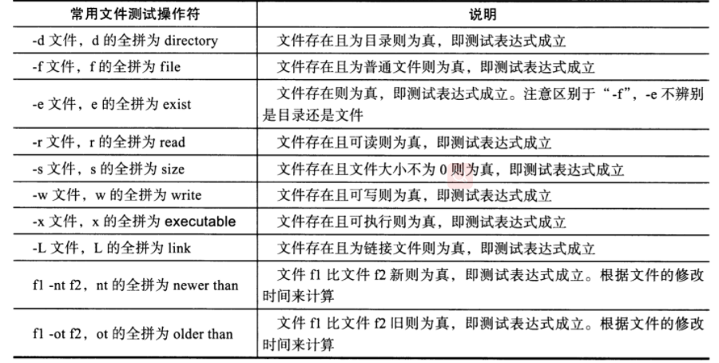
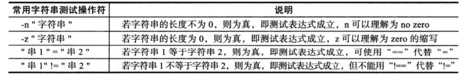
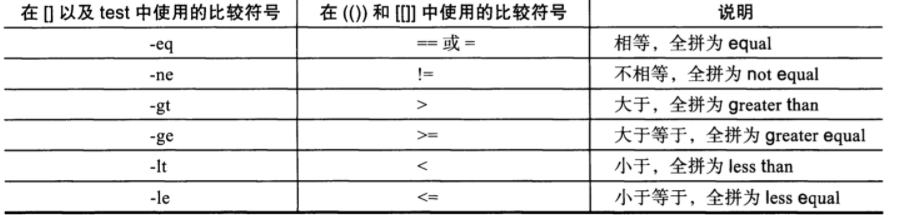
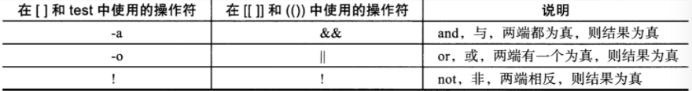

## test条件测试

> test 命令最短的定义可能是评估一个表达式；
>
> 如果条件为真，则返回一个 0 值。
>
> 如果表达式不为真，则返回一个大于 0 的值 — 也可以将其称为假值。
>
> 检查最后所执行命令的状态的最简便方法是使用 $? 值。

**语法**

```
语法
. 关于某个文件名的『类型』侦测(存在与否)，如 test -e filename 

-e 该『文件名』是否存在？(常用) 
-f 该『文件名』是否为文件(file)？(常用) 
-d 该『文件名』是否为目录(directory)？(常用) 
-b 该『文件名』是否为一个 block device 装置
-c 该『文件名』是否为一个 character device 装置？ 
-S 该『文件名』是否为一个 Socket 文件？ 
-p 该『文件名』是否为一个 FIFO (pipe) 文件？ 
-L 该『文件名』是否为一个连结档？ 

2. 关于文件的权限侦测，如 test -r filename 

-r 侦测该文件名是否具有『可读』的属性？ 
-w 侦测该文件名是否具有『可写』的属性？ 
-x 侦测该文件名是否具有『可执行』的属性？ 
-u 侦测该文件名是否具有『SUID』的属性？ 
-g 侦测该文件名是否具有『SGID』的属性？ 
-k 侦测该文件名是否具有『Sticky bit』的属性？ 
-s 侦测该文件名是否为『非空白文件』？ 

3. 两个文件之间的比较，如： test file1 -nt file2 

-nt (newer than)判断 file1 是否比 file2 新 
-ot (older than)判断 file1 是否比 file2 旧 
-ef 判断 file2 与 file2 是否为同一文件，可用在判断 hard link 的判定上。 主要意义在判定，两个文件是否均指向同一个 inode 哩！ 

4. 关于两个整数之间的判定，例如 test n1 -eq n2 

-eq 两数值相等 (equal) 
-ne 两数值不等 (not equal) 
-gt n1 大于 n2 (greater than) 
-lt n1 小于 n2 (less than) 
-ge n1 大于等于 n2 (greater than or equal) 
-le n1 小于等于 n2 (less than or equal) 

5. 判定字符串的数据 

test -z string 判定字符串是否为 0 ？若 string 为空字符串，则为 true 
test -n string 判定字符串是否非为 0 ？若 string 为空字符串，则为 false。
注： -n 亦可省略 
test str1 = str2 判定 str1 是否等于 str2 ，若相等，则回传 true 
test str1 != str2 判定 str1 是否不等于 str2 ，若相等，则回传 false 

6. 多重条件判定，例如： test -r filename -a -x filename 

-a (and)两状况同时成立！例如 test -r file -a -x file，则 file 同时具有 r 与 x 权限时，才回传 true。 
-o (or)两状况任何一个成立！例如 test -r file -o -x file，则 file 具有 r 或 x 权限时，就可回传 true。 
! 反相状态，如 test ! -x file ，当 file 不具有 x 时，回传 true
```

### 案例

-f 是否是普通文件类型

```
[root@redis scripts]# test -f str1
[root@redis scripts]# echo $?
1

# && 并且，|| 否则
[root@redis scripts]# test -f friuts.txt && echo ok || echo no
ok
```

-z 字符串长度是否为0

```
[root@redis scripts]# test -z "" && echo ok || echo no
ok
```

### 中括号测试[ ]

> 这个和test作用一样，相对来说用的多一些

```
[root@redis scripts]# [ -f aa ] && echo ok || echo no
no
```

利用-f创建文件

```
[root@redis scripts]# [ -f shell.sh ] && echo "已经存在了"||touch shell.sh
```

-d 测试目录

```
[root@redis /]# [ -d home ] && echo ok || echo no
ok
```

### 双中括号 [[ ]]

```
[root@redis /]# [[ -f text.txt ]] || echo "不存在"
不存在
```

## 文件测试表达式

运维写脚本，为了更高的严谨性，需要对文件操作测试。



-e 无论是文件，目录，是否存在

```
[ -e apple ] && echo "已存在" || echo "不存在"
```

-d 目录测试

```
 [ -d apple ] && echo "已存在" || echo "不存在"
```

-r 文件可读属性测试(注意别用root，特殊) -w 测试可写属性

```
[ -r hello.sh ] && echo "可读" || echo "没阅读权限"
```

### 变量测试

```
[ -f $file1 ] && echo ok || echo no
```

### 测试变量的特殊写法

对变量测试，必须加上双引号

```
[ -f "$test" ] && echo ok || echo no
```

## 字符串测试

字符串是运维日常操作的数据类型，在脚本开发里用的也很多，例如判断两个字符串是否相等，字符串是否为空等



-n 判断字符串长度，有内容就真，没内容就假

```
[ -n "yzh" ] && echo ok || echo no

[ -n " " ] && echo ok || echo no

# 求长度
[root@redis /]# expr length abc
3
```

-z 和-n反过来的，只要为空，就为真，反之为假

```
name="666"
 [ -z "$name" ] && echo ok || echo no
```

变量是否相等

```
[root@redis /]# [ "a" = "aa" ] && echo ok || echo no
no
```

## 整数比较符测试

在脚本开发中，会用到对数值的比较判断，也就是常见的大于，小于，等于之类



> 语法注意：在中括号里，数值条件测试，大于，小于号，需要用转义符号
>
> 1.在中括号，以及test的用法

中括号(常用)

```
[root@redis /]# [ 2 \> 1 ] && echo yes || echo no
yes

[root@redis /]# [ 2 -gt 1 ] && echo yes|| echo no
yes
```

双中括号

```
[root@redis /]# [[ 6 > 5 ]] && echo ok || echo no
ok
[root@redis /]# [[ 6 -gt 5 ]] && echo ok || echo no
ok
```

双小括号(不能使用 -gt -lt的符号)

```
[root@redis /]# ((10>5)) && echo ok || echo no
ok
[root@redis /]# ((3 == 2)) && echo ok || echo no
no
```

- 注意语法，[]和test为一类，可以用`-gt -lt 以及< > !=等符号`
- 而 ` (())`，不能用 `-gt -lt`这样的符号

## 逻辑操作符

真或假



中括号

```
[root@redis /]# [ -f "$file1" -a -f "$file2"  ] && echo "都是普通文件，条件成立" || echo "不成立"
不成立

[root@redis /]# [ -f "$file11"  -o -f "$file22"  ] && echo "都是普通文件，条件成立" || echo "不成立"
不成立
```

双中括号

-n 判断字符串是否为空，有内容则真

```
# 条件，a不为空，且a等于b
[[ -n "$a" && "$a" = "$b"  ]] && echo yes || echo no
```

## 逻辑操作脚本开发

### 输入判断脚本

```
[root@redis scripts]# cat and_or_test.sh 
#!/bin/bash
#Author:yzh
read -p "请输入一个数字:" var1

[ "$var1" -eq "1" ] &&{
echo $var1
exit 0
}

[ "$var1" -eq "1" ] &&{
echo $var1
exit 0
}

[ "$var1" != "2" -a "$var1" != "1" ] &&{
    echo "输入错误"
    exit 1
}

[root@redis scripts]# bash and_or_test.sh 
请输入一个数字:1
1
[root@redis scripts]# bash and_or_test.sh 
请输入一个数字:2
[root@redis scripts]# bash and_or_test.sh 
请输入一个数字:3
输入错误
```

### 安装脚本开发

