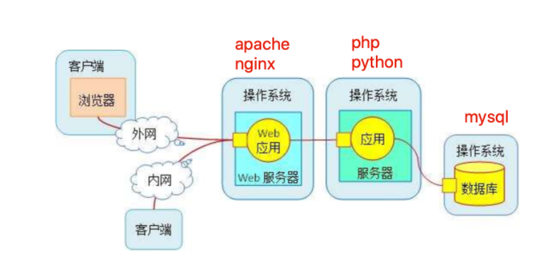
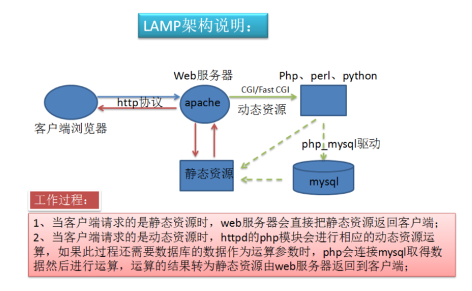
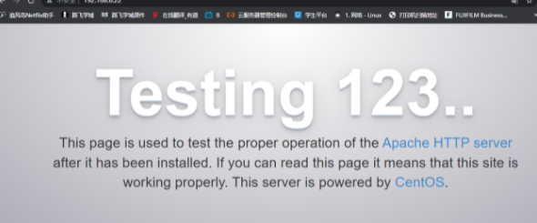
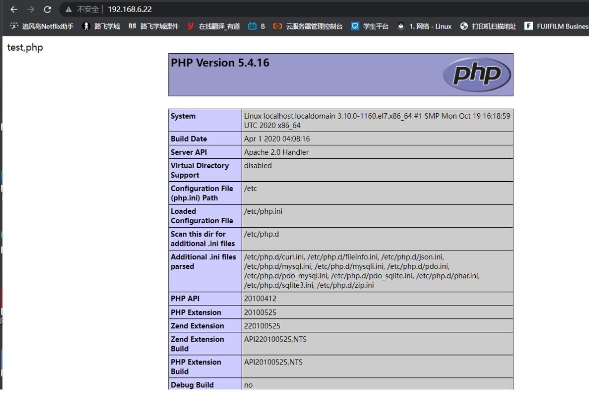
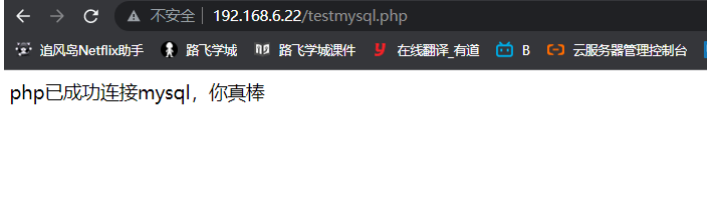
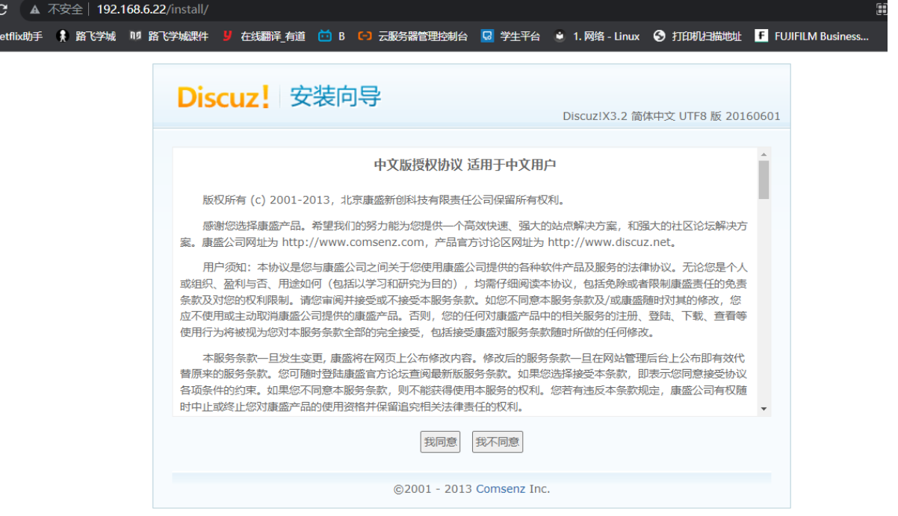
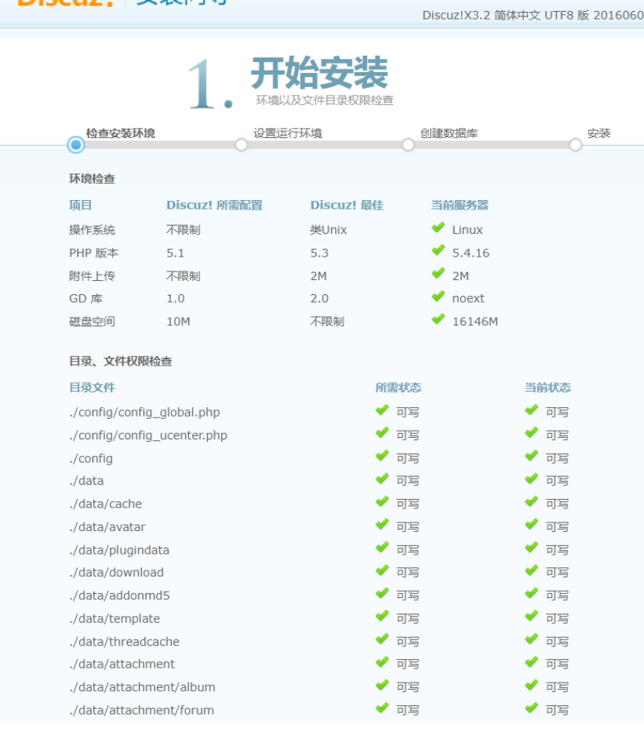
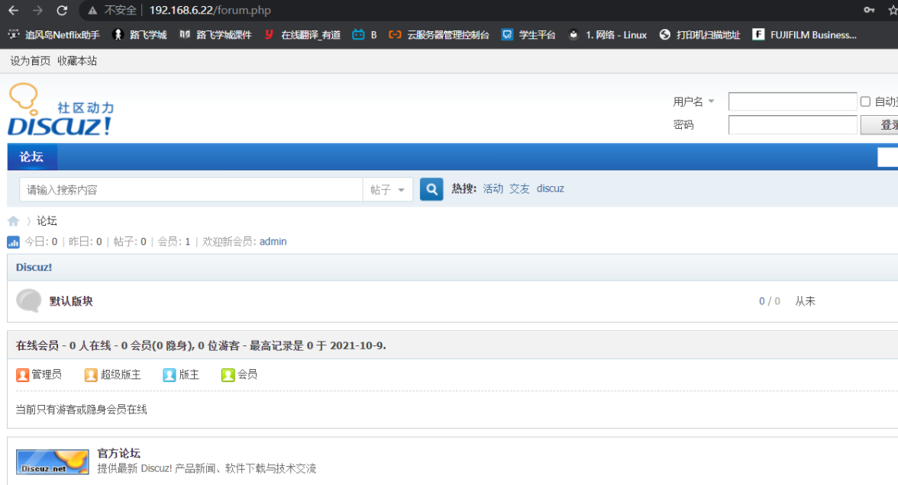

## 什么是LAMP

LAMP是公认的最常见、最古老的黄金Web技术栈、

`Linux `

`Apache ` 

`Mysql/Mariadb`

`Perl/Php/Python`


## LAMP架构

 LAMP（Linux-Apache-MySQL-PHP）网站架构是目前国际流行的Web框架，该框架包括：Linux操作系统，Apache网络服务器，MySQL数据库，Perl、PHP或者Python编程语言，所有组成产品均是开源软件，是国际上成熟的架构框架，很多流行的商业应用都是采取这个架构，LAMP具有通用、跨平台、高性能、低价格的优势，因此LAMP无论是性能、质量还是价格都是企业搭建网站的首选平台。

LAMP是一个多C/S架构的平台，最初级为web客户端(浏览器)基于TCP/IP通过http协议发起传送，这个请求可能是动态的，也可能是静态的。

 所以web服务器通过发起请求的后缀来判断，如果是静态的资源就由web服务器自行处理，然后将资源发给客户端。如果是动态这时web服务器会通过CGI（Common Gateway interface）协议发起给php。

 这里但是如果php是以模块形式与Web服务器联系，（安装在同一台服务器）那么他们是通过内部共享内存的方式。

 如果是php单独的放置与一台服务器，那么他们是通过sockets套接字监听的方式通信（安装在不同的服务器上，远程通信，这又是一个C/S架构）。

 这时php会相应的执行一段程序，如果在执行程序时，需要用到数据。

那么php就会通过mysql协议发送给mysql服务器（也可以看作是一个C/S架构）。由mysql服务器处理，将数据供给php程序。

> 流程解析



1.用户通过浏览器发送http请求，到达`web服务器（apache或nginx）`

2.web服务器解析用户请求信息，明确他到底要什么，如果是`静态资源请求`，直接通过linux内核读取硬盘上的数据，然后构建响应报文，给与用户。如果`是动态资源请求`，则转发请求给`应用服务器（php,python）`，由php解析动态请求，解析完毕后，返回给apache，发给用户

3.如果涉及数据库操作，利用`php-mysql`驱动，获取数据库数据，再返回给php，最终给与用户



### 搭建LAMP

#### 部署linux系统环境

##### 关闭防火墙、selinux

```
[root@localhost ~]# iptables -F
[root@localhost ~]# systemctl stop firewalld
[root@localhost ~]# systemctl disable firewalld
[root@localhost ~]# getenforce
Disabled
```

##### 部署apache

```
1.安装apache
yum install httpd -y
2.启动httpd服务并且查看运行状态
[root@localhost ~]# systemctl start httpd
[root@localhost ~]# systemctl status httpd
● httpd.service - The Apache HTTP Server
   Loaded: loaded (/usr/lib/systemd/system/httpd.service; disabled; vendor preset: disabled)
   Active: active (running) since Sat 2021-10-09 13:35:23 CST; 14s ago
     Docs: man:httpd(8)
           man:apachectl(8)
3.查看80端口是否开启
[root@localhost ~]# netstat -tunlp | grep 80
tcp6       0      0 :::80                   :::*                    LISTEN      4542/httpd
4.查看apache进程是否存在
[root@localhost ~]# ps -ef|grep httpd
root       4542      1  0 13:35 ?        00:00:00 /usr/sbin/httpd -DFOREGROUND
apache     4543   4542  0 13:35 ?        00:00:00 /usr/sbin/httpd -DFOREGROUND
apache     4544   4542  0 13:35 ?        00:00:00 /usr/sbin/httpd -DFOREGROUND
apache     4545   4542  0 13:35 ?        00:00:00 /usr/sbin/httpd -DFOREGROUND
apache     4546   4542  0 13:35 ?        00:00:00 /usr/sbin/httpd -DFOREGROUND
apache     4547   4542  0 13:35 ?        00:00:00 /usr/sbin/httpd -DFOREGROUND
root       4553   4453  0 13:39 pts/0    00:00:00 grep --color=auto httpd

```

##### 测试apaceh访问

```
192.168.6.22
```



##### 部署mysql

```
1.安装mysql
yum install mariadb-server mariadb 
2.启动mysql
systemctl start mariadb
3.检查mariadb数据文件夹，存在mysql.sock文件表示启动
[root@localhost ~]# ls -l /var/lib/mysql/
total 37852
-rw-rw---- 1 mysql mysql    16384 Oct  9 14:36 aria_log.00000001
-rw-rw---- 1 mysql mysql       52 Oct  9 14:36 aria_log_control
-rw-rw---- 1 mysql mysql 18874368 Oct  9 14:36 ibdata1
-rw-rw---- 1 mysql mysql  5242880 Oct  9 14:36 ib_logfile0
-rw-rw---- 1 mysql mysql  5242880 Oct  9 14:36 ib_logfile1
drwx------ 2 mysql mysql     4096 Oct  9 14:36 mysql
srwxrwxrwx 1 mysql mysql        0 Oct  9 14:36 mysql.sock
drwx------ 2 mysql mysql     4096 Oct  9 14:36 performance_schema
drwx------ 2 mysql mysql        6 Oct  9 14:36 test
4.设置密码并且登录数据库
[root@localhost ~]# mysqladmin -uroot password "1234"
[root@localhost ~]# mysql -uroot -p
Enter password: 
Welcome to the MariaDB monitor.  Commands end with ; or \g.
Your MariaDB connection id is 4
Server version: 5.5.68-MariaDB MariaDB Server

Copyright (c) 2000, 2018, Oracle, MariaDB Corporation Ab and others.

Type 'help;' or '\h' for help. Type '\c' to clear the current input statement.

MariaDB [(none)]> show databases;
+--------------------+
| Database           |
+--------------------+
| information_schema |
| mysql              |
| performance_schema |
| test               |
+--------------------+
4 rows in set (0.00 sec)
```

##### 部署php

```
1.安装php依赖环境
  yum install -y zlib-devel libxml2-devel libjpeg-devel libjpeg-turbo-devel libiconv-devel freetype-devel libpng-devel gd-devel libcurl-devel libxslt-devel libtool-ltdl-devel pcre pcre-devel apr apr-devel zlib-devel gcc make -y
2.安装php，以及php连接mysql数据库的驱动
[root@localhost ~]#  yum install php php-fpm php-mysql -y
3.修改apache配置文件 ，支持php
vim /etc/httpd/conf/httpd.conf

DocumentRoot "/var/www/html"
 TypesConfig /etc/mime.types
  AddType application/x-httpd-php  .php
  AddType application/x-httpd-php-source  .phps
  DirectoryIndex  index.php index.html
4.修改首页文件内容
vim /var/www/html/index.php

<meta charset=utf8>
test,php
<?php
phpinfo();
?>
5.启动php进程
systemctl start php-fpm
6.重启httpd服务
systemctl restart httpd
```

##### 测试访问php部署页面

```
192.168.6.22
```



##### 测试php链接mysql

```
[root@localhost html]# vim /var/www/html/testmysql.php
[root@localhost html]# cat /var/www/html/testmysql.php 
<?php
     $conn = mysql_connect('localhost','root','1234');
 if ($conn)
   echo "php已成功连接mysql，你真棒";
 else
   echo "你咋回事，这都搞不定，细心检查下吧";
 mysql_close();
?>

```

##### 访问php脚本文件，测试是否成功



##### Discuz论坛搭建

```
1.创建论坛站点目录
mkdir -p /opt/discuz
cd /opt/discuz
2.下载discuz源码包
[root@localhost discuz]# wget http://download.comsenz.com/DiscuzX/3.2/Discuz_X3.2_SC_UTF8.zip
3.解压缩源代码
[root@localhost discuz]# unzip Discuz_X3.2_SC_UTF8.zip 
[root@localhost discuz]# ll
total 12200
-rw-r--r--  1 root root 12486773 Apr  8  2020 Discuz_X3.2_SC_UTF8.zip
drwxr-xr-x  2 root root      102 May 31  2016 readme
drwxr-xr-x 12 root root     4096 May 31  2016 upload
drwxr-xr-x  4 root root       72 May 31  2016 utility
4.给与最高权限，便于实验
chmod -R 755 /opt/discuz/*
5.移动upload文件到apache目录下
mv upload/* /var/www/html/
```

访问apache首页，查看是否进入论坛安装页面

```
http://192.168.6.22/install/
```



```
把所有目录文件提权，便于安装
chmod -R 777 /var/www/html/*
```




安装完成，可以访问discuz论坛

