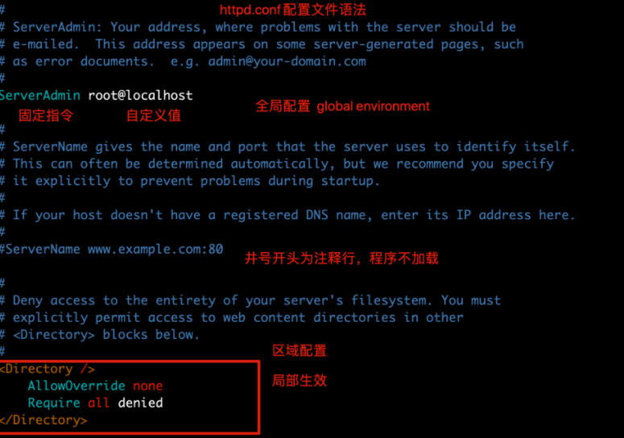
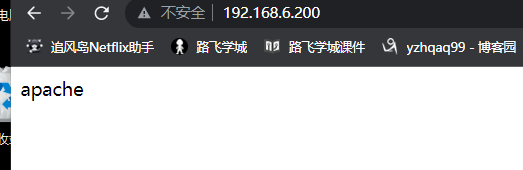
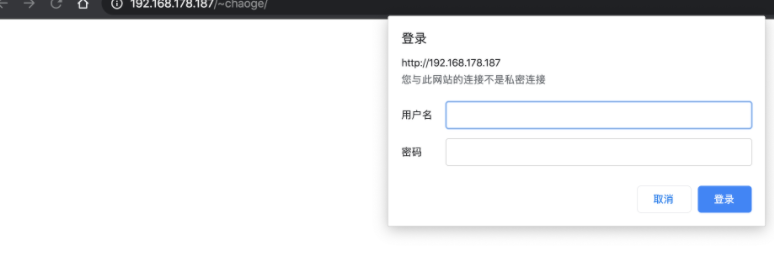
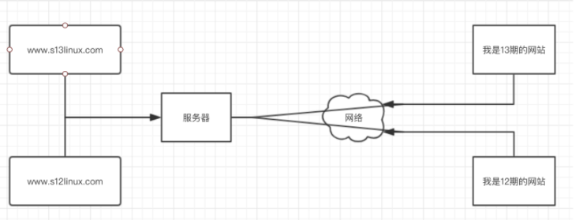
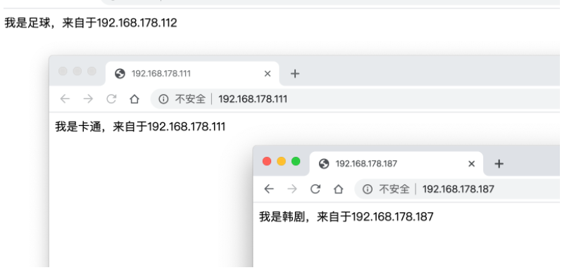
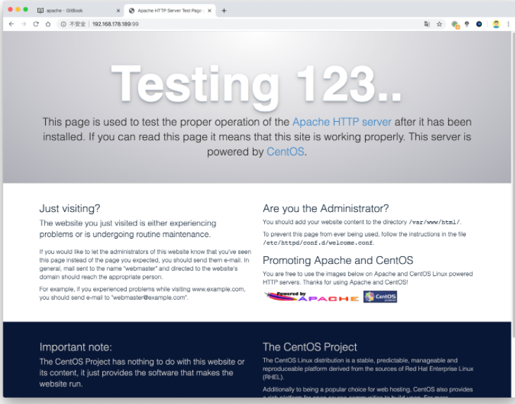
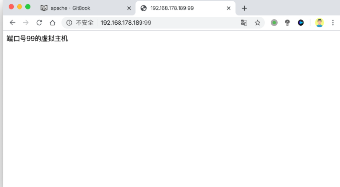
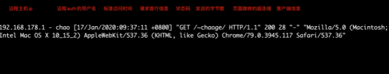
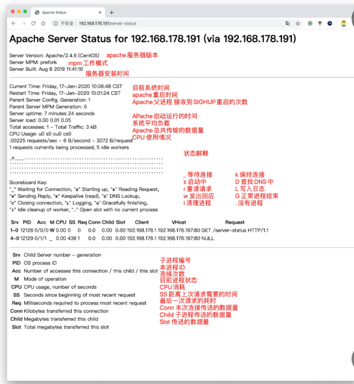

## 介绍

Apache是世界主流的Web服务器，世界上大多著名网站都是Apache搭建，
优势在于开放源代码，开发维护团队强大、支持跨平台应用（Unix、Linux、Windows），强大的移植性等优点。
Apache属于重量级产品，功能以模块化定制，消耗内存较高，性能稍弱于其他轻量级Web服务器。

## 安装

```
1.安装apache(linux的软件包httpd)
yum install httpd -y

2.启动httpd服务，开机自启
systemctl start httpd
systemctl enable httpd #开机启动
systemctl disable httpd #开机不启动

3.检查80端口是否开启
netstat -tunlp|grep 80

4.查看apache进程是否存在
ps -ef|grep httpd
```

## 配置文件

| 文件路径                              | 作用                         |
| ------------------------------------- | ---------------------------- |
| /etc/httpd/conf/httpd.conf            | apache主配置文件             |
| /etc/httpd                            | apache主配置目录             |
| /etc/httpd/conf.d/*.conf              | apache子配置文件             |
| /usr/sbin/httpd                       | 二进制脚本                   |
| /var/log/httpd/                       | 日志路径access_log error_log |
| /var/www/html                         | 站点资源目录                 |
| /usr/lib/systemd/system/httpd.service | httpd服务脚本文件            |
| /usr/lib64/httpd/modules/             | httpd模块文件路径            |

### 【http主配置文件学习】

```
/etc/httpd/conf/httpd.conf
#过滤掉注释空白行
[root@chaogelinux ~]# grep -Ev '^[# ]|^$' /etc/httpd/conf/httpd.conf
ServerRoot "/etc/httpd"
Listen 80
Include conf.modules.d/*.conf
User apache
Group apache
ServerAdmin root@localhost
<Directory />
</Directory>
DocumentRoot "/var/www/html"
<Directory "/var/www">
</Directory>
<Directory "/var/www/html">
</Directory>
<IfModule dir_module>
</IfModule>
<Files ".ht*">
</Files>
ErrorLog "logs/error_log"
LogLevel warn
<IfModule log_config_module>
</IfModule>
<IfModule alias_module>
</IfModule>
<Directory "/var/www/cgi-bin">
</Directory>
<IfModule mime_module>
</IfModule>
AddDefaultCharset UTF-8
<IfModule mime_magic_module>
</IfModule>
EnableSendfile on
IncludeOptional conf.d/*.conf
```

主配置文件中，主要分为3类

- 全局配置，全局性
- 主服务器配置
- 虚拟主机



#### 常见参数解析

| 参数                                 | 解析                   |
| ------------------------------------ | ---------------------- |
| ServerRoot "/etc/httpd"              | 定义服务工作目录       |
| ServerAdmin root@localhost           | 管理员邮箱地址         |
| User apache                          | 运行服务的用户信息     |
| Group apache                         | 运行服务的用户组       |
| ServerName `www.example.com:80`      | 填写服务器域名         |
| DocumentRoot "/var/www/html"         | 定义网站根目录         |
|                                      | 定义网站数据目录的权限 |
| Listen                               | 监听的IP地址和端口号   |
| DirectoryIndex index.html            | 默认的首页页面文件     |
| ErrorLog "logs/error_log"            | 定义错误日志位置       |
| CustomLog "logs/access_log" combined | 定义访问日志路径       |

### 【修改首页内容】

```
[root@docker ~]# vim /var/www/html/index.html
[root@docker ~]# curl 127.0.0.1
<meta charset=utf8>
apache
```




### 【修改网站资源目录路径】

```
1.修改配置文件如下，两处修改
[root@chaogelinux ~]# cat /etc/httpd/conf/httpd.conf
DocumentRoot "/www"

<Directory "/www">
    AllowOverride None
    # Allow open access:
    Require all granted
</Directory>


2.创建资源目录，创建html文件
[root@chaogelinux conf]# cat /www/index.html
<meta charset=utf8>
我是新的首页，你好兄弟们


3.修改了配置文件，还得重启http服务才能生效
systemctl restart httpd

4.注意关闭防火墙和selinux，影响实验
[root@chaogelinux conf]# systemctl stop firewalld
[root@chaogelinux conf]# systemctl disable firewalld
[root@chaogelinux conf]# iptables -F
[root@chaogelinux conf]# setenforce 0  #临时关闭selinux
[root@chaogelinux conf]# grep -i '^selinux' /etc/selinux/config    
SELINUX=disabled    #永久关闭selinux，重启机器生效
SELINUXTYPE=targeted
```

此时可以访问新资源目录的内容了

```
[root@chaogelinux conf]# curl 127.0.0.1
<meta charset=utf8>
我是新的首页，你好兄弟们
```


### 【修改监听端口】

```
[root@chaogelinux ~]# grep -i "^listen"  /etc/httpd/conf/httpd.conf
Listen 85
```

访问效果

```
[root@chaogelinux ~]# curl 127.0.0.1:85
<meta charset=utf8>
我是新的首页，你好兄弟们
```

### 【apache的工作模式】

apache是经典的网站黄金架构`lanmp`中的`a`

Apache提供了三种稳定的（多进程处理模块）`MPM(Mutli-Processing Modules 多通道处理模块)`，使得Apache能够使用更多不同的工作环境，扩展了Apache的功能。

```
检查默认的apache工作模式
[root@chaogelinux ~]# httpd -V|grep -i "server mpm"
Server MPM:     prefork
```

可以在编译apache软件时候，添加编译参数，更改mpm模式

```
--with-mpm=prefork|worker|event
```

apache提供了三种工作模式

```
1.prefork
Apache在启动之初，就预先fork一些子进程，然后等待请求进来。之所以这样做，是为了减少频繁创建和销毁进程的开销。每个子进程只有一个线程，在一个时间点内，只能处理一个请求。

优点：成熟稳定，兼容所有新老模块。同时，不需要担心线程安全的问题。
缺点：一个进程相对占用更多的系统资源，消耗更多的内存。而且，它并不擅长处理高并发请求。

2.worker
使用了多进程和多线程的混合模式。它也预先fork了几个子进程(数量比较少)，然后每个子进程创建一些线程，同时包括一个监听线程。每个请求过来，会被分配到1个线程来服务。线程比起进程会更轻量，因为线程通常会共享父进程的内存空间，因此，内存的占用会减少一些。在高并发的场景下，因为比起prefork有更多的可用线程，表现会更优秀一些。

优点：占据更少的内存，高并发下表现更优秀。
缺点：必须考虑线程安全的问题。

3.event
它和worker模式很像，最大的区别在于，它解决了keep-alive场景下，长期被占用的线程的资源浪费问题。event MPM中，会有一个专门的线程来管理这些keep-alive类型的线程，当有真实请求过来的时候，将请求传递给服务线程，执行完毕后，又允许它释放。这样增强了高并发场景下的请求处理能力。

HTTP采用keepalive方式减少TCP连接数量，但是由于需要与服务器线程或进程进行绑定，导致一个繁忙的服务器会消耗完所有的线程。Event MPM是解决这个问题的一种新模型，它把服务进程从连接中分离出来。在服务器处理速度很快，同时具有非常高的点击率时，可用的线程数量就是关键的资源限制，此时Event MPM方式是最有效的，但不能在HTTPS访问下工作。
```

### 【Userdir】

userdir模块可以很方便的与他人共享目录资源

**修改/etc/httpd/conf.d/userdir.conf**

```
1.启用userdir，
<IfModule mod_userdir.c>
    #
    # UserDir is disabled by default since it can confirm the presence
    # of a username on the system (depending on home directory
    # permissions).
    #
    #UserDir disabled  #添加注释，表示启用

    #
    # To enable requests to /~user/ to serve the user's public_html
    # directory, remove the "UserDir disabled" line above, and uncomment
    # the following line instead:
    #
    UserDir public_html
</IfModule>

<Directory "/home/*/public_html">
    #AllowOverride FileInfo AuthConfig Limit Indexes
    AllowOverride all
    authuserfile "/etc/httpd/passwd"        
    authname "input your account"
    authtype basic
    require user chao
    #Options MultiViews Indexes SymLinksIfOwnerMatch IncludesNoExec
    #Require method GET POST OPTIONS

</Directory>

2.创建网站数据文件夹，注意权限
[root@chaogelinux conf.d]# su - chaoge
[chaoge@chaogelinux ~]$ mkdir public_html

3.创建首页文件
[chaoge@chaogelinux ~]$ echo "超哥带你学apache，666" > public_html/index.html

4.设置权限
[root@chaogelinux www]# chmod -Rf 755 /home/chaoge/

5.创建需要验证的账户密码，生成数据库文件
[root@chaogelinux www]# htpasswd -c /etc/httpd/passwd chao
New password:
Re-type new password:
Adding password for user chao


6.重启httpd，注意退回root
[root@chaogelinux conf.d]# systemctl restart httpd

7.可以访问http://192.168.178.187/~chaoge/   格式是 ip/~用户名  

8.访问目录下资源
[root@chaogelinux public_html]# pwd
/home/chaoge/public_html
[root@chaogelinux public_html]# ls
hehe.html  index.html
```



### 【虚拟主机】

虚拟主机，也叫“网站空间”，就是把一台运行在互联网上的物理服务器划分成多个“虚拟”服务器。虚拟主机技术极大的促进了网络技术的应用和普及。同时虚拟主机的租用服务也成了网络时代的一种新型经济形式。



如果每台Linux服务器，只能跑一个网站，那一些只有简单业务的网站，或者个人博客站点，对于硬件资源来说是浪费的，且需要支付服务器的费用。

对于Apache是支持虚拟主机的，能够以用户请求的不同的IP、域名、端口来区分不同的站点

#### 基于IP的虚拟主机

在一台服务器上绑定多个IP地址，每个IP地址部署一个站点，访问不同的IP地址，apache服务器返回不同的网站资源。

```
服务器绑定三个ip地址

[root@chaogelinux ~]# ip a|grep 'inet'
    inet 127.0.0.1/8 scope host lo
    inet6 ::1/128 scope host
    inet 192.168.178.187/24 brd 192.168.178.255 scope global noprefixroute dynamic ens33
    inet 192.168.178.111/24 scope global secondary ens33
    inet 192.168.178.112/24 scope global secondary ens33
    inet6 fe80::22c3:376e:b0ae:5076/64 scope link noprefixroute
```

配置三个文件夹，对应三个站点资料

```
[root@chaogelinux ~]# mkdir -p /www/{hanju,cartoon,football}
[root@chaogelinux ~]# echo "我是韩剧，来自于192.168.178.187" > /www/hanju/index.html
[root@chaogelinux ~]# echo "我是卡通，来自于192.168.178.111" > /www/cartoon/index.html
[root@chaogelinux ~]# echo "我是足球，来自于192.168.178.112" > /www/football/index.html
```

修改httpd.conf配置文件，最底行添加apache虚拟主机的配置

```
<VirtualHost 192.168.178.187>
DocumentRoot /www/hanju
#ServerName
<Directory /www/hanju >
AllowOverride None
Require all granted
</Directory>
</VirtualHost>
<VirtualHost 192.168.178.111>
DocumentRoot /www/cartoon
#ServerName
<Directory /www/cartoon >
AllowOverride None
Require all granted
</Directory>
</VirtualHost>
<VirtualHost 192.168.178.112>
DocumentRoot /www/football
#ServerName
<Directory /www/football >
AllowOverride None
Require all granted
</Directory>
</VirtualHost>
```

重启httpd

```
systemctl restart httpd
```



#### 多域名虚拟主机

刚才的操作是多IP虚拟主机，那么当服务器仅允许有一个IP地址的时候，就无法实现多虚拟主机了，Apache还支持基于不同的域名、返回不同的站点资源。


这种配置方式，需要配置多个域名，可以使用本地hosts文件，也可以配置DNS记录。

```
1.配置hosts文件解析
[root@chaogelinux ~]# cat /etc/hosts
127.0.0.1   localhost localhost.localdomain localhost4 localhost4.localdomain4
::1         localhost localhost.localdomain localhost6 localhost6.localdomain6

192.168.178.189 www.chao.com www.pyyu.com

2.分别创建不同的虚拟主机站点，且创建前端文件
[root@chaogelinux ~]# mkdir -p /www/{chao,pyyu}
[root@chaogelinux ~]# echo "超哥666" > /www/chao/index.html
[root@chaogelinux ~]# echo "pyyu带你学apache" > /www/pyyu/index.html

3.修改apache的配置文件，写入虚拟主机的参数
[root@chaogelinux ~]# cat /etc/httpd/conf/httpd.conf
<VirtualHost 192.168.178.189>
DocumentRoot "/www/chao"
ServerName "www.chao.com"
<Directory "/www/chao" >
AllowOverride None
Require all granted
</Directory>
</VirtualHost>
<VirtualHost 192.168.178.189>
DocumentRoot /www/pyyu
ServerName "www.pyyu.com"
<Directory "/www/pyyu" >
AllowOverride None
Require all granted
</Directory>
</VirtualHost>

4.检测页面内容
[root@chaogelinux ~]# curl www.chao.com
超哥666
[root@chaogelinux ~]# curl www.pyyu.com
pyyu带你学apache
```

#### 【多端口号虚拟主机】

apache默认端口是80提供web服务器功能，可以基于多个端口实现多虚拟主机

```
1.生成多个数据文件夹
[root@chaogelinux ~]# mkdir -p /www/{66,99}
[root@chaogelinux ~]# echo "端口号66的虚拟主机" > /www/66/index.html
[root@chaogelinux ~]# echo "端口号99的虚拟主机" > /www/99/index.html

2.修改配置文件，支持多端口的虚拟主机
#######

<VirtualHost 192.168.178.189:66>
DocumentRoot "/www/66"
ServerName "www.chao.com"
<Directory "/www/66" >
AllowOverride None
Require all granted
</Directory>
</VirtualHost>
<VirtualHost 192.168.178.189:99>
DocumentRoot "/www/99"
ServerName "www.pyyu.com"
<Directory "/www/99" >
AllowOverride None
Require all granted
</Directory>
</VirtualHost>

3.重启httpd
[root@chaogelinux ~]# systemctl restart httpd

4.查看不同端口的页面内容
[root@chaogelinux ~]# curl www.chao.com
超哥666
[root@chaogelinux ~]# curl www.chao.com:66
端口号66的虚拟主机
[root@chaogelinux ~]# curl www.pyyu.com
pyyu带你学apache
[root@chaogelinux ~]# curl www.pyyu.com:99
端口号99的虚拟主机
```

### 资源限制访问

当我们有部分资源不希望被别人访问的时候，可以通过参数拒绝资源目录被访问

【案例】

拒绝其他人访问站点资源

```
http://192.168.178.189:99/
```



```
1.创建一个资源文件，禁止用户访问
[root@chaogelinux ~]# mkdir -p /www/denyhtml/
[root@chaogelinux ~]# echo "小样，想偷看我？" > /www/denyhtml/index.html

2.修改httpd配置文件
<Directory "/www/99" >
Order allow,deny
#Allow from 192.168.178.0/24
</Directory>
</VirtualHost>

3.打开注释，允许某个网段访问

4.重启httpd
[root@chaogelinux ~]# systemctl restart httpd

5.即可访问资源了
```



### 注意！httpd的版本问题

```
apache目录站点 访问限制总结：

2.4之前版本的：

语法是
Order Deny,allow
Allow from 192.168.178.190


2.4版本开始：

不再使用上述的语法了

改为 
Require all granted  # 允许所有ip访问
Require ip 192.168.178.190  #只允许某个ip访问
Require ip 192.168.178.0/24 # 允许某个我那网段访问
```

### 限制访问详解

```
给指定的文件夹配置对应的访问权限是Apache配置中的基础应用，也是Apache使用者的必备技能之一。

在Apache配置文件中，给指定目录设置基本的访问权限，主要是靠Allow、Deny、Order三个指令的配合使用来实现的。

1.Allow指令

Allow指令的作用与其英文单词的含义一致，用于设置允许访问当前目录(及其子目录)或文件的用户范围。例如，Allow from all表示允许所有用户访问。下面，我们参考更多的例子，以帮助理解(Deny与Order用法一致)：

<Directory /web>
#只允许IP为123.10.10.2的用户访问/web目录
Allow from 123.10.10.2
</Directory>
<Directory /web>
#只允许IP以10.10开头的用户访问/web目录
Allow from 10.10
</Directory>
<Directory /web>
#只允许域名为365mini.com的用户访问
Allow from 365mini.com
</Directory>
2.Deny指令

同样的，Deny指令的作用就是“Deny(拒绝)”，用于设置拒绝访问当前目录或文件的用户范围。例如，Deny from all表示拒绝所有用户访问。

3.Order指令

在Apache的配置文件中，Order指令用于控制Allow指令和Deny指令的生效顺序。例如，Order Allow,Deny表示当前配置段中的Allow指令先生效，Deny指令后生效。

在Apache中，Allow指令和Deny指令在同一配置段中都可以有多条。不过，对于Allow和Deny指令而言，如果先生效的指令与后生效的指令的作用范围存在冲突，则起冲突的作用范围部分以后生效的指令为准。

下面，我们同样参考几个具体的例子以帮助大家理解：

<Directory /web>
Order Allow,Deny
Allow from all
Deny from 112.2.10.2
#先允许所有用户访问，再拒绝112.2.10.2
#总结：允许除IP为112.2.10.2外的所有用户访问
</Directory>
<Directory /web>
Order Allow,Deny
Deny from 112.2.10.2
Allow from all
#先允许所有用户访问，再拒绝112.2.10.2
#总结：允许除IP为112.2.10.2外的所有用户访问
#(即使Deny指令在Allow指令之前，但是根据Order Allow,Deny语句，仍然先看Allow，再看Deny)
</Directory>
<Directory /web>
Order Deny,Allow
Deny from 112.2.10.2
Allow from all
Deny from 123.10.10.1
#先拒绝112.2.10.2访问
#再拒绝123.10.10.1访问
#最后允许所有用户访问
#总结：允许所有用户访问
#(即使Allow指令在Deny指令前，但是根据Order Deny,Allow语句，仍然先看Deny，再看Allow)
</Directory>
```

### 定义访客日志格式

有时候我们需要定制apache默认显示的日志格式，增加或者减少日志记录的内容，更好的让运维人员掌握用户访问信息。

并且日志可能会给系统造成大量的IO操作，造成较多的负担，如果关闭日志功能，甚至可能提高40%的性能，那当然是不能关闭，而是调整日志级别。

查看httpd配置文件

```
ErrorLog "logs/error_log"  #错误日志存放位置

#
# LogLevel: Control the number of messages logged to the error_log.
# Possible values include: debug, info, notice, warn, error, crit,
# alert, emerg.
#
LogLevel warn
<IfModule log_config_module>
    #
    # The following directives define some format nicknames for use with
    # a CustomLog directive (see below).
    #
    LogFormat "%h %l %u %t \"%r\" %>s %b \"%{Referer}i\" \"%{User-Agent}i\"" combined
    LogFormat "%h %l %u %t \"%r\" %>s %b" common

    <IfModule logio_module>
      # You need to enable mod_logio.c to use %I and %O
      LogFormat "%h %l %u %t \"%r\" %>s %b \"%{Referer}i\" \"%{User-Agent}i\" %I %O" combinedio
    </IfModule>

    #
    # The location and format of the access logfile (Common Logfile Format).
    # If you do not define any access logfiles within a <VirtualHost>
    # container, they will be logged here.  Contrariwise, if you *do*
    # define per-<VirtualHost> access logfiles, transactions will be
    # logged therein and *not* in this file.
    #
    #CustomLog "logs/access_log" common

    #
    # If you prefer a logfile with access, agent, and referer information
    # (Combined Logfile Format) you can use the following directive.
    #
    CustomLog "logs/access_log" combined
</IfModule>
```

#### 日志级别

```
# LogLevel: Control the number of messages logged to the error_log.
# Possible values include: debug, info, notice, warn, error, crit,
# alert, emerg.
#
LogLevel warn

#解释
emerg 紧急 - 系统无法使用。 "Child cannot open lock file. Exiting"  
alert 必须立即采取措施。 "getpwuid: couldn't determine user name from uid"  
crit 致命情况。 "socket: Failed to get a socket, exiting child"  
error 错误情况。 "Premature end of script headers"  
warn 警告情况。 "child process 1234 did not exit, sending another SIGHUP"  
notice 一般重要情况。 "httpd: caught SIGBUS, attempting to dump core in ..."  
info 普通信息。 "Server seems busy, (you may need to increase StartServers, or Min/MaxSpareServers)..."  
debug 出错级别信息 "Opening config file ..."
```

#### 日志格式

```
 LogFormat "%h %l %u %t \"%r\" %>s %b \"%{Referer}i\" \"%{User-Agent}i\"" combined #组合日志
    LogFormat "%h %l %u %t \"%r\" %>s %b" common    #通用日志格式

%…a: 远程IP地址
%…A: 本地IP地址
%…B: 已发送的字节数，不包含HTTP头
%…b: CLF格式的已发送字节数量，不包含HTTP头。例如当没有发送数据时，写入‘-’而不是0。
%…{FOOBAR}e: 环境变量FOOBAR的内容
%…f: 文件名字
%…h: 远程主机
%…H 请求的协议
%…{Foobar}i: Foobar的内容，发送给服务器的请求的标头行。
%…l: 远程登录名字（来自identd，如提供的话）
%…m 请求的方法
%…{Foobar}n: 来自另外一个模块的注解“Foobar”的内容
%…{Foobar}o: Foobar的内容，应答的标头行
%…p: 服务器响应请求时使用的端口
%…P: 响应请求的子进程ID。
%…q 查询字符串（如果存在查询字符串，则包含“?”后面的部分；否则，它是一个空字符串。）
%…r: 请求的第一行，如 "GET / HTTP/1.1"
%…>s: 状态。对于进行内部重定向的请求，这是指*原来*请求 的状态。如果用%…>s，则是指后来的请求。
%…t: 以公共日志时间格式表示的时间（或称为标准英文格式）
%…{format}t: 以指定格式format表示的时间
%…T: 为响应请求而耗费的时间，以秒计
%…D: Apache 2.0 开始，提供了一个新的参数 %D。可以记录服务器处理请求的微秒时间
%…u: 远程用户（来自auth；如果返回状态（%s）是401则可能是伪造的）
%…U: 用户所请求的URL路径
%…v: 响应请求的服务器的ServerName
%…V: 依照UseCanonicalName设置得到的服务器名字
%…{Referer}i：请求报文中首部“referer”的值；即从哪个页面中的超链接跳转至当前页面的；
%…{User-Agent}i：请求报文中首部“User-Agent”的值；即发出请求的应用程序；
```

日志显示格式

```
192.168.178.1 - - [17/Jan/2020:09:24:14 +0800] "GET / HTTP/1.1" 304 - "-" "Mozilla/5.0 (iPhone; CPU iPhone OS 11_0 like Mac OS X) AppleWebKit/604.1.38 (KHTML, like Gecko) Version/11.0 Mobile/15A372 Safari/604.1"


192.168.178.1 - - [17/Jan/2020:09:24:24 +0800] "GET / HTTP/1.1" 304 - "-" "Mozilla/5.0 (Linux; Android 5.0; SM-G900P Build/LRX21T) AppleWebKit/537.36 (KHTML, like Gecko) Chrome/79.0.3945.117 Mobile Safari/537.36"

192.168.178.1 - - [17/Jan/2020:09:24:35 +0800] "GET / HTTP/1.1" 304 - "-" "Mozilla/5.0 (Linux; Android 8.0.0; Pixel 2 XL Build/OPD1.170816.004) AppleWebKit/537.36 (KHTML, like Gecko) Chrome/79.0.3945.117 Mobile Safari/537.36"
```



### status状态页

对于运维人员来说，需要实时监控httpd实时运行情况，负载情况，连接数等，能够更好的掌握服务器情况，需要在编译安装apache的时候，开启mod_status模块

```
/etc/httpd/conf/httpd.conf配置文件中添加状态参数

<Location /server-status>
SetHandler server-status
<RequireAll>
Require ip 192.168.178.0/24
</RequireAll>
</Location>

重启httpd 
访问状态页路径
http://192.168.178.191/server-status
```

【针对apache进行压力测试】

使用Apache自带的压力测试工具

```
1.可能需要单独安装软件包
[root@chaogelinux ~]# yum install httpd-tools
```

ab命令常用参数

```
此外，我们再根据上面的用法介绍界面来详细了解每个参数选项的作用。

-n    即requests，用于指定压力测试总共的执行次数。
-c    即concurrency，用于指定的并发数。
-t    即timelimit，等待响应的最大时间(单位：秒)。
-b    即windowsize，TCP发送/接收的缓冲大小(单位：字节)。
-p    即postfile，发送POST请求时需要上传的文件，此外还必须设置-T参数。
-u    即putfile，发送PUT请求时需要上传的文件，此外还必须设置-T参数。
-T    即content-type，用于设置Content-Type请求头信息，例如：application/x-www-form-urlencoded，默认值为text/plain。
-v    即verbosity，指定打印帮助信息的冗余级别。
-w    以HTML表格形式打印结果。
-i    使用HEAD请求代替GET请求。
-x    插入字符串作为table标签的属性。
-y    插入字符串作为tr标签的属性。
-z    插入字符串作为td标签的属性。
-C    添加cookie信息，例如："Apache=1234"(可以重复该参数选项以添加多个)。
-H    添加任意的请求头，例如："Accept-Encoding: gzip"，请求头将会添加在现有的多个请求头之后(可以重复该参数选项以添加多个)。
-A    添加一个基本的网络认证信息，用户名和密码之间用英文冒号隔开。
-P    添加一个基本的代理认证信息，用户名和密码之间用英文冒号隔开。
-X    指定使用的和端口号，例如:"126.10.10.3:88"。
-V    打印版本号并退出。
-k    使用HTTP的KeepAlive特性。
-d    不显示百分比。
-S    不显示预估和警告信息。
-g    输出结果信息到gnuplot格式的文件中。
-e    输出结果信息到CSV格式的文件中。
-r    指定接收到错误信息时不退出程序。
-h    显示用法信息，其实就是ab -help。
```

案例

```
1.发出100个并发数，总共发出10000个请求
[root@chaogelinux ~]# ab -c 100 -n 100000 http://192.168.178.191/

2.检查状态页的信息
http://192.168.178.191/server-status
```

状态页参数解析



```
1.检查服务器的进程数量，apache每一请求会启动一个进程
开启100个并发，发出一万个请求
[root@chaogelinux ~]# ab -c 100 -n 10000 http://192.168.178.191/

2.检查进程数
[root@chaogelinux ~]# ps -ef|grep httpd |wc -l
107
```

### curl命令

curl是基于URL语法在命令行下工作的传输工具，支持诸多协议，FTP、HTTP、HTTPS、等。

```
-A/--user-agent <string>              设置用户代理发送给服务器
-b/--cookie <name=string/file>    cookie字符串或文件读取位置
-c/--cookie-jar <file>                    操作结束后把cookie写入到这个文件中
-C/--continue-at <offset>            断点续转
-D/--dump-header <file>              把header信息写入到该文件中
-e/--referer                                  来源网址
-f/--fail                                          连接失败时不显示http错误
-o/--output                                  把输出写到该文件中
-O/--remote-name                      把输出写到该文件中，保留远程文件的文件名
-r/--range <range>                      检索来自HTTP/1.1或FTP服务器字节范围
-s/--silent                                    静音模式。不输出任何东西
-T/--upload-file <file>                  上传文件
-u/--user <user[:password]>      设置服务器的用户和密码
-w/--write-out [format]                指定输出内容
-x/--proxy <host[:port]>              在给定的端口上使用HTTP代理
-#/--progress-bar                        进度条显示当前的传送状态
```

#### 1.保存网页html元素

获取网页html元素

```
[root@chaogelinux ~]# curl www.pythonav.cn > /tmp/index.html
```

#### 2.参数保存网页

同于第一条命令，-o 指定文件名字

```
[root@chaogelinux ~]# curl -o /tmp/luffy.html  www.pythonav.cn
```

#### 3.测试页面返回值

-o 输出内容到文件

-s 不输出页面内容

-w 指定输出内容

```
[root@chaogelinux ~]# curl -o /dev/null -s -w %{http_code} www.pythonav.cn
```

#### 4.保存站点cookie

```
[root@chaogelinux tmp]# curl -c cookiec.txt  www.baidu.com

[root@chaogelinux tmp]# cat cookiec.txt
# Netscape HTTP Cookie File
# http://curl.haxx.se/docs/http-cookies.html
# This file was generated by libcurl! Edit at your own risk.

.baidu.com    TRUE    /    FALSE    1579334979    BDORZ    27315
```

#### 5.模拟客户端

伪装user-agent

```
#原本客户端地址
222.35.242.113 - - [17/Jan/2020:16:17:06 +0800] "GET / HTTP/1.1" 200 9503 "-" "curl/7.64.1" "-"


#指定客户端地址
yumac: ~ yuchao$curl -A "Mozilla/5.0 (Macintosh; Intel Mac OS X 10_15_2) AppleWebKit/537.36 (KHTML, like Gecko) Chrome/79.0.3945.117 Safari/537.36"  www.pythonav.cn
```

#### 6.下载资源

-O 大写字母O参数，直接保存资源到本地，用源文件名

```
curl -O http://hcdn1.luffycity.com/static/frontend/public_class/PY1@2x_1566529821.1110113.png
```

#### 7.断点续传

```
curl -O -C http://hcdn1.luffycity.com/static/frontend/public_class/PY1@2x_1566529821.1110113.png

```

