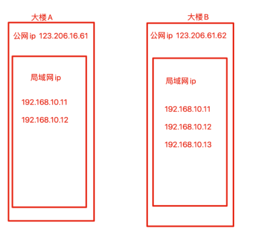

## 引申

你是不是遇到过这样的问题，QQ明明上的去，而网页打不开，通常这个情况你去搜索解决方法，大家就会告诉你改DNS。还有一些人办理宽带的时候，有些人会提到这个宽带有DNS劫持的情况，不要用这家的宽带，包括买路由器的时候也有人会提到DNS劫持，说到dns劫持，这就涉及到ip的知识了。。。

## IP地址

互联网初期，电脑数据并不共享，是通过数据线进行传输数据


机器如果一多那么。。


现在满世界都是电脑，如何进行数据交互呢？所有的机器都能够接入互联网，通过互联网互相转发数据


那这里就要明确，每台机器的地址，否则数据发给别人可咋办，为了准确发送数据，就要给每台电脑添加门牌号与地址信息。

因此IP地址，就是用于标记机器在网络中的地址信息，保证数据不会发错给别的人。

比如向192.168.1.100机器发数据，肯定不会发送到192.168.1.105上

### ip划分

ip地址主要分为四类

- A类，ip范围`0.0.0.0~126.255.255.255`，A类地址主要分配给超大型网络环境的公司，例如苹果公司。
- B类，ip范围`128.0.0.0~191.255.255.255`，主要分配给有大规模局域网数量的公司
- C类，ip范围`192.0.0.0~223.255.255.255`，主要分配给如校园网等小型局域网
- D类和E类地址比较特殊，D类属于广播地址，E类属于保留地址

### 公网ip与局域网ip

好比寄快递，需要明确省、市、县、小区、门牌号等。

**局域网**

局域网的ip好比是某一个小区的门牌号，用于某一个群体内部交互数据使用的ip地址，离开这个群体，也就失效了


如果这个小区名字是唯一的，全中国就一个，通过互联网系统查询，只有这一个唯一的小区门牌号，全世界大家都能找到你，这个就是一个公网IP

- 公网ip，例如，123.206.16.61、123.206.16.62
- 局域网ip，例如192.168.10.11，例如192.168.5.44



- 如果A公司内部机器传输资料，192.168.10.12只需发给192.168.10.11即可
- 如果A公司的某一个电脑，要发数据给B公司的某一个电脑，就得
  - A公司某一电脑数据发给公网ip
  - 然后再发送给B公司的公网ip
  - 然后再转发给B公司的某一个局域网ip

## 什么是dns

**【网页浏览的原理】**

大家日常上网的时候，打开的网页本质上就是你从对方服务器上获取的文件，比如说你现在正在看的这篇文章，就存储在知乎的服务器上，你通过知乎客户端的浏览器，获取到了这些数据，并下载到了你的手机缓存当中，然后你的手机再把他们显示到屏幕上。

浏览网页的本质，就是下载文件，并将下载下来的网页文件变成你所能看到的图像。网页文件一般是.html结尾的，不相信的话你可以用电脑浏览器，随便打开一个网址，右键空白处，网页另存为，然后你就会发现你存储下来了一个.html结尾的网页文件，这时候你就算断网，双击这个网页文件你依旧可以用浏览器浏览，因为这个html文件被你保存到电脑上了。

所以浏览网页的原理就是，在互联网上找到了对方的电脑，然后从对方的电脑里拷贝出来html网页文件到你的电脑上，并将其转化成了文字和图片显示到显示器或手机上。

**【域名与IP的关系】**

在早期的时候，上网就是这么麻烦，你想要访问对方的网站，你必须要知道对方的IP，然后在你的浏览器里输入IP地址，然后就可以访问了，但是IP地址是4组数字，记IP地址的难度不亚于背一个陌生人的手机号，于是乎，我们用一串英文字母来代替IP地址，这就是网站域名。

例如你的网站域名就是`www.baidu.com`，对应的ip地址是`123.206.16.61`，ip很难记，域名可以自定义很好记。

但是这里就有一个问题了，你输入的是域名，你的电脑该怎么将他变成IP地址呢？就比如你输入的是`www.pythonav.cn`，为什么你的电脑知道对方的IP是`123.206.16.61`呢？这个东西就是hosts文件，hosts文件就在你的`C:\windows\system32\drivers\etc`文件夹下，linux就是`/etc/hosts`，他相当于电脑的电话本，他记录着每一个域名对应的IP地址，当你输入域名而不是IP的时候，他就会在这个电话本里找到对应的域名，然后把他转化成IP地址。

**【DNS解析服务器】**

但是这样也有问题，那就是Hosts文件是有限的，就和你不可能拥有这个世界上所有人的电话号码一样。既然我们自己不可能拥有全世界所有人的电话号码，但是我们可以将收集电话号码这个任务交给一个专门来干这个活的人，然后大家想要问电话的时候去他那查一下就可以了。

这就是DNS服务器，DNS服务器有着相当全的域名和IP，当你输入一串网站的时候，这串网站并不会直接访问，而是先将这个网站发送给DNS服务器，DNS服务器帮你把这串网站变成了IP地址，然后返回给你的电脑，你再访问这个IP地址，这样就解决了IP难记，而域名不能直接访问的问题了。

所以这样就可以解释文章开头那个故障了，你打不开网页，却可以上QQ，因为上QQ不需要涉及到DNS解析服务，直接访问的就是腾讯服务器的IP，但是你打开网页输入的是域名，而你的DNS服务器输入错误或者DNS服务器炸了，所以你电脑不知道这串域名对应的IP，你自然就没法访问这个网站，而如果你手动直接输入IP，你依旧是可以访问网站的。

**【什么是DNS劫持？】**

DNS服务器想给你返回什么IP就给你返回什么，所以他可以在幕后操作一些东西。最简单的就是广告。比如A网站没有广告，你直接访问就是没有的，但是你的DNS服务器把A网站下载下来了，给这个网站加了个广告，然后重新上传到了一个IP上，并把这个IP告诉了你，那就是你虽然输入的A网站的域名，但是你访问的是一个包含了广告的复制版A网站，虽然两者功能一样，但是却完全不是一个服务器上的。

这些就被我们称为DNS劫持，DNS劫持对于网络访问的影响和体验是非常严重的，除了DNS服务器，你的路由器同样可以这么干，所以在买路由器的时候也有人会关注这个路由器是否会进行DNS劫持。

### 修改Linux的dns配置

```
[root@docker01 ~]# cat /etc/resolv.conf 
# Generated by NetworkManager
nameserver 114.114.114.114
```

## DNS域名解析服务

相较于由数字构成的 IP 地址，域名更容易被理解和记忆，所以我们通常更习惯通过域名 的方式来访问网络中的资源。但是，网络中的计算机之间只能基于 IP 地址来相互识别对方的 身份，而且要想在互联网中传输数据，也必须基于外网的 IP 地址来完成。

为了降低用户访问网络资源的门槛，DNS(Domain Name System，域名系统)技术应运 而生。这是一项用于管理和解析域名与 IP 地址对应关系的技术，简单来说，就是能够接受用 户输入的域名或 IP 地址，然后自动查找与之匹配(或者说具有映射关系)的 IP 地址或域名， 即将域名解析为 IP 地址(正向解析)，或将 IP 地址解析为域名(反向解析)。这样一来，我们 只需要在浏览器中输入域名就能打开想要访问的网站了。DNS 域名解析技术的正向解析也是 我们最常使用的一种工作模式。

鉴于互联网中的域名和 IP 地址对应关系数据库太过庞大，DNS 域名解析服务采用了类 似目录树的层次结构来记录域名与 IP 地址之间的对应关系，从而形成了一个分布式的数据库 系统

域名后缀一般分为国际域名和国内域名。原则上来讲，域名后缀都有严格的定义，但在实际使用时可以不必严格遵守。

目前最常见的域名后缀有.com(商业组织)、.org(非营利组 织)、.gov(政府部门)、.net(网络服务商)、.edu(教研机构)、.pub(公共大众)、.cn(中国 国家顶级域名)等。


【dns解析流程图】


```
1、在浏览器中输入www.baidu.com域名，操作系统会先检查自己本地的hosts文件是否有这个网址映射关系，如果有，就先调用这个IP地址映射，完成域名解析。

2、如果hosts里没有这个域名的映射，则查找本地DNS解析器缓存，是否有这个网址映射关系，如果有，直接返回，完成域名解析。

3、如果hosts与本地DNS解析器缓存都没有相应的网址映射关系，首先会找TCP/ip参数中设置的首选DNS服务器（常见8.8.8.8；114.114.114.114）在此我们叫它本地DNS服务器，此服务器收到查询时，如果要查询的域名，包含在本地配置区域资源中，则返回解析结果给客户机，完成域名解析，此解析具有权威性。

4、如果本地DNS服务器本地区域文件与缓存解析都失效，则根据本地DNS服务器的设置（是否设置转发器）进行查询，如果未用转发模式，本地DNS就把请求发至13台根DNS，根DNS服务器收到请求后会判断这个域名(.com)是谁来授权管理，并会返回一个负责该顶级域名服务器的一个IP。本地DNS服务器收到IP信息后，将会联系负责.com域的这台服务器。这台负责.com域的服务器收到请求后，如果自己无法解析，它就会找一个管理.com域的下一级DNS服务器地址(baidu.com)给本地DNS服务器。当本地DNS服务器收到这个地址后，就会找baidu.com域服务器，重复上面的动作，进行查询，直至找到www.baidu.com主机。

5、如果用的是转发模式，此DNS服务器就会把请求转发至上一级DNS服务器，由上一级服务器进行解析，上一级服务器如果不能解析，或找根DNS或把转请求转至上上级，以此循环。不管是本地DNS服务器用是是转发，还是根提示，最后都是把结果返回给本地DNS服务器，由此DNS服务器再返回给客户机。
```

## dnsmasq

1、dnsmasq是一款小巧且方便地用于配置DNS服务器和DHCP服务器的工具，适用于小型网络，它提供了DNS解析功能和可选择的DHCP功能。

 2、dnsmasq可以解决小范围的dns查询问题，如果业务是跨机房、跨地区的话不建议使用dnsmasq做为dns解析服务器。

1.主配置文件，安装后自动生成

```
/etc/dnsmasq.conf
```

2.内部需要解析的ip和域名

```
/etc/dnsmasq.hosts
```

3.dnsmasq的上游DNS服务器

```
可以配置为resolv.conf，添加nameserver
/etc/resolv.dnsmasq.conf
```

#### 主配置文件

```
#过滤文件中排除空行^$和  ^#或者^;的行 
[root@local-pyyu ~]# grep -Ev '^$|^[#;]' /etc/dnsmasq.conf
#定义dnsmasq从哪里获取上游DNS服务器的地址，默认是从/etc/resolv.conf获取
resolv-file=/etc/resolv.dnsmasq.conf
#访问baidu.com时的所有域名都会被解析成123.206.16.61
address=/baidu.com/123.206.16.61
address=/taobao.com/123.206.16.61
#定义dnsmasq监听的地址，默认是监控本机的所有网卡上。局域网内主机若要使用dnsmasq服务时，指定本机的IP地址
listen-address=192.168.178.180
#本地域名配置文件（不支持泛域名），添加内部需要解析的地址和域名（重新加载即可生效）
addn-hosts=/etc/dnsmasq.hosts
#记录dns查询日志服务器
log-queries
##设置日志记录
log-facility=/var/log/dnsmasq.log
#包含其他文件夹下所有配置文件
conf-dir=/etc/dnsmasq.d,.rpmnew,.rpmsave,.rpmorig
```

#### 内部解析地址配置

```
#添加需要内部解析的域名
[root@local-pyyu ~]# cat /etc/dnsmasq.hosts
123.206.16.61 testchaoge.com
```

#### 添加上游dns服务器地址

```
#当某个域名无法解析的时候，发给上游服务器查询
[root@local-pyyu ~]# cat /etc/resolv.dnsmasq.conf
nameserver 223.5.5.5
nameserver 223.6.6.6
```

#### 配置日志切割

```
[root@local-pyyu ~]# cat /etc/logrotate.d/dnsmasq
/var/log/dnsmasq.log {
    daily
    copytruncate
    missingok
    rotate 30
    compress
    notifempty
    dateext
    size 200M
}
```

#### 启动dnsmasq服务

```
systemctl start dnsmasq
```

#### 配置dns客户端地址

```
# 此时我们本地机器，以及是dns的服务端
[root@local-pyyu ~]# cat /etc/resolv.conf
# Generated by NetworkManager
search localdomain
nameserver 192.168.178.180
```

#### 测试dns域名解析

【以下所有操作，可以检测dnsmasq日志文件】

```
[root@local-pyyu ~]# tail -f  /var/log/dnsmasq.log
#安装dns客户端软件  dig与nslookup
yum install bind-utils -y 

dig www.4399.com|grep -i 'query time'  #第二次访问就能够缓存加速了

[root@local-pyyu ~]# nslookup baidu.com  #用本地dns
Server:        192.168.178.180
Address:    192.168.178.180#53

Name:    baidu.com
Address: 123.206.16.61

[root@local-pyyu ~]#
[root@local-pyyu ~]#
[root@local-pyyu ~]# nslookup baidu.com 223.5.5.5 #用公网dns
Server:        223.5.5.5
Address:    223.5.5.5#53

Non-authoritative answer:
Name:    baidu.com
Address: 39.156.69.79
Name:    baidu.com
Address: 220.181.38.148

[root@local-pyyu ~]# nslookup taobao.com  #用本地dns
Server:        192.168.178.180
Address:    192.168.178.180#53

Name:    taobao.com
Address: 123.206.16.61

[root@local-pyyu ~]# nslookup www.jd.com  #转发给上游服务器
Server:        192.168.178.180
Address:    192.168.178.180#53

Non-authoritative answer:
www.jd.com    canonical name = www.jd.com.gslb.qianxun.com.
www.jd.com.gslb.qianxun.com    canonical name = www.jdcdn.com.
www.jdcdn.com    canonical name = img2x-v6-sched.jcloudedge.com.
Name:    img2x-v6-sched.jcloudedge.com
Address: 117.131.205.3
Name:    img2x-v6-sched.jcloudedge.com
Address: 2409:8c02:11c:20:8000::3
```