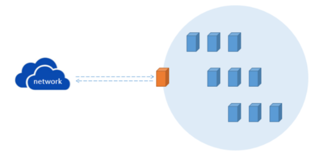
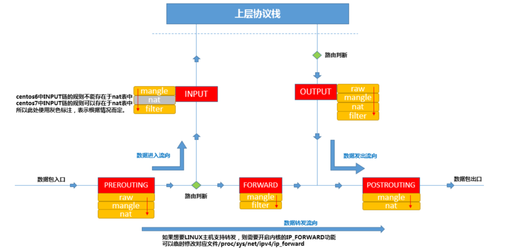
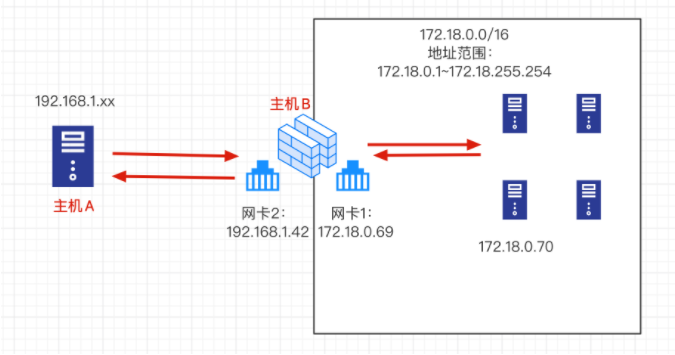
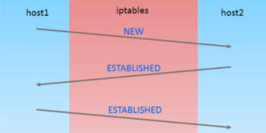

## 黑白名单机制

前文中一直在强调一个概念：报文在经过iptables的链时，会匹配链中的规则，遇到匹配的规则时，就执行对应的动作，如果链中的规则都无法匹配到当前报文，则使用链的默认策略（默认动作），链的默认策略通常设置为ACCEPT或者DROP。

那么，当链的默认策略设置为ACCEPT时，如果对应的链中没有配置任何规则，就表示接受所有的报文，如果对应的链中存在规则，但是这些规则没有匹配到报文，报文还是会被接受。

同理，当链的默认策略设置为DROP时，如果对应的链中没有配置任何规则，就表示拒绝所有报文，如果对应的链中存在规则，但是这些规则没有匹配到报文，报文还是会被拒绝。

所以，当链的默认策略设置为ACCEPT时，按照道理来说，我们在链中配置规则时，对应的动作应该设置为DROP或者REJECT，为什么呢？

因为默认策略已经为ACCEPT了，如果我们在设置规则时，对应动作仍然为ACCEPT，那么所有报文都会被放行了，因为不管报文是否被规则匹配到都会被ACCEPT，所以就失去了访问控制的意义。

所以，当链的默认策略为ACCEPT时，链中的规则对应的动作应该为DROP或者REJECT，表示只有匹配到规则的报文才会被拒绝，没有被规则匹配到的报文都会被默认接受，这就是"黑名单"机制。

### 白名单案例

```
# 放行ssh服务的报文，以及web服务的报文
[root@chaoge01 ~]# iptables -I INPUT -p tcp --dport 22 -j ACCEPT
[root@chaoge01 ~]# iptables -I INPUT -p tcp --dport 80 -j ACCEPT
```

> 现在放行了特定的报文，其他的报文全部拒绝，那么可以直接DROP即可，实现白名单机制

```
[root@chaoge01 ~]# iptables -nvL INPUT
Chain INPUT (policy ACCEPT 2 packets, 226 bytes)
 pkts bytes target     prot opt in     out     source               destination
    0     0 ACCEPT     tcp  --  *      *       0.0.0.0/0            0.0.0.0/0            tcp dpt:80
  174 12204 ACCEPT     tcp  --  *      *       0.0.0.0/0            0.0.0.0/0            tcp dpt:22


[root@chaoge01 ~]# iptables -P INPUT DROP
[root@chaoge01 ~]#
[root@chaoge01 ~]# iptables -nvL INPUT
Chain INPUT (policy DROP 1 packets, 229 bytes)
 pkts bytes target     prot opt in     out     source               destination
    0     0 ACCEPT     tcp  --  *      *       0.0.0.0/0            0.0.0.0/0            tcp dpt:80
  233 16296 ACCEPT     tcp  --  *      *       0.0.0.0/0            0.0.0.0/0            tcp dpt:22
[root@chaoge01 ~]#
```

此时你要注意了，我们已经吧默认的规则改成了`DROP`，因为我们单独给了白名单，才放行了`22端口，ssh服务`，因此还是可以远程连接服务器的。

如果你现在执行清空规则语句，那么白名单被清空了，默认规则又是拒绝，会导致所有报文都被拒绝，ssh也会断开了。

> 因此，默认策略改为拒绝，是很不明智的操作，因为很大可能给你自己带来大麻烦。
>
> 最好的是，默认是Accept，然后添加所需的规则，如果有`拒绝所有请求`的规则，也放在最底行加载。

### 黑名单案例

```
# 1.修改默认策略为 ACCEPT
[root@chaoge01 ~]# iptables -P INPUT ACCEPT
[root@chaoge01 ~]# iptables -vnL INPUT
Chain INPUT (policy ACCEPT 5 packets, 420 bytes)
 pkts bytes target     prot opt in     out     source               destination
    0     0 ACCEPT     tcp  --  *      *       0.0.0.0/0            0.0.0.0/0            tcp dpt:80
  329 23084 ACCEPT     tcp  --  *      *       0.0.0.0/0            0.0.0.0/0            tcp dpt:22

# 尾部追加一个拒绝的规则
[root@chaoge01 ~]# iptables -A INPUT -j REJECT
[root@chaoge01 ~]#
[root@chaoge01 ~]#
[root@chaoge01 ~]# iptables -vnL INPUT
Chain INPUT (policy ACCEPT 0 packets, 0 bytes)
 pkts bytes target     prot opt in     out     source               destination
    0     0 ACCEPT     tcp  --  *      *       0.0.0.0/0            0.0.0.0/0            tcp dpt:80
  412 28904 ACCEPT     tcp  --  *      *       0.0.0.0/0            0.0.0.0/0            tcp dpt:22
    0     0 REJECT     all  --  *      *       0.0.0.0/0            0.0.0.0/0            reject-with icmp-port-unreachable
```

所以，这是最好的形式

- 放行了指定的重要的业务
- 最后一条拒绝其他无用的报文，保证机器安全
- 即使手误删除了规则，默认规则也是ACCEPT，也不会造成很大麻烦

## iptables网络防火墙

防火墙从逻辑上讲，主要分为

- 主机防火墙：针对单个服务器进行防护。
- 网络防火墙：处于网络入口，针对网络入口进行防护，防护躲在防火墙背后的局域网。



橘黄色主机为iptables所在主机，使用iptables进行网络防火墙服务。

浅蓝色区域表示被网络防火墙防护的主机区域。

## 报文流程

当外网中的主机与防火墙内部的主机通信时，无论是进、出的报文，都必须得经过iptables主机，由防火墙主机进行*过滤且转发*。

所以，防火墙的主要工作是，过滤且转发。



前文，我们使用iptables都是用作 主机防火墙的作用

且为们只用到了INPUT和OUTPUT链，因为提供了过滤功能的链只有三条，INPUT，OUTPUT，FORWARD，当报文发往本机的时候，如果想要过滤，只能在进、出链中实现。

此时我们改变了iptables主机的作用，提供网络防火墙服务，需要实现“过滤并转发”，要实现转发功能，报文只有经过FORWARD链，因此转发规则是定义在FORWARD链里的。

## 环境设计



> 内部网络：172.18.0.xx，
>
> 外部网络：192.168.1.xx
>
> 网络防火墙主机：网卡2，192.168.1.42，有两块网卡，同时可以和内部，外部网络通信，网卡1，172.18.0.69
>
> 访问形式：
>
> 主机A > 想要访问主机C，172.18.0.70，默认情况是无法访问的，且不是一个网段，这里我们可以使用B主机的防火墙转发功能实现。

### vmware设置

> 主机A：桥接模式， 192.168.1.33 主机B：桥接模式， 192.168.1.42。仅主机模式，172.18.0.69 主机C：仅主机模式，172.18.0.18 ，网关指向iptables网络防火墙，GATEWAY="172.18.0.69"

简化路由设置，让A主机访问172.18.0.0网段时，网关直接指向B主机。

```
[root@a ~]# route add -net 172.18.0.0/16 gw 192.168.1.42
[root@a ~]#
[root@a ~]# route -n
Kernel IP routing table
Destination     Gateway         Genmask         Flags Metric Ref    Use Iface
0.0.0.0         192.168.1.1     0.0.0.0         UG    100    0        0 ens37
172.18.0.0      192.168.1.42    255.255.0.0     UG    0      0        0 ens37
192.168.1.0     0.0.0.0         255.255.255.0   U     100    0        0 ens37
```

此时主机A通往172.18网络的网关已经是指向主机B，主机A能够访问到内网172.18.0.0码?

```
[root@a ~]# ping 172.18.0.69
PING 172.18.0.69 (172.18.0.69) 56(84) bytes of data.
64 bytes from 172.18.0.69: icmp_seq=1 ttl=64 time=0.456 ms
64 bytes from 172.18.0.69: icmp_seq=2 ttl=64 time=0.381 ms

[root@a ~]# ping 172.18.0.18
PING 172.18.0.18 (172.18.0.18) 56(84) bytes of data.
^C
--- 172.18.0.18 ping statistics ---
7 packets transmitted, 0 received, 100% packet loss, time 6000ms

[root@a ~]#
```

> 为什么主机A，能够访问主机B的内网地址，却无法访问主机C的内网地址？
>
> 答案是：
>
> 主机A通过route -n路由表得知，发往172.18.0.0/16网段的报文网关是B主机
>
> 当主机A访问例如主机C的172.18.0.18，报文到达主机B时，B主机发现A的目标是172.18.0.18，而自己的IP是172.18.0.69，此时主机B需要将该报文转发给172.18.0.18（主机C），但是Linux默认不会转发报文，因此主机C就没收到主机A的报文，这是根本原因所在，所以C主机没有给予主机A回复。
>
> 那为什么主机B的172.18.0.69又能够给主机A回复呢？
>
> 答案：
>
> 主机B是双网卡，192.168.1.42和172.18.0.69都是主机B的地址，主机A通过路由表把报文发给了主机B，主机B自然也就能直接回应主机A。

## Linux内核转发配置

检查Linux转发语句是否开启

```
[root@b ~]# cat /proc/sys/net/ipv4/ip_forward
0
# 默认为0，则是关闭了转发动作，改为1就是开启转发功能。
# 打开转发
[root@b ~]# echo 1 > /proc/sys/net/ipv4/ip_forward

# 打开转发
[root@b ~]# sysctl -w net.ipv4.ip_forward=1
net.ipv4.ip_forward = 1


# 以上两个方法都是临时生效，重启网络就失效了，可以永久修改
[root@b ~]# tail -1  /usr/lib/sysctl.d/00-system.conf
net.ipv4.ip_forward = 1
[root@b ~]#
```

此时B主机已经有了报文转发功能，此时可以再用主机A，尝试访问内网的B和C，都是可以ping通的。

```
[root@a ~]# ping 172.18.0.69
PING 172.18.0.69 (172.18.0.69) 56(84) bytes of data.
64 bytes from 172.18.0.69: icmp_seq=1 ttl=64 time=0.648 ms
^C
--- 172.18.0.69 ping statistics ---
1 packets transmitted, 1 received, 0% packet loss, time 0ms
rtt min/avg/max/mdev = 0.648/0.648/0.648/0.000 ms
[root@a ~]#
[root@a ~]#
[root@a ~]# ping 172.18.0.18
PING 172.18.0.18 (172.18.0.18) 56(84) bytes of data.
64 bytes from 172.18.0.18: icmp_seq=1 ttl=63 time=0.742 ms
64 bytes from 172.18.0.18: icmp_seq=2 ttl=63 time=0.361 ms
^C
--- 172.18.0.18 ping statistics ---
2 packets transmitted, 2 received, 0% packet loss, time 1001ms
rtt min/avg/max/mdev = 0.361/0.551/0.742/0.191 ms
```

## 网络防火墙测试

实验开始前，先清空主机A和C的iptables规则，防止影响网络防火墙的实验。

```
# 清空A和C的规则，不指定链，默认所有链
[root@a ~]# iptables -F
[root@c ~]# iptables -F
```

查看网络防火墙机器--机器B的filter表规则，也就是提供过滤+转发的链

```
[root@b ~]# iptables -nvL
Chain INPUT (policy ACCEPT 2914 packets, 296K bytes)
 pkts bytes target     prot opt in     out     source               destination

Chain FORWARD (policy ACCEPT 142 packets, 15584 bytes)
 pkts bytes target     prot opt in     out     source               destination

Chain OUTPUT (policy ACCEPT 455 packets, 54664 bytes)
 pkts bytes target     prot opt in     out     source               destination
[root@b ~]#
```

FORWARD转发链目前没有规则，默认策略是放行，我们可以使用`白名单机制`，也就是FORWARD末端用一条拒绝的规则，然后添加`放行规则`在默认拒绝的规则之前即可。

```
# 添加默认拒绝规则
[root@b ~]# iptables -nvL FORWARD
Chain FORWARD (policy ACCEPT 0 packets, 0 bytes)
 pkts bytes target     prot opt in     out     source               destination
    0     0 REJECT     all  --  *      *       0.0.0.0/0            0.0.0.0/0            reject-with icmp-port-unreachable
[root@b ~]#
```

测试主机A和C已经无法通信了，若要通信还得添加放行规则

```
[root@a ~]# ping 172.18.0.18
PING 172.18.0.18 (172.18.0.18) 56(84) bytes of data.
From 192.168.1.42 icmp_seq=1 Destination Port Unreachable
From 192.168.1.42 icmp_seq=2 Destination Port Unreachable
^C
--- 172.18.0.18 ping statistics ---
2 packets transmitted, 0 received, +2 errors, 100% packet loss, time 999ms

[root@a ~]#
```

本来B主机已经支持转发了，但是经过iptables的FORWARD链的规则，将报文拒绝了，因此也就无法转发。

> 启用web服务进行调试，A和C机器，启动nginx

```
[root@c ~]# curl 127.0.0.1
hello c

[root@a ~]# curl 127.0.0.1
hello a
```

由于B机器已经禁止了转发报文，因此A和C是无法互相访问到web服务的。

```
[root@a ~]# curl 172.18.0.18
curl: (7) Failed connect to 172.18.0.18:80; Connection refused

[root@c ~]# curl 192.168.1.33
curl: (7) Failed connect to 192.168.1.33:80; Connection refused
```

> 配置转发规则，让C可以访问A，内网可以访问外网。

```
[root@b ~]# iptables -I FORWARD  -s 172.18.0.0/16 -p tcp --dport 80 -j ACCEPT
[root@b ~]#
[root@b ~]# iptables -vnL FORWARD
Chain FORWARD (policy ACCEPT 0 packets, 0 bytes)
 pkts bytes target     prot opt in     out     source               destination
    0     0 ACCEPT     tcp  --  *      *       172.18.0.0/16        0.0.0.0/0            tcp dpt:80
   19  2876 REJECT     all  --  *      *       0.0.0.0/0            0.0.0.0/0            reject-with icmp-port-unreachable
[root@b ~]#
```

此时在防火墙放行了内网的web请求，**"因此我们认为 c > B > A 是没有问题的了"**

```
# 尝试下
[root@c ~]# curl 192.168.1.33
```

> 为什么C还是无法访问A？
>
> 因为我们刚才加的规则是，允许172.18.0.0内网主机访问80端口的请求，的确可以转发出去
>
> 但是外部主机回应的报文，并没有允许进入防火墙，因此还得添加规则

```
[root@b ~]# iptables -I FORWARD -d 172.18.0.0/16 -p tcp --sport 80 -j ACCEPT
[root@b ~]#
[root@b ~]#
[root@b ~]# iptables -vnL FORWARD
Chain FORWARD (policy ACCEPT 0 packets, 0 bytes)
 pkts bytes target     prot opt in     out     source               destination
    0     0 ACCEPT     tcp  --  *      *       0.0.0.0/0            172.18.0.0/16        tcp spt:80
    7   420 ACCEPT     tcp  --  *      *       172.18.0.0/16        0.0.0.0/0            tcp dpt:80
   26  3296 REJECT     all  --  *      *       0.0.0.0/0            0.0.0.0/0            reject-with icmp-port-unreachable
[root@b ~]#
```

注意这里的选项，-d. --sport

此时当外部主机响应了报文，也就是从80端口给予了响应，目标是响应给172.18.0.0内网地址。

再来尝试访问，C > A

```
[root@c ~]# curl 192.168.1.33
hello a
```

### 防火墙转发理念

> 此时我们会发现，主机的配置规则，要考虑双向性，流量的进入，出口，都得设置。
>
> 此时C可以访问A，反之还是不行的，因为我们没有配置其他规则。
>
> 我们可以对规则进行优化，无论是 进 > 出，还是 出 > 进 ，只要是响应的报文，统统放行。

### state扩展模块

> --state 状态模块，用于表示两台机器的连接状态
>
> 对于state模块的连接而言，"连接"其中的报文可以分为5种状态，报文状态可以为NEW、ESTABLISHED、RELATED、INVALID、UNTRACKED
>
> **NEW**：连接中的第一个包，状态就是NEW，我们可以理解为新连接的第一个包的状态为NEW。
>
> **ESTABLISHED**：我们可以把NEW状态包后面的包的状态理解为ESTABLISHED，表示连接已建立。
>
> **RELATED**：数据传输时建立的关系



案例

```
# 1. 目前的规则
[root@b ~]# iptables -nvL FORWARD
Chain FORWARD (policy ACCEPT 0 packets, 0 bytes)
 pkts bytes target     prot opt in     out     source               destination
    4   459 ACCEPT     tcp  --  *      *       0.0.0.0/0            172.18.0.0/16        tcp spt:80
   13   816 ACCEPT     tcp  --  *      *       172.18.0.0/16        0.0.0.0/0            tcp dpt:80
   40  4004 REJECT     all  --  *      *       0.0.0.0/0            0.0.0.0/0            reject-with icmp-port-unreachable
[root@b ~]#


2.删除刚才单独添加的响应规则
[root@b ~]# iptables -D FORWARD 1

3.添加新规则，只要是响应报文就放行，完成双向的效果
# 第一条规则，只有是回应本机器的报文才能通过防火墙，如果是主动发来的报文无法通过
# 第二条规则，当请求来自于172.18.0.0时，目标地址是80，允许转发
# 第三条规则，拒绝所有请求
[root@b ~]# iptables -I FORWARD -m state --state ESTABLISHED,RELATED -j ACCEPT
[root@b ~]# iptables -nvL FORWARD
Chain FORWARD (policy ACCEPT 0 packets, 0 bytes)
 pkts bytes target     prot opt in     out     source               destination
    0     0 ACCEPT     all  --  *      *       0.0.0.0/0            0.0.0.0/0            state RELATED,ESTABLISHED
   13   816 ACCEPT     tcp  --  *      *       172.18.0.0/16        0.0.0.0/0            tcp dpt:80
   40  4004 REJECT     all  --  *      *       0.0.0.0/0            0.0.0.0/0            reject-with icmp-port-unreachable
[root@b ~]#
```

> 因此上述结果，应该是：
>
> 只允许C机器发出80的请求，得到响应，事实如下。
>
> 只允许 C > A ，内 > 外

```
[root@c ~]# curl 192.168.1.33
hello a

[root@a ~]# curl 172.18.0.18
curl: (7) Failed connect to 172.18.0.18:80; Connection refused
[root@a ~]#
```

> 再来一个案例：
>
> 允许内部网络ssh连接外部网络。

```
[root@b ~]# iptables -I FORWARD -s 172.18.0.0/16 -p tcp --dport 22 -j ACCEPT
```

## iptables总结

- 规则顺序很重要
- 规则里有多个匹配条件时，条件之间属于"与"的关系
- 在没有顺序要求时，不同类的规则，匹配次数多的，频率高的放在规则前面。
- iptables用作网络防火墙时，考虑双向性。
- 注意链的默认策略，黑名单，白名单机制