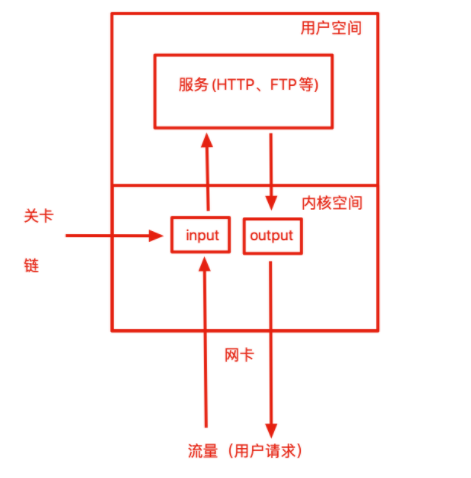
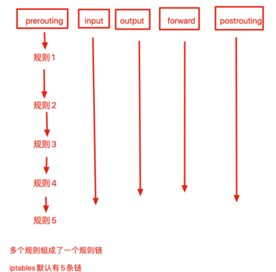

## 防火墙是什么

防火墙好比一堵真的墙，能够隔绝些什么，保护些什么。

防火墙的本义是指古代构筑和使用木制结构房屋的时候，为防止火灾的发生和蔓延，人们将坚固的石块堆砌在房屋周围作为屏障，这种防护构筑物就被称之为“防火墙”。其实与防火墙一起起作用的就是“门”。

如果没有门，各房间的人如何沟通呢，这些房间的人又如何进去呢？当火灾发生时，这些人又如何逃离现场呢？

这个门就相当于我们这里所讲的防火墙的“安全策略”，所以在此我们所说的防火墙实际并不是一堵实心墙，而是带有一些小孔的墙。

这些小孔就是用来留给那些允许进行的通信，在这些小孔中安装了过滤机制，就是防火墙的过滤策略了。


## 防火墙的作用

防火墙具有很好的保护作用。入侵者必须首先穿越防火墙的安全防线，才能接触目标计算机。

## 防火墙的功能

防火墙对流经它的网络通信进行扫描，这样能够过滤掉一些攻击，以免其在目标计算机上被执行。防火墙还可以关闭不使用的端口。而且它还能禁止特定端口的流出通信。

最后，它可以禁止来自特殊站点的访问，从而防止来自不明入侵者的所有通信。

## 防火墙概念

防火墙一般有硬件防火墙和软件防火墙

硬件防火墙：在硬件级别实现部分防火墙功能，另一部分功能基于软件实现，性能高，成本高。

软件防火墙：应用软件处理逻辑运行于通用硬件平台之上的防火墙，性能低，成本低。

## 软件防火墙

Linux提供的软件防火墙，名为`iptables`，它可以理解为是一个客户端代理，通过`iptables`的代理，将用户配置的安全策略执行到对应的`安全框架`中，这个安全框架称之为`netfilter`。

iptables是一个命令行的工具，位于用户空间，我们用这个工具操作真正的框架，也就是netfilter

真正实现流量过滤的防火墙框架是`netfilter`，位于内核空间，它俩共同组成了Linux的软件防火墙，一般用来代替昂贵的硬件防火墙，实现数据包过滤，网络地址转换等。

> 在Centos7发行版本下，firewalld防火墙又取代了iptables防火墙

```
iptables是将配置好的规则交给内核层的netfilter网络过滤器来处理
filrewalld服务是将配置好的防火墙规则交给内核层的nftables网络过滤器处理
这俩工具二选一即可，都只是命令行工具，
```

### iptables

iptables就是按照规则办事的，（rules）规则就是运维事先定义好的规则。

```
[root@chaogelinux tmp]# iptables -L
Chain INPUT (policy ACCEPT)
target     prot opt source               destination

Chain FORWARD (policy ACCEPT)
target     prot opt source               destination

Chain OUTPUT (policy ACCEPT)
target     prot opt source               destination
```

iptables会从上至下的读取防火墙规则，找到匹配的规则后，就结束匹配工作，并且执行对应的动作。

如果读取所有的防火墙规则都没有符合的，就执行默认的规则。

规则一般两种：允许、拒绝。

- 当默认策略是全部拒绝的时候，就要设置一些允许流量通过的规则，否则就全部禁止了
- 当默认策略是全部允许的时候，就得设置一些拒绝的规则，否则机器就没安全可言了

规则就存储在内核空间的信息包过滤表中，这些规则定义了源地址信息、目的地址、传输的协议类型、服务类型等

当数据包符合规则条件时候，iptables就根据所定义的方法来处理这些数据包，`放行accept、拒绝reject、丢弃drop`。



### 链

iptables服务吧用于处理或者过滤流量的策略称之为规则，多条规则就组成了一个`规则链`，规则链根据数据包处理位置的不同进行分类。



具体5条链如下

- 路由选择前处理数据包，prerouting链
- 处理流入的数据包，input链
- 处理流出的数据包，output链
- 处理转发的数据包，forward链
- 进行路由选择后处理数据包，postrouting链

正常情况下，服务器内网向外网发出的流量一般是良性可控的，主要处理的都是input链，从外网流入的流量，需要严格把控，能够很大程度防止恶意流量，造成服务器隐患。

防火墙的规则链，这在生活里很常见，例如`外卖禁止入内`、`禁止小贩入内`、`共享单车禁止入内`、`车辆进入要登记`等。

这些校园、小区门口都有一些规则，用于控制外来的人员，这就好比服务器设置的防火墙规则，禁止哪些流量进入。

好比现在有一个人送外卖，直接第一条规则就禁止入内了，外卖小哥只能离开或是想其他办法

现在又来了一个骑着共享单车的想要进入校园，他不是送外卖的，第一条规则通过，但是第二条规则，给他拦下来了。

现在有一个学生要进去校园，两条规则都不符合，如果默认规则是放行，学生则可以直接进入校园。

### 动作

校园大门口的保安，除了在门上贴上告示，定义一些`规则链`以外，在学生进入后还得有一些动作，好比服务器流量进入后，防火墙还得有一些动作去处理流量。

- accept，允许数据包通过
- reject，拒绝数据包通过，还会给客户端一个响应，告知它被拒绝了
- log，在`/var/log/message`中记录日志，然后数据包传递给下一个规则，不做处理
- drop，直接丢弃数据包，不给任何回应，客户端会以为自己的请求扔进大海了，直到请求超时报错
- SNAT，源地址转换，解决内网用户用同一个公网的问题
- DNAT，目标地址转换
- redirect，在本机做端口映射

**drop和reject区别**

例如小明在家里，忽然有陌生人敲门，发现是自己的朋友来找自己出去玩，但是不想去，因此拒绝了他们（这就是reject）

如果小明透过猫眼发现门外是一个坏人敲门，小明闷不吭声，假装自己不在家（这就是drop）

