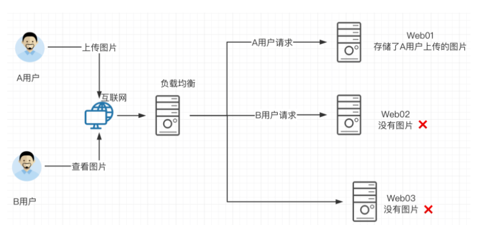
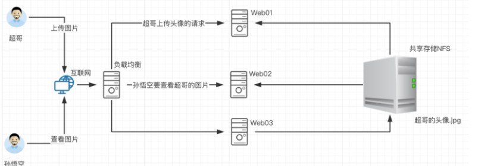
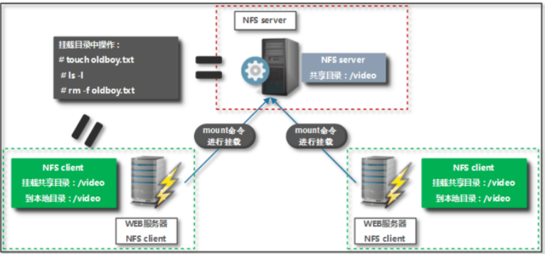
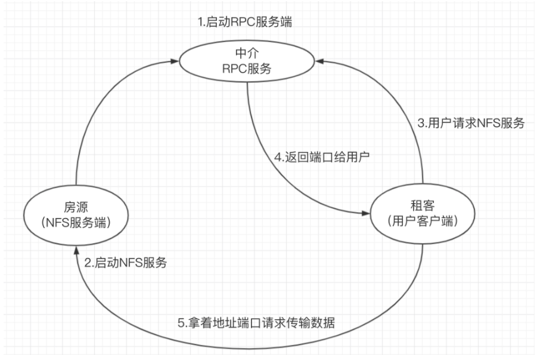
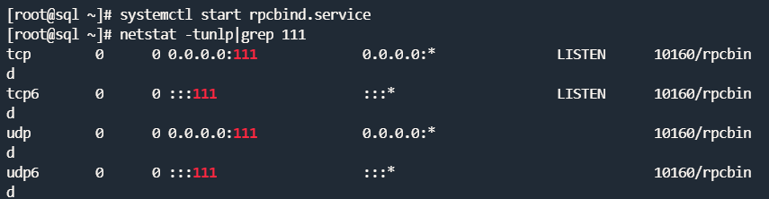
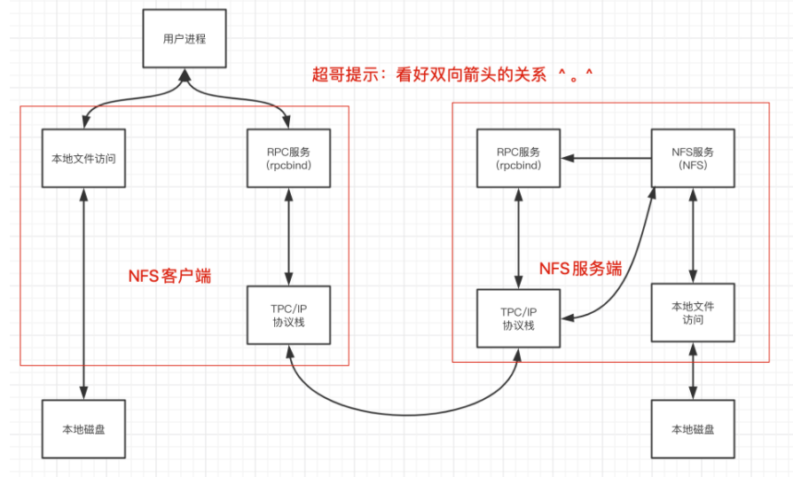

## 介绍

已知samba主要用于linux与windows之间共享文件夹

那用于Linux之间进行文件共享则是用NFS服务（Network FileSystem）

目的在于让不同的机器，不同的操作系统可以彼此分享各自的文件数据。

NFS服务可以将远程Linux系统上的文件共享资源挂载到本地机器的目录上。

NFS很像Windows系统的网络共享、安全功能、网络驱动器映射，这也和Linux系统的samba服务类似。

一般情况下，Windows网络共享服务或samba服务用语办公局域网共享，而中小型网站集群架构后端通常用NFS数据共享，如果大型网络集群，还会用更复杂的文件系统，如GlusterFS、FastDFS等。

NFS系统已有30年发展历史，代表了一个稳定的网络文件系统，具备可扩展，高性能等特点。

由于网络速度的加快和延迟的减少，NFS系统一直是通过网络提供文件系统的不错的选择，特别是在中小型互联网企业用的广泛。

## NFS在企业的应用架构

在企业集群架构的工作场景中，NFS网络文件系统一般被用来存储共享视频、图片、静态文件，通常网站用户上传的文件也都会放在NFS共享里，例如BBS产品(论坛)产生的图片、附件、头像等，然后前端所有的节点访问静态资源时都会读取NFS存储上的资源。

阿里云等公有云平台的NAS就是云版的NFS服务应用。


在企业架构集群中，如图就是NFS系统工作位置，NFS作为所有前端服务的共享存储，存储内容包括用户上传的图片，附件，头像等，注意网站后端代码等重要数据不得放在NFS共享。

## 企业生产集群为什么需要共享存储



先看一下如果没有共享存储的问题

A用户上传图片到web01服务器，然后用户B访该图片，结果B的请求被负载均衡分发到了Web02，但是由于没有配置共享存储，web02没有该图片，导致用户B看不到该资源，用户心理很不爽呀。

那么如果配置了共享存储，无论A用户上传的图片是发给了web01还是其他，最终都会存储到共享存储上，用户B再访问该图片的时候，无论请求被负载均衡发给了web01、web02、web03最终都会去共享存储上寻找资源，这样也就能够访问到资源了。

这个共享存储对于中小企业，也就是使用服务器配置NFS网络文件共享系统实现。



中小型互联网企业一般不会购买硬件存储，成本过高，大公司由于业务发展快，需要购买硬件存储分散网站的压力，但是网站的并发压力如果继续增长，硬件设备的扩展就会费劲，且金钱成本翻倍增长。

因此企业也就采用了开源的软件技术替换硬件设备，如用Lvs+Haproxy替换了NetScaler负载均衡设备。

## NFS工作原理



如图是企业中NFS服务器和客户端的挂载结构

1.在NFS服务端设置一个共享的目录/video，其他有权限访问NFS服务器的客户端都可以把该目录/video挂载到本地客户端的某个挂载点（挂载点就是一个目录，可以自由定义路径）

客户端正确挂载完毕后，进入NFS客户端的挂载点，也就能够看到NFS服务端的/video共享目录下的数据。在客户端查看时，NFS服务端/video的目录数据就相当于本地一个目录而已，根本察觉不到任何区别。

## NFS与RPC原理

基于RPC(远程过程调用)实现，RPC实现注册中心功能，默认端口号是111，nfs服务在启动的瞬间固定端口号，然后注册到注册中心，用户要使用nfs服务会先链接注册中心获取端口。

一般来说，rpc和nfs在同一个机器运行

nfs优势：节省本地存储空间，将常用的数据比如/data目录存放到nfs服务器上，通过网络来进行访问，本地终端可以减少自身的存储空间的使用。

### 什么是RPC

NFS服务就是使用RPC协议的帮忙，RPC服务实现的功能是记录每个NFS功能对应的端口号，并且在NFS客户端发出请求的时候，把该功能和对应的端口信息传递给发出请求的NFS客户端，保证客户端能够正确的连接到NFS的端口，达到数据传输的目的。RPC就好比是一个中介，处在客户端、服务端之间。



> 比如去租房，租聘人就是一个nfs客户端，中介就是rpc服务，房源拥有者房东就是nfs客户端，提供数据中介手里就要先储备好房东信息转达给租聘人。

当NFS服务器启动时会随机采用若干端口，并且主动在RPC服务中注册相关端口以及功能信息。

如此一来RPC服务就知道NFS服务对应的端口功能了，RPC服务默认使用固定111端口来监听NFS客户端提交的请求，并将正确的NFS端口信息回复给NFS客户端，这样，NFS客户端就可以和NFS服务器进行数据通信了。



## rpcbind服务

在启动NFS服务端之前，必须先启动RPC服务，在centos7服务器下为rpcbind服务，否则NFSserver无法向RPC注册信息了。另外如果RPC服务重启，原来注册的NFS服务端信息也就失效了，也必须重启服务，再次注册信息给RPC服务。

特别要注意的是，修改NFS配置文件后不需要重启NFS，只需要执行`exportfs -rv` 命令即可或是`systemctl reload nfs`

### NFS工作原理



当访问程序通过NFS客户端向NFS服务器端存储文件时，其数据请求流程如下：

1.用户访问网站程序，由程序在NFS客户端上发出存取文件的请求，此时NFS客户端（执行程序的机器）的RPC服务（rpcbind）就会通过网络向NFS服务器的RPC服务的111端口发出NFS文件存取功能的请求。

2.NFS服务器RPC找到对应注册的NFS端口，通知NFS客户端RPC服务

3.此时NFS客户端获取到正确的端口，并与NFS daemon联机存取数据

4.NFS客户端把数据存取成功后返回给前端程序，告知用户存取结果，完成一次存取请求。

这也就证明，必须先启动RPC服务，再启动NFS服务的步骤。

## 安装NFS

安装nfs服务，需要安装如下软件包

- nfs-utils：NFS服务的主程序，包括了rpc.nfsd、rpc.mountd这两个守护进程以及相关文档，命令
- rpcbind：是centos7/6环境下的RPC程序

```
1.安装软件包命令
yum install nfs-utils rpcbind -y

2.检查默认NFS软件安装情况
[root@sql ~]# rpm -qa nfs-utils rpcbind
rpcbind-0.2.0-48.el7.x86_64
nfs-utils-1.3.0-0.65.el7.x86_64
```

## 配置NFS

> 环境配置

NFS也是C/S模式，准备一个NFS服务端，一个NFS客户端，两台linux机器

在Server机器上创建用于NFS文件共享的文件夹，且设置好权限

```
[root@sql ~]# mkdir /nfsdir
[root@sql /]# chown -R nfsnobody.nfsnobody /nfsdir/
```

### 修改NFS服务的配置文件

默认配置文件路径是`/etc/exports`

```
exports配置文件语法:

NFS共享目录  NFS客户端地址(参数1、参数2...) 客户点地址2（参数1、参数2...）
```

【nfs语法参数解释】

```
1.NFS共享目录：为NFS服务器要共享的实际目录，必须绝对路径，注意目录的本地权限，如果要读写共享，要让本地目录可以被NFS客户端的(nfsnobody)读写
2.NFS客户端地址，也就是NFS服务器端授权可以访问共享目录的客户端地址，详见下表
3.权限参数，对授权的NFS客户端访问权限设置，见下表
```

【NFS客户端地址配置说明】

| 客户端地址 | 具体地址     | 说明                                            |
| ---------- | ------------ | ----------------------------------------------- |
| 整个网段   | 10.0.0.0/24  | 24表示子网掩码255.255.255.0，指定网段，用的较多 |
| 单一客户端 | 192.168.6.66 | 用的少                                          |

**配置案例**

> 共享所有网段,机器可访问

```
[root@sql /]# cat /etc/exports
/nfsdir *(insecure,rw,sync,root_squash)

#表示共享该文件夹，且提供给所有网段的机器可访问

配置规则是：
rw: 可读写
sync: 数据同步写入到磁盘
root_squash: 把root管理员映射为本地的匿名用户，
insecure: insecure是客户端从大于1024的端口发送链接
```

> 只共享 ip 192.168.6.0-255 网段，并设置只读

```
[root@sql /]# cat /etc/exports
/nfsdir 192.168.6.0/24(ro)

只读共享，例如一些生成服务器的日志目录，又不想给开发服务器的权限，共享目录给他人只读查看
```

**常用参数解释**

```
ro 只读
rw 读写
root_squash 当nfs客户端以root访问时，它的权限映射为NFS服务端的匿名用户，它的用户ID/GID会变成nfsnobody
no_root_squash 同上，但映射客户端的root为服务器的root，不安全，避免使用
all_squash 所有nfs客户端用户映射为匿名用户，生产常用参数
sync 数据同步写入到内存与硬盘，优点数据安全，缺点性能较差
async 数据写入到内存，再写入硬盘，效率高，但可能内存数据会丢
```

## 启动NFS服务端

NFS服务都是基于RPC协议通信的默认端口是111，要确保系统运行了rpcbind服务

要注意的是`rpcbind服务`即使停止，111端口也不会挂掉，因为还有`rpcbind.socket`服务

```
[root@sql /]# systemctl status rpcbind
● rpcbind.service - RPC bind service
   Loaded: loaded (/usr/lib/systemd/system/rpcbind.service; enabled; vendor preset: enabled)
   Active: active (running) since Thu 2022-03-03 06:34:50 EST; 25min ago
  Process: 10159 ExecStart=/sbin/rpcbind -w $RPCBIND_ARGS (code=exited, status=0/SUCCESS)
 Main PID: 10160 (rpcbind)
    Tasks: 1
   Memory: 720.0K
   CGroup: /system.slice/rpcbind.service
           └─10160 /sbin/rpcbind -w

Mar 03 06:34:50 sql systemd[1]: Starting RPC bind service...
Mar 03 06:34:50 sql systemd[1]: Started RPC bind service.


# 启动rpcbind服务
systemctl restart rpcbind

#启动
systemctl restart nfs-server
```

## 配置NFS服务端实战

创建共享目录且设置权限

```
1.确保RPC服务启动了
systemctl start rpcbind

2.创建需要共享的目录，以及资料
[root@sql ~]# mkdir /nfsdir
[root@sql nfsdir]# ls
test.sh  test.txt

#修改文件夹的user，group，这里更换权限是防止NFS客户端无法写入数据
#也可以修改目录权限为777，这个不是很安全在局域网可以用
[root@sql /]# chown -R nfsnobody.nfsnobody /nfsdir/
```

配置NFS服务端配置文件，并且查看挂载情况

```
1.编辑配置文件，写入如下挂载参数
[root@sql nfsdir]# cat /etc/exports
/nfsdir *(insecure,rw,sync)

2.重新加载nfs服务
[root@sql nfsdir]# systemctl reload nfs

3.查看NFS服务端挂载情况
[root@sql nfsdir]# showmount -e
Export list for sql:
/nfsdir *

4.查看NFS服务端挂载默认的参数
[root@sql nfsdir]# cat /var/lib/nfs/etab 
/nfsdir *(rw,sync,wdelay,hide,nocrossmnt,insecure,root_squash,no_all_squash,no_subtree_check,secure_locks,acl,no_pnfs,anonuid=65534,anongid=65534,sec=sys,rw,insecure,root_squash,no_all_squash)

5.本地机器当做客户端做一个简单的挂载测试
[root@sql nfsdir]# mount -t nfs 192.168.6.80:/nfsdir  /mnt

#已经可以查看到挂载目录的数据了
[root@sql nfsdir]# ls /mnt
test.sh  test.txt

#检查挂载情况
[root@sql nfsdir]# df -h|tail -1
192.168.6.80:/nfsdir      19G  4.9G   14G  27% /mnt

[root@sql nfsdir]# mount |tail -1
192.168.6.80:/nfsdir on /mnt type nfs4 (rw,relatime,vers=4.1,rsize=524288,wsize=524288,namlen=255,hard,proto=tcp,timeo=600,retrans=2,sec=sys,clientaddr=192.168.6.80,local_lock=none,addr=192.168.6.80)
```

!>注意：

修改/etc/exports文件后，注意要重启`systemctl reload nfs`重新加载配置，无需重启

## NFS客户端配置

在另一台linux机器上连接nfs服务端

```
#安装操作nfs的命令套件
yum install nfs-utils rpcbind -y  

# 确保rpcbind服务正常
systemctl status rpcbind

#检查服务端挂载情况，关闭selinux,防火墙
[root@web02 ~]# showmount -e 192.168.6.80
Export list for 192.168.6.80:
/nfsdir *

[root@web02 ~]# mkdir /nfs80

#nfs协议挂载目录
[root@web02 ~]# mount -t nfs 192.168.6.80:/nfsdir /nfs80

挂载目录检查服务端的文件资料
[root@web02 ~]# cd /nfs80
[root@web02 nfs80]# ls
test.sh  test.txt
```

## 取消挂载

```
umount /目录

#例如取消/nfs80
[root@web02 /]# umount /nfs80
```

取消挂载异常

```
如果出现umount.nfs: /data: device is busy时

安装fuser
yum install psmisc -y

fuser -mv /data

                     用户     进程号 权限   命令
/data/:              root       2798 ..c.. bash
                     root       2996 ..c.. su
                     
-v 表示 verbose 模式。进程以 ps 的方式显示，包括 PID、USER、COMMAND、ACCESS 字段

-m 表示指定文件所在的文件系统或者块设备（处于 mount 状态）。所有访问该文件系统的进程都被列出。


将如上两个进程号kill掉，在重新取消挂载
kill -9  2798
kill -9  2996
```

## 配置开机自动挂载

将挂载命令写入到`/etc/fstab`文件

```
tail -1 /etc/fstab
 
192.168.6.80:/nfsdir /nfsdir nfs defaults 0 0
```

## Autofs自动挂载服务

> 为什么要用autofs

Linux的mount命令用于挂载文件系统

对于`本地固定`的设备，例如硬盘分区可以使用mount进行挂载

在`/etc/fstab`文件中，如果定义了过多的自动挂载配置，无疑都会随着服务器开机而进行挂载，如果不用则会给服务器造成硬件资源压力，以及网络带宽压力。

因此一些具有`动态特性`的文件系统，如`光盘、软盘、U盘、甚至NFS、SMB`等文件系统，特点是当需要，且使用的时候才有必要挂载。

当光盘或是U盘需要使用的时候，我们即可插入服务器，进行相应的挂载即可，但是NFS或SMB这样的远程共享，我们就不一定知道何时使用，进行挂载，何时不用，也不造成资源浪费。

autofs优点:

- Autofs和mount的不同点在于，Autofs是一种守护进程。它在后台检测用户是否要访问一个还没有挂载的文件系统，autofs会自动检查该文件系统是否存在，存在则自动挂载。

  且autofs检测到已经挂载的文件系统有一段时间没用，则会自动将其卸载，省去了人力维护挂载设备的成本，以及不会造成服务器资源浪费。

autofs的缺点：

- autofs特点是只有用户请求时才执行挂载，所以当高并发访问时，开始请求的瞬间需要执行挂载，性能较差，因此在高并发业务场景下，宁愿保持挂载也不使用autofs自动挂载。

### 安装autofs

在`需要挂载`的那台机器执行

```
yum install autofs -y
```

配置文件修改

autofs配置文件以`挂载点 子配置文件`的格式填写，添加一行配置

```
[root@web02 /]# grep -v '^#' /etc/auto.master
/misc   /etc/auto.misc
/- /etc/auto.home    #添加到这里，需要创建auto.home配置文件
/net    -hosts
+dir:/etc/auto.master.d
+auto.master
```

定义子配置文件的内容

```
[root@web02 /]# cat /etc/auto.home 
/mnt  -rw,soft,intr 192.168.6.80:/nfsdir
```

检查系统文件系统情况（检查挂载情况）

```
#此时并没有/mnt文件系统的挂载数据
[root@web02 /]# df -hT
Filesystem              Type      Size  Used Avail Use% Mounted on
devtmpfs                devtmpfs  475M     0  475M   0% /dev
tmpfs                   tmpfs     487M     0  487M   0% /dev/shm
tmpfs                   tmpfs     487M   26M  461M   6% /run
tmpfs                   tmpfs     487M     0  487M   0% /sys/fs/cgroup
/dev/mapper/centos-root xfs        19G  6.3G   12G  35% /
/dev/sda1               xfs       950M  138M  813M  15% /boot
tmpfs                   tmpfs      98M     0   98M   0% /run/user/0
```

启动autofs

```
[root@web02 /]# systemctl restart autofs
[root@web02 /]# systemctl enable autofs
```

进入/mnt目录中，autofs服务会自动检测，且自动挂载

```
[root@web02 /]# cd /mnt
[root@web02 mnt]# ls
test.sh  test.txt

[root@web02 mnt]# df -hT
Filesystem              Type      Size  Used Avail Use% Mounted on
devtmpfs                devtmpfs  475M     0  475M   0% /dev
tmpfs                   tmpfs     487M     0  487M   0% /dev/shm
tmpfs                   tmpfs     487M   26M  461M   6% /run
tmpfs                   tmpfs     487M     0  487M   0% /sys/fs/cgroup
/dev/mapper/centos-root xfs        19G  6.3G   12G  35% /
/dev/sda1               xfs       950M  138M  813M  15% /boot
tmpfs                   tmpfs      98M     0   98M   0% /run/user/0
192.168.6.80:/nfsdir    nfs4       19G  4.9G   14G  27% /mnt  #自动挂载成功
```

设置多少秒不使用可以自动取消挂载

```
[root@web02 mnt]# grep -i "timeout =" /etc/autofs.conf 
timeout = 120

[root@web02 mnt]# systemctl restart autofs
```

