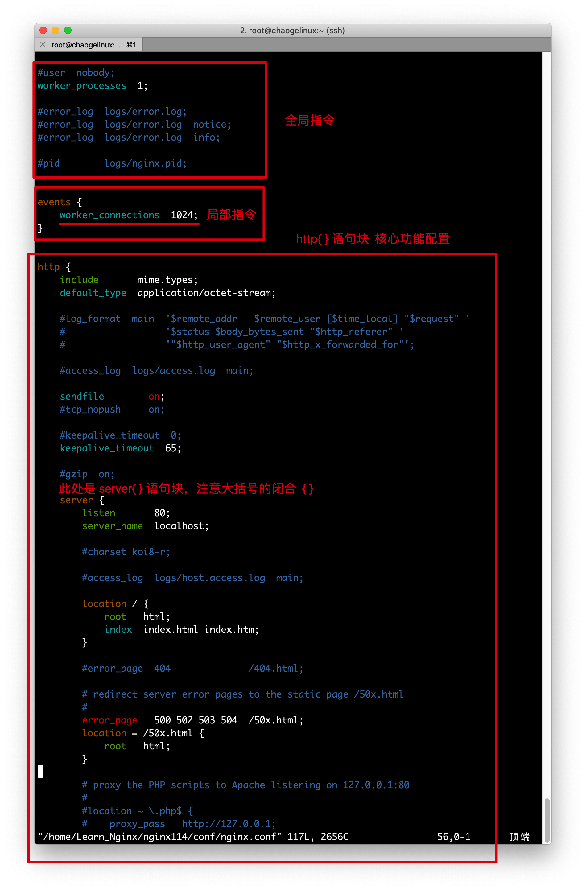
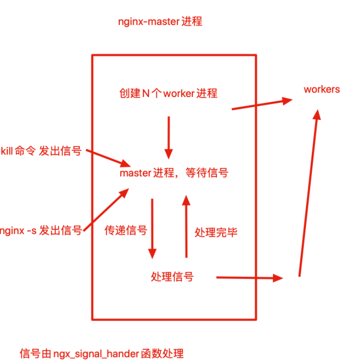

### 安装

Nginx如今分为商业版，开源版，支持Linux与Windows平台下载使用

```
nginx.com  商业版
nginx.org  开源版
https://tengine.taobao.org/
```

```
1.centos7系统 源代码编译安装(指定路径，额外开启nginx)
2.准备linux编译开发环境
yum install -y gcc gcc-c++ autoconf automake make

yum install zlib zlib-devel openssl openssl-devel pcre pcre-devel wget httpd-tools vim

```

#### 编译安装nginx

```nginx
1.下载nginx源代码(nginx.org)
wget https://nginx.org/download/nginx-1.18.0.tar.gz
1.1还可以用淘宝的nginx的源码
http://tengine.taobao.org/
wget http://tengine.taobao.org/download/tengine-2.3.3.tar.gz

2.解压缩文件
tar -zxvf tengine-2.3.3.tar.gz

2.1给文件添加高亮提示
[root@servera conf]# mkdir -p ~/.vim
[root@servera conf]# cp -r /opt/nginx-1.18.0/contrib/vim/* ~/.vim/

3.Nginx源代码目录介绍
auto 检测系统模块
CHANGES nginx更改记录文件
conf 存放nginx配置文件
configure 释放编译文件的定制脚本
contrib 提供了perl与vim插件语法高亮
html 存放标准html页面语法
src 存放nginx源码

4.(第一曲)开始编译Nginx，扩展编译模块
#列出Nginx的编译选项，如制定安装路径，配置文件、日志文件等路径，指定开启模块功能等
./configure --help 

5.(第二曲)编译Nginx初步
./configure --prefix=/opt/ngx1.18/ --with-http_ssl_module  --with-http_flv_module --with-http_gzip_static_module --with-http_stub_status_module  --with-threads  --with-file-aio

6.执行make编译7.(第三曲)首次编译安装，生成nginx的可执行命令
make && make install


8.查看安装后的nginx目录
[root@servera opt]# cd ngx1.18/
[root@servera ngx1.18]# ls -l
conf  (nginx配置文件)
html  (nginx网页根目录文件，存放站点的静态文件数据)
logs  (存放nginx的各种日志)
sbin  (存放该软件的可执行命令)

9.创建nginx的环境变量，修改配置文件,配置完成后重新登陆
vim /etc/profile.d/nginx.sh
	export PATH=$PATH:/opt/ngx1.18/sbin
	
10.使用nginx指令来启动nginx服务
nginx 首次启动正常，如果出现报错情况则需要停掉服务nginx -s stop然后在启动
如果不重启nginx重新加载配置文件，nginx提供了一个reload功能，不重启重读配置文件
nginx -s reload #平滑重启

11.检查nginx编译模块信息
nginx -V
```

#### nginx主配置文件语法了解

```
vim vim /opt/ngx1.18/conf/nginx.conf
```

- nginx.conf由指令与指令块构成
- 每行语句由分号结束，指令和参数之间由空格分隔
- 指令块可以大括号{}组织多条指令块
- 配置文件中#号添加注释信息
- 支持`$变量`使用变量
- 支持include语句，组合多个配置文件
- 部分指令支持正则表达式



### nginx.conf指令注释

```nginx
######Nginx配置文件nginx.conf中文详解#####

#定义Nginx运行的用户和用户组
user www www;

#nginx进程数，建议设置为等于CPU总核心数。
worker_processes 8;

#全局错误日志定义类型，[ debug | info | notice | warn | error | crit ]
error_log /usr/local/nginx/logs/error.log info;

#进程pid文件
pid /usr/local/nginx/logs/nginx.pid;

#指定进程可以打开的最大描述符：数目
#工作模式与连接数上限
#这个指令是指当一个nginx进程打开的最多文件描述符数目，理论值应该是最多打开文件数（ulimit -n）与nginx进程数相除，但是nginx分配请求并不是那么均匀，所以最好与ulimit -n 的值保持一致。
#现在在linux 2.6内核下开启文件打开数为65535，worker_rlimit_nofile就相应应该填写65535。
#这是因为nginx调度时分配请求到进程并不是那么的均衡，所以假如填写10240，总并发量达到3-4万时就有进程可能超过10240了，这时会返回502错误。
worker_rlimit_nofile 65535;


events
{
    #参考事件模型，use [ kqueue | rtsig | epoll | /dev/poll | select | poll ]; epoll模型
    #是Linux 2.6以上版本内核中的高性能网络I/O模型，linux建议epoll，如果跑在FreeBSD上面，就用kqueue模型。
    #补充说明：
    #与apache相类，nginx针对不同的操作系统，有不同的事件模型
    #A）标准事件模型
    #Select、poll属于标准事件模型，如果当前系统不存在更有效的方法，nginx会选择select或poll
    #B）高效事件模型
    #Kqueue：使用于FreeBSD 4.1+, OpenBSD 2.9+, NetBSD 2.0 和 MacOS X.使用双处理器的MacOS X系统使用kqueue可能会造成内核崩溃。
    #Epoll：使用于Linux内核2.6版本及以后的系统。
    #/dev/poll：使用于Solaris 7 11/99+，HP/UX 11.22+ (eventport)，IRIX 6.5.15+ 和 Tru64 UNIX 5.1A+。
    #Eventport：使用于Solaris 10。 为了防止出现内核崩溃的问题， 有必要安装安全补丁。
    use epoll;

    #单个进程最大连接数（最大连接数=连接数*进程数）
    #根据硬件调整，和前面工作进程配合起来用，尽量大，但是别把cpu跑到100%就行。每个进程允许的最多连接数，理论上每台nginx服务器的最大连接数为。
    worker_connections 65535;

    #keepalive超时时间。
    keepalive_timeout 60;

    #客户端请求头部的缓冲区大小。这个可以根据你的系统分页大小来设置，一般一个请求头的大小不会超过1k，不过由于一般系统分页都要大于1k，所以这里设置为分页大小。
    #分页大小可以用命令getconf PAGESIZE 取得。
    #[root@web001 ~]# getconf PAGESIZE
    #4096
    #但也有client_header_buffer_size超过4k的情况，但是client_header_buffer_size该值必须设置为“系统分页大小”的整倍数。
    client_header_buffer_size 4k;

    #这个将为打开文件指定缓存，默认是没有启用的，max指定缓存数量，建议和打开文件数一致，inactive是指经过多长时间文件没被请求后删除缓存。
    open_file_cache max=65535 inactive=60s;

    #这个是指多长时间检查一次缓存的有效信息。
    #语法:open_file_cache_valid time 默认值:open_file_cache_valid 60 使用字段:http, server, location 这个指令指定了何时需要检查open_file_cache中缓存项目的有效信息.
    open_file_cache_valid 80s;

    #open_file_cache指令中的inactive参数时间内文件的最少使用次数，如果超过这个数字，文件描述符一直是在缓存中打开的，如上例，如果有一个文件在inactive时间内一次没被使用，它将被移除。
    #语法:open_file_cache_min_uses number 默认值:open_file_cache_min_uses 1 使用字段:http, server, location  这个指令指定了在open_file_cache指令无效的参数中一定的时间范围内可以使用的最小文件数,如果使用更大的值,文件描述符在cache中总是打开状态.
    open_file_cache_min_uses 1;

    #语法:open_file_cache_errors on | off 默认值:open_file_cache_errors off 使用字段:http, server, location 这个指令指定是否在搜索一个文件是记录cache错误.
    open_file_cache_errors on;
}


#设定http服务器，利用它的反向代理功能提供负载均衡支持
http
{
    #文件扩展名与文件类型映射表
    include mime.types;

    #默认文件类型
    default_type application/octet-stream;

    #默认编码
    #charset utf-8;

    #服务器名字的hash表大小
    #保存服务器名字的hash表是由指令server_names_hash_max_size 和server_names_hash_bucket_size所控制的。参数hash bucket size总是等于hash表的大小，并且是一路处理器缓存大小的倍数。在减少了在内存中的存取次数后，使在处理器中加速查找hash表键值成为可能。如果hash bucket size等于一路处理器缓存的大小，那么在查找键的时候，最坏的情况下在内存中查找的次数为2。第一次是确定存储单元的地址，第二次是在存储单元中查找键 值。因此，如果Nginx给出需要增大hash max size 或 hash bucket size的提示，那么首要的是增大前一个参数的大小.
    server_names_hash_bucket_size 128;

    #客户端请求头部的缓冲区大小。这个可以根据你的系统分页大小来设置，一般一个请求的头部大小不会超过1k，不过由于一般系统分页都要大于1k，所以这里设置为分页大小。分页大小可以用命令getconf PAGESIZE取得。
    client_header_buffer_size 32k;

    #客户请求头缓冲大小。nginx默认会用client_header_buffer_size这个buffer来读取header值，如果header过大，它会使用large_client_header_buffers来读取。
    large_client_header_buffers 4 64k;

    #设定通过nginx上传文件的大小
    client_max_body_size 8m;

    #开启高效文件传输模式，sendfile指令指定nginx是否调用sendfile函数来输出文件，对于普通应用设为 on，如果用来进行下载等应用磁盘IO重负载应用，可设置为off，以平衡磁盘与网络I/O处理速度，降低系统的负载。注意：如果图片显示不正常把这个改成off。
    #sendfile指令指定 nginx 是否调用sendfile 函数（zero copy 方式）来输出文件，对于普通应用，必须设为on。如果用来进行下载等应用磁盘IO重负载应用，可设置为off，以平衡磁盘与网络IO处理速度，降低系统uptime。
    sendfile on;

    #开启目录列表访问，合适下载服务器，默认关闭。
    autoindex on;

    #此选项允许或禁止使用socke的TCP_CORK的选项，此选项仅在使用sendfile的时候使用
    tcp_nopush on;

    tcp_nodelay on;

    #长连接超时时间，单位是秒
    keepalive_timeout 120;

    #FastCGI相关参数是为了改善网站的性能：减少资源占用，提高访问速度。下面参数看字面意思都能理解。
    fastcgi_connect_timeout 300;
    fastcgi_send_timeout 300;
    fastcgi_read_timeout 300;
    fastcgi_buffer_size 64k;
    fastcgi_buffers 4 64k;
    fastcgi_busy_buffers_size 128k;
    fastcgi_temp_file_write_size 128k;

    #gzip模块设置
    gzip on; #开启gzip压缩输出
    gzip_min_length 1k;    #最小压缩文件大小
    gzip_buffers 4 16k;    #压缩缓冲区
    gzip_http_version 1.0;    #压缩版本（默认1.1，前端如果是squid2.5请使用1.0）
    gzip_comp_level 2;    #压缩等级
    gzip_types text/plain application/x-javascript text/css application/xml;    #压缩类型，默认就已经包含textml，所以下面就不用再写了，写上去也不会有问题，但是会有一个warn。
    gzip_vary on;

    #开启限制IP连接数的时候需要使用
    #limit_zone crawler $binary_remote_addr 10m;


    #负载均衡配置
    upstream pythonav.cn {

        #upstream的负载均衡，weight是权重，可以根据机器配置定义权重。weigth参数表示权值，权值越高被分配到的几率越大。
        server 192.168.80.121:80 weight=3;
        server 192.168.80.122:80 weight=2;
        server 192.168.80.123:80 weight=3;

        #nginx的upstream目前支持4种方式的分配
        #1、轮询（默认）
        #每个请求按时间顺序逐一分配到不同的后端服务器，如果后端服务器down掉，能自动剔除。
        #2、weight
        #指定轮询几率，weight和访问比率成正比，用于后端服务器性能不均的情况。
        #例如：
        #upstream bakend {
        #    server 192.168.0.14 weight=10;
        #    server 192.168.0.15 weight=10;
        #}
        #2、ip_hash
        #每个请求按访问ip的hash结果分配，这样每个访客固定访问一个后端服务器，可以解决session的问题。
        #例如：
        #upstream bakend {
        #    ip_hash;
        #    server 192.168.0.14:88;
        #    server 192.168.0.15:80;
        #}
        #3、fair（第三方）
        #按后端服务器的响应时间来分配请求，响应时间短的优先分配。
        #upstream backend {
        #    server server1;
        #    server server2;
        #    fair;
        #}
        #4、url_hash（第三方）
        #按访问url的hash结果来分配请求，使每个url定向到同一个后端服务器，后端服务器为缓存时比较有效。
        #例：在upstream中加入hash语句，server语句中不能写入weight等其他的参数，hash_method是使用的hash算法
        #upstream backend {
        #    server squid1:3128;
        #    server squid2:3128;
        #    hash $request_uri;
        #    hash_method crc32;
        #}

        #tips:
        #upstream bakend{#定义负载均衡设备的Ip及设备状态}{
        #    ip_hash;
        #    server 127.0.0.1:9090 down;
        #    server 127.0.0.1:8080 weight=2;
        #    server 127.0.0.1:6060;
        #    server 127.0.0.1:7070 backup;
        #}
        #在需要使用负载均衡的server中增加 proxy_pass http://bakend/;

        #每个设备的状态设置为:
        #1.down表示单前的server暂时不参与负载
        #2.weight为weight越大，负载的权重就越大。
        #3.max_fails：允许请求失败的次数默认为1.当超过最大次数时，返回proxy_next_upstream模块定义的错误
        #4.fail_timeout:max_fails次失败后，暂停的时间。
        #5.backup： 其它所有的非backup机器down或者忙的时候，请求backup机器。所以这台机器压力会最轻。

        #nginx支持同时设置多组的负载均衡，用来给不用的server来使用。
        #client_body_in_file_only设置为On 可以讲client post过来的数据记录到文件中用来做debug
        #client_body_temp_path设置记录文件的目录 可以设置最多3层目录
        #location对URL进行匹配.可以进行重定向或者进行新的代理 负载均衡
    }


    #虚拟主机的配置
    server
    {
        #监听端口
        listen 80;

        #域名可以有多个，用空格隔开
        server_name www.w3cschool.cn w3cschool.cn;
        index index.html index.htm index.php;
        root /data/www/w3cschool;

        #对******进行负载均衡
        location ~ .*.(php|php5)?$
        {
            fastcgi_pass 127.0.0.1:9000;
            fastcgi_index index.php;
            include fastcgi.conf;
        }

        #图片缓存时间设置
        location ~ .*.(gif|jpg|jpeg|png|bmp|swf)$
        {
            expires 10d;
        }

        #JS和CSS缓存时间设置
        location ~ .*.(js|css)?$
        {
            expires 1h;
        }

        #日志格式设定
        #$remote_addr与$http_x_forwarded_for用以记录客户端的ip地址；
        #$remote_user：用来记录客户端用户名称；
        #$time_local： 用来记录访问时间与时区；
        #$request： 用来记录请求的url与http协议；
        #$status： 用来记录请求状态；成功是200，
        #$body_bytes_sent ：记录发送给客户端文件主体内容大小；
        #$http_referer：用来记录从那个页面链接访问过来的；
        #$http_user_agent：记录客户浏览器的相关信息；
        #通常web服务器放在反向代理的后面，这样就不能获取到客户的IP地址了，通过$remote_add拿到的IP地址是反向代理服务器的iP地址。反向代理服务器在转发请求的http头信息中，可以增加x_forwarded_for信息，用以记录原有客户端的IP地址和原来客户端的请求的服务器地址。
        log_format access '$remote_addr - $remote_user [$time_local] "$request" '
        '$status $body_bytes_sent "$http_referer" '
        '"$http_user_agent" $http_x_forwarded_for';

        #定义本虚拟主机的访问日志
        access_log  /usr/local/nginx/logs/host.access.log  main;
        access_log  /usr/local/nginx/logs/host.access.404.log  log404;

        #对 "/" 启用反向代理
        location / {
            proxy_pass http://127.0.0.1:88;
            proxy_redirect off;
            proxy_set_header X-Real-IP $remote_addr;

            #后端的Web服务器可以通过X-Forwarded-For获取用户真实IP
            proxy_set_header X-Forwarded-For $proxy_add_x_forwarded_for;

            #以下是一些反向代理的配置，可选。
            proxy_set_header Host $host;

            #允许客户端请求的最大单文件字节数
            client_max_body_size 10m;

            #缓冲区代理缓冲用户端请求的最大字节数，
            #如果把它设置为比较大的数值，例如256k，那么，无论使用firefox还是IE浏览器，来提交任意小于256k的图片，都很正常。如果注释该指令，使用默认的client_body_buffer_size设置，也就是操作系统页面大小的两倍，8k或者16k，问题就出现了。
            #无论使用firefox4.0还是IE8.0，提交一个比较大，200k左右的图片，都返回500 Internal Server Error错误
            client_body_buffer_size 128k;

            #表示使nginx阻止HTTP应答代码为400或者更高的应答。
            proxy_intercept_errors on;

            #后端服务器连接的超时时间_发起握手等候响应超时时间
            #nginx跟后端服务器连接超时时间(代理连接超时)
            proxy_connect_timeout 90;

            #后端服务器数据回传时间(代理发送超时)
            #后端服务器数据回传时间_就是在规定时间之内后端服务器必须传完所有的数据
            proxy_send_timeout 90;

            #连接成功后，后端服务器响应时间(代理接收超时)
            #连接成功后_等候后端服务器响应时间_其实已经进入后端的排队之中等候处理（也可以说是后端服务器处理请求的时间）
            proxy_read_timeout 90;

            #设置代理服务器（nginx）保存用户头信息的缓冲区大小
            #设置从被代理服务器读取的第一部分应答的缓冲区大小，通常情况下这部分应答中包含一个小的应答头，默认情况下这个值的大小为指令proxy_buffers中指定的一个缓冲区的大小，不过可以将其设置为更小
            proxy_buffer_size 4k;

            #proxy_buffers缓冲区，网页平均在32k以下的设置
            #设置用于读取应答（来自被代理服务器）的缓冲区数目和大小，默认情况也为分页大小，根据操作系统的不同可能是4k或者8k
            proxy_buffers 4 32k;

            #高负荷下缓冲大小（proxy_buffers*2）
            proxy_busy_buffers_size 64k;

            #设置在写入proxy_temp_path时数据的大小，预防一个工作进程在传递文件时阻塞太长
            #设定缓存文件夹大小，大于这个值，将从upstream服务器传
            proxy_temp_file_write_size 64k;
        }


        #设定查看Nginx状态的地址
        location /NginxStatus {
            stub_status on;
            access_log on;
            auth_basic "NginxStatus";
            auth_basic_user_file confpasswd;
            #htpasswd文件的内容可以用apache提供的htpasswd工具来产生。
        }

        #本地动静分离反向代理配置
        #所有jsp的页面均交由tomcat或resin处理
        location ~ .(jsp|jspx|do)?$ {
            proxy_set_header Host $host;
            proxy_set_header X-Real-IP $remote_addr;
            proxy_set_header X-Forwarded-For $proxy_add_x_forwarded_for;
            proxy_pass http://127.0.0.1:8080;
        }

        #所有静态文件由nginx直接读取不经过tomcat或resin
        location ~ .*.(htm|html|gif|jpg|jpeg|png|bmp|swf|ioc|rar|zip|txt|flv|mid|doc|ppt|
        pdf|xls|mp3|wma)$
        {
            expires 15d; 
        }

        location ~ .*.(js|css)?$
        {
            expires 1h;
        }
    }
}
######Nginx配置文件nginx.conf中文详解#####

nginx.conf详解
```

#### nginx.conf重要的指令块

核心功能都在于http{}指令块里，http{}块还包含了以下指令

- server{} 指令块 ，对应一个站点配置，反向代理，静态资源站点
- location{} ，对应一个url
- upstream{} ，定义上游服务，负载均衡池

### Nginx命令行

- 启停指令
  - nginx -s stop
  - nginx -s reload
  - nginx 首次输入表示启动
- nginx帮助指令

```
[root@chaogelinux nginx114]# nginx  -h
nginx version: nginx/1.14.0
Usage: nginx [-?hvVtTq] [-s signal] [-c filename] [-p prefix] [-g directives]

Options:
  -?,-h         : this help   #帮助信息
  -v            : show version and exit        #显示版本
  -V            : show version and configure options then exit #显示编译信息与版本
  -t            : test configuration and exit    #测试配置文件语法
  -T            : test configuration, dump it and exit    #测试语法且输出内容
  -q            : suppress non-error messages during configuration testing
  -s signal     : send signal to a master process: stop, quit, reopen, reload #发送信号，stop立即停止，quit优雅停止，reload重读配置文件，reopen重新记录日志
  -p prefix     : set prefix path (default: /home/Learn_Nginx/nginx114//)
  -c filename   : set configuration file (default: conf/nginx.conf) #使用指定配置文件
  -g directives : set global directives out of configuration file #覆盖默认参数
```


### nginx命令行案例

#### 配置文件重读

在nginx正在运行时，如实修改了nginx.conf或是新增了一些功能配置，让其生效，可能需要重启整个nginx进程、

但是你不能保证某个时间段没有用户在访问nginx，重启会断开用户的连接，造成莫名的故障

因此nginx提供了reload重载功能，不停止服务，更新配置文件

```
1.修改nginx.conf
worker_processes  3; #定义nginx工作进程数的

2.重载配置文件
nginx -s reload

3.检查linux进程
[root@chaogelinux nginx114]# vim conf/nginx.conf
[root@chaogelinux nginx114]#
[root@chaogelinux nginx114]# ps aux|grep nginx
root      6191     1  0 10:33 ?        00:00:00 nginx: master process nginx
nobody    6213  6191  0 10:33 ?        00:00:00 nginx: worker process
nobody    6214  6191  0 10:33 ?        00:00:00 nginx: worker process
nobody    6215  6191  0 10:33 ?        00:00:00 nginx: worker process
root      6345  5283  0 10:38 pts/0    00:00:00 grep --color=auto nginx
```

### Nginx-master信号

nginx进程信号传递如图



```
1.master不处理请求，而是分配worker进程，负责重启，热部署，重载等功能。
2.master根据worker_processes 定义开始的workers数量
3.worker运行后，master处于挂起状态，等待信号
4.可以发送kill，或者nginx -s 参数发出信号
```

#### 信号集

| nginx -s 对应参数 | 信号  | 含义                                      | English                                                      |
| :---------------- | :---- | :---------------------------------------- | :----------------------------------------------------------- |
| stop              | TERM  | 强制关闭整个服务                          | Shut down quickly.                                           |
| null              | INT   | 强制关闭整个服务                          | Shut down quickly.                                           |
| quit              | QUIT  | 优雅地关闭整个服务                        | Shut down gracefully.                                        |
| reopen            | USR1  | 重新打开日志记录                          | Reopen log files.                                            |
| reload            | HUP   | 重新读取配置文件,并且优雅地退出老的worker | Reload configuration, start the new worker process with a new configuration, and gracefully shut down old worker processes. |
| null              | USR2  | 平滑升级到新版本                          | Upgrade the nginx executable on the fly.                     |
| null              | WINCH | 优雅地关闭worker(在热更新的时候必用)      | Shut down worker processes gracefully.                       |

#### 热部署

nginx作为一个优秀的反向代理服务器，同时具备高可用的特性，Nginx也支持热部署。

热部署指的是`在不重启或关闭进程情况下，新应用直接替换掉旧的应用`

```
热部署大致流程
1.备份旧的二进制文件
2.编译安装新的二进制文件，覆盖旧的二进制文件
3.发送USR2信号给旧master进程
4.发送WINCH信号给旧master进程
5.发送QUIT信号给旧master进程
```

```
环境准备：
旧版本
nginx version: nginx/1.18.0
新版本
https://nginx.org/download/nginx-1.21.3.tar.gz
```

【nginx热部署】

nginx工作模式是master-worker（包工头-工人）

```
刚才所说的nginx支持`reload重载`仅仅是nginx的master进程，检查配置文件语法是否正确，错则返回错误、正确也`不会改变`已经建立连接的worker，只得等待worker处理完毕请求之后，`杀死旧配置文件的worker，启动新配置文件的worker`。

但是Nginx这里提提供了热部署功能，就是在`不影响用户体验下，进行软件版本升级`，也就是不主动杀死worker，替换软件的二进制文件。
```

### 热部署具体操作

```
1.备份旧版本的nginx二进制文件
pwd
/opt/ngx118/sbin/nginx

mv nginx nginx.old
2.检查旧版本nginx的编译参数
nginx.old -V

3.编译安装新版本nginx
wget https://nginx.org/download/nginx-1.21.3.tar.gz
tar -zxf nginx-1.21.3.tar.gz
cd nginx-1.21.3/
3.1开始编译
./configure --prefix=/opt/ngx1.18/ --with-http_ssl_module --with-http_flv_module --with-http_gzip_static_module --with-http_stub_status_module --with-threads --with-file-aio
3.2编译安装
make && make install
4.发现两个nginx程序
[root@servera sbin]# ls
nginx  nginx.old
5.检查系统nginx状态(通过pid,ppid验证worker process是由master process创建的)
ps -ef | grep nginx
6.此时发送一个USR2信号给旧的master process,作用是使得nginx旧的版本停止接收用户的请求，并且切换为新的nginx版本
kill -USR2 `cat /opt/ngx1.18/logs/nginx.pid`
当执行完毕上述的命令，nginx-master旧的，首先会重新命名它的pid文件，然后添加上.oldbin后缀，在启动一个新的master主进程，以及worker，使用的是新版本的nginx二进制命令，此时新的nginx就能够自动接收用户发来的请求，过渡到新的nginx-worker工作进程上，因此实现了平滑过渡
(如果执行此命令没有出现新的master进程，要把旧的nginx用绝对路径启动，然后在发送kill -USR2信号)
7.查看新旧pid文件
[root@servera nginx-1.21.3]# cd /opt/ngx1.18/
[root@servera ngx1.18]# cd logs
[root@servera logs]# ls
access.log  error.log  nginx.pid  nginx.pid.oldbin
[root@servera logs]# cat nginx.pid
10375
[root@servera logs]# cat nginx.pid.oldbin 
10330
8.发送winch信号给master进程，优雅关闭worker
kill -WINCH `cat /opt/ngx1.18/logs/nginx.pid.oldbin`
```

### 	nginx日志切割

日志切割是线上很常见的操作，控制单个文件大小，便于管理日志

```
本地模拟并发访问
ab -kc 100 -n 1000 http://127.0.0.1/
```

```
1.查看日志进行切割
ls -lh
2.重命名日志文件
mv access.log access.log$(date +"%Y-%m-%d--%H:%M:%S")
3.发送USR1信号给nginx-master,重新打开日志记录，生成新的日志文件
nginx -s reopen  #等同于 Kill -USR1 nginx.pid 
4.注意，在以上的nginx重命名日志切割，不要着急立即对文件修改，且要sleep 等待1秒
由于nginx的工作模式，master下发指令给worker只是做了标记，当业务量大的时候，这个修改操作可能会慢一点，不会立即生效

5.在生产环境下，主要以crontab形式，执行cut_nginx_log.sh脚本的
编写定时日志切割脚本
vim cut_nginx_log.sh

#!/bin/bash
# 脚本写入crontab，每天0点执行，这是一个nginx日志切割脚本

#nginx日志存放点
logs_path="/opt/ngx1.18/logs/"
mkdir -p ${logs_path}$(date -d "yesterday" +"%Y")/$(date -d "yesterday" +"%m")
mv ${logs_path}access.log ${logs_path}$(date -d "yesterday" +"%Y")/$(date -d "yesterday" +"%m")/access_$(date -d "yesterday" +"%Y-%m-%d").log


#发送USR1信号给nginx-master,重新打开日志记录，生成新的日志文件
nginx -s reopen


6.把脚本执行，加入crontab 每天0点执行
chmod +x cut_nginx_log.sh

crontab -e  #打开定时任务
[root@servera logs]# crontab -l
0 0 * * * /bin/bash /opt/ngx1.18/logs/cut_nginx_log.sh
```

