## lnmp

LNMP是网站架构初期最合适的单体架构。因为初创型技术团队对于技术的选型，需要考虑如下因素

1. 在创业初期，研发资源有限，研发人力有限，技术储备有限，需要选择一个易维护、简单的技术架构；
2. 产品需要快速研发上线，并能够满足快速迭代要求，现实情况决定了一开始没有时间和精力来选择一个过于复杂的分布式架构系统，研发速度必须要快；
3. 创业初期，业务复杂度比较低，业务量也比较小，如果选择过于复杂的架构，反而会增加研发难度以及运维难度；
4. 遵从选择合适的技术而不是最好的技术原则，并权衡研发效率和产品目标，同时创业初期只有一个PHP研发人员，过于复杂的技术架构必然会带来比较高昂的学习成本。

基于如上的因素，LNMP架构就是最合适的。

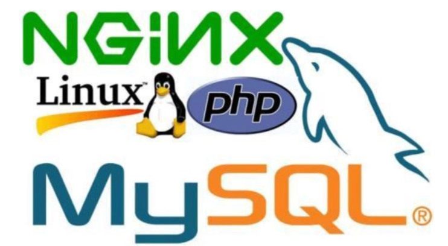

如此架构，一般三台服务器足以，Nginx与后台系统部署在一台机器，Mysql数据库单独服务器，Mencached缓存一台服务器。这样的架构优势在于

- 单体架构，架构简单，清晰的分层结构；
- 可以快速研发，满足产品快速迭代要求；
- 没有复杂的技术，技术学习成本低，同时运维成本低，无需专业的运维，节省开支。

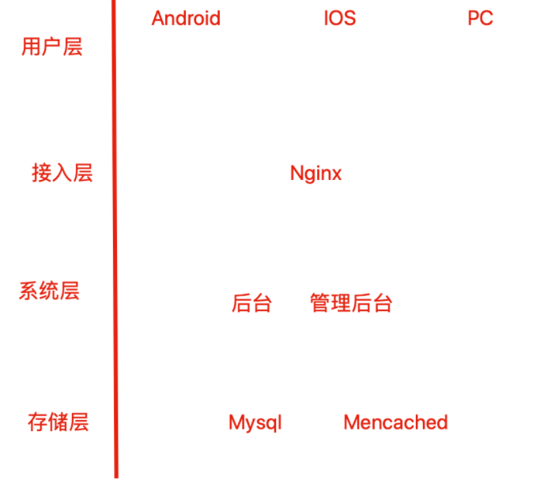

## LNMP组合工作流程

LNMP工作流是用户通过浏览器输入域名访问Nginx web服务，Nginx判断请求是静态请求则由Nginx返回给用户。如果是动态请求(如.php结尾)，那么Nginx会将该请求通过FastCGI接口发送给PHP引擎（php-fpm进程）进行解析，如果该动态请求需要读取mysql数据库，php会继续向后读取数据库，最终Nginx将获取的数据返回给用户。

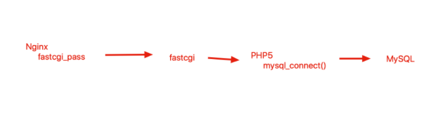

## LNMP环境搭建Nginx编译安装

```
1.安装nginx所需的pcre库，让nginx支持url重写的rewrite功能
yum install pcre pcre-devel -y

2.安装openssl-devel模块，nginx需要支持https
[root@web01 opt]# yum install openssl openssl-devel -y

2.1 安装gcc编译器
yum install gcc -y

3.下载nginx源码包
[root@bogon opt]# mkdir /tools
[root@bogon opt]# cd /tools
[root@bogon tools]#  wget http://nginx.org/download/nginx-1.16.0.tar.gz
[root@bogon tools]# echo $?
0

4.解压缩源代码包
[root@bogon tools]# tar -zxf nginx-1.16.0.tar.gz 
[root@bogon tools]# ls
nginx-1.16.0  nginx-1.16.0.tar.gz

5.创建普通nginx用户，用于运行nginx进程，降低nginx的系统权限
(-u 指定uid -s指定bash解释器权限 -M不创建家目录)
useradd nginx -u 1111 -s /sbin/nologin -M

6.编译安装nginx服务
[root@bogon nginx-1.16.0]# ./configure --user=nginx --group=nginx --prefix=/tools/nginx-1.16/ --with-http_stub_status_module --with-http_ssl_module && make && make install
[root@bogon nginx-1.16.0]# echo $?
0

7.给nginx配置软连接，这是生产环境常用操作，便于运维，开发，一起使用，便于日后升级
[root@bogon tools]# ln -s /tools/nginx-1.16/  /tools/nginx

8.配置nginx环境变量
vim /etc/profile.d/nginx.sh

export PATH="$PATH:/tools/nginx-1.16/sbin"

[root@bogon ~]# which 
/tools/nginx-1.16/sbin/nginx

9.启动nginx
[root@bogon ~]# nginx
```

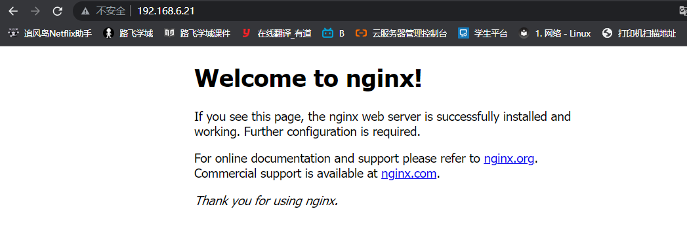

## 安装Mysql

```
安装方式
yum，rpm包安装，简单，快速，无法定制化，新手推荐用yum
二进制方式安装，把安装好后的mysql打包成压缩文件，用户可以解压缩后直接简单配置即可使用，无需在安装，速度较快适合专业dba
源代码编译安装，定制化软件功能，安装过程复杂
```

```
1.创建普通mysql用户，降低程序运行权限
useradd -s /sbin/nologin mysql


2.查看mysql用户信息
[root@bogon ~]# id mysql
uid=1112(mysql) gid=1112(mysql) groups=1112(mysql)

3.提前下号wget工具
yum install get -y

4.下载mysql二进制代码包
wget http://mirrors.163.com/mysql/Downloads/MySQL-5.7/mysql-5.7.34-el7-x86_64.tar.gz


```

## 二进制方式安装mysql

```
1.解压mysql安装包
[root@bogon tools]# tar -xzvf mysql-5.7.34-el7-x86_64.tar.gz

2.配置软链接 ，快捷访问mysql
ln -s /tools/mysql-5.7.34-el7-x86_64 /tools/mysql

3.卸载可能centos7存在的mariadb相关依赖关系,防止冲突
rpm -e --nodeps mariadb-libs

4.准备启动mysql的配置文件
vim /etc/my.cnf
[mysqld] 对服务端生效的参数
[mysql] 对客户端生效的参数
按照自己安装的路径修改如下配置

[mysqld]
basedir=/tools/mysql/
datadir=/tools/mysql/data
socket=/tmp/mysql.sock
server_id=1
port=3306
log_error=/tools/mysql/data/mysql_err.log

[mysql]
socket=/tmp/mysql.sock

```

## 初始化mysql服务端

```
1.首先卸载系统自带的mariadb的依赖
rpm -e --nodeps mariadb-libs

2.检查mysql的所需依赖环境
yum install libaio-devel -y

3.创建mysql数据文件夹，用于初始化数据，进行权限控制
mkdir -p /tools/mysql/data/
chown -R mysql.mysql /tools/mysql #修改mysql所有的内容，更改属主，属组为mysql用户

4.初始化mysql数据库
/tools/mysql/bin/mysqld --initialize-insecure --user=mysql --basedir=/tools/mysql/ --datadir=/tools/mysql/data/

```

## 配置mysql客户端

使用systemctl 命令管理mysql数据库

```
1.编写mysql启动脚本
vim /etc/systemd/system/mysqld.service

[Unit]
Description=MySQL server by chaoge
Documentation=man:mysqld(8)
Documentation=http://dev.mysql.com/doc/refman/en/using-systemd.html
After=network.target
After=syslog.target
[Install]
WantedBy=multi-user.target
[Service]
User=mysql
Group=mysql
ExecStart=/tools/mysql/bin/mysqld --defaults-file=/etc/my.cnf
LimitNOFILE=5000
```

## 启动mysqld服务端

```
systemctl start mysqld
systemctl status mysqld
systemctl enable mysqld
```

检查mysql启动状态

```
netstat -tunlp | grep mysql
ps -ef|grep mysql
```

## 登录MySQL数据库

这个mysql是c/s架构模式，就好比登录qq一样

先启动mysqld服务端，然后用mysql客户端命令登录即可

```
1.如果你电脑之前装过其他的数据库，可以用yum卸载，不会影响到第二次安装的二进制mysql数据库yum remove mysql -y
2.退出会话重新登陆3.配置二进制安装的mysql环境变量vim /etc/profile
PATH="$PATH:/tools/mysql/bin"保存退出后，重新登录会话exit

[root@bogon ~]# echo $PATH/usr/local/sbin:/usr/local/bin:/usr/sbin:/usr/bin:/tools/nginx-1.16/sbin:/tools/mysql/bin:/root/bin

[root@bogon ~]# which mysql/tools/mysql/bin/mysql
```

## 登录mysql数据库

```
如果无法使用mysql -u root -p 需要添加安装目录的mysql启动程序在/etc/profile里面

[root@rsync01 tools]# mysql -u root -p
Enter password: 
Welcome to the MariaDB monitor.  Commands end with ; or \g.
Your MySQL connection id is 4
Server version: 5.7.34 MySQL Community Server (GPL)

Copyright (c) 2000, 2018, Oracle, MariaDB Corporation Ab and others.

Type 'help;' or '\h' for help. Type '\c' to clear the current input statement.

MySQL [(none)]>
```

## 修改mysql密码

```
mysqladmin -uroot password '1234'    #使用mysqladmin命令修改密码为1234
mysqladmin -uroot password 'chaoge666'
```

## LNMP之PHP

### FastCGI介绍

CGI（Common Gateway Interface），全文名是`通用网关接口`，用于HTTP服务器和其他机器通信的一种工具。

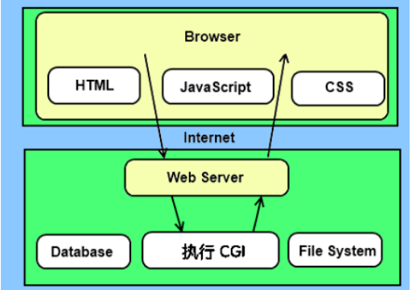

传统CGI程序性能较弱，因此每次HTTP服务器遇到动态程序的时候，都需要重启解析器来执行解析，之后的处理结果才会返回给HTTP服务器。

这样在高并发场景下访问几乎是太差劲了，因此诞生了FastCGI。

FastCGI是一个可伸缩、高速的在HTTP服务器和动态脚本之间通信的接口（在Linux环境下，FastCGI接口就是socket，这个socket可以是文件socket，也可以是IP socket，也就意味着本地通信，远程通信两种），主要优点是把动态语言和HTTP服务器分离开。

多数主流的web服务器都支持FastCGI，如Apache、nginx、LightHttpd等

同时FastCGI也被许多脚本语言所支持，比较流行的脚本语言之一为PHP。

Fast-CGI接口采用c/s架构，可以将`HTTP服务器`和`脚本解析服务器`分离开。

当HTTP服务器遇见静态请求，直接返回，遇见动态请求转发给动态服务器，交给FastCGI去处理，实现动静分离，提升服务器性能。

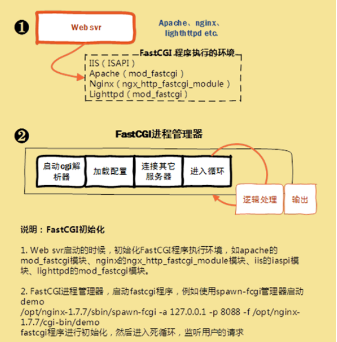

当HTTP服务器发送一个动态请求给FastCGI。

当进来一个请求时，Web 服务器把环境变量和这个页面请求通过一个`unix domain socket`(都位于同一物理服务器）或者一个`IP Socket`（FastCGI部署在其它物理服务器）传递给FastCGI进程。

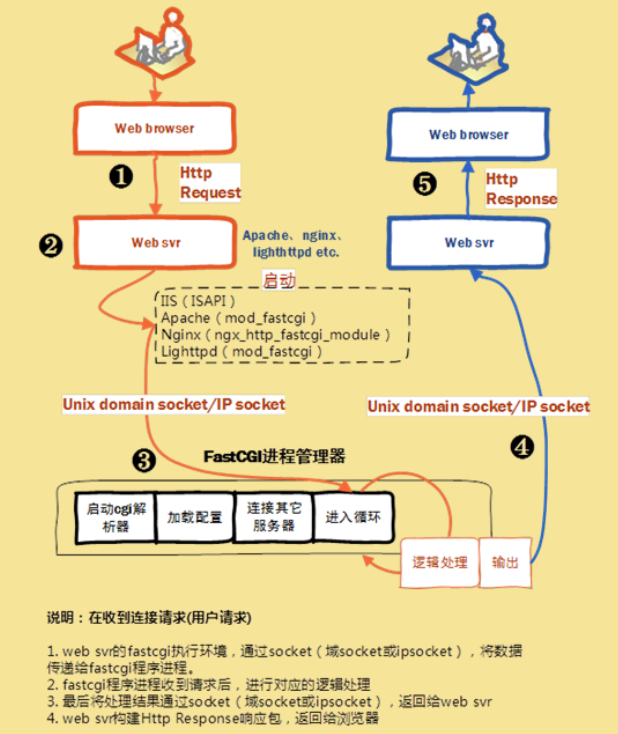

## Nginx FastCGI的运行原理

Nginx默认不支持外部动态程序直接解析，所有的外部程序都得通过FastCGI接口调用。FastCGI接口运行在LInux平台默认是socket进程通信，为了调用CGI程序，还需要FastCGI的wrapper（启动cgi的程序），这个wrapper绑定在某个固定的socket上，例如端口或者文件socket都行。

当Nginx把CGI请求发送给该socket，通过FastCGI接口wrapper接收到请求，派生出一个新的线程，这个线程调用解释器或者外部程序处理脚本来读取返回的数据；

wrapper再吧返回的数据通过FastCGI接口沿着固定的socket传递给Nginx；

最后Nginx把返回的数据交给客户端。

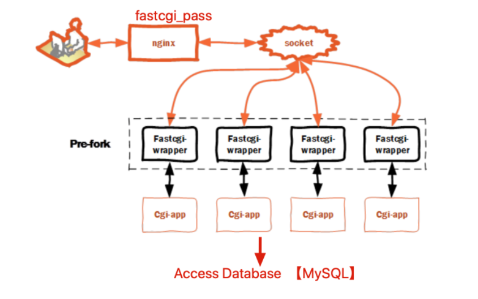

## LNMP之PHP部署

lnmp部署流程 linux nginx mysql php

部署笔记

```
1.检查nginx和mysqld的安装和启动ps -ef|grep nginxps -ef|grep mysql

2.安装php必须有的依赖环境yum install  gcc gcc-c++ make zlib-devel libxml2-devel libjpeg-devel libjpeg-turbo-devel libiconv-devel \freetype-devel libpng-devel gd-devel libcurl-devel libxslt-devel libxslt-devel -y

3.发现yum仓库默认缺少一个libiconv-devel软件包，因此我们可以手动下载自行编译安装该软件 wget -P /tools/  http://ftp.gnu.org/pub/gnu/libiconv/libiconv-1.15.tar.gz

4.解压缩安装的该软件包，编译安装tar -xzf  libiconv-1.15.tar.gz./configure --prefix=/tools/libiconvmake && make install5.检查编译安装命令是否正确结束了echo $?
```

### 安装PHP（FastCGI形式）

```
1.下载php源代码wget http://mirrors.sohu.com/php/php-7.3.5.tar.gz

2.解压缩并编译安装文件
./configure --prefix=/tools/php7.3 \
--enable-mysqlnd \
--with-mysqli=mysqlnd \
--with-pdo-mysql=mysqlnd \
--with-iconv-dir=/opt/libiconv \
--with-freetype-dir \
--with-jpeg-dir \
--with-png-dir \
--with-zlib \
--with-libxml-dir=/usr \
--enable-xml \
--disable-rpath \
--enable-bcmath \
--enable-shmop \
--enable-sysvsem \
--enable-inline-optimization \
--with-curl \
--enable-mbregex \
--enable-fpm \
--enable-mbstring \
--with-gd \
--with-openssl \
--with-mhash \
--enable-pcntl \
--enable-sockets \
--with-xmlrpc \
--enable-soap \
--enable-short-tags \
--enable-static \
--with-xsl \
--with-fpm-user=nginx \
--with-fpm-group=nginx \
--enable-ftp \
--enable-opcache=no

系统环境检查完毕后可以编译安装make && make install
```

编译安装结束后，配置环境变量

```
[root@web01 php-7.3.5]# ln -s /tools/php7.3/ /tools/php
```

## php配置文件

默认的php配置文件模板，在解压php源码的目录下

```
ls php.ini* 
php.ini-development php.ini-production  
#可以比较两个文件的区别 vimdiff php.ini-development php.ini-production 

2.拷贝到安装目录下 
[root@bogon php-7.3.5]#  cp php.ini-development /tools/php7.3/php.ini  
```

## 有关FASTCGI配置文件

```
1.检查FASTCGI默认的配置文件
[root@bogon etc]# pwd/tools/php7.3/etc
[root@bogon etc]# lspear.conf  php-fpm.conf.default  php-fpm.d

2.拷贝模板配置文件，生成新的配置文件
[root@bogon etc]# cp php-fpm.conf.default  php-fpm.conf
[root@bogon etc]# ls
pear.conf  php-fpm.conf  php-fpm.conf.default  php-fpm.d

[root@bogon etc]# cd php-fpm.d/
[root@bogon php-fpm.d]# ls
www.conf.default

[root@bogon php-fpm.d]# cp www.conf.default www.conf

[root@bogon php-fpm.d]# ls

www.conf  www.conf.default
```

## 启动PHP服务，指定以FASTCGI形式

```
1.用户绝对路径启动php进程/tools/php7.3/sbin/php-fpm

2.检查端口进程
[root@bogon sbin]# netstat -tunlp | grep php
[root@bogon sbin]# ps -ef | grep php

```

## 修改nginx支持php代码

```
1.配置文件优化，对每一个虚拟主机单独管理配置拆分cat nginx.conf

#user  nobody;worker_processes  

http {
    include       mime.types;
    default_type  application/octet-stream;

    #log_format  main  '$remote_addr - $remote_user [$time_local] "$request" '
    #                  '$status $body_bytes_sent "$http_referer" '
    #                  '"$http_user_agent" "$http_x_forwarded_for"';


    sendfile        on;

    keepalive_timeout  65;
    charset utf-8;
    #gzip  on;

include extra/my_php.conf;

}


2.手动创建extra目录，以及my_php.conf

vim /tools/nginx/conf/extra/my_php.conf 

server {
listen 80;
server_name _;
location / {
    root html;
    index index.html;
}

#添加有关php程序的解析
location ~ .*\.(php|php5)?$ {
	root html/myphp;
    fastcgi_pass 127.0.0.1:9000;
    fastcgi_index index.php;
    include fastcgi.conf;
}


}

3.检查nginx语法，以及重启nginx
nginx -t
nginx -s reload

4.创建首页脚本文件
[root@rsync01 extra]# mkdir -p /tools/nginx/html/myphp
[root@rsync01 extra]# echo "<?php phpinfo(); ?>"   > /tools/nginx/html/myphp/index.php

5.测试lnmp结合关系
192.168.6.22/index.php
```


5.测试lnmp的结合关系，看到此页面说明环境搭建好了，nginx以及转发请求给php

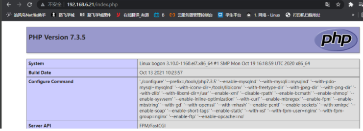

## 测试php访问mysql

编写php脚本代码，直接在网页中解析即可

```
[root@bogon myphp]#cat  tools/nginx/html/myphp/testmysql.php

<?php
$link_id=mysqli_connect('localhost','root','1234') or mysql_error();
if($link_id){

    echo "mysql successful by chaoge.\n";
}else {

    echo mysql_error();
}
?>
```

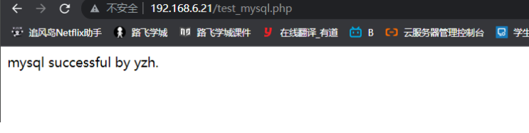

## LNMP远程部署

上述php-fpm和nginx在一起，这里的讲解，是php-fpm和nginx在两台服务器，远程访问

参考博客

```
https://xuchen.wang/archives/nginxphp.html
还有注意，修改php-fpm的启动地址，改为0.0.0.0:9000配置文件夹在安装目录的etc/php-fpm.d/下面的已conf为后缀的文件，一般在安装时我们设置成了www.conf。把 listen = 127.0.0.1:9000 后面的端口号9000换成你需要的端口，然后重启php
```

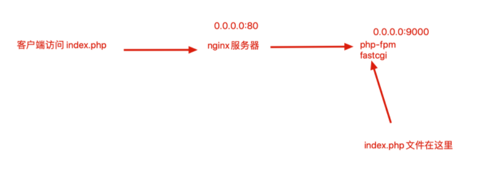

## LNMP部署开源博客


利用开源工具wordpress可以搭建出精美的博客站点，它是一套利用php语言和mysql数据库开发的程序，用于可以在支持php环境和mysql数据库的服务器上搭建blog站点。

你只需要掌握LNMP环境搭建，即可轻松部署wordpress程序。

### LNMP环境准备

```
1.启动mysql数据库，创建用于wordpress博客的数据库
2.创建wordpress数据库
mysql> create database wordpress;
Query OK, 1 row affected (0.01 sec)

mysql> show databases like 'wordpress';
+----------------------+
| Database (wordpress) |
+----------------------+
| wordpress            |
+----------------------+
1 row in set (0.01 sec)

3.创建用于wordpress专用的数据库用户
mysql> create user wordpress;
Query OK, 0 rows affected (0.00 sec)

4.给该用户授权#给wordpress用户授权，允许在localhost本地登录mysql,且有增删改查的权限，且设置密码
mysql> grant all on wordpress.* to wordpress@'localhost' identified by '123456';
Query OK, 0 rows affected, 1 warning (0.02 sec)

5.刷新授权表
mysql> flush privileges;
Query OK, 0 rows affected (0.01 sec)

6.查询用户信息
mysql> select user,authentication_string,host from mysql.user;
+---------------+-------------------------------------------+-----------+
| user          | authentication_string                     | host      |
+---------------+-------------------------------------------+-----------+
| root          | *A4B6157319038724E3560894F7F932C8886EBFCF | localhost |
| mysql.session | *THISISNOTAVALIDPASSWORDTHATCANBEUSEDHERE | localhost |
| mysql.sys     | *THISISNOTAVALIDPASSWORDTHATCANBEUSEDHERE | localhost |
| wordpress     | *6BB4837EB74329105EE4568DDA7DC67ED2CA2AD9 | localhost |
+---------------+-------------------------------------------+-----------+
4 rows in set (0.00 sec)

```

确保nginx支持php程序的解析

```
在/tools/nginx/conf/extra目录中添加如下代码
server {
listen 80;server_name _;
location / { 
root html/myphp;    
index index.php  index.html;  #在这里添加 一个index.php参数
}
#添加有关php程序的解析
#判断当请求url结尾是以php,php5的时候，就进入如下的location代码
location ~ .*\.(php|php5)?$ { 
root html/myphp;    
fastcgi_pass 127.0.0.1:9000;    
fastcgi_index index.php;    
include fastcgi.conf;
	}
}
```

wordpress程序安装

```
1.获取博客程序的代码wget 
wget https://wordpress.org/latest.tar.gz

2.解压缩
yum -y install unzip

unzip  latest.zip

3.移动博客程序代码放入nginx目录下且授权
mv wordpress/*  /tools/nginx/html/myphp/

chown -R nginx.nginx /tools/nginx/html/myphp/

4.重写
nginxnginx -s reload

5.访问wordpress
```

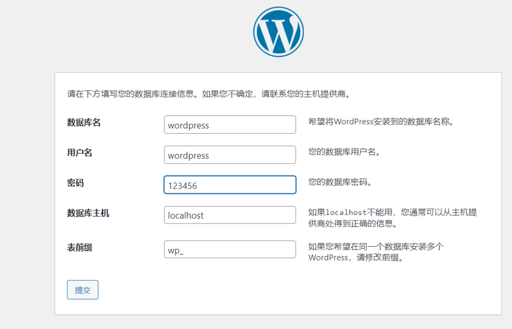

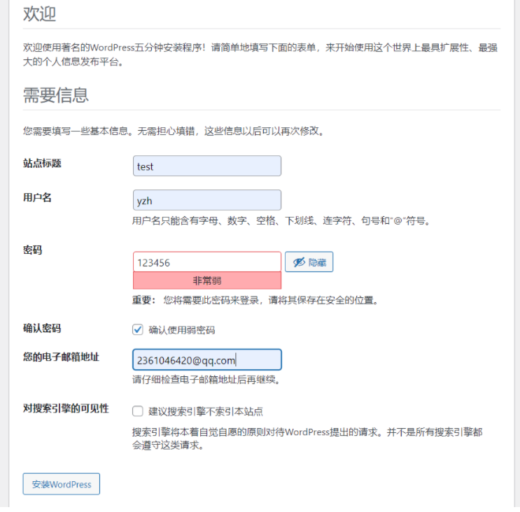

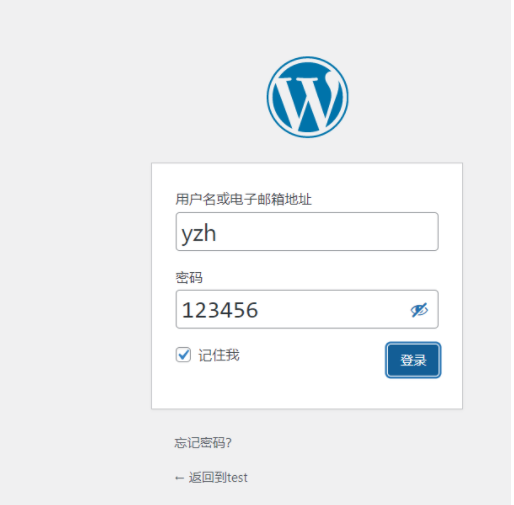

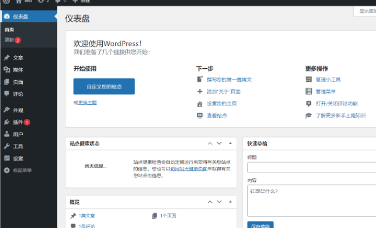

博客搭建完毕