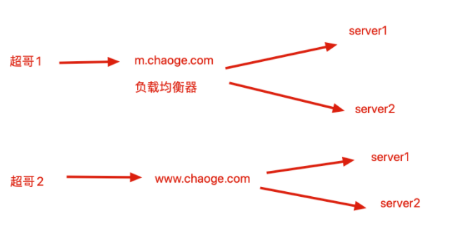

## 定义一组www服务器池

```
upstream www_pools {
server 192.168.6.22 weight=1;
server 192.168.6.23 weight=1;
}
```

## 配置虚拟主机实现代理

注意这里是部分代码，修改了第一个server虚拟主机

```
 server {
        listen       80;
        server_name  www.chaoge.com;

        #charset koi8-r;

        #access_log  logs/host.access.log  main;

        location / {
        # 通过代理参数吧用户的请求转发给地址池中的服务器处理
                proxy_pass http://www_pools;
        }    
}
```

## 实测负载均衡效果

```
[root@lb01 nginx-1.16.0]# curl www.chaoge.com
chaoge_bbs_121
[root@lb01 nginx-1.16.0]# curl www.chaoge.com
chaoge_bbs_122
[root@lb01 nginx-1.16.0]# curl www.chaoge.com
chaoge_bbs_121
[root@lb01 nginx-1.16.0]# curl www.chaoge.com
chaoge_bbs_122
```

从测试结果中，可以看出，请求逐一的分给两个节点服务器了，实现了请求分发功能。

但是问题是，为何看到的网页内容，一直都是bbs的内容，而非出现www呢？


## 如何解决上述问题

其根本原因是，用户访问域名时候确实是`www.chaoge.com`，请求首先是发给了Nginx反向代理服务器

问题是：

- 代理服务器(lb01)重新发起请求时，默认并没有在请求头里告诉节点服务器要找哪一个虚拟主机【`www.chaoge.com`】还是【`bbs.chaoge.com`】
- 因此后端节点服务器接收到请求之后，并没有主机头信息，默认把请求发给了第一个虚拟主机去处理（以web01的nginx.conf中的配置，也就是bbs站点内容了）

解决办法：

- 在反向代理时候，添加主机头信息，明确告诉节点服务器找哪个虚拟主机

```
proxy_set_header Host $host;
```

在代理服务器向节点服务器发送HTTP请求头中添加host主机头信息后，若是后端服务器配置了多个虚拟主机，也就可以根据主机头的信息，来进行匹配决定发给哪一个虚拟主机【bbs还是www】。

nginx.conf修改如下，修改location的配置

```
    server {
        listen       80;
        server_name  www.chaoge.com;

        #charset koi8-r;

        #access_log  logs/host.access.log  main;

        location / {
                proxy_pass http://www_pools;
         # 添加该参数，在向后端发请求的时候，就会保留客户端的主机头信息，发给节点服务器
                proxy_set_header Host $host;
        }
}
```

最终效果，结果和域名就完全对应上了

```
[root@lb01 nginx-1.16.0]# curl www.chaoge.com
chaoge_www_121
[root@lb01 nginx-1.16.0]# curl www.chaoge.com
chaoge_www_122
[root@lb01 nginx-1.16.0]# curl www.chaoge.com
chaoge_www_121
[root@lb01 nginx-1.16.0]# curl www.chaoge.com
chaoge_www_122
[root@lb01 nginx-1.16.0]# curl bbs.chaoge.com
chaoge_bbs_121
[root@lb01 nginx-1.16.0]# curl bbs.chaoge.com
chaoge_bbs_122
[root@lb01 nginx-1.16.0]# curl bbs.chaoge.com
chaoge_bbs_121
```

## 反向代理&记录用户IP地址企业案例

对于互联网的资源，有时候程序员喜欢用爬虫程序去捉取

通过`python网络爬虫脚本`，大量获取文章、图片、视频等资源

那么对于网站管理员就不乐意了，爬虫程序频繁的网站网站获取资料，也就给管理员的服务器带来了额外的压力，那么运维人员一般会通过`Nginx的access.log`追踪用户的ip地址，发现异常、频繁的ip地址记录，就可以将其封禁，或者限制他的访问速率。

爬虫程序这时候如果发现自己的ip地址被限制了，他也会想些办法，逃避这个封禁，再次获取资料，那么他就会利用`代理IP`的方式再去爬取网站资料。

这时候对于系统管理员也不乐意了，如果我只是封禁了代理的IP，我如何抓到`背后的那个坏人呢！（真实的客户端IP）`

### 反向代理后的节点

在反向代理或者代理IP这样的形式，访问服务器后，服务器捉到的都是反向代理机器的IP地址。

```
以我们之前的机器配置
web01 192.168.6.22
web02 192.168.6.23

lb01  192.168.6.20

lb01就是一台反向代理服务器（负载均衡的功能）
```


上述图片解读：

- 使用客户端机器web02，访问负载均衡器lb01（反向代理），看到了机器web01和web02的资料
- 在web服务器上检测客户端信息，发现客户端是192.168.178.130（这不是lb01吗）
- 我们明明用的是web02发出的请求

这就是反向代理的含义所在，用户请求发给了反向代理，反向代理再次发出了一个请求。

【如何解决这样的问题，捉到客户端的IP而非代理服务器呢？】

### X-Forwarded-For

在反向代理请求后端节点服务器的`请求头`中添加获取客户端IP的字段信息，然后在后端节点可以通过程序或者相关配置接收`X-Forwarded-For`传过来的真实用户的IP信息。

【lb01反向代理节点配置如下】

部分nginx.conf代码如下，注意重点修改的部分

```
http {
    include       mime.types;
    default_type  application/octet-stream;

# 定义web服务器地址池，也就是xxx,xxx两个节点
upstream www_pools {
server 192.168.6.x weight=1;
server 192.168.6.x weight=1;
}

    server {
        listen       80;
        server_name  www.chaoge.com;

        #charset koi8-r;

        #access_log  logs/host.access.log  main;

        location / {
                proxy_pass http://www_pools;
                proxy_set_header Host $host;
                # 添加此处代码即可，代理服务器向后端发送HTTP请求时，请求头中添加该参数信息，用于后端服务器程序、日志等接受真实用户的IP，而非是代理服务器的IP
                proxy_set_header X-Forwarded-For $remote_addr;
        }
}
}
```

重新加载lb01的nginx

```
[root@lb01 nginx-1.16.0]# nginx -s reload
```

特别注意，不仅要在代理服务器配置，添加获取真实IP的字段，还要再节点服务器中添加配置，接受用户真实的IP，配置日志格式等操作。

【修改节点服务器的nginx.conf】

部分代码修改如下，关注重点修改的部分

```
[root@web01 opt]# grep -Ev "^#|^$" /opt/nginx/conf/nginx.conf
worker_processes  1;
events {
    worker_connections  1024;
}
http {
    include       mime.types;
    default_type  application/octet-stream;
    sendfile        on;
    keepalive_timeout  65;
    gzip  on;

 # 重点修改这里的代码即可，添加结尾的参数$http_x_forwarded_for，即可在日志中获取客户端的真实IP
 # 注意access日志文件具体的路径，由下面虚拟主机的参数定义
log_format  main  '$remote_addr - $remote_user [$time_local] "$request" '
                 '$status $body_bytes_sent "$http_referer" '
                  '"$http_user_agent" "$http_x_forwarded_for"';


server {
listen 80;
server_name bbs.xxx.com;
location / {
    root html/bbs;
    index index.html;
}
# 注意这里的日志配置！！！一定要写和我一样的！！
access_log logs/access_bbs.log main;
}
server {
listen 80;
server_name www.xxx.com;
location / {
    root html/www;
    index index.html index.htm;
}
# 注意这里的日志配置！！！一定要写和我一样的！！
access_log logs/access_www.log main;
}
}
```

重启节点服务器的nginx

```
[root@web01 opt]# nginx -s reload
```

### 测试效果一

配置步骤

```
1.在自己的电脑本地hosts文件中添加解析记录
C:\Windows\System32\drivers\etc\hosts

192.168.6.x www.xxx.com bbs.xxx.com

2.在自己的本地电脑浏览器访问站点
192.168.6.x
```

```
3.检查121节点的日志信息
[root@web01 logs]# tail -f /opt/nginx/logs/access_www.log

192.168.178.130 - - [22/Mar/2020:11:29:08 -0400] "GET /favicon.ico HTTP/1.0" 404 555 "http://www.chaoge.com/" "Mozilla/5.0 (Macintosh; Intel Mac OS X 10_15_3) AppleWebKit/537.36 (KHTML, like Gecko) Chrome/80.0.3987.149 Safari/537.36" "192.168.178.1"


4.日志解析
192.168.178.130 显示的是远程访客的地址，也就是lb01负载均衡发来的请求
"192.168.178.1" 是通过X-Forwarded-For参数获取到的真实客户端的ip，也就是你笔记本的ip地址
```

### 测试效果二

直接用curl命令测试访问

```
1.使用一台节点服务器去访问 负载均衡器
[root@web02 nginx-1.16.0]# curl www.chaoge.com
chaoge_www_122
[root@web02 nginx-1.16.0]# curl www.chaoge.com
chaoge_www_121
[root@web02 nginx-1.16.0]# curl www.chaoge.com
chaoge_www_122

2.在一台节点服务器上查看访客日志
[root@web01 logs]# tail -f /opt/nginx/logs/access_www.log
192.168.178.130 - - [22/Mar/2020:11:34:49 -0400] "GET / HTTP/1.0" 200 15 "-" "curl/7.29.0" "192.168.178.122"


最终通过日志，发现检测到了真实发请求的，其实是web02机器，ip为192.168.178.122
```

### 总结

- nginx的accesslog日志，其日志格式里`$remote_addr`变量，表示远程客户端的IP地址（可能是代理IP地址）
- 其`$http_x_forwarded_for`变量，是接收了在反向代理中配置的`proxy_set_header X-Forwarded-For $remote_addr`，获取了用户真实的IP（躲在代理IP后）

当然这里的`X-Forwarded-For`并不是万能的，所谓道高一尺魔高一丈，对于代理的形式还有很多种。

| 代理参数                                       | 解释                                                         |
| ---------------------------------------------- | ------------------------------------------------------------ |
| `proxy_pass http://server_pools`               | 把用户的请求转发到反向代理定义的upstream地址池               |
| proxy_set_header Host $host;                   | 在代理服务器向后端节点机器发送HTTP请求时，加入host字段信息，可以用于当后端节点存在多个虚拟主机，且通过域名区分，可以通过该host参数，识别代理的主机是哪一个 |
| Proxy_set_header X-Forwarded-For $remote_addr; | 代理服务器向后端节点发出请求时，添加该字段信息，能提供给后端节点机器，获取到真实客户端的IP地址 |

## 反向代理参数优化

对于nginx众多的虚拟主机配置，如果写入一个文件里，难以维护，阅读，可以把参数配置，写入到单独的配置文件中，再通过nginx的`include`方式获取。

```
/opt/nginx/conf/nginx.conf
# 定义web服务器地址池，也就是121,122两个节点
upstream www_pools {
server 192.168.178.121 weight=1;
server 192.168.178.122 weight=2;
}

    server {
        listen       80;
        server_name  www.chaoge.com;
        default_type application/octet-stream;
        #charset koi8-r;

        #access_log  logs/host.access.log  main;

        location / {
                proxy_pass http://www_pools;
                # 包含语法，读取该文件中的配置，加载到当前文件中
                include proxy.conf;
        }
}
```

生成规范的代理配置文件，注意和nginx.conf写在同一级目录

```
[root@lb01 conf]# cat proxy.conf
proxy_set_header Host $host;
proxy_set_header X-Forwarded-For $remote_addr;
proxy_connect_timeout 60;
proxy_send_timeout 60;
proxy_read_timeout 60;
proxy_buffer_size 4k;
proxy_buffers 4 32k;
proxy_busy_buffers_size 64k;
proxy_temp_file_write_size 64k;
```

详细的参数，解释，在官方文档可以查阅

> http://nginx.org/en/docs/http/ngx_http_proxy_module.html

## 反向代理企业案例

### 企业级动静分离案例

该场景是，通过nginx实现动静分离，配置反向代理规则，实现动态请求和静态请求分别转发给不同的服务器解析，以解决网站性能、安全、用户体验等问题。


该架构图是企业常见的动静分离集群架构图，例如该网站域名是`www.chaoge.com`

- 当用户请求`www.chaoge.com/upload/xx`，该形式的URL，代理服务器会将其转发到上游服务器`upload_pools`
- 当用户访问`www.chaoge.com/static/xx`，该形式的URL，代理服务器会将其转发到静态服务器地址池`static_pools`
- 当用户访问`www.chaoge.com/xx`，该形式的URL，也就是不包含指定的路径URL，代理服务器将其默认都转发给动态服务器池处理数据

### 案例配置准备

了解了需求，配置地址池即可，这里需要用到三台虚拟机，可以自由定义

- web01
- web02
- web03

使用克隆的形式，创建虚拟机亦可

【配置静态服务器池】

```
upstream static_pools {
server 192.168.178.121 weight=1;
}
```

【配置上传服务器池】

```
upstream upload_pools {
    server 192.168.178.122 weight=1;
}
```

【默认地址池，动态地址池】

```
upstream default_pools {
    server 192.168.178.131 weight=1;
}
```

### 实际配置思路

【方案1】

使用nginx的location功能，匹配不同的URL（路径），请求分发给不同的服务器池

```
location /static/ {
    proxy_pass http://static_pools;
    include proxy.conf;
}

location /upload/ {
proxy_pass http://upload_pools;
include proxy.conf;
}

location / {
proxy_pass http://default_pools;
include proxy.conf;
}
```

【方案2】

使用shell语句进行判断

```
if ($request_url ~* "^/static/(.*)$")
{
    proxy_pass http://static_pools/$1;
}

if ($request_url ~* "^/upload/(.*)$")
{
    proxy_pass http://uoload_pools/$1;
}

location / {
    proxy_pass http://default_pools;
    include proxy.conf;
}
```

### nginx实战配置

```
1.编辑nginx.conf，修改添加如下代码

# 定义三个地址池
upstream static_pools {
        server 192.168.178.121 weight=1;
}

upstream uoload_pools {
        server 192.168.178.122 weight=1;
}

upstream default_pools {
        server 192.168.178.131 weight=1;
}

# 定义虚拟主机
    server {
        listen       80;
        server_name  www.chaoge.com;
        default_type application/octet-stream;

# 通过locaiton进行URL路径匹配
        location / {
                proxy_pass http://default_pools;
                include proxy.conf;
        }

        location /static/ {
                proxy_pass http://static_pools;
                include proxy.conf;
}

        location /upload/ {
                proxy_pass http://upload_pools;
                include proxy.conf;
}

}
```

检查配置，重启配置

```
[root@lb01 conf]# nginx -t
nginx: the configuration file /opt/nginx-1.16.0/conf/nginx.conf syntax is ok
nginx: configuration file /opt/nginx-1.16.0/conf/nginx.conf test is successful
[root@lb01 conf]# nginx -s reload
```

### 分别配置三个地址池

#### 【修改静态服务器配置】


### **---这里很重要---**

```
创建一个static文件夹，因为请求转发给了此台机器，URL如下
www.chaoge.com/static/index.html  
# 必须在网页站点目录下，存在该static文件夹
[root@web01 logs]# mkdir -p /opt/nginx/html/www/static/
[root@web01 logs]# echo "我是超哥配置的静态服务器static" > /opt/nginx/html/www/static/index.html

修改nginx.conf支持中文
server {
listen 80;
server_name www.chaoge.com;
charset utf-8;
location / {
        root html/www;
        index index.html index.htm;
}
access_log logs/access_www.log main;
}


# 重启nginx
nginx -s reload
```

#### 【修改uploads服务器配置】

这里其实访问的是`www.chaoge.com/upload`

因此必须得有upload目录

```
[root@web02 nginx-1.16.0]# mkdir -p /opt/nginx/html/www/upload/
[root@web02 nginx-1.16.0]# echo "我是超哥配置的uploads服务器" > /opt/nginx/html/www/upload/index.html


# 让nginx支持中文
server {
listen 80;
server_name www.chaoge.com;
charset utf-8;
location / {
    root html/www;
    index index.html index.htm;
}
access_log logs/access_www.log main;
}


# 重启nginx
nginx -s reload
```

#### 【配置默认的动态服务器】

```
1.确保nginx.conf配置文件正确
 server {
        listen       80;
        server_name  www.chaoge.com;
        # 让nginx支持中文
        charset utf-8;

        #access_log  logs/host.access.log  main;

        location / {
            root   html/www;
            index  index.html index.htm;
        }
}

2.生成首页文件
[root@web03 nginx-1.16.0]# mkdir -p /opt/nginx/html/www/static
[root@web03 nginx-1.16.0]# cat /opt/nginx/html/www/staticindex.html
<meta charset=utf8>
我是超哥配置默认动态服务器


3.启动nginx，或者重启 nginx -s reload
nginx
```

### 明确配置

| 主机  | IP，端口        | 测试地址                                  | 显示内容 |
| ----- | --------------- | ----------------------------------------- | -------- |
| web01 | 192.168.178.121 | `http://www.chaoge.com/static/index.html` |          |
| web02 | 192.168.178.122 | `http://www.chaoge.com/upload/index.html` |          |
| web03 | 192.168.178.131 | `http://www.chaoge.com/index.html`        |          |

### 测试访问结果

这里请使用一个单独的客户端机器，配置好本地dns，进行测试访问

```
C:\Windows\System32\drivers\etc\hosts

192.168.178.130 www.chaoge.com bbs.chaoge.com
```

网页测试结果

## URL转发应用场景

根据HTTP的URL转发的场景，被称之为七层转发（应用层转发）

而`LVS`的负载均衡一般用于TCP的转发，也就被称之为4层转发。

利用`Nginx`的七层转发，可以实现动静分离，移动、PC端页面区分，交给不同的后端服务器处理，让用户得到更佳的访问体验。

## 客户端设备匹配转发实战

对于大多数网站，都是由区分移动端页面，PC端页面，对于用户不同的客户端设备，返回不同的页网站页面。

因此，为了让用户有更好的访问体验，就需要在服务器后端设立不同的服务器来满足不同的客户端访问。

例如，移动端客户访问网站，请求就转发给处理移动端页面的服务器，移动端还分为苹果、安卓、手机、ipad等不同的设备。

那么如何实现该方案呢

### 基于4层负载均衡的转发

四层转发就是`IP+PORT`的形式转发

在常规的4层负载均衡架构下，可以使用不同的域名来实现该需求，例如

- 人为分配，让移动端用户访问`m.chaoge.com`
- PC端用户访问`www.chaoge.com`
- 通过不同的域名来引导用户访问指定的后端服务器



但是这样的形式，用户需要记住不同的域名，用户肯定是不乐意的，体验较差

### 基于7层的负载均衡

在7层负载均衡下就不需要人为拆分域名了，移动端、PC端只需要一个`www.chaoge.com`域名即可。

方法就是通过获取用户请求中的客户端信息（来自于哪个浏览器，手机、ipad等等客户端），是通过`$http_user_agent`获取，根据该变量获取到的用户客户端信息，再决定交给哪一个后端服务器去处理。

这是企业常用的解决方案。


### 根据客户端转发实战

我们可以模拟出当不同的浏览器，访问站点的时候，系统检测到的用户客户端信息

以下均是通过accesslog捉到的信息

#### curl命令客户端

```
[root@web02 nginx-1.16.0]# curl www.chaoge.com/static/index.html
我是超哥配置的静态服务器static

# 日志记录如下
192.168.178.130 - - [23/Mar/2020:01:59:34 -0400] "GET /static/index.html HTTP/1.0" 200 43 "-" "curl/7.29.0" "192.168.178.122"
```

#### safari客户端

```
192.168.178.130 - - [23/Mar/2020:02:00:36 -0400] "GET /static/ HTTP/1.0" 200 43 "-" "Mozilla/5.0 (Macintosh; Intel Mac OS X 10_15_3) AppleWebKit/605.1.15 (KHTML, like Gecko) Version/13.0.5 Safari/605.1.15" "192.168.178.1"
```

#### chrome客户端

```
192.168.178.130 - - [23/Mar/2020:02:01:43 -0400] "GET /static/index.html HTTP/1.0" 200 43 "-" "Mozilla/5.0 (Macintosh; Intel Mac OS X 10_15_3) AppleWebKit/537.36 (KHTML, like Gecko) Chrome/80.0.3987.149 Safari/537.36" "192.168.178.1"
```

#### Nginx根据客户端信息转发配置

### 补充：location修饰符解释

```
= 表示精确匹配。只有请求的url路径与后面的字符串完全相等时，才会命中。
~ 表示该规则是使用正则定义的，区分大小写。
~* 表示该规则是使用正则定义的，不区分大小写。
^~ 表示如果该符号后面的字符是最佳匹配，采用该规则，不再进行后续的查找。
利用shell语句进行逻辑判断

location / {
# 这里进行浏览器判断
if ($http_user_agent ~* "MSIE")
{
    proxy_pass http://static_pools;
}
if ($http_user_agent ~* "Chrome")
{
    proxy_pass http://upload_pools;
}

if ($http_user_agent ~* "Safari")
{
    proxy_pass http://static_pools;
}

proxy_pass http://default_pools;
include proxy.conf;

}
```

### Nginx实际配置

修改nginx.conf如下，无须完整贴代码，看好修改了哪些配置即可

```
[root@lb01 conf]# grep -Ev "^#|^$" /opt/nginx/conf/nginx.conf
worker_processes  1;
events {
    worker_connections  1024;
}
http {
    include       mime.types;
    default_type  application/octet-stream;
    log_format  main  '$remote_addr - $remote_user [$time_local] "$request" '
                      '$status $body_bytes_sent "$http_referer" '
                      '"$http_user_agent" "$http_x_forwarded_for"';    
    sendfile        on;
    keepalive_timeout  65;
upstream www_pools {
server 192.168.178.121 weight=1;
server 192.168.178.122 weight=2;
}
upstream static_pools {
    server 192.168.178.121 weight=1;
}
upstream upload_pools {
    server 192.168.178.122 weight=1;
}
upstream default_pools {
    server 192.168.178.131 weight=1;
}
    server {
        listen       80;
        server_name  www.chaoge.com;
    default_type application/octet-stream;

# 修改如下代码
# 我们这里直接返回状态码，更直观看见区别，也可以编写proxy_pass
location / {

if ($http_user_agent ~* "MSIE")
{
        proxy_pass http://static_pools;
}
if ($http_user_agent ~* "Chrome")
{
        #proxy_pass http://upload_pools;
        return 401;
}

if ($http_user_agent ~* "Safari")
{
        #proxy_pass http://static_pools;
        return 402;
}

proxy_pass http://default_pools;
include proxy.conf;

}


}
}
```

检测nginx语法，重启nginx

```
[root@lb01 conf]# nginx -t
nginx: the configuration file /opt/nginx-1.16.0/conf/nginx.conf syntax is ok
nginx: configuration file /opt/nginx-1.16.0/conf/nginx.conf test is successful
[root@lb01 conf]# nginx -s reload
```

#### 查看实际转发效果

上述代码含义

- 当谷歌浏览器访问，返回401状态码
- 当safari浏览器访问，返回402


### 检测移动端客户端

```
1.修改nginx.conf支持移动端检测，修改部分代码如下

location / {

if ($http_user_agent ~* "android")
{
return "501";
}

if ($http_user_agent ~* "iphone")
{
return "502";
}

proxy_pass http://default_pools;
include proxy.conf;

}


# 重启
nginx -s reload
```

直接通过curl命令，模拟客户端发起HTTP请求

```
[root@lb01 conf]# curl -A "android" www.chaoge.com
<html>
<head><title>501 Not Implemented</title></head>
<body>
<center><h1>501 Not Implemented</h1></center>
<hr><center>nginx/1.16.0</center>
</body>
</html>
[root@lb01 conf]#
[root@lb01 conf]#
[root@lb01 conf]# curl -A "iphone" www.chaoge.com
<html>
<head><title>502 Bad Gateway</title></head>
<body>
<center><h1>502 Bad Gateway</h1></center>
<hr><center>nginx/1.16.0</center>
</body>
</html>
```

## 通过文件扩展名转发

【方法一：通过location匹配】

1.通过检测用户发请求的文件后缀名来转发

```
location ~ .*.(gif|jpgjpeg|png|bmp|swf|css|js)$ {
        # proxy_pass http://static_pools;
        # include proxy.conf;
        return 503;
}

# 重启nginx -s reload
```

【方法二：通过shell语句判断】

```
if ($request_uri ~* ".*\.(php|php5)$")
{
    proxy_pass http://php_server_pols;
}

if ($request_uri ~* ".*\.(jsp|jsp*|do|do*)$")
{
    proxy_pass http://java_server_pools;
}
```

### nginx根据请求扩展名转发实践

据此可以实现用户请求动静分离，例如图片，视频等请求静态资源服务器

php，jsp，等动态请求转发给动态服务器

```
# 修改nginx.conf添加如下代码

    server {
        listen       80;
        server_name  www.chaoge.com;
        default_type application/octet-stream;


          location / {

          if ($http_user_agent ~* "MSIE")
          {
                  proxy_pass http://static_pools;
          }
          if ($http_user_agent ~* "Chrome")
          {
                  #proxy_pass http://upload_pools;
                  return 401;
          }

          if ($http_user_agent ~* "Safari")
          {
                  #proxy_pass http://static_pools;
                  return 402;
          }
          if ($http_user_agent ~* "android")
          {
          return "501";
          }

          if ($http_user_agent ~* "iphone")
          {
          return "502";
          }

          proxy_pass http://default_pools;
          include proxy.conf;

          }

          location ~ .*.(gif|jpg|jpeg|png|bmp|swf|css|js)$ {
                  # proxy_pass http://static_pools;
                  # include proxy.conf;
                  return 503;
          }

          location ~ .*.(php|php3|php5)$ {
                  return 504;
          }


          }

# 重启nginx
nginx -s reload
```

#### 客户端发出请求，验证配置


