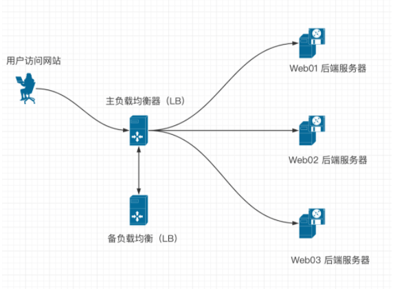
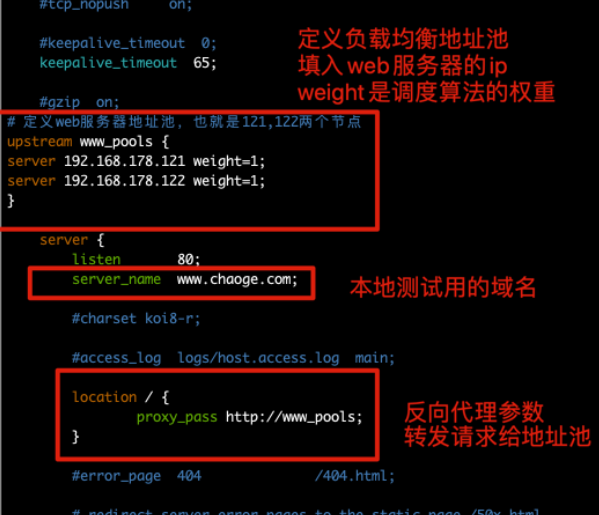

## 集群是什么

集群是指一组若干个计算机，利用通信网络组成一个较大的计算机服务系统，集群中的每台计算机都是运行各自服务的独立服务器。

## 为什么要用集群

高性能，高可用，可伸缩，性价比高于超级计算机

## 集群的分类

- 负载均衡集群

- 高可用性集群
- 高性能计算集群
- 网格计算 

## 负载均衡集群

负载 -- 压力

均衡 -- 分流

负载均衡集群为企业提供了更实用，性价比更高的系统架构方案。
负载均衡把很多客户集中的访问请求压力平均的分摊在计算机集群中进行处理。
每个节点承担一定的访问压力，并且实现请求在各个节点之间动态分配。

## 高可用性集群

高可用性集群指的是，集群中任意一个节点宕机的情况，该节点上所有的任务会自动转移到其他节点上，整个过程不会影响整个集群的运行。

当高可用集群中的一个节点系统发生故障时，运行着的集群服务器会迅速做出反应，把该系统的服务分配到集群中其他正在工作的机器上运行。

如果高可用性集群中主节点出现故障，那么宕机时间内将由备用节点代替它。

备用节点可以完全接管主节点（IP地址及其他资源），因此对于使用高可用性集群系统的用户是无感知的，不会影响用户访问。

高可用性集群的作用：
- 当一台机器宕机时，另一台机器接管宕机机器的IP资源和服务资源，继续提供服务。
- 用于例如负载均衡器的高可用，数据库的高可用



## 高性能计算集群

也成为并行计算，通常该集群系统用于解决复杂的科学问题，天气预报，石油勘探，核反应模拟等。

高性能计算机集群就如同一台超级计算机，该计算机系统由数十个至上万个独立的服务器组成。

### 常见集群硬、软件设备介绍

互联网企业常用的开源集群软件有：

- nginx
- lvs
- haproxy
- keepalived
- heartbeat

企业常用的商业集群硬件有：

- f5
- netscaler
- radware
- A10

### 如何选择开源负载均衡产品

中小互联网公司的服务器在用户并发量和总访问量还不是很大的情况下，建议首选Nginx负载均衡，其理由是：

- Nginx负载均衡配置简单
- 使用方便
- 安全稳定
- 社区活跃
- 使用人多居多
- 在淘宝公司的大流量业务得到了验证

当考虑使用Nginx进行负载均衡的时候，对其要进行高可用性设计，首选建议是用Keepalived软件，同样是因为配置简单、使用方便、安全稳定。

### Nginx负载均衡集群

负载均衡集群提供了一种廉价、有效、透明的方法扩展网络设备和服务器设备，集群能够提升计算机服务的负载能力、带宽、吞吐量，网络灵活性、高可用性等属性

### 搭建负载均衡的背景

- 把单台计算机无法承受的大规模并发访问，大量的数据流量分摊给多台服务器设备进行处理，减少集中式的压力，减少用户的等待时间，提升用户体验。
- 单个重负担的运算压力分摊给多台机器节点并行处理，每个节点处理完毕后将结果汇总给用户，集群系统处理能力大幅度提升
- 高可用性负载均衡系统，保证了7*24小时的服务提供，同组集群内所有的计算机节点都提供相同的服务，单点故障也不会影响用户访问

### 负载均衡与反向代理的区别

**普通的负载均衡软件，**例如LVS，其表现的功能只是对请求数据包的转发、传递，其主要的DR模式功能是：

- 从负载均衡下的节点服务器观察，接收到的请求信息依然是`访问负载均衡器`的真实客户端的信息

**反向代理的概念就不一样了：**

- 反向代理是在接收到用户的请求后，再`代理用户`重新向代理下的节点服务器发送请求，在节点服务器上观察，此时的客户端已经是代理服务器了，而非是真实的客户端用户

- 普通的负载均衡软件，例如lvs，仅仅对数据包进行转发

- nginx是接收到用户请求之后，重新的向后台负载均衡节点发出请求

### 反向代理


### 负载均衡


## Nginx负载均衡部署

Nginx提供负载均衡的模块是：

```
ngx_http_proxy_module        proxy代理模块，用于把请求抛给后端的服务器节点，或是upstream服务器池
ngx_http_upstream_module    负载均衡模块，实现服务器的负载均衡节点配置，以及健康检查
```

## 服务器准备

准备四台VM虚拟机

lb01，主负载均衡器，`192.168.6.20`

lb02，备负载均衡器（防止主节点故障），`192.168.6.21`

Web01，站点1，`192.168.6.22`

Web02，站点2（防止站点1故障），`192.168.6.23`

分别在四台机器上安装Nginx，因为Nginx提供如下功能

- 负载均衡
- web站点功能

```
1.安装依赖环境，重要
注意统一更换阿里云yum源!
yum install gcc patch libffi-devel python-devel  zlib-devel bzip2-devel openssl-devel ncurses-devel sqlite-devel readline-devel tk-devel gdbm-devel db4-devel libpcap-devel xz-devel openssl openssl-devel wget vim -y


2.编译安装nginx，编译安装能够统一管理目录，便于后期维护
mkdir -p /home/chaoge/tools
wget -P /home/chaoge/tools/ http://nginx.org/download/nginx-1.16.0.tar.gz

3.解压缩安装nginx
cd /home/chaoge/tools/
tar xf nginx-1.16.0.tar.gz
cd nginx-1.16.0
./configure --user=nginx --group=nginx --prefix=/opt/nginx-1.16.0 && make && make install

4.统一配置nginx环境变量
ln -s /opt/nginx-1.16.0/ /opt/nginx
检查软连接
ls -dl /opt/nginx

5.配置nginx环境变量
echo "PATH='/opt/nginx/sbin:/opt/mysql/bin:/usr/local/sbin:/usr/local/bin:/usr/sbin:/usr/bin'" >> /etc/profile

source /etc/profile

6.检查nginx环境变量
which nginx
```

### 配置测试nginx的服务(web01,web02)

在Nginx的两台Web服务器上，进行操作（web01,web02），两台机器操作完全一致

注意可能要备份之前的配置文件

```
[root@web01 opt]# cp /opt/nginx/conf/nginx.conf{,.bak}
```

示例配置文件，修改为如下

```
[root@web01 opt]# cat /opt/nginx/conf/nginx.conf

#user  nobody;
worker_processes  1;

#error_log  logs/error.log;
#error_log  logs/error.log  notice;
#error_log  logs/error.log  info;

#pid        logs/nginx.pid;


events {
    worker_connections  1024;
}


http {
    include       mime.types;
    default_type  application/octet-stream;
    sendfile        on;
    keepalive_timeout  65;
    gzip  on;

server {
listen 80;
server_name bbs.chaoge.com;
location / {
    root html/bbs;
    index index.html;
}
access_log logs/access_bbs.log main;
}
server {
listen 80;
server_name www.chaoge.com;
location / {
    root html/www;
    index index.html index.htm;
}
access_log logs/access_www.log main;
}


}
```

创建测试站点的资源数据

```
1.创建数据文件夹
mkdir -p /opt/nginx/html/{www,bbs}

2.创建nginx静态网页文件
[root@web01 opt]# echo "chaoge_www_121" > /opt/nginx/html/www/index.html
[root@web01 opt]# echo "chaoge_bbs_121" > /opt/nginx/html/bbs/index.html
```

启动nginx，检测语法

```
[root@web01 opt]# nginx -t
nginx: the configuration file /opt/nginx-1.16.0//conf/nginx.conf syntax is ok
nginx: configuration file /opt/nginx-1.16.0//conf/nginx.conf test is successful
[root@web01 opt]#
[root@web01 opt]# nginx
[root@web01 opt]# netstat -tunlp|grep 80
tcp        0      0 0.0.0.0:80              0.0.0.0:*               LISTEN      7981/nginx: master
```

配置本地dns解析

```
[root@web01 opt]# echo "192.168.178.121 www.chaoge.com bbs.chaoge.com" >> /etc/hosts
```

使用curl命令检测nginx站点

```
[root@web01 opt]# curl www.chaoge.com
chaoge_www_121
[root@web01 opt]# curl bbs.chaoge.com
chaoge_bbs_121
```

### 同样的步骤，在web02上再执行一遍即可，注意区分两台机器的IP

```
区别就在这里
[root@web01 opt]# echo "chaoge_www_122" > /opt/nginx/html/www/index.html
[root@web01 opt]# echo "chaoge_bbs_122" > /opt/nginx/html/bbs/index.html

[root@web02 nginx-1.16.0]# echo "192.168.178.122 www.chaoge.com bbs.chaoge.com" >> /etc/hosts
```

## 实现一个简单的负载均衡

配置两台负载均衡的机器，也是一样的操作（lb01,lb02）

### 配置lb01

该负载均衡功能是由Nginx提供，修改nginx.conf如下

```
1.添加一个负载均衡池参数
# 定义web服务器地址池，也就是121,122两个节点
upstream www_pools {
server 192.168.6.22 weight=1;
server 192.168.6.23 weight=1;
}


2.修改server{}虚拟主机参数
server {
        listen       80;
        server_name  www.chaoge.com;

        #charset koi8-r;

        #access_log  logs/host.access.log  main;

        location / {
                proxy_pass http://www_pools;
        }

        ...
}
```



### 启动lb01负载均衡器

```
[root@lb01 nginx-1.16.0]# nginx -t
nginx: the configuration file /opt/nginx-1.16.0/conf/nginx.conf syntax is ok
nginx: configuration file /opt/nginx-1.16.0/conf/nginx.conf test is successful

# 如果出现如下错误，表明当nginx还未启动，找不到pid文件
[root@lb01 nginx-1.16.0]# nginx -s reload
nginx: [error] invalid PID number "" in "/opt/nginx-1.16.0/logs/nginx.pid"

# 直接启动nginx即可
[root@lb01 nginx-1.16.0]# nginx
[root@lb01 nginx-1.16.0]#

# 检查负载均衡器
[root@lb01 nginx-1.16.0]# netstat -tunlp|grep 80
tcp        0      0 0.0.0.0:80              0.0.0.0:*               LISTEN      7500/nginx: master
```

### 配置hosts文件

```
1.添加一个本地测试域名
echo "192.168.178.130 www.chaoge.com bbs.chaoge.com" >> /etc/hosts
```

### 访问负载均衡器，查看效果

请求走到了负载均衡器，也就是nginx、进行代理转发请求

```
[root@lb01 nginx-1.16.0]# curl www.chaoge.com
chaoge_bbs_122
[root@lb01 nginx-1.16.0]# curl www.chaoge.com
chaoge_bbs_121
[root@lb01 nginx-1.16.0]# curl www.chaoge.com
chaoge_bbs_122
[root@lb01 nginx-1.16.0]# curl bbs.chaoge.com
chaoge_bbs_121
[root@lb01 nginx-1.16.0]# curl bbs.chaoge.com
chaoge_bbs_122
[root@lb01 nginx-1.16.0]# curl bbs.chaoge.com
chaoge_bbs_121
```

