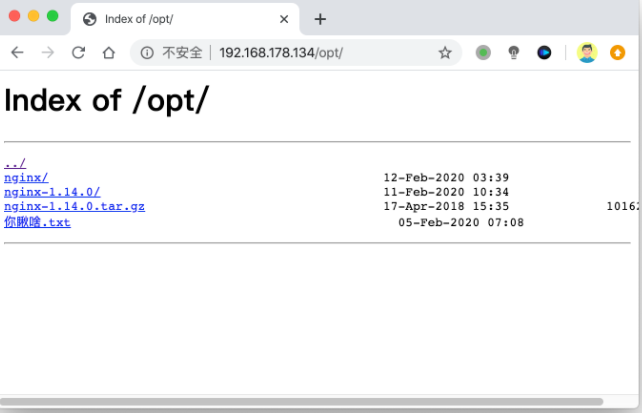
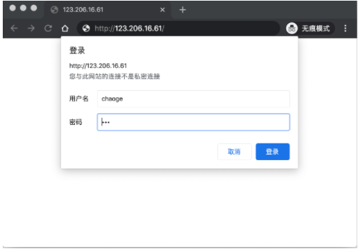
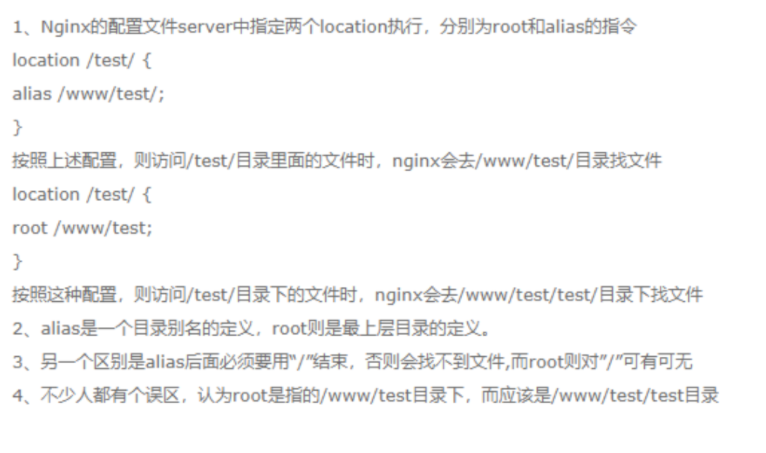

### Nginx虚拟主机

虚拟主机指的就是一个独立的站点，具有独立的域名，有完整的www服务，例如网站、FTP、邮件等。

Nginx支持多虚拟主机，在一台机器上可以运行完全独立的多个站点。


一些草根流量站长，常会搭建个人站点进行资源分享交流，并且可能有多个不同业务的站点，如果每台服务器只运行一个网站，那么将造成资源浪费，成本浪费。

利用虚拟主机的功能，就不用为了运行一个网站而单独配置一个Nginx服务器，或是单独再运行一组Nginx进程。

虚拟主机可以在一台服务器，同一个Nginx进程上运行多个网站。

nginx.conf主配置文件中，最简单的一段虚拟主机配置如下

```nginx
http{

#nginx虚拟主机默认加载是自上而下的匹配规则

   #第一个虚拟主机配置如下
    server {
        #站点端口
        listen       80;
        #域名配置无域名可以写localhost或_
        server_name  localhost;

        #定义网站编码
        charset utf-8;

        #access_log  logs/host.access.log  main;

        #定义usl匹配请求会进入location配置
        location / {
        #定义nginx的网页根目录，这个html是以nginx安装的路径相对的
            root   html;
        #定义nginx首页文件名，默认找这个文件
            index  index.html index.htm;
        }

      
      #平级关系内，可以编写多个server{}虚拟主机
      #一个server标签可以理解为是一个网站
     server {
			     
     		}
     
     
    }
}
```

### 修改nginx虚拟主机站点目录

```
1.修改nginx默认站点配置 nginx.conf 修改server标签内容

        location / {
            root   /www/html/
            index  index.html index.htm;
}

2.创建新的文件目录并添加测试内容
mkdir /www/html
vim /www/html

平滑重启
nginx -s reload

3.访问页面
192.168.6.20
```

### 静态资源压缩

nginx支持gzip压缩，压缩后的图片，动态图，文件为原本的30%甚至更小，用户访问网站体验会好

```nginx
1.准备静态数据
[root@servera html]# echo aa{1..5000000} > text.txt

[root@servera html]# ls -lh text.txt 
-rw-r--r-- 1 root root 47M 10月  8 11:14 text.txt

2.无gzip 访问静态数据访问速度很慢

3.开启nginx的gzip压缩功能，在http()配置，打开如下参数
 	    gzip on;
        gzip_http_version 1.1;
        gzip_comp_level 4;
        gzip_types text/plain application/javascript application/x-javascript text/css application/xml text/javascript 	application/x-httpd-php image/jpeg image/gif image/png;

 4.重载nginx服务
 nginx -s reload
```

### 基于IP多虚拟主机

Linux操作系统都能够支持给网卡绑定多个IP地址，可以使得一块网卡上运行多个基于IP的虚拟主机。

环境准备

```
配置3个ip地址
ifconfig ens33:1 192.168.6.166 netmask 255.255.255.0 broadcast 192.168.6.255 up
ifconfig ens33:2 192.168.6.167 netmask 255.255.255.0 broadcast 192.168.6.255 up
ifconfig ens33:3 192.168.6.168 netmask 255.255.255.0 broadcast 192.168.6.255 up

查看新增配置的ip
[root@servera html]# ifconfig|grep "inet 192"
        inet 192.168.6.20  netmask 255.255.255.0  broadcast 192.168.6.255
        inet 192.168.6.166  netmask 255.255.255.0  broadcast 192.168.6.255
        inet 192.168.6.167  netmask 255.255.255.0  broadcast 192.168.6.255
        inet 192.168.6.168  netmask 255.255.255.0  broadcast 192.168.6.255
        inet 192.168.122.1  netmask 255.255.255.0  broadcast 192.168.122.255
```

添加nginx的配置，配置多个server{}标签，让nginx支持基于ip的多虚拟主机，返回多个站点内容

```nginx
1.给nginx添加inlucde包含语法，让其他目录下的配置文件参数，导入到nginx.conf中这样可以看起来更简洁

修改nginx.conf，在http()标签中的最后一行，添加此参数,extra文件夹和conf文件夹相对
include extra/*.conf;

2.在extra目录下，添加多个基于ip的虚拟主机配置
可以像如下规划的形式，来编写nginx.conf配置文件
编辑 166.conf  添加如下代码

server {
listen 192.168.6.166:80;
server_name _ ;
location / {
	root /www/166;
	index index.html;

}
}

编辑 167.conf  添加如下代码
server {
listen 192.168.6.167:80;
server_name _ ;
location / {
	root /www/167;
	index index.html;

}
}

3.检查nginx语法是否正确
[root@servera extra]# nginx -t
nginx: the configuration file /opt/ngx1.18//conf/nginx.conf syntax is ok
nginx: configuration file /opt/ngx1.18//conf/nginx.conf test is successful

4.准备3个基于ip的站点内容
mkdir -p /www/{20,166,167}
[root@servera extra]# echo "i am 20,hello nginx" > /www/20/index.html
[root@servera extra]# echo "i am 166,hello nginx" > /www/166/index.html
[root@servera extra]# echo "i am 167,hello nginx" > /www/167/index.html

5.重读服务
nginx -s reload
----改了较多的nginx配置，在允许重启nginx的情况下
----nginx -s stop
----nginx

6.测试访问页面不同的ip访问不同的站点
192.168.6.20:80
192.168.6.166:80
192.168.6.167:80
```

### 基于域名的多虚拟主机

基于多IP的虚拟主机可能会造成IP地址不足的问题，如果没有特殊需求，更常用的是基于多域名的形式。

只需要你单独配置DNS服务器，将主机名对应到正确的IP地址，修改Nginx配置，可以识别到不同的主机即可，这样就可以使得多个虚拟主机用同一个IP，解决了IP不足的隐患。

```nginx
1.修改hosts文件
C:\Windows\System32\drivers\etc\hosts
2.客户端本地添加域名
192.168.6.20      yzhlinux.com 	
192.168.6.20       test.com 
3.修改配置文件
vim /opt/ngx1.18/conf/nginx.conf

server {
        #站点端口
        listen      80;
   
        server_name   yzhlinux.com;

    

        #access_log  logs/host.access.log  main;
        
        location / {
 
            root   /www/yzhlinux ;
            index  index.html index.htm;
        }

#修改第二个域名配置文件

vim /opt/ngx1.18/conf/extra/test.conf
server {
        #站点端口
        listen      80;
        server_name   test.com;
  
        #access_log  logs/host.access.log  main;
        location / {
 
            root   /www/test ;
            index  index.html index.htm;
        }

}

4重启nginx
nginx -s stop
nginx
```

### 基于端口的多虚拟主机

基于端口的配置在生产环境比较少见，用于特殊场景，例如公司内部测试平台网站，使用特殊端口的后台，OA系统、网站后台，CRM后台等。

案例：运行基于80、81端口的虚拟主机运行

```nginx
1.第一个虚拟主机

        server {
        #监听的端口和ip
        listen       80;
        #主机域名
        server_name  www.chaogelinux.com;
        access_log logs/www.chaogelinux.log;
        charset utf-8;

        #url匹配
        location / {
            #HTML文件存放的目录
            root   /website/s1/;
            #默认首页文件，从左往右寻找，index.html或是index.htm文件
            index  index.html index.htm;
        #autoindex off;
        }
}

2.#第二个虚拟主机
server {
listen 81;
server_name www.chaogenginx.com;
access_log logs/www.chaogenginx.com;
charset utf-8;
location / {
        index index.html index.htm;
        root /website/s2;
        #autoindex on;
}

}

3.nginx -s reload

4.访问80、81端口
[root@bogon nginx]# curl 127.0.0.1:81
我是来自于域名www.chaogenginx.com的多域名虚拟主机
[root@bogon nginx]# curl 127.0.0.1:80
我是多域名虚拟主机，来自于域名www.chaogelinux.com


<head>
<link rel="shortcut icon" href="#"/>
</head>
```

### 多虚拟主机定义日志

由于Nginx支持多虚拟主机，日志功能也是可以区分开的，用`access_log`定义存储位置。

日志指令语法

```
access_log  path  [format  buffer=size  | off]
path代表日志存放路径
```

【关闭日志】

```
access_log off;
```

【多虚拟主机的访客日志】

```
server {
        #站点端口
        listen      80;

        server_name   test.com;
        charset utf-8;

        access_log logs/test_nginx.log; #定义日志存放路径

        #access_log  logs/host.access.log  main;

        location / {

            root   /www/test ;
            index  index.html index.htm;
        }

} 

nginx -s reload
```

### Nginx访客日志功能

日志对于程序员很重要，可用于问题排错，记录程序运行状态，一个好的日志能够给与精确的问题定位。

Nginx日志功能需要在nginx.conf中打开相关指令`log_format`，设置日志格式，以及设置日志的存储位置`access_log`，指定日志的格式，路径，缓存大小。

```nginx
nginx.conf中有关访客日志定义如下
 #a
 #定义日志的那内容格式(记录那内容的详细程度)
log_format  main  '$remote_addr - $remote_user [$time_local] "$request" '
                      '$status $body_bytes_sent "$http_referer" '
                    '"$http_user_agent" "$http_x_forwarded_for"';

 access_log  logs/access.log  main;

参数解释 
$remote_addr ：记录访问网站的客户端ip地址
$remote_user ：记录远程客户端用户名
$time_local ：记录访问时间与时区
$request ：记录用户的 http 请求起首行信息
$status ：记录 http 状态码，即请求返回的状态，例如 200 、404 、502 等
$body_bytes_sent ：记录服务器发送给客户端的响应 body 字节数
$http_referer ：记录此次请求是从哪个链接访问过来的，可以根据 referer 进行防盗链设置
$http_user_agent ：记录客户端访问信息，如浏览器、手机客户端等
$http_x_forwarded_for ：当前端有代理服务器时，设置 Web 节点记录客户端地址的配置，此参数生效的前提是代理服务器上也进行了相关的 x_forwarded_for 设置
```

查看日志格式

```nginx
tail -2 logs/access.log

192.168.178.1 - - [11/Feb/2020:19:24:37 +0800] "GET / HTTP/1.1" 304 0 "-" "Mozilla/5.0 (Macintosh; Intel Mac OS X 10_15_3) AppleWebKit/537.36 (KHTML, like Gecko) Chrome/79.0.3945.130 Safari/537.36"
127.0.0.1 - - [12/Feb/2020:10:26:26 +0800] "GET / HTTP/1.1" 200 65 "-" "curl/7.29.0"
```

### Nginx目录浏览功能

例如将你电脑的资料共享出来，方便快速访问



    server {
        #监听的端口和ip
        listen       80;
        #主机域名
        server_name  www.chaogelinux.com;
        access_log logs/www.chaogelinux.log;
        #目录有中文的时候，这里必须改
        charset utf-8;
    
        #url匹配
        location / {
            #需要列出目录索引的位置
            root  www/test;     
            #开启目录索引功能
             autoindex on;
        }

       注意此目录下不要有index.html页面相关文件，否则会直接访问页面..

### Nginx状态信息功能

nginx提供了status模块，用于检测nginx的请求链接信息

这个功能需要在编译安装nginx的时候，添加--with-http-stud-status_module参数，才可以使用

##### 1.检查编译信息

```nginx
[root@servera test]# nginx -V
nginx version: nginx/1.21.3
built by gcc 4.8.5 20150623 (Red Hat 4.8.5-44) (GCC) 
built with OpenSSL 1.0.2k-fips  26 Jan 2017
TLS SNI support enabled
configure arguments: --prefix=/opt/ngx1.18/ --with-http_ssl_module --with-http_flv_module --with-http_gzip_static_module --with-http_stub_status_module --with-threads --with-file-aio
```

支持status功能，添加一个conf配置文件，用于检查状态页的功能

```nginx
创建status.conf放入extra目录下

1.确保nginx.conf主配置文件支持include语法
include extra/*.conf; #将当前的extra目录下所有的conf文件，都识别为nginx的配置文件
2.创建status.conf
touch /opt/ngx1.18/conf/extra/status.conf
3.修改status.conf开启状态页面功能，添加如下内容
vim /opt/ngx1.18/conf/extra/status.conf
  server {
  listen 85;
  location / {
         stub_status on;  #开启状态页功能
         access_log off;  #关闭访客日志功能
}
}
4.检查nginx配置，并重写
nginx -t
nginx -s reload
```

使用ab命令，进行nginx压力测试

```
yum -y install httpd-tools

ab -kc 1000 -n 100000 http://127.0.0.1/  #开启会话保持，1000个并发，发送十万个请求

-n requests #执行的请求数，即一共发起多少请求。
-c concurrency #请求并发数。
-k #启用HTTP KeepAlive功能，即在一个HTTP会话中执行多个请求。
```

##### nginx错误日志

Nginx能够将自身运行故障的信息也写入到指定的日志文件中。对于错误信息的调试，是维护Nginx的重要手段，指令是`error_log`，可以放在http{}全局中，也可以单独为虚拟主机记录。

```
语法：
error_log file  level;

日志级别在乎debug|info|notice|warn|error|crit|alert|emerg
级别越高，日志记录越少，生产常用模式是warn|error|crit级别
日志的记录，会给服务器增加额外大量的IO消耗，按需修改
```

nginx.conf修改如下，针对虚拟主机添加错误日志

```
#修改配置文件
[root@bogon extra]# cat blog.conf
#第二个虚拟主机
server {
listen 81; 
server_name www.chaogenginx.com;
access_log logs/www.chaogenginx.com;
charset utf-8;

error_log logs/blog.error.log;  #添加本行即可

location / {
    index index.html index.htm;
    root /website/s2;
}

}

#检查日志
[root@bogon extra]# nginx -s reload
[root@bogon extra]#
[root@bogon extra]#
[root@bogon extra]# ls ../../logs/
access.log  blog.error.log  error.log  nginx.pid  www.chaogelinux.log  www.chaogenginx.com
```

## Nginx location作用

Nginx的locaiton作用是根据用户请求的URI不同，来执行不同的应用。

针对用户请求的网站URL进行匹配，匹配成功后进行对应的操作。

```
nginx.conf中server{}指令块的location指令如下

        location / {
            root   html;
            index  index.html index.htm;
        }


        location = /50x.html {
            root   html;
        }
```

语法

```
location [ = | ~| ~* | ^~ ]  url {
    #指定对应的动作
}

#正则表达式解释
匹配符 匹配规则 优先级
=    精确匹配    1
^~    以某个字符串开头，不做正则    2
~*    正则匹配    3
/blog/ 匹配常规字符串，有正则就优先正则 4
/    通用匹配，不符合其他location的默认匹配    5
```

实际演练

| 请求url         | 完整url                               | 匹配后动作 |
| --------------- | ------------------------------------- | ---------- |
| /               | http://192.168.178.134/               | 配置A      |
| /index.html     | http://192.168.178.134/index.html     | 配置B      |
| /blog/blog.html | http://192.168.178.134/blog/blog.html | 配置C      |
| /img/1.jpg      | http://192.168.178.134/1.jpg          | 配置D      |
| /blog/1.jpg     | http://192.168.178.134/blog/1.jpg     | 配置E      |

修改nginx.conf如下

```nginx
[root@bogon extra]# cat www.conf
server {
    listen 83;
    server_name _;

    #最低级匹配，不符合其他locaiton就来这
    location / {
        return 401;
}
    #优先级最高
    location = / {
        return 402;
}
    #以/blog/开头的url，来这里，如符合其他locaiton，则以其他优先
    location /blog/ {
        return 403;
}
    #匹配任何以/img/开头的请求，不匹配正则
    location ^~ /img/ {
        return 404;
}
    #匹配任何以.gif结尾的请求，支持正则
    location ~* \.(gif|jpg|jpeg)$ {
        return 500;
}


}
```

通过curl命令，检测nginx的locaiton匹配

```
curl命令-s 不输出错误和进度信息，静默输出-o  
输出写入到指定文件中 /dev/null 就是丢弃输出，扔进黑洞-I 只显示响应头-w 完成后输出哪些内容#用户请求的url为空或者有一个/

[root@bogon extra]# curl  -s -o /dev/null -I -w "%{http_code}\n" 127.0.0.1:83402
[root@bogon extra]# curl  -s -o /dev/null -I -w "%{http_code}\n" 127.0.0.1:83/402#用户请求存在index.html或者其他任意不符合其他location的字符串

[root@bogon extra]# curl  -s -o /dev/null -I -w "%{http_code}\n" 127.0.0.1:83/index.html401#访问以/blog/开头的url
[root@bogon extra]# curl  -s -o /dev/null -I -w "%{http_code}\n" 127.0.0.1:83/blog/index.html403#访问以/img/开头的url

[root@bogon extra]# curl  -s -o /dev/null -I -w "%{http_code}\n" 127.0.0.1:83/img/2.gif404#匹配以gif结尾的url，由于/blog/优先级最低，因此匹配1.gif的规则

[root@bogon extra]# curl  -s -o /dev/null -I -w "%{http_code}\n" 127.0.0.1:83/blog/1.gif500#由于/img/优先级更高，因此优先匹配

[root@bogon extra]# curl  -s -o /dev/null -I -w "%{http_code}\n" 127.0.0.1:83/img/1.gif404
```

## Nginx地址重写

Nginx rewrire技术主要是实现URL地址重写，且支持正则表达式的规则。

rewrite能够实现URL的跳转，需要nginx在编译安装的时候，装好了PCRE这个软件。

通过rewrite可以规范URL、根据变量进行URL跳转等，常用的功能如

- 对于爬虫的封禁，让其跳转无用页面
- 动态的URL伪装成HTMl页面，便于搜索引擎的抓取
- 旧域名、旧目录的更新，需要跳转到新的URL地址

语法

```
rewrite ^/(.*) http://192.168.178.134/$1 permanent;

#解释rewrite是指令，开启一个跳转规则正则是 ^/(.*) 表示匹配所有，匹配成功后跳转到后面的url地址$1 表示取出前面正则括号里的内容permanent表示 301 重定向的标记
```

【rewrite的结尾参数 flag标记】

| 标记      | 解释a                                          |
| --------- | ---------------------------------------------- |
| last      | 规则匹配完成后，继续向下匹配新的Locaiton       |
| break     | 本条规则完成匹配后，立即停止                   |
| redirect  | 返回302临时重定向，浏览器地址栏显示跳转后的URL |
| permanent | 返回301永久重定向，浏览器地址显示跳转后的URL   |

last和break用于实现URL重写，浏览器地址栏不发生变化

redirect和permanent用于实现URL跳转，浏览器地址栏跳转新的URL

### 实现301 URL跳转

```
#请求直接跳转到百度
[root@bogon extra]# cat learn_rewrite.conf

server {
listen 90;
server_name _;
rewrite ^/(.*) http://www.baidu.com/$1 permanent;
}
```

## Nginx访问认证

有时候，我们一些站点内容想要进行授权查看，只能输入账号密码之后才能访问，例如一些重要的内网平台，CRM，CMDB，企业内部WIKI等等。

```
htpasswd是Apache密码生成工具，Nginx支持auth_basic认证，因此我门可以将生成的密码用于Nginx中，输入一行命令即可安装：yum -y install httpd-tools ，参数如下：

-c 创建passwdfile.如果passwdfile 已经存在,那么它会重新写入并删去原有内容.
-n 不更新passwordfile，直接显示密码
-m 使用MD5加密（默认）
-d 使用CRYPT加密（默认）
-p 使用普通文本格式的密码
-s 使用SHA加密
-b 命令行中一并输入用户名和密码而不是根据提示输入密码，可以看见明文，不需要交互
-D 删除指定的用户

#接认证文件，htpasswd -bc .access username password  #在当前目录生成.access文件，用户名username，密码：password，默认采用MD5加密方式。
```

```
nginx的认证模块指令，语法：
location / {

    auth_basic "string"; 可以填写off或是string
    auth_basic_user_file conf/htpasswd;  
}
```

案例

```
[root@nginxweb extra]# cat www.conf

server {

    listen 80;
    server_name _;
    location / {
    root html/www;
    index index.html;
    auth_basic    "learn nginx auth_module";
    #nginx会去这个文件中验证账号密码
    auth_basic_user_file /home/Learn_Nginx/nginx/conf/extra/htpasswd;
    }
}

[root@nginxweb www]# cat index.html
<meta charset=utf8>
只有正确输入了账号密码，才能看到此页面

重启nginx
nginx -s reload
```

```
生成密码文件
[root@nginxweb extra]# htpasswd -bc ./htpasswd  yzh  666
Adding password for user yzh
```

访问测试



## root和alias区别

