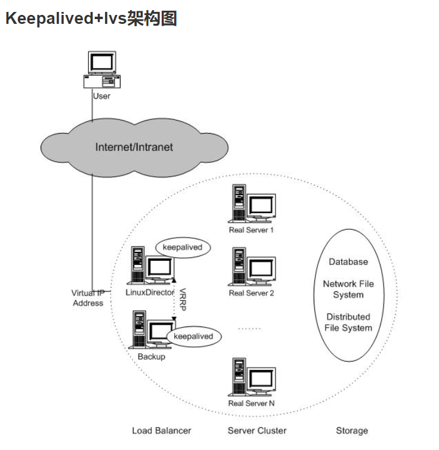
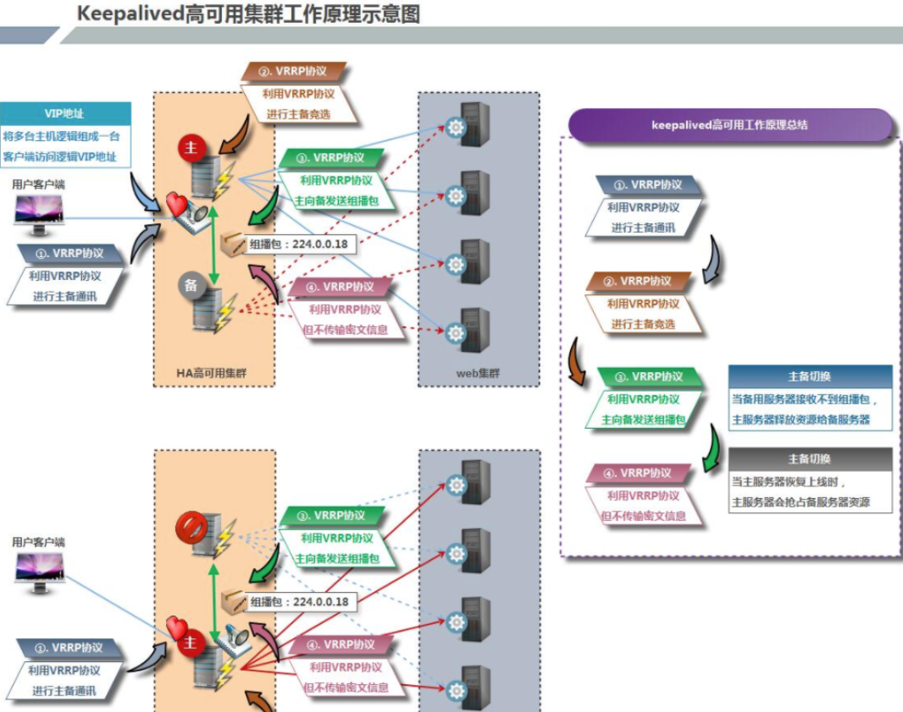
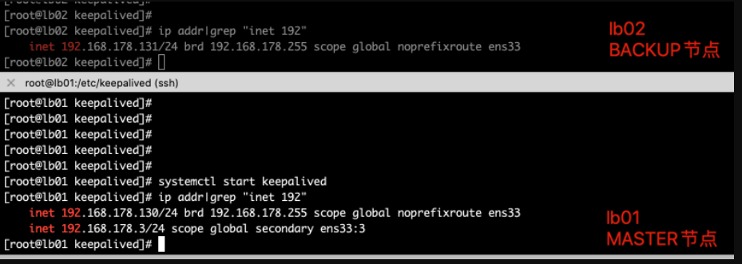
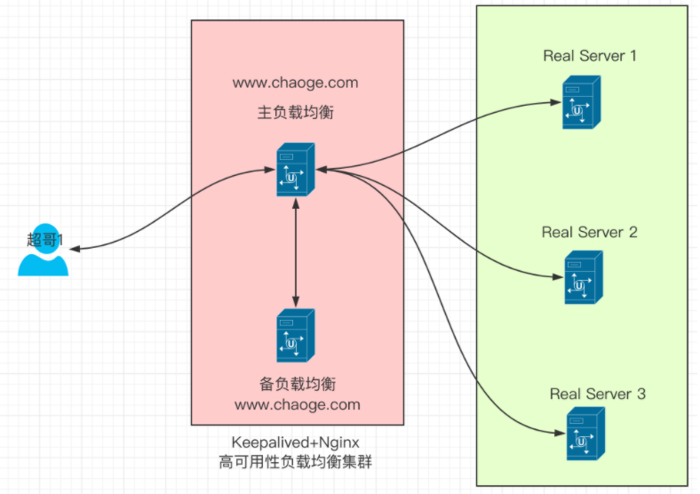
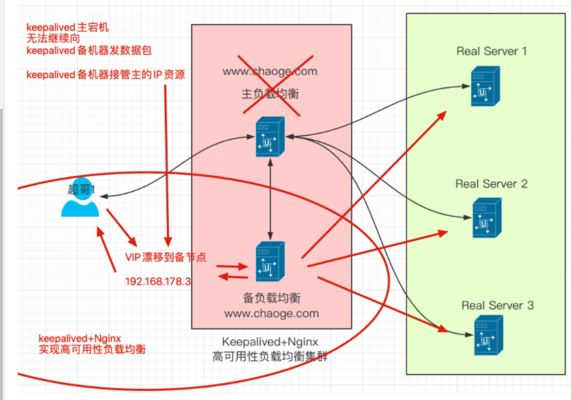

## 企业级集群高可用方案


Keepalived软件起初是专为LVS负载均衡软件设计的，用来管理并监控LVS集群系统中各个服务节点的状态，后来又加入了可以实现高可用的VRRP功能。因此，Keepalived除了能够管理LVS软件外，还可以作为其他服务（例如：Nginx、Haproxy、MySQL等）的高可用解决方案软件。

　　Keepalived软件主要是通过VRRP协议实现高可用功能的。VRRP是Virtual Router RedundancyProtocol(虚拟路由器冗余协议）的缩写，VRRP出现的目的就是为了解决静态路由单点故障问题的，它能够保证当个别节点宕机时，整个网络可以不间断地运行。

　　所以，Keepalived 一方面具有配置管理LVS的功能，同时还具有对LVS下面节点进行健康检查的功能，另一方面也可实现系统网络服务的高可用功能。

> keepalived官网[http://www.keepalived.org](http://www.keepalived.org/)

## keepalived服务的三个重要功能

### 管理LVS负载均衡软件

LVS，全称Linux Virtual Server，是国人章文嵩发起的一个开源项目。

在社区具有很大的热度，是一个基于四层、具有强大性能的反向代理服务器。

早期使用lvs需要修改内核才能使用，但是由于性能优异，现在已经被收入内核。

我们这里不多介绍LVS，他和Nginx一样，能够实现反向大力功能。

早期的LVS软件需要通过命令或者脚本实现管理，如果LVS机器突然宕机，会导致整个负载均衡无法工作，因此引入了Keepalived软件，它和LVS紧密协作。



### 对LVS集群节点健康检查

keepalived可以在自身的配置文件中修改对LVS节点的管理、启停，以及当LVS集群节点失效的时候，踢出集群，并且转换IP地址等配置，转移到健康的节点上，从而保证用户的访问不受影响。

当故障的节点恢复后，keepalived服务能够重新将其加入LVS集群中。

### 作为系统网络服务的高可用共而过

keepalived能够实现任意两台主机之间，例如master和backup主机之间的故障和自动转义，这个主机可以是普通的禁止停机的业务服务器，也可以是例如LVS、Nginx这样的反向代理服务器。

## keepalived高可用&故障切换原理

 Keepalived高可用服务对之间的故障切换转移，是通过 VRRP (Virtual Router Redundancy Protocol ,虚拟路由器冗余协议）来实现的。

　　在 Keepalived服务正常工作时，主 Master节点会不断地向备节点发送（多播的方式）心跳消息，用以告诉备Backup节点自己还活看，当主 Master节点发生故障时，就无法发送心跳消息，备节点也就因此无法继续检测到来自主 Master节点的心跳了，于是调用自身的接管程序，接管主Master节点的 IP资源及服务。而当主 Master节点恢复时，备Backup节点又会释放主节点故障时自身接管的IP资源及服务，恢复到原来的备用角色。

　　那么，什么是VRRP呢？

　　**VRRP ,全 称 Virtual Router Redundancy Protocol ,中文名为虚拟路由冗余协议 ，VRRP的出现就是为了解决静态踣甶的单点故障问题，VRRP是通过一种竞选机制来将路由的任务交给某台VRRP路由器的。**

### VRRP描述

有关VRRP协议的描述，我们可以记住如下点：

- VRRP协议，全称是 Virtual Router Redundancy Protocol，中文名是虚拟路由冗余协议，它的出现是为了解决静态路由的单点故障。
- VRRP协议是通过一种竞选协议机制来将路由任务交给某台VRRP路由器。
- VRRP通过IP多播的方式（默认多播地址224.0..18）实现高可用之间的通信。
- 工作时`主节点发包`，`备节点接包`，当`备节点`接收不到`主节点`的数据包的时候，就启动接管程序接管主节点的资源。备用节点可以存在多个，通过优先级竞选。一般keepaived只配置一对主备。

### keepalived描述

keepalived高可用性服务器之间是通过VRRP进行通信的，VRRP协议是通过竞选机制来确定主备身份，主节点的优先级高于备节点。

工作时，主节点优先获取所有的资源，备用节点处于等待状态，只有当备节点，得不到主节点的数据消息，备节点开始工作，接管主节点素有的资源，然后顶替它的位置，

当Keepalived服务对之间，作为主节点的机器会一直发送VRRP广播数据包，告诉备节点，我还活着，因此备节点不会抢占资源，当主节点宕机，备节点接替，整个切换过程最快小于1S。



## keepalived高可用服务搭建

准备四台linux机器

| hostname | IP              | 说明                                |
| -------- | --------------- | ----------------------------------- |
| lb01     | 192.168.178.130 | keepalived主服务器(nginx主负载均衡) |
| lb02     | 192.168.178.131 | Keepalived备服务器(Nginx辅负载均衡) |
| web01    | 192.168.178.121 | web01                               |
| Web02    | 192.168.178.122 | Web02                               |

### 系统环境准备

```
[root@lb01 conf]# cat /etc/redhat-release
CentOS Linux release 7.5.1804 (Core)
[root@lb01 conf]#
[root@lb01 conf]# uname -r
3.10.0-862.el7.x86_64
[root@lb01 conf]# uname -m
x86_64
```

### 安装keepalived(lb01，lb02)

```
[root@lb01 conf]# yum install keepalived -y
[root@lb01 conf]# rpm -qa keepalived
keepalived-1.3.5-16.el7.x86_64
[root@lb02 nginx-1.16.0]# yum install keepalived -y
[root@lb02 nginx-1.16.0]# rpm -qa keepalived
keepalived-1.3.5-16.el7.x86_64
```

## keepalived配置文件

默认的配置文件路径在

```
/etc/keepalived/keepalived.conf
```

keepalived在上面介绍了主要有3个功能，这里超哥仅仅分享其高可用的功能，非高可用性相关的功能可以将其注释掉。

有关高可用性的配置，有两大区块

### 全局定义部分（global definition）

这部分主要定义keepalived的故障通知机制和Router ID标识。

```
[root@lb01 conf]# head -12 /etc/keepalived/keepalived.conf | cat -n
     1    ! Configuration File for keepalived
     2
     3    global_defs {
     4       notification_email {
     5         acassen@firewall.loc
     6         failover@firewall.loc
     7         sysadmin@firewall.loc
     8       }
     9       notification_email_from Alexandre.Cassen@firewall.loc
    10       smtp_server 192.168.200.1
    11       smtp_connect_timeout 30
    12       router_id LVS_DEVEL
```

行内容解释

1.注释行，!和#作用一样

2.空行

3~8.定义邮件报警的地址，当keepalived主备切换，或者RS(后端服务器 real server)故障时发送告警邮件。这里一般不用，运维使用高级监控软件。

9.指定告警邮件，发信人的地址

10.指定邮件服务器地址，例如本地配置了sendmail服务

11.连接邮件服务器的超时时间

**12.重要参数，指定keepalived的路由标识（router_id），在局域网内，该ID应该是唯一的。**

### VRRP实例配置

主要配置keepalived主备状态，接口、优先级，认证方式，IP地址等信息。

```
/etc/keepalived/keepalived.conf
 19 vrrp_instance VI_1 {
 20     state MASTER
 21     interface eth0
 22     virtual_router_id 51
 23     priority 100
 24     advert_int 1
 25     authentication {
 26         auth_type PASS
 27         auth_pass 1111
 28     }
 29     virtual_ipaddress {
 30         192.168.200.16
 31         192.168.200.17
 32         192.168.200.18
 33     }
 34 }
```

参数解释：

1. 定义vrrp实例，名字是VI_1，每一个vrrp实例可以理解为是keepalived的一个业务，vrrp实例在配置文件中可以有多个，并且**主节点的keepalived配置的vrrp_instance在备节点也必须存在，才能实现故障迁移**（keepalived是一款工具，真正干活的配置是vrrp_instance）
2. 参数作用是表示当前实例VI_1的角色是主节点，该参数值只有`MASTER`和`BACKUP`两种，严格区分大小写。MASTER表示工作中的主节点，BACKUP表示备用节点。BACKUP在MASTER故障时，接替其工作继续运转。
3. insterface为网络通信接口，对外提供服务器的网络接口，根据自己机器修改
4. 唯一虚拟路由ID标识，最好是数字，在当前`keepalived.conf`配置文件中必须是唯一的，**且在MASTER和BACKUP的配置中相同实例的virtual_router_id必须是一样的，否则会出现脑裂问题**
5. 定义实例的优先级，也是一串数字，数字越大，优先级越高。在同一个`vrrp_instance`实例里，MASTER的优先级必须高于BACKUP，一般配置MASTER和BACKUP间隔大小在50，例如MASTER的优先级150，BACKUP的优先级是小于100的数值。
6. 定义MASTER和BACKUP之间的通信检查时间，默认单位是秒

25~28.权限配置参数，密码类型是PASS，密码为明文方式，长度建议不超过8个字符，一般用4位数字，同一个VRRP实例，MASTER和BACKUP的密码必须一样才能通信。

29~34.定义虚拟IP的地址，可以配置多个IP地址，且明确子网掩码和IP绑定的网络接口（网卡名），否则虚拟IP的子网掩码默认是32位，网络接口和前面的`Interface`参数一致。**这里的虚拟IP（VIP）就是实际工作中需要使用的IP地址，和域名进行绑定解析**

## keepalived实战单实例

事实上网络服务的高可用功能原理是比较简单的，本质上就是把手动的操作自动化解决了。

如果没有配置高可用服务，当服务器宕机了就得找一个新的服务器，重新进行环境初始化，配置IP，搭建服务，整个手动恢复的时间比较漫长，对于用户而言，那可真是糟透了。这个切换过程必须自动化完成，效率更好，体验更好。

高可用性的实验配置，就是开启一对服务器，同事配置好高可用服务，但是只有获取到虚拟IP（VIP）的主服务器提供服务，若是主节点宕机，VIP会自动漂移到备用服务器上，此时用户的请求，也就跟着走到了备用服务器，这个过程完全自动化，快速迁移。

### 配置主keepalived服务器 lb01-master

```
1.备份旧配置文件，定义新配置文件
[root@lb01 conf]# cd /etc/keepalived/
[root@lb01 keepalived]# cp keepalived.conf{,.bak}
[root@lb01 keepalived]# ls
keepalived.conf  keepalived.conf.bak
[root@lb01 keepalived]# >keepalived.conf

2.删除所有旧的配置，定义新配置，这个需要根据自己机器环境修改
[root@lb01 keepalived]# cat keepalived.conf -n
     1    global_defs {
     2        router_id lb01
     3    }
     4
     5    vrrp_instance VI_1 {
     6        state MASTER
     7        interface ens33
     8        virtual_router_id 51
     9        priority 150
    10        advert_int 1
    11        authentication {
    12            auth_type PASS
    13            auth_pass 1111
    14        }
                # 定义虚拟IP，也就是VIP，提供给用户访问的高可用地址，绑定网络接口ens33，别名ens33:3，主备节点要相同
    15        virtual_ipaddress {
    16            192.168.178.3/24 dev ens33 label ens33:3
    17        }
    18    }
```

【启动keepalived】

```
[root@lb01 keepalived]# ps -ef|grep keep|grep -v grep
[root@lb01 keepalived]# systemctl start keepalived
[root@lb01 keepalived]# ps -ef|grep keep|grep -v grep
root      28529      1  1 11:16 ?        00:00:00 /usr/sbin/keepalived -D
root      28530  28529  0 11:16 ?        00:00:00 /usr/sbin/keepalived -D
root      28531  28529  0 11:16 ?        00:00:00 /usr/sbin/keepalived -D
```

此时检查是否生成新的VIP地址，`192.168.178.3`

```
[root@lb01 keepalived]# ip addr|grep "inet 192"
    inet 192.168.178.130/24 brd 192.168.178.255 scope global noprefixroute ens33
    inet 192.168.178.3/24 scope global secondary ens33:3
```

出现如上的VIP地址，表示lb01的keepaived单实例配置以及成功了。

### 配置keepalived备服务器lb02-BACKUP

注意lb02和lb01的参数区别

```
[root@lb02 keepalived]# cat -n keepalived.conf
     1
     2    global_defs {
     3        router_id lb02
     4    }
     5
     6    vrrp_instance VI_1 {
     7        state BACKUP
     8        interface ens33
     9        virtual_router_id 51
    10        priority 100
    11        advert_int 1
    12        authentication {
    13            auth_type PASS
    14            auth_pass 1111
    15        }
    16        virtual_ipaddress {
    17            192.168.178.3/24 dev ens33 label ens33:3
    18        }
    19    }
```

配置完毕，启动服务，检查服务状态

```
[root@lb02 keepalived]# ps -ef|grep keep|grep -v grep
root      29374      1  0 13:48 ?        00:00:00 /usr/sbin/keepalived -D
root      29375  29374  0 13:48 ?        00:00:00 /usr/sbin/keepalived -D
root      29376  29374  0 13:48 ?        00:00:00 /usr/sbin/keepalived -D
```

检查配置结果，是否出现了虚拟IP（VIP）

- **正确的结果应该是没有出现VIP**
- 因为lb02位BACKUP，当主节点正常的时候，它不会接管VIP
- 若是lb02看到了VIP，表示配置出错了！

```
[root@lb02 keepalived]# ip addr|grep "inet 192"
    inet 192.168.178.131/24 brd 192.168.178.255 scope global noprefixroute ens33
```

### 如果出现lb01、lb02抢夺VIP资源，排查故障思路

- 主备服务器是否能够通信，可以ping检测
- 是否没有正确配置防火墙，或是忘记关闭防火墙
- 两台服务器的keepalived.conf是否写错（例如虚拟路由ID是否不一致）

## 高可用主备服务切换实践

### 停止主服务器的keepalived或者直接关机

```
[root@lb01 keepalived]# ip addr|grep "inet 192"
    inet 192.168.178.130/24 brd 192.168.178.255 scope global noprefixroute ens33
    inet 192.168.178.3/24 scope global secondary ens33:3
[root@lb01 keepalived]#
[root@lb01 keepalived]# systemctl stop keepalived
[root@lb01 keepalived]# ip addr|grep "inet 192"
    inet 192.168.178.130/24 brd 192.168.178.255 scope global noprefixroute ens33

可以看到，关闭服务后，VIP消失了
```

### 检查BACKUP机器状态

```
[root@lb02 keepalived]# ip addr|grep "inet 192"
    inet 192.168.178.131/24 brd 192.168.178.255 scope global noprefixroute ens33
    inet 192.168.178.3/24 scope global secondary ens33:3
```

可以看到备节点lb02此时已经接管了VIP，并且这个接管期间，备节点还会主动发送ARP广播，让局域网内所有的客户端更新本地ARP缓存表，以便访问新接管VIP服务的节点。

```
arp是地址解析协议（ARP、Address Resolution Protocol），主要功能是根据IP地址获取物理地址（MAC地址）
```

### 恢复主节点，查看VIP动态

```
root@lb01 keepalived]# systemctl start keepalived
[root@lb01 keepalived]# ip addr|grep "inet 192"
    inet 192.168.178.130/24 brd 192.168.178.255 scope global noprefixroute ens33
    inet 192.168.178.3/24 scope global secondary ens33:3
```



此时会发现，再次启动keepalived主服务，MASTER很快会接管VIP，备服务器正确应该是释放了VIP，此时用户的请求也就再次转移到新机器了。

### 明确单实例主备模式配置文件区别

| 区别参数  | MASTER参数 | BACKUP参数 |
| --------- | ---------- | ---------- |
| router_id | lb01       | Lb02       |
| state     | MASTER     | BACKUP     |
| priority  | 150        | 100        |

## 脑裂问题

### 什么是脑裂

由于某些问题，导致两台高可用服务器在指定时间内无法检测到对方的心跳消息，导致各自都取得资源和服务的拥有权，这样回导致同一个IP地址或服务同时存在，引发的冲突问题。并且可能两台机器使用同一个VIP地址，用户写入数据可能会分别写入两台机器，导致服务器两端数据不一致，造成数据混乱，这种情况就是`脑裂`问题。

### 导致脑裂的原因

一般来说，导致脑裂的原因有如下，也是排错的思路

- 高可用服务器之间的心跳线路故障，无法通信
- 心跳线坏了、断裂、老化（心跳线指的是服务器之间使用网线连接）
- 网卡或驱动损坏，IP配置冲突
- 防火墙阻挡了心跳消息传输
- 配置文件写错，虚拟路由ID不一致

### 解决脑裂方案

- 使用双心跳线路，防止单线路损坏，另一个还是好的，同时使用串行电缆和以外网电缆

- 当检测到脑裂情况时，强行关闭一个心跳节点（需要额外设备支持，如Stonith），备节点收不到心跳消息的时候，通过单独的线路发送关机命令，强制关闭主节点电源。
- 做好脑裂监控报警，如手机短信，邮件，微信等，在发生脑裂问题时，人为第一时间介入仲裁，降低损失。
- 注意如果开启了防火墙，一定要允许心跳消息通过，允许IP段访问。
- 使用专业级监控软件，zabbix等进行脑裂检测。

## Keepalived双实例双主模式实战

A业务在lb01上是主模式，在lb02上是备模式

B业务在lb01上是备模式，在lb02上是主模式

| hostname | IP              | 解释                                            |
| -------- | --------------- | ----------------------------------------------- |
| lb01     | 192.168.178.130 | VIP：192.168.178.3（绑定A业务`www.chaoge.com`） |
| lb02     | 192.168.178.131 | VIP：192.168.178.4（绑定B业务`bbs.chaoge.com`） |

### 配置lb01

添加一个VRRP实例，第20行起

```
[root@lb01 keepalived]# cat /etc/keepalived/keepalived.conf -n
     1    global_defs {
     2        router_id lb01
     3    }
     4
     5    vrrp_instance VI_1 {
     6        state MASTER
     7        interface ens33
     8        virtual_router_id 51
     9        priority 150
    10        advert_int 1
    11        authentication {
    12            auth_type PASS
    13            auth_pass 1111
    14        }
    15        virtual_ipaddress {
    16            192.168.178.3/24 dev ens33 label ens33:3
    17        }
    18    }
    19
    20    vrrp_instance VI_2 {
    21    state BACKUP
    22    interface ens33
    23    virtual_router_id 52
    24    priority 100
    25    advert_int 1
    26    authentication {
    27        auth_type PASS
    28        auth_pass 1111
    29    }
    30
    31    virtual_ipaddress {
    32        192.168.178.4 dev ens33 label ens33:4
    33    }
    34
    35    }
```

此处的配置，在lb01机器VI_1实例属于MASTER角色，VI_2实例属于BACKUP角色。

### 配置lb02

```
[root@lb02 keepalived]# cat -n /etc/keepalived/keepalived.conf
     1
     2    global_defs {
     3        router_id lb02
     4    }
     5
     6    vrrp_instance VI_1 {
     7        state BACKUP
     8        interface ens33
     9        virtual_router_id 51
    10        priority 100
    11        advert_int 1
    12        authentication {
    13            auth_type PASS
    14            auth_pass 1111
    15        }

    16        virtual_ipaddress {
    17            192.168.178.3/24 dev ens33 label ens33:3
    18        }
    19    }
    20
    21    vrrp_instance VI_2 {
    22
    23    state MASTER
    24    interface ens33
    25    virtual_router_id 52
    26    priority 150
    27    advert_int 1
    28    authentication {
    29        auth_type PASS
    30        auth_pass 1111
    31    }
    32    virtual_ipaddress {
    33        192.168.178.4/24 dev ens33 label ens33:4
    34    }
    35    }
```

注意此处的配置，实例VI_1是BACKUP，实例VI_2角色是MASTER

## 分别重启lb01/lb02服务

```
[root@lb01 keepalived]# systemctl restart keepalived
[root@lb02 keepalived]# systemctl restart keepalived
```

### 检查VIP状态

### lb01机器

| vrrp实例 | 角色   | VIP                                      | 优先级ID | 虚拟路由ID |
| -------- | ------ | ---------------------------------------- | -------- | ---------- |
| VI_1     | MASTER | 192.168.178.3/24 dev ens33 label ens33:3 | 150      | 51         |
| VI_2     | BACKUP | 192.168.178.4/24 dev ens33 label ens33:4 | 100      | 52         |

```
[root@lb01 keepalived]# ip addr |grep "inet 192"
    inet 192.168.178.130/24 brd 192.168.178.255 scope global noprefixroute ens33
    inet 192.168.178.3/24 scope global secondary ens33:3

此处结果正确，只有实例1是MASTER，因此只有一个VIP
```

### lb02机器

```
[root@lb02 keepalived]# ip addr |grep "inet 192"
    inet 192.168.178.131/24 brd 192.168.178.255 scope global noprefixroute ens33
    inet 192.168.178.4/24 scope global secondary ens33:4


同理，只出现了实例2的VIP
```

| vrrp实例 | 角色   | VIP                                      | 优先级ID | 虚拟路由ID |
| -------- | ------ | ---------------------------------------- | -------- | ---------- |
| VI_1     | BACKUP | 192.168.178.3/24 dev ens33 label ens33:3 | 100      | 51         |
| VI_2     | MASTER | 192.168.178.4/24 dev ens33 label ens33:4 | 150      | 52         |

## 模拟多实例故障

### 停掉任意一个keepalived节点(lb02)

```
[root@lb02 keepalived]# systemctl stop keepalived
[root@lb02 keepalived]# ip addr|grep "inet 192"
    inet 192.168.178.131/24 brd 192.168.178.255 scope global noprefixroute ens33

发现此时lb02的VIP已经丢失
```

### 检查lb01机器

```
[root@lb01 keepalived]# ip addr|grep "inet 192"
    inet 192.168.178.130/24 brd 192.168.178.255 scope global noprefixroute ens33
    inet 192.168.178.4/32 scope global ens33:4
    inet 192.168.178.3/24 scope global secondary ens33:3

此时VI_2实例的VIP已经成功漂移到另一台机器
```

### 恢复keepalived（再次检查VIP漂移）

```
[root@lb02 keepalived]# systemctl start keepalived
[root@lb02 keepalived]# ip addr|grep "inet 192"
    inet 192.168.178.131/24 brd 192.168.178.255 scope global noprefixroute ens33
[root@lb02 keepalived]# ip addr|grep "inet 192"
    inet 192.168.178.131/24 brd 192.168.178.255 scope global noprefixroute ens33
    inet 192.168.178.4/24 scope global secondary ens33:4


发现VIP漂移还是需要点时间的
```

### 总结

- Lb01、lb02主备节点都已经实现了各自服务提供的VIP服务
- 任意节点宕机，VIP都能够实现漂移工作
- 在实际工作下，可以把业务网站的域名解析到VIP上提供服务，例如Nginx的负载均衡，实现高可用性负载均衡

## 高可用性负载均衡实战



该架构图，利用keepalived的VIP漂移高可用，防止Nginx单点故障宕机

### 架构部署规划

| hostname | IP              | 解释                                            |
| -------- | --------------- | ----------------------------------------------- |
| lb01     | 192.168.178.130 | VIP：192.168.178.3（绑定A业务`www.chaoge.com`） |
| lb02     | 192.168.178.131 | VIP：192.168.178.4（绑定B业务bbs.chaoge.com）   |

### Nginx负载均衡配置(两台机器配置一样)

无论哪一个负载均衡节点宕机，都会通过VIP的漂移，让另一个机器继续工作，用户是无感知的

### lb01(nginx.conf)

```
[root@lb01 keepalived]# cat -n /opt/nginx/conf/nginx.conf
     1    worker_processes  1;
     2    events {
     3        worker_connections  1024;
     4    }
     5    http {
     6        include       mime.types;
     7        default_type  application/octet-stream;
     8    upstream www_pools {
     9    server 192.168.178.121;
    10    server 192.168.178.122;
    11    }
    12        server {
    13            listen       80;
    14            server_name  www.chaoge.com;
    15
    16        location / {
    17
    18        proxy_pass http://www_pools;
    19        proxy_set_header Host $host;
    20    }
    21
    22
    23
    24    }
    25
    26    }

# 重启nginx
[root@lb01 keepalived]# nginx -s reload
# 检查
[root@lb01 keepalived]# netstat -tunlp|grep nginx
tcp        0      0 0.0.0.0:80              0.0.0.0:*               LISTEN      27706/nginx: master
```

### lb02(nginx.conf)

```
[root@lb02 keepalived]# cat -n /opt/nginx/conf/nginx.conf
     1
     2    worker_processes  1;
     3    events {
     4        worker_connections  1024;
     5    }
     6    http {
     7        include       mime.types;
     8        default_type  application/octet-stream;
     9    upstream www_pools {
    10    server 192.168.178.121;
    11    server 192.168.178.122;
    12    }
    13        server {
    14            listen       80;
    15            server_name  www.chaoge.com;
    16            location / {
    17            proxy_pass http://www_pools;
    18            proxy_set_header Host $host;
    19    }
    20    }
    21    }

# 重启nginx
nginx -s reload

# 检查
[root@lb02 keepalived]# netstat -tunlp|grep nginx
tcp        0      0 0.0.0.0:80              0.0.0.0:*               LISTEN      29698/nginx: master
```

### lb01(keepalived.conf)

```
1.检查配置文件，配置好VI_1实例，实例配置如下
[root@lb01 keepalived]# cat -n /etc/keepalived/keepalived.conf
     1    global_defs {
     2        router_id lb01
     3    }
     4
     5    vrrp_instance VI_1 {
     6        state MASTER
     7        interface ens33
     8        virtual_router_id 51
     9        priority 150
    10        advert_int 1
    11        authentication {
    12            auth_type PASS
    13            auth_pass 1111
    14        }
    15        virtual_ipaddress {
    16            192.168.178.3/24 dev ens33 label ens33:3
    17        }
    18    }
    19

2.此处的VIP就是交给Nginx负载均衡的高可用IP地址
```

### lb02(keepalived.conf)

```
[root@lb02 keepalived]# cat -n /etc/keepalived/keepalived.conf
     1
     2    global_defs {
     3        router_id lb02
     4    }
     5
     6    vrrp_instance VI_1 {
     7        state BACKUP
     8        interface ens33
     9        virtual_router_id 51
    10        priority 100
    11        advert_int 1
    12        authentication {
    13            auth_type PASS
    14            auth_pass 1111
    15        }
    16        virtual_ipaddress {
    17            192.168.178.3/24 dev ens33 label ens33:3
    18        }
    19    }
    20
```

### web01站点配置

```
1.检查nginx.conf，有关www.chaoge.com虚拟主机配置如下
server {
listen 80;
server_name www.chaoge.com;
 charset utf-8;
location / {
        root html/www;
        index index.html index.htm;
}
access_log logs/access_www.log main;
}


2.定义好用于测试负载均衡的站点资料
[root@web01 logs]# echo "我是real server web01" > /opt/nginx/html/www/index.html
```

### web02站点配置

```
1.检查nginx.conf，有关www.chaoge.com虚拟主机配置如下
server {
listen 80;
server_name www.chaoge.com;
charset utf-8;
location / {
        root html/www;
        index index.html index.htm;
}
access_log logs/access_www.log main;
}


2.定义好测试负载均衡的站点资料
[root@web02 nginx-1.16.0]# echo "我是server web02"> /opt/nginx/html/www/index.html
```

### 用户访问模拟配置

在本地客户端的hosts文件中写好解析关系，用于测试站点访问

**将域名解析到VIP上**

```
C:\Windows\System32\drivers\etc\hosts

192.168.178.3 www.chaoge.com
```

浏览器访问域名`www.chaoge.com`

此时负载均衡一切正常，用于访问正常，此时我们模拟一台Nginx负载均衡宕机

## 关闭Nginx负载均衡主节点

可以选择直接关机lb01负载均衡机器，或者简单的关闭keepalived服务

```
1.关闭服务
systemctl stop keepalived

2.直接关机来的效果更好，模拟机器宕机
poweroff
```

在关闭了lb01负载均衡之后，模拟宕机，我们继续用客户端访问该站点，看是否正常(对于用户来说一切正常)

### 检查lb02负载均衡节点

发现VIP已经成功漂移到备节点，整个实验大功告成

```
[root@lb02 keepalived]# ip addr|grep "192.168.178.3"
    inet 192.168.178.3/24 scope global secondary ens33:3
```

