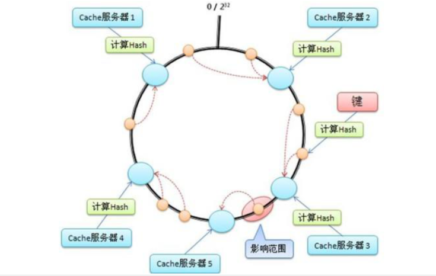

## 1. hash

​    nginx的负载均衡时有一个hash $request_uri的选项，这个是类似于LVS的dh。是针对客户端访问的uri来做的绑定。这样客户端访问同一个uri的时候，会被分配到同一个服务器上去。这样提高了缓存的命中率。

​        过程：每个uri进行hash计算得到一个数值，这个数值除以整个节点数量取余数。（取模算法）

​    缺点：如果一个节点挂了，那么整个全局都会乱掉。因为整个的节点数变了，因为除数变了。

## 2. 一致性hash

​    一致性hash的采用的是除数特别大，假设有一个hash环。是个闭环。把32位二进制的整数转换为十进制后均匀分布在整个环上。hash结果是除以2的32次方-1（hash是除以）. 那么结果一定是落在环上的。那么，这个点靠近谁，就缓存在谁那里。假设a节点坏了。那么下一次的计算结果就是旁边的邻居。但是邻居的缓存不会受到影响。只是坏掉的A节点会从新去缓存。



引入虚拟节点可以解决偏斜问题。在tengine的官方网站有一致性hash的一些详细介绍。 http://tengine.taobao.org/document_cn/http_upstream_consistent_hash_cn.html

## 3. 转移

如果后端主机宕机，请求会移动到其他的节点上去。 有三种hash方式。

- consistent_hash $remote_addr：可以根据客户端ip映射
- consistent_hash $request_uri： 根据客户端请求的uri映射
- consistent_hash $args：根据客户端携带的参数进行映射

```
worker_processes 1;
http {
    upstream test{
       consistent_hash  $request_uri;
       server 192.168.1.10:80 id=10 weight=3;
       server 192.168.1.20:80 id=20 weight=4;
       server 192.168.1.30:80 id=30 weight=6;    
    }
}
```