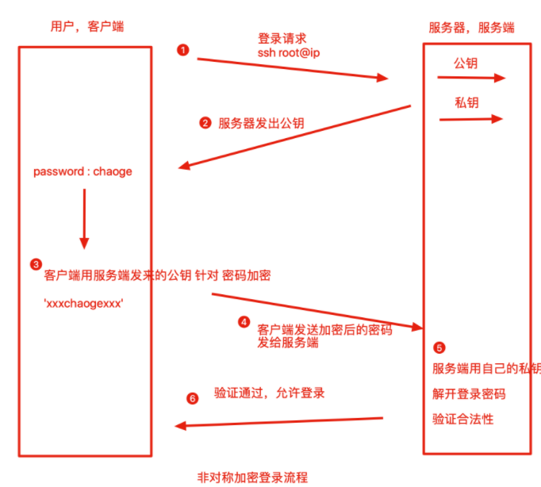
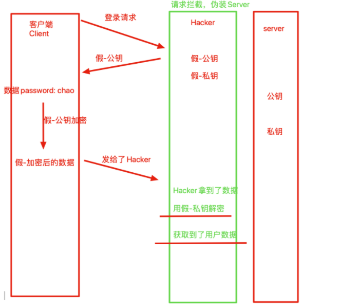
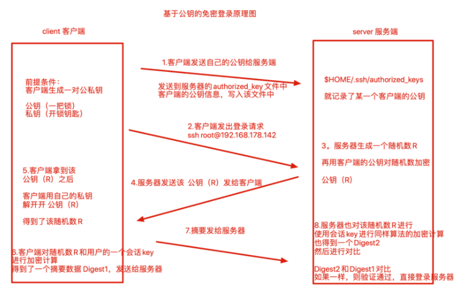
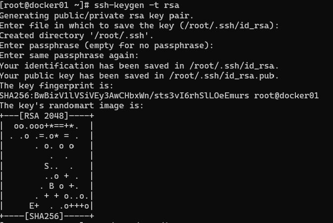

## ssh介绍

SSH是一套网络协议，目的在于`安全的网络服务`与`加密远程登录`。

实现了SSH协议的最主流的开源软件`OpenSSH`

### **为什么需要SSH**

如果一个用户从本地计算机，使用`SSH协议登录另一台远程计算机`，我们就可以认为，这种登录是安全的，即使被中途截获，密码也不会泄露。

Secure Shell是Linux系统首选的登录方式，以前使用FTP或telnet登录服务器，**都是以明文的形式在网络中发送账号密码**，很容易被黑客截取到数据，篡改后威胁服务器数据安全。因此如何对数据加密，安全传输是重中之重，主要方式有两种：

- 对称加密（秘钥加密）
- 非对称加密（公钥加密）

### 【对称加密】

> 加密，解密使用同一套秘钥

对称加密强度很高，难以破解，问题是当机器数量较多的时候，大量的发送密钥，难以保证密钥安全性，一旦某一个Client被窃取密钥，其他机器的安全性也就崩塌了

**因此，非对称加密应运而生**

### 【非对称加密】

> 非对称加密分为：公钥（Public Key）与私钥（Private Key）
> 使用公钥加密后的密文，只能使用对应的私钥才能解开，破解的可能性很低。



```
此种方式是私钥放在Server端，即使client在登录的时候，
传输数据被窃取，黑客也没有私钥进行解密，因此保证了数据安全。
```

### 中间人攻击

【Client如何保证自己接收到的公钥就是来源于目标Server机器的？】

上图看似理所当然，然而此时一位不愿意透露姓名的黑客路过，并且做了如下事情

1. 拦截客户端的登录请求
2. 向客户端发送`黑客自己`的公钥，这时客户端可能并不知道，并且用了此公钥对数据进行了加密
3. 客户端发送`假的公钥，加密后的数据`，黑客拿到了此`加密后的数据`，再用自己的私钥进行解密
4. 客户端的数据此时已被黑客截取



### ssh配置文件

和Linux用户有关ssh的配置文件，存放在此路径：`$HOME/.ssh/`

```
[root@chaogelinux .ssh]# pwd
/root/.ssh
[root@chaogelinux .ssh]# ls
authorized_keys  id_rsa  id_rsa.pub  known_hosts
```

- Known_hosts：当Client接收Server的公钥以后，Server的公钥信息会放在Client`$HOME/.ssh/known_hosts文件中`，下次再次连接的时候，系统能够识别出Server的公钥已经存在了本地，因此可以跳过警告部分，直接提示输入密码了
- authorized_keys：Server远程主机将`用户的公钥`，保存在已登录用户的`$HOME/.ssh/authorized_keys`文件中。
- id_rsa：私钥文件
- id_rsa.pub：公钥文件

#### 【基于公钥认证】

基于口令的认证存在一些缺点，每次登陆都需要输入密码，当我们机器数量众多的时候，难以维护了。

我们更希望能够免密登录`公钥登录`



公钥登录流程如下

- client发送自己的`公钥`给server，写入server的`authorized_keys`中
- server端接收到client的连接请求后，在自己的`authorized_keys`文件中匹配client的公钥信息`pubkey`，并且生成一个`随机数R`，使用client的公钥`pibkey`针对该`随机数R`进行加密，得到一个加密后的随机数**pubkey(R)**
- client通过私钥进行解密得到`随机数R`，再对随机数R和当前会话的sessionkey采用MD5生成摘要Digest1，再发送给server端
- server端会对随机数R和当前client的sessionkey用同样摘要算法生成Digest2
- 结果比较client发来的Digest1与Digest2是否一致，正确则完成认证

## 配置SSH公钥认证

1.client本地生成公私钥

```
[root@docker01 ~]# ssh-keygen -t rsa  #指定rsa密钥类型，默认一路回车

Your identification has been saved in /root/.ssh/id_rsa.
Your public key has been saved in /root/.ssh/id_rsa.pub.
```



2.client发送自己的公私钥到server中

```
[root@sql ~]# ssh-copy-id root@192.168.6.200
/usr/bin/ssh-copy-id: INFO: Source of key(s) to be installed: "/root/.ssh/id_rsa.pub"
The authenticity of host '192.168.6.200 (192.168.6.200)' can't be established.
ECDSA key fingerprint is SHA256:nARYC8XYub+RlvI9Lcfevdx/oYAUUbsw/32KF0jufHM.
ECDSA key fingerprint is MD5:e9:8e:b0:10:bf:81:5c:31:35:e6:f9:33:e3:f2:d5:c8.
Are you sure you want to continue connecting (yes/no)? yes
/usr/bin/ssh-copy-id: INFO: attempting to log in with the new key(s), to filter out any that are already installed
/usr/bin/ssh-copy-id: INFO: 1 key(s) remain to be installed -- if you are prompted now it is to install the new keys
root@192.168.6.200's password: 

Number of key(s) added: 1

Now try logging into the machine, with:   "ssh 'root@192.168.6.200'"
and check to make sure that only the key(s) you wanted were added.
```

3.此时可以免密登录了

```
[root@sql ~]# ssh root@192.168.6.200
Last login: Fri Feb 18 20:08:04 2022 from 192.168.6.1
```

## ssh配置文件

Linux强调一切皆文件，Linux系统中修改服务的运行参数，都是在修改程序的配置文件。

ssh服务的配置文件存放于`/etc/ssh/sshd_config`

```
[root@chaogelinux ~]# grep -Ev '^$|^[# ]' /etc/ssh/sshd_config
Port 22    #默认端口
AddressFamily any    #配置地址家族，any支持ipv4，ipv6
ListenAddress 0.0.0.0 #设置sshd服务监听的ip地址，注意多网卡的绑定
HostKey /etc/ssh/ssh_host_rsa_key  #ssh各密钥存放的位置 
HostKey /etc/ssh/ssh_host_ecdsa_key
HostKey /etc/ssh/ssh_host_ed25519_key
PermitRootLogin yes  #是否允许root管理员直接登录，保证系统安全
StrictModes yes    #当用户的私钥改变，直接拒绝连接
MaxAuthTries 6    #最大密码尝试次数
MaxSessions 10    #最大终端数
AuthorizedKeysFile .ssh/authorized_keys    #信任主机的公钥文件存放地
PasswordAuthentication yes #是否设置密码验证机制
PermitEmptyPasswords no  #是否允许空密码登录，禁止
```

对于centos7系列，默认以及安装且启用了SSHD服务，可以直接使用ssh命令登录服务器

对于生产环境，服务器一般禁止root管理员直接登录服务器，可以大大降低被黑客暴力破解的几率，需要修改sshd的主配置文件，修改如下参数

```
PermitRootLogin yes   #禁止root直接登录,使用普通用户登录安全性较高
```

注意的是，修改了配置文件，重启服务方可生效

```
systemctl restart sshd
systemctl enable sshd
```

以后直接用root登录会被禁止，应该使用普通用户登录后，sudo执行命令

## ssh与服务器安全实战

Linux强调一切皆文件，Linux系统更改各种软件的配置参数，也就是在修改文件内容而已

sshd服务的配置文件，默认在`/etc/ssh/sshd_config`

```
默认的sshd配置文件，如下

[root@chaoge_linux ~]# grep -Ev '^$|^[# ]' /etc/ssh/sshd_config
HostKey /etc/ssh/ssh_host_rsa_key
HostKey /etc/ssh/ssh_host_ecdsa_key
HostKey /etc/ssh/ssh_host_ed25519_key
SyslogFacility AUTHPRIV
AuthorizedKeysFile    .ssh/authorized_keys
PasswordAuthentication yes
ChallengeResponseAuthentication no
GSSAPIAuthentication no
GSSAPICleanupCredentials no
UsePAM yes
X11Forwarding yes
UseDNS no
AcceptEnv LANG LC_CTYPE LC_NUMERIC LC_TIME LC_COLLATE LC_MONETARY LC_MESSAGES
AcceptEnv LC_PAPER LC_NAME LC_ADDRESS LC_TELEPHONE LC_MEASUREMENT
AcceptEnv LC_IDENTIFICATION LC_ALL LANGUAGE
AcceptEnv XMODIFIERS
Subsystem    sftp    /usr/libexec/openssh/sftp-server
```

在生产服务器下，运维人员一般会禁止root用户登录服务器，最大程度的保证服务器的安全，被黑客攻击的几率，以及修改ssh的远程连接端口

- 修改ssh的端口 ，Port 23354
- 禁止root登录，PermitRootLogin no
- 禁止用密码登录，只能用被信任的机器，用公私钥进行登录，PasswordAuthentication no

```
修改/etc/ssh/sshd_config 文件的如下参数,此时一个安全的ssh服务器以及配置完毕，参数如下

[root@chaoge_linux ~]# grep -Ev '^$|^[# ]' /etc/ssh/sshd_config
Port 23354
AddressFamily any
ListenAddress 0.0.0.0
HostKey /etc/ssh/ssh_host_rsa_key
HostKey /etc/ssh/ssh_host_ecdsa_key
HostKey /etc/ssh/ssh_host_ed25519_key
SyslogFacility AUTHPRIV
PermitRootLogin no
AuthorizedKeysFile    .ssh/authorized_keys
PasswordAuthentication no
ChallengeResponseAuthentication no
GSSAPIAuthentication no
GSSAPICleanupCredentials no
UsePAM yes
X11Forwarding yes
UseDNS no
AcceptEnv LANG LC_CTYPE LC_NUMERIC LC_TIME LC_COLLATE LC_MONETARY LC_MESSAGES
AcceptEnv LC_PAPER LC_NAME LC_ADDRESS LC_TELEPHONE LC_MEASUREMENT
AcceptEnv LC_IDENTIFICATION LC_ALL LANGUAGE
AcceptEnv XMODIFIERS
Subsystem    sftp    /usr/libexec/openssh/sftp-server
```

注意了，此时别立即重启服务

配置一个普通用户的账号，且支持公钥登录的形式

```
1.登录服务器，创建普通用户，设置登录密码
useradd yuchao
passwd yuchao

2.在自己本地机器，生成一个普通用户的公私钥对
ssh-keygen -t rsa
3.发送公钥给服务器，配置公钥登录
ssh-copy-id yuchao@192.168.178.142

4.在正确配置了公私钥登录之后，yuchao这个用户就可以免密登录linux服务器了
ssh yuchao@192.168.178.142
```

在linux机器上配置yuchao用户支持sudo命令

```
1.使用root登录服务器，配置yuchao用户支持sudo命令
vim  /etc/sudoers文件
添加如下行
## Allow root to run any commands anywhere
root    ALL=(ALL)       ALL
yuchao  ALL=(ALL)       ALL

2.此时尝试用yuchao用户登录，是否能够使用sudo命令
```

到了最后一步了，使用root账号，重启linux的sshd服务器，以后root用户就无法使用密码登录了，只能用yuchao这个用户进行免密登录，最大程度保证服务器的安全了

```
1.使用root用户重启sshd服务
ssh root@192.168.178.142

2.重启sshd服务
systemctl restart sshd

3.此时机器已经禁止root登录，禁止密码登录，且修改了ssh端口为23354

4.此时只能使用配置好的yuchao用户进行免密登录了
ssh yuchao@192.168.178.142 -p 23354
```

## Screen命令

作为linux服务器管理员,经常要使用ssh登陆到远程linux机器上做一些耗时的操作。

也许你遇到过使用telnet或SSH远程登录linux,运行一些程序。如果这些程序需要运行很长时间(几个小时)，而程序运行过程中出现网络故障，或者客户机故障，这时候客户机与远程服务器的链接将终端，并且远程服务器没有正常结束的命令将被迫终止。 又比如你SSH到主机上后，开始批量的scp命令，如果这个ssh线程断线了，scp进程就中断了。在远程服务器上正在运行某些耗时的作业，但是工作还没做完快要下班了，退出的话就会中断操作了，如何才好呢？

因此screen命令是能够实现多窗口远程控制的一个程序，解决由于网络异常或是窗口端口导致的服务断开，还能使用screen在多个远程会话中自由切换。

- 远程会话恢复：由于网络中断，导致的会话断开，需要重新连接，screen能确保用户不会丢失对远程会话的控制
- 多窗口，运行多个远程会话
- 会话共享：多个用户同时登录到远程服务器时，可以使用会话共享功能让用户之间的数据共享

### 安装screen命令

```
1.提前配置好epel仓库源
[root@chaogelinux ~]# yum install screen -y

2.直接安装
[root@chaogelinux ~]# yum install screen -y
```

### 管理远程会话

Screen常用参数

| 参数  | 作用                                                         |
| ----- | ------------------------------------------------------------ |
| -S    | 创建会话窗口                                                 |
| -A    | 所有的窗口都调整为当前终端的大小                             |
| -d    | 断开screen进程（得有用户是Attached状态，可以用screen -list查看） |
| -ls   | 同于-list，显示目前所有的screen                              |
| -r    | 恢复离线的screen进程，可以指定多个pid.tty.host               |
| -x    | 恢复离线的screen作业                                         |
| -wipe | 检查目前所有的screen作业，并删除已经无法使用的screen作业     |

【实际操作案例】

```
1.进入一个新的screen会话，名字叫做s1
[root@chaogelinux ~]# screen -S s1

2.此时会立刻进入screen，检查会话信息
[root@chaogelinux ~]# screen -ls
There is a screen on:
        27686.s1        (Attached)
1 Socket in /var/run/screen/S-root.

3.想要退出screen会话，直接输入exit
[root@chaogelinux ~]# screen -S s1
[screen is terminating]
```

screen实际应用，模拟突然端口远程会话

```
1.新建一个会话，执行一个持续执行的任务
[root@chaogelinux ~]# screen -S myPing

2.执行一个ping任务
ping baidu.com

3.直接关闭窗口

4.检查screen会话
发现有个myPing是挂掉的状态
[root@chaogelinux ~]# screen -ls
There is a screen on:
    28570.myPing    (Detached)
1 Socket in /var/run/screen/S-root.

5.恢复会话
[root@chaogelinux ~]# screen -r myPing

6.退出会话直接exit

7.还可以再次尝试用screen新建一个会话，使用vim编辑文件，然后关闭窗口
```

### 会话共享

screen命令不仅可以保护用户在极端的情况下不会丢失对系统的远程控制，还可以进行会话共享，分屏切割，会话锁定等功能。

例如会话共享，可以让多个用户看到一样的内容

【利用screen完成远程协助功能】

```
1.小王同学创建一个screen会话，等待超哥连接
screen -S shareScreen


2.超哥登录服务器，查看以存在的会话信息
[root@chaogelinux ~]# screen -ls

3.超哥加入会话，且开始操作，协助小王解决问题，小王坐在电脑前默默观看
screen -x  shareScreen

4.小王默默观看超哥一顿输出，解决bug

5.超哥退出screen输入ctrl + a + d 组合键，留下小王满意的笑容
ctrl + a + d #超哥退出screen

6.小王退出screen，正常操作linux
exit
```