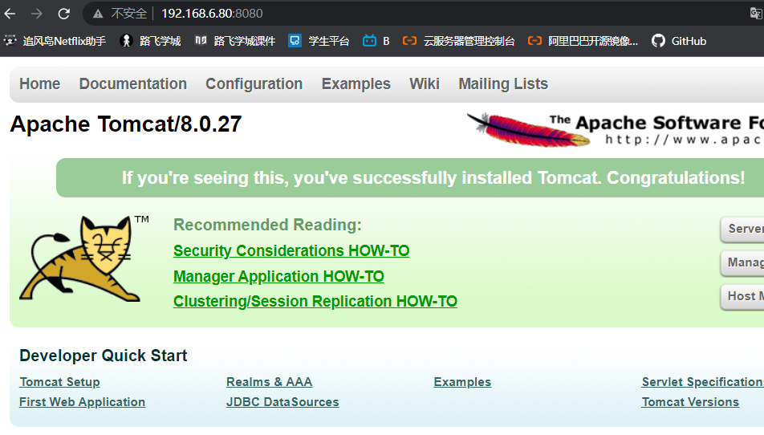
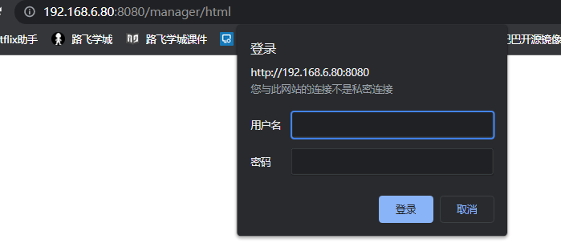
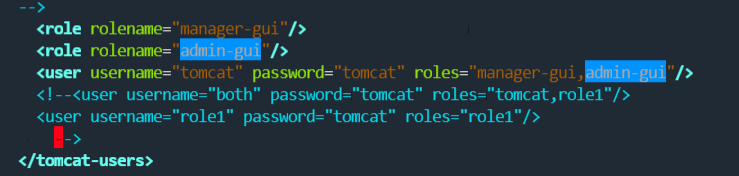
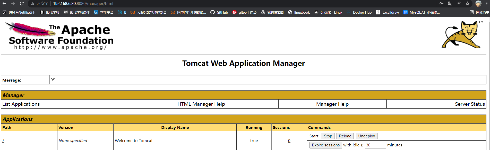

## 安装Tomcat&JDK

### jdk

Tomcat运行必须得有java环境，这个JDK是：

> Java Development Kit（JDK）sun公司对Java开发人员发布的免费软件开发工具包（SDK，Software development kit）

> JDK下载页面：http://www.oracle.com/technetwork/java/javase/downloads/index.html

JDK是 Java 语言的软件开发工具包，主要用于移动设备、嵌入式设备上的java应用程序。JDK是整个java开发的核心，它包含了JAVA的运行环境（JVM+Java系统类库）和JAVA工具。

JDK包含了一批用于Java开发的组件，其中包括：

```
javac：编译器，将后缀名为.java的源代码编译成后缀名为“.class”的字节码
java：运行工具，运行.class的字节码
jar：打包工具，将相关的类文件打包成一个文件
javadoc：文档生成器，从源码注释中提取文档，注释需匹配规范
jdb debugger：调试工具
jps：显示当前java程序运行的进程状态
javap：反编译程序
appletviewer：运行和调试applet程序的工具，不需要使用浏览器
javah：从Java类生成C头文件和C源文件。这些文件提供了连接胶合，使Java和C代码可进行交互。
javaws：运行JNLP程序
extcheck：一个检测jar包冲突的工具
apt：注释处理工具 
jhat：java堆分析工具
jstack：栈跟踪程序
jstat：JVM检测统计工具
jstatd：jstat守护进程
jinfo：获取正在运行或崩溃的java程序配置信息
jmap：获取java进程内存映射信息
idlj：IDL-to-Java编译器。将IDL语言转化为java文件 
policytool：一个GUI的策略文件创建和管理工具
jrunscript：命令行脚本运行
```

> 安装时候选择tomcat软件版本要与程序开发使用的版本一致。jdk版本要进行与tomcat保持一致

- 准备2个linux虚拟机
- 一个运行nginx进行负载均衡
- 一个用来运行tomcat

### 安装

#### 部署jdk

```
#下载好包，然后解压缩
[root@sql tomcat]# ll
total 185908
-rw-r--r-- 1 root root   9128610 Mar  4 23:20 apache-tomcat-8.0.27.tar.gz
-rw-r--r-- 1 root root 181238643 Mar  4 23:21 jdk-8u60-linux-x64.tar.gz

#配置个软连接，以后方便配置
[root@sql tomcat]# ln -s /server/tomcat/jdk1.8.0_60/ /server/tomcat/jdk

#sed替换配置文件,配置jdk环境变量
sed -i.ori '$a export JAVA_HOME=/server/tomcat/jdk\nexport PATH=$JAVA_HOME/bin:$JAVA_HOME/jre/bin:$PATH\nexport CLASSPATH=.:$JAVA_HOME/lib:$JAVA_HOME/jre/lib:$JAVA_HOME/lib/tools.jar' /etc/profile

#读取配置文件
[root@sql tomcat]# source /etc/profile

#检查环境变量
[root@sql tomcat]# sed -i.ori '$a export JAVA_HOME=/server/tomcat/jdk\nexport PATH=$JAVA_HOME/bin:$JAVA_HOME/jre/bin:$PATH\nexport CLASSPATH=.:$JAVA_HOME/lib:$JAVA_HOME/jre/lib:$JAVA_HOME/lib/tools.jar' /etc/profile

#测试jdk是否安装成功
[root@sql tomcat]# java -version
java version "1.8.0_60"
Java(TM) SE Runtime Environment (build 1.8.0_60-b27)
Java HotSpot(TM) 64-Bit Server VM (build 25.60-b23, mixed mode)
```

#### 部署tomcat

```
#下载好包，然后解压缩
[root@sql tomcat]# ll
total 185908
-rw-r--r-- 1 root root   9128610 Mar  4 23:20 apache-tomcat-8.0.27.tar.gz
-rw-r--r-- 1 root root 181238643 Mar  4 23:21 jdk-8u60-linux-x64.tar.gz

#配置个软连接，以后方便配置
[root@sql tomcat]# ln -s /server/tomcat/apache-tomcat-8.0.27 /server/tomcat/tomcat

# 设置环境变量
[root@sql tomcat]# echo 'export TOMCAT_HOME=/server/tomcat/tomcat' > /etc/profile
[root@sql tomcat]# source /etc/profile
[root@sql tomcat]# tail -1 /etc/profile
export TOMCAT_HOME=/server/tomcat/tomcat

#给tomcat/jdk目录文件夹，整体授权root用户
[root@sql tomcat]# chown -R root.root /server/tomcat/jdk /server/tomcat/tomcat/


# 检查tomcat是否安装正确
[root@sql tomcat]# /server/tomcat/tomcat/bin/version.sh 
Using CATALINA_BASE:   /server/tomcat/tomcat
Using CATALINA_HOME:   /server/tomcat/tomcat
Using CATALINA_TMPDIR: /server/tomcat/tomcat/temp
Using JRE_HOME:        /server/tomcat/jdk
Using CLASSPATH:       /server/tomcat/tomcat/bin/bootstrap.jar:/server/tomcat/tomcat/bin/tomcat-juli.jar
Server version: Apache Tomcat/8.0.27
Server built:   Sep 28 2015 08:17:25 UTC
Server number:  8.0.27.0
OS Name:        Linux
OS Version:     3.10.0-1160.el7.x86_64
Architecture:   amd64
JVM Version:    1.8.0_60-b27
JVM Vendor:     Oracle Corporation
```

### Tomcat目录介绍

```
# 目录解释
[root@sql tomcat]# tree /server/tomcat/tomcat/ -L 1
server/tomcat/tomcat/
├── bin              # 存放tomcat管理脚本
├── conf             # tomcat 配置文件存放目录
├── lib              # web应用调用的jar包存放路径
├── LICENSE
├── logs             # tomcat 日志存放目录，catalina.out 为主要输出日志
├── NOTICE
├── RELEASE-NOTES
├── RUNNING.txt
├── temp             # 存放临时文件
├── webapps         # web程序存放目录
└── work             # 存放编译产生的.java 与 .class文件

7 directories, 4 files

# 日志说明
```

### webapps目录介绍

```
 tree  /tomcat/webapps/ -L 1

├── docs            # tomcat 帮助文档
├── examples        # web应用实例
├── host-manager    # 主机管理
├── manager         # 管理
└── ROOT             # 默认站点根目录

5 directories, 0 files
```

### Tomcat配置文件

```
 tree  /tomcat/conf/

├── catalina.policy
├── catalina.properties
├── context.xml
├── logging.properties
├── server.xml                    # tomcat主配置，例如更改端口等
├── tomcat-users.xml        # tomcat管理用户配置
├── tomcat-users.xsd
└── web.xml
```

### Tomcat启停

```
#启动
[root@sql tomcat]# /server/tomcat/tomcat/bin/startup.sh 

#停止
[root@sql tomcat]# /server/tomcat/tomcat/bin/shutdown.sh 
```

### 访问tomcat

```
[root@sql tomcat]# /server/tomcat/tomcat/bin/startup.sh 
```



### 检测tomcat日志

```
[root@sql tomcat]# tail -f /server/tomcat/tomcat/logs/catalina.out 
04-Mar-2022 23:47:04.729 INFO [localhost-startStop-1] org.apache.catalina.startup.HostConfig.deployDirectory Deployment of web application directory /server/tomcat/apache-tomcat-8.0.27/webapps/docs has finished in 14 ms
```

### Tomcat管理功能

生产环境一般禁用，或者设置访问权限。

Tomcat管理功能用于对Tomcat自身以及部署在Tomcat上的应用进行管理的web应用。在默认情况下是处于禁用状态的。

默认访问不了,需要账号密码



配置管理用户配置`tomcat-users.xml`



修改完成后重启配置，再次进入后台管理页面



## Tomcat配置文件解析

```java
/opt/tomcat/conf/server.xml

# 默认配置内容很多
[root@sql tomcat]# grep -Ev  '^#|^$' /server/tomcat/tomcat/conf/server.xml

# 主要的标签部分，通过如下的缩进关系，了解他们的关系
<server>                                    # 顶级组件，在配置的顶层，运行一个JVM中的tomcat实例
     <service>                        # 容器类组件，可以包含其他组件，如engine，host，context
         <connector />        # 连接类组件，连接用户请求到tomcat,如connector，类似listen监听端口
               <engine>        # 核心容器组件，通过connector接受用户请求，处理请求，转发给虚拟主机host
                     <host>    # 类似于nginx的虚拟主机
                         <context>  </context>  # 最内层的组件，不得嵌套，配置web站点，webapp目录，类似于nginx配置的alias定义的目录。
                             </host>
                             <host>
                         <context></context>
                     </host>
               </engine>
         </service>
</server>
```

### 组件名称解释

| **组件名称**          | **功能介绍**                                                 |
| --------------------- | ------------------------------------------------------------ |
| **engine**            | 核心容器组件，catalina引擎，负责通过connector接收用户请求，并处理请求，将请求转至对应的虚拟主机host。 |
| **host**              | 类似于httpd中的虚拟主机，一般而言支持基于FQDN的虚拟主机。    |
| **context**           | 定义一个应用程序，是一个最内层的容器类组件（不能再嵌套）。配置context的主要目的指定对应对的webapp的根目录，类似于httpd的alias，其还能为webapp指定额外的属性，如部署方式等。 |
| **connector**         | 接收用户请求，类似于httpd的listen配置监听端口的。            |
| **service（服务）**   | 将connector关联至engine，因此一个service内部可以有多个connector，但只能有一个引擎engine。service内部有两个connector，一个engine。因此，一般情况下一个server内部只有一个service，一个service内部只有一个engine，但一个service内部可以有多个connector。 |
| **server**            | 表示一个运行于JVM中的tomcat实例。                            |
| **Valve**             | 阀门，拦截请求并在将其转至对应的webapp前进行某种处理操作，可以用于任何容器中，比如记录日志(access log valve)、基于IP做访问控制(remote address filter valve)。 |
| **logger**            | 日志记录器，用于记录组件内部的状态信息，可以用于除context外的任何容器中。 |
| **realm**             | 可以用于任意容器类的组件中，关联一个用户认证库，实现认证和授权。可以关联的认证库有两种：UserDatabaseRealm、MemoryRealm和JDBCRealm。 |
| **UserDatabaseRealm** | 使用JNDI自定义的用户认证库。                                 |
| **MemoryRealm**       | 认证信息定义在tomcat-users.xml中。                           |
| **JDBCRealm**         | 认证信息定义在数据库中，并通过JDBC连接至数据库中查找认证用户。 |

### server.xml注释版

```
<?xml version='1.0' encoding='utf-8'?>
<!--
<Server>元素代表整个容器,是Tomcat实例的顶层元素.由org.apache.catalina.Server接口来定义.它包含一个<Service>元素.并且它不能做为任何元素的子元素.
    port指定Tomcat监听shutdown命令端口.终止服务器运行时,必须在Tomcat服务器所在的机器上发出shutdown命令.该属性是必须的.
    shutdown指定终止Tomcat服务器运行时,发给Tomcat服务器的shutdown监听端口的字符串.该属性必须设置
-->
<Server port="8005" shutdown="SHUTDOWN">
  <Listener className="org.apache.catalina.startup.VersionLoggerListener" />
  <Listener className="org.apache.catalina.core.AprLifecycleListener" SSLEngine="on" />
  <Listener className="org.apache.catalina.core.JreMemoryLeakPreventionListener" />
  <Listener className="org.apache.catalina.mbeans.GlobalResourcesLifecycleListener" />
  <Listener className="org.apache.catalina.core.ThreadLocalLeakPreventionListener" />
  <GlobalNamingResources>
    <Resource name="UserDatabase" auth="Container"
              type="org.apache.catalina.UserDatabase"
              description="User database that can be updated and saved"
              factory="org.apache.catalina.users.MemoryUserDatabaseFactory"
              pathname="conf/tomcat-users.xml" />
  </GlobalNamingResources>
  <!--service服务组件-->
  <Service name="Catalina">
    <!-- Connector主要参数说明（见下表） -->
    <Connector port="8080" protocol="HTTP/1.1"
               connectionTimeout="20000"
               redirectPort="8443" />
    <Connector port="8009" protocol="AJP/1.3" redirectPort="8443" />
    <!--engine,核心容器组件,catalina引擎,负责通过connector接收用户请求,并处理请求,将请求转至对应的虚拟主机host
        defaultHost指定缺省的处理请求的主机名，它至少与其中的一个host元素的name属性值是一样的
    -->
    <Engine name="Catalina" defaultHost="localhost">
      <!--Realm表示存放用户名，密码及role的数据库-->
      <Realm className="org.apache.catalina.realm.LockOutRealm">
        <Realm className="org.apache.catalina.realm.UserDatabaseRealm"
               resourceName="UserDatabase"/>
      </Realm>
      <!-- 详情常见下表（host参数详解）-->
      <Host name="localhost"  appBase="webapps"
            unpackWARs="true" autoDeploy="true">
        <!-- 详情常见下表（Context参数说明 ）-->
        <Context path="" docBase="" debug=""/>
        <Valve className="org.apache.catalina.valves.AccessLogValve" directory="logs"
               prefix="localhost_access_log" suffix=".txt"
               pattern="%h %l %u %t &quot;%r&quot; %s %b" />
      </Host>
    </Engine>
  </Service>
</Server>
```

### Connector主要参数说明

| **参数**              | **参数说明**                                                 |
| --------------------- | ------------------------------------------------------------ |
| **connector**         | 接收用户请求，类似于httpd的listen配置监听端口.               |
| **port**              | 指定服务器端要创建的端口号，并在这个端口监听来自客户端的请求。 |
| **address**           | 指定连接器监听的地址，默认为所有地址（即0.0.0.0）            |
| **protocol**          | 连接器使用的协议，支持HTTP和AJP。AJP（Apache Jserv Protocol）专用于tomcat与apache建立通信的， 在httpd反向代理用户请求至tomcat时使用（可见Nginx反向代理时不可用AJP协议）。 |
| **minProcessors**     | 服务器启动时创建的处理请求的线程数                           |
| **maxProcessors**     | 最大可以创建的处理请求的线程数                               |
| **enableLookups**     | 如果为true，则可以通过调用request.getRemoteHost()进行DNS查询来得到远程客户端的实际主机名，若为false则不进行DNS查询，而是返回其ip地址 |
| **redirectPort**      | 指定服务器正在处理http请求时收到了一个SSL传输请求后重定向的端口号 |
| **acceptCount**       | 指定当所有可以使用的处理请求的线程数都被使用时，可以放到处理队列中的请求数，超过这个数的请求将不予处理 |
| **connectionTimeout** | 指定超时的时间数(以毫秒为单位)                               |

### host参数详解

| **参数**              | **参数说明**                                                 |
| --------------------- | ------------------------------------------------------------ |
| **host**              | 表示一个虚拟主机                                             |
| **name**              | 指定主机名                                                   |
| **appBase**           | 应用程序基本目录，即存放应用程序的目录.一般为appBase="webapps" ，相对于CATALINA_HOME而言的，也可以写绝对路径。 |
| **unpackWARs**        | 如果为true，则tomcat会自动将WAR文件解压，否则不解压，直接从WAR文件中运行应用程序 |
| **autoDeploy**        | 在tomcat启动时，是否自动部署。                               |
| **xmlValidation**     | 是否启动xml的校验功能，一般xmlValidation="false"。           |
| **xmlNamespaceAware** | 检测名称空间，一般xmlNamespaceAware="false"。                |

### Context参数说明

| **参数**       | **参数说明**                                                 |
| -------------- | ------------------------------------------------------------ |
| **Context**    | 表示一个web应用程序，通常为WAR文件                           |
| **docBase**    | 应用程序的路径或者是WAR文件存放的路径,也可以使用相对路径，起始路径为此Context所属Host中appBase定义的路径。 |
| **path**       | 表示此web应用程序的url的前缀，这样请求的url为`http://localhost:8080/path/`**** |
| **reloadable** | 这个属性非常重要，如果为true，则tomcat会自动检测应用程序的/WEB-INF/lib 和/WEB-INF/classes目录的变化，自动装载新的应用程序，可以在不重启tomcat的情况下改变应用程序 |