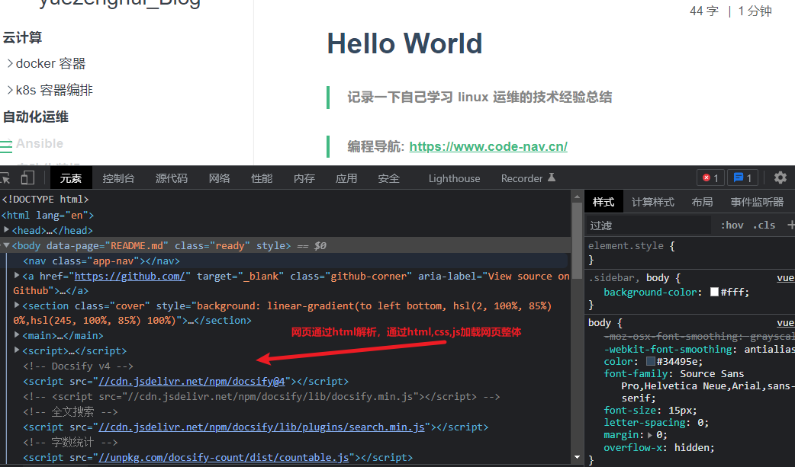

## tomcat

Tomcat是Apache软件基金会（Apache Software Foundation）项目中的一个核心项目，由Apache、Sun和其他一些公司及个人共同开发而成。

Tomcat服务器是一个免费的开放源代码的Web应用服务器，属于轻量级应用服务器，在中小型系统和并发访问用户不是很多的场合下被普遍使用，是开发和调试JSP程序的首选。

Tomcat和Nginx、Apache(httpd)、lighttpd等Web服务器一样，具有处理HTML页面的功能，另外它还是一个Servlet和JSP容器，独立的Servlet容器是Tomcat的默认模式。

Tomcat处理静态HTML的能力不如Nginx/Apache服务器。

Java容器还有resin、weblogic等。

## Web运行原理

当在浏览器中输入一个URL之后，经过DNS解析之后对应的服务器就会把该URL对应的网页，通过远程Web服务器发送到客户端，且由客户端的浏览器将其展示出来。

Web服务器上存放了各种静态文件，如HTML，图片，音视频等，这些信息通过超文本技术相互连接，也就是HTML文件，且采用HTTP协议和Web服务器通信，这样就能拿到Web服务器上的各种资料。

## Tomcat架构

Tomcat本身完全用Java语言开发，Tomcat目前可以和大部分Web服务器（IIS，Apache，Nginx）一起工作，且Tomcat是运行Java代码等容器。

常见用法是，nginx+tomcat，实现动静态请求分离。

Tomcat本身由一系列可配置等组件构成，核心组件是Servlet容器组件，Servlet就是一个用java语言开发，运行在服务器上的插件，用于解析动态的用户请求。

在使用java开发的公司，进行代码部署，常见做法是：

- 将Tomcat作为独立的Web服务器单独运行，Tomcat的运行必须依赖于Java虚拟机进程（Java Virtual Machine，JVM）进程。
- JVM虚拟机解决了JAVA程序，可以运行在任何平台上，解决了可移植性。

