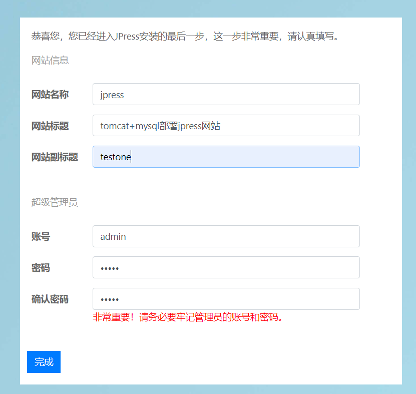

## Tomcat部署jpress

tomcat部署代码的方式有两种：

- 开发打包好的代码，直接放在webapps目录下
- 使用开发工具将程序打包成war包，再传到webapps目录下

> jpress官网：[http://jpress.io](http://jpress.io/)

> 下载地址：https://github.com/JpressProjects/jpress

```
#1.服务器配置mysql


#2.配置数据库信息
mysql> create database jpress default character set utf8;
Query OK, 1 row affected (0.01 sec)

mysql> grant all on jpress.* to jpress@localhost identified by '123456';
Query OK, 0 rows affected (0.01 sec)

mysql> flush privileges;
Query OK, 0 rows affected (0.01 sec)

#3.把现在好的jpress war包上传到tomcat的webapps目录，tomcat自动解压缩war包
[root@sql tomcat]# ls tomcat/webapps/
docs  examples  host-manager  jpress-v4.0.4  jpress-v4.0.4.war  manager  ROOT

#4.访问站点,注意要访问webapps目录下解压缩war包的名字
http://192.168.6.80:8080/jpress-v4.0.4/install
```

进入安装页




此时我们从新登录一下该网站

> http://192.168.6.80:8080/jpress-v4.0.4/login


部署成功


## Tomcat多实例

多实例指的是，同一个服务，基于不同的端口，运行多个实例（进程），例如

- mysql多实例，一台机器，可以运行多个独立的数据库，端口分别是3306,3307,3308
- nginx多虚拟主机，基于不同的ip，域名，端口

多实例的作用是，如：

- 一个服务器可以运行多个站点，如`www.linux.com`，如`www.python.com`，属于独立的服务
- 一个机器运行一个站点多个实例，进行负载均衡，不过这种形式还是分机器为好

