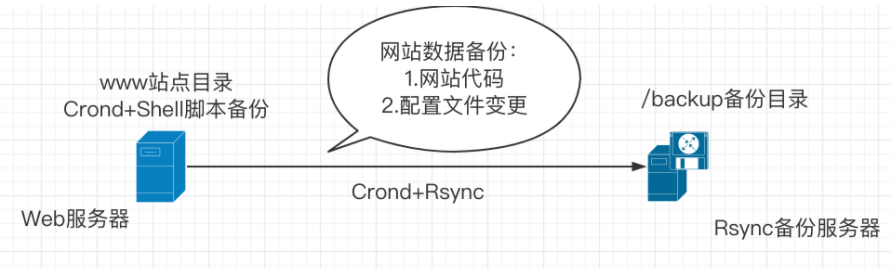
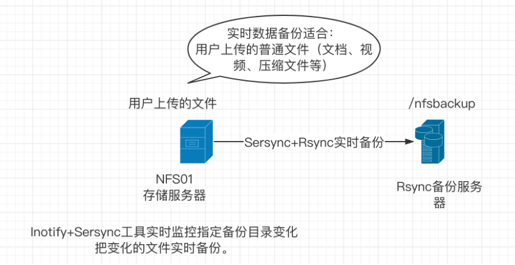
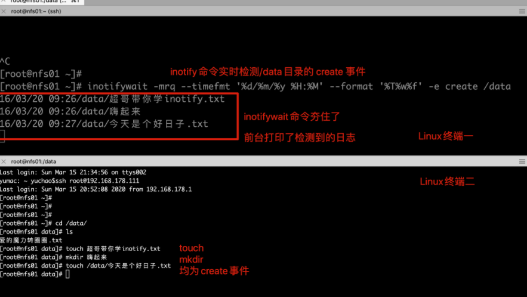
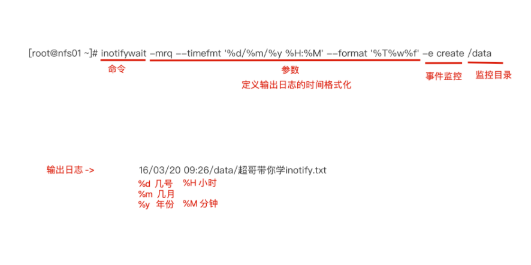
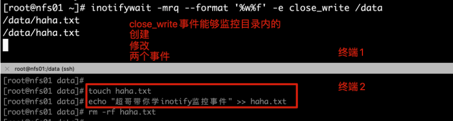
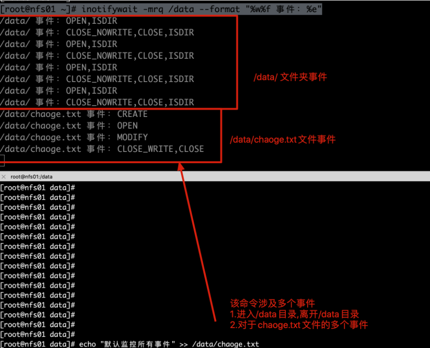
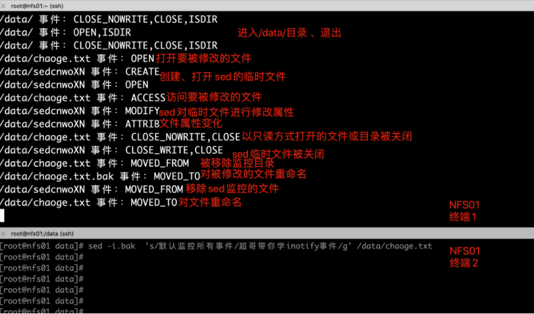
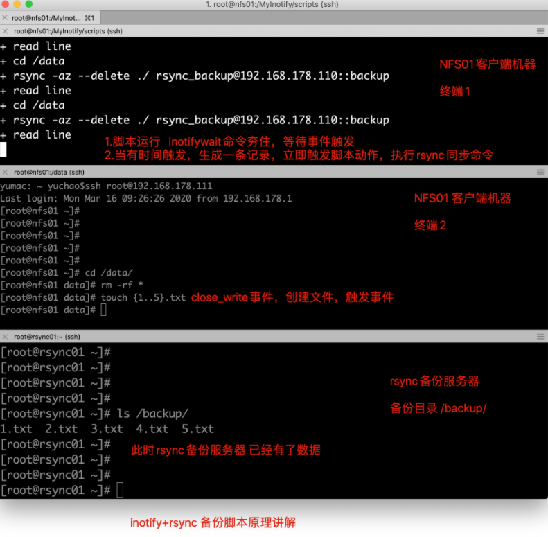

## 数据备份方案

企业网站和应用都得有完全的数据备份方案确保数据不丢失，通常企业有如下的数据备份方案

### 定时任务定期备份

需要周期性备份的数据可以分两类：

- 后台程序代码、运维配置文件修改，一般会定时任务执行脚本进行文件备份，然后配置Rsync工具推送到远程服务器备份
- 对于数据库文件用定时任务脚本配合数据库提供的备份工具，定时生成备份文件，配合Rsync备份到远端

为什么要用实时同步服务

因为定时任务有缺陷，一分钟以内的数据无法进行同步，容易造成数据丢失

### 实施复制方案

实施复制是最适合企业备份重要数据的方式，用于用户提交的数据备份，对于用户提交的普通文件（jpg、tar、zip、MP4、txt、html）等待，都可以用`Inofity+Sersync+Rsync`实时备份方案。

对于数据文件，还有更复杂的分布式存储方案，把数据同时备份成多份，如FastDFS、GlusterFS等

对于提交到数据库中的数据，还可以用数据库的主从复制（如MySQL），这是软件自带的实时备份。

### 图解备份方式



### 图解实时复制



## 实时复制环境准备

【部署机器准备】

```
NFS01机器  192.168.178.111        /data共享目录
BACKUP机器                                      /backup 备份目录
```

### 实时复制说明

1.实时复制软件会监控磁盘文件系统的变化，比如指定的/data目录，实时复制软件进程会实时监控这个/data目录中对应文件系统数据的变化。

2.一旦/data目录文件发生变化，就会执行rsync命令，将变化的数据推送到备份服务器对应的备份目录中

### 实施复制软件介绍

企业常用实时复制软件如下两款

| 软件          | 依赖程序      | 部署难点 | 说明             |
| ------------- | ------------- | -------- | ---------------- |
| Inotify-tools | Rsync守护进程 | 复制脚本 | 监控目录数据变化 |
| Sersync*      | Rsync守护进程 | 配置文件 | 监控目录数据变化 |

## Inotify机制

Inotify是一种异步的系统事件监控机制，通过Inotify可以监控文件系统中添加、删除、修改等事件，利用这个内核接口，第三方软件可以监控文件系统下的情况变化。

那么Inofity-tools就是该类软件的实现，是一个监控指定目录数据实时变化的软件。

实现了Inotify的软件还有`Sersync`、`Inotify-tools`

```
Sersync软件是在Inotify的基础上进行开发的，功能更加强大，支持配置文件中定义、重试机制、过滤机制、提供CDN数据更新、多线程操作等。
```

【Inotify机制的优点】

- 监控文件系统的事件变化，通过复制工具实现实时数据复制
- 支持多线程实时复制

【Inotify的缺点】

- 实测当文件数量大于200个（10~100kb），复制存在延迟。

## Inofity+Rsync实施复制实战

无论是Inotify-tools还是Sersync、本身的核心功能都是`监控指定目录内的数据变化`，具体的复制到远端服务器的功能还是借助Rsync工具配合，Inotify机制软件工作流程如下

1. 备份源客户端开机运行Inotify软件，检测指定目录的文件系统变化
2. 一旦获取到指定监控目录的数据发生变化，即刻执行Rsync命令复制数据。
3. 将变化的数据发送到Rsync服务端的备份目录。

## 项目部署实施

【1.确保远程数据传输服务部署完成】

### 前提配置好Rsync Daemon模式

```
也就是可以在客户端机器，推送、拉取数据到BACKUP服务器，才能配置Inofity-tools

将rsync守护进程模式部署完毕
rsync服务端部署
a 检查rsync软件是否已经安装
b 编写rsync软件主配置文件
c 创建备份目录管理用户
d 创建备份目录，并进行授权
e 创建认证文件，编写认证用户和密码信息，设置文件权限为600
f 启动rsync守护进程服务
```

### 在NFS01机器配置

```
rsync客户端部署
a 检查rsync软件是否已经安装    
b 创建认证文件，编写认证用户密码信息即可，设置文件权限为600
c 利用客户端进行数据同步测试

当前也就是rsync客户端机器，配置如下部署
1.设置密码环境变量，方便的使用rsync命令
[root@nfs01 ~]# echo "export RSYNC_PASSWORD=chaoge"  >> /etc/bashrc

2.加载配置文件
source /etc/bashrc

3.检查环境变量
[root@nfs01 ~]# echo $RSYNC_PASSWORD
chaoge

4.作为Rsync客户端，测试推送和拉取数据是否正常
#推送本地数据给Rsync服务端
[root@nfs01 ~]# rsync -avz /data/ rsync_backup@192.168.178.110::backup

5.拉取服务端资料
[root@nfs01 ~]# rsync -avz rsync_backup@192.168.178.110::backup  /tmp
```

### 检查Linux版本是否支持Inotify机制

只有Linux内核版本在2.6.13起才支持，以及是否存在三个系统文件，存在则支持

```
1.检查linux内核版本
[root@nfs01 ~]# uname -r
3.10.0-1062.9.1.el7.x86_64

2.检查Inotify相关文件
[root@nfs01 ~]# ls -l /proc/sys/fs/inotify/
总用量 0


[root@nfs01 ~]# cd /proc/sys/fs/inotify/
[root@nfs01 inotify]# ll
总用量 0
-rw-r--r-- 1 root root 0 2018-02-25 19:45 max_queued_events    
-rw-r--r-- 1 root root 0 2018-02-25 19:45 max_user_instances
-rw-r--r-- 1 root root 0 2018-02-25 19:45 max_user_watches
max_user_watches:    设置inotifywait或inotifywatch命令可以监视的文件数量（单进程）
默认只能监控8192个文件

max_user_instances:    设置每个用户可以运行的inotifywait或inotifywatch命令的进程数
默认每个用户可以开启inotify服务128个进程

max_queued_events:    设置inotify实例事件（event）队列可容纳的事件数量
默认监控事件队列长度为16384
```

### Inotify-tools工具安装

```
1.yum安装，需配置epel源
[root@nfs01 ~]# yum install inotify-tools -y

2.检查软件
[root@nfs01 ~]# rpm -ql inotify-tools|head -2
/usr/bin/inotifywait        # 重要软件命令
/usr/bin/inotifywatch        # 重用软件命令
```

### Inotify命令工具

上述操作我们安装好了Inotify-tools软件，生成2个重要的命令

- inotifywait：在被监控的目录等待特定文件系统事件（open、close、delete等事件），执行后处于阻塞状态，适合在Shell脚本中使用，是实现监控的关键
- Inotifywatch：收集被监控的文件系统使用的统计数据（文件系统事件发生的次数统计）

【inotifywait命令解释】

```
inotifywait用于等待文件或文件集上的一个待定事件，可以监控任何文件和目录设置，并且可以递归地监控整个目录树；

inotifywatch用于收集被监控的文件系统计数据，包括每个inotify事件发生多少次等信息

从上面可知inotifywait是一个监控事件，可以配合shell脚本使用它。与它相关的参数：

语法格式：inotifywait [-hcmrq][-e][-t][–format][-timefmt][…]

-m： 即“–monitor” 表示始终保持事件监听状态。

-d：类似于-m参数，将命令运行在后台，记录出发的事件信息，记录在指定文件里，加上--outfile参数

-r： 即“–recursive” 表示递归查询目录

-q： 即“–quiet” 表示打印出监控事件

-o： 即“–outfile” 输出事情到一个文件而不是标准输出

-s: 即“–syslog” 输入错误信息到系统日志

-e： 即“–event”， 通过此参数可以指定要监控的事件，常见的事件有modify、delete、create、close_write、move、close、unmount和attrib等

-format： 指定输出格式；常用的格式符如：

%w：表示发生事件的目录

%f：表示发生事件的文件

%e：表示发生的事件

%Xe:事件以“X”分隔

%T：使用由-timefmt定义的时间格式

-timefmt：指定时间格式，用于-format选项中的%T格式
```

利用Inotify软件监控的事件主要是如下

```
Events    含义
access    文件或目录被读取
modify    文件或目录内容被修改
attrib    文件或目录属性被改变
close    文件或目录封闭，无论读/写模式
open    文件或目录被打开
moved_to    文件或目录被移动至另外一个目录
move    文件或目录被移动到另一个目录或从另一个目录移动至当前目录
create    文件或目录被创建在当前目录
delete    文件或目录被删除
umount    文件系统被卸载
```

### Inotify可监控的事件

```
可监控的事件
有几种事件能够被监控。一些事件，比如 IN_DELETE_SELF 只适用于正在被监控的项目，而另一些，比如 IN_ATTRIB 或者 IN_OPEN 则只适用于监控过的项目，或者如果该项目是目录，则可以应用到其所包含的目录或文件。

IN_ACCESS
被监控项目或者被监控目录中的条目被访问过。例如，一个打开的文件被读取。
IN_MODIFY
被监控项目或者被监控目录中的条目被修改过。例如，一个打开的文件被修改。
IN_ATTRIB
被监控项目或者被监控目录中条目的元数据被修改过。例如，时间戳或者许可被修改。
IN_CLOSE_WRITE
一个打开的，等待写入的文件或目录被关闭。
IN_CLOSE_NOWRITE
一个以只读方式打开的文件或目录被关闭。
IN_CLOSE
一个掩码，可以很便捷地对前面提到的两个关闭事件（IN_CLOSE_WRITE | IN_CLOSE_NOWRITE）进行逻辑操作。
IN_OPEN
文件或目录被打开。
IN_MOVED_FROM
被监控项目或者被监控目录中的条目被移出监控区域。该事件还包含一个 cookie 来实现 IN_MOVED_FROM 与 IN_MOVED_TO 的关联。
IN_MOVED_TO
文件或目录被移入监控区域。该事件包含一个针对 IN_MOVED_FROM 的 cookie。如果文件或目录只是被重命名，将能看到这两个事件，如果它只是被移入或移出非监控区域，将只能看到一个事件。如果移动或重命名一个被监控项目，监控将继续进行。参见下面的 IN_MOVE-SELF。
IN_MOVE
可以很便捷地对前面提到的两个移动事件（IN_MOVED_FROM | IN_MOVED_TO）进行逻辑操作的掩码。
IN_CREATE
在被监控目录中创建了子目录或文件。
IN_DELETE
被监控目录中有子目录或文件被删除。
IN_DELETE_SELF
被监控项目本身被删除。监控终止，并且将收到一个 IN_IGNORED 事件。
IN_MOVE_SELF
监控项目本身被移动。
```

### 测试create事件



【上述案例解读】

```
命令中只监控了create的事件，并没有检测其他事件，因此也只有create会被inotify监控到
-e： 即“–event”， 通过此参数可以指定要监控的事件，常见的事件有modify、delete、create、close_write、move、close、unmount和attrib等
```



### 测试delete事件

```
1.在NFS01客户端机器上检测inotify功能，检测delete事件，只有在该目录下的删除动作，才会触发监控
[root@nfs01 ~]# inotifywait -mrq --format '%w%f' -e delete /data

2.再开一个终端，进行删除动作
[root@nfs01 data]# rm -rf 爱的魔力转圈圈.txt
```

### close_write事件

```
检测不同的时间，其实就是-e参数指定的不同，其实很简单
[root@nfs01 ~]# inotifywait -mrq --format '%w%f' -e close_write /data
```



### inotify增删改事件

| 重要事件    | 包含事件                   | 说明                                               |
| ----------- | -------------------------- | -------------------------------------------------- |
| close       | close_write、close_nowrite | 文件或目录关闭，不管是`读`还是`写`都包含`关闭`操作 |
| close_write | create                     | 含创建文件事件，不含创建目录事件，自身有修改事件   |
| move        | moved_to、moved_from       | 文件或目录无论是移动、移除监控目录，都被监控       |

### 扩展：sed命令触发事件

#### 在NFS01上开启Inotify监控功能

```
1.监控所有事件，且格式化输出
[root@nfs01 ~]# inotifywait -mrq /data --format "%w%f 事件：%e"
```



#### 利用sed修改文件内容

```
# 替换chaoge.txt的内容，且进行备份，旧内容在chaoge.txt.bak  ，替换后内容在chaoge.txt
[root@nfs01 data]# sed -i.bak  's/默认监控所有事件/超哥带你学inotify事件/g' /data/chaoge.txt

# sed修改文件事件如下
1. 创建临时文件
2. 把源文件内容放入临时文件中
3. 修改临时文件内容
4. 对源文件进行备份 -i.bak ---- chaoge.txt.bak
5. 对临时文件重命名为chaoge.txt
```

#### sed修改文件inotify事件图



## Inotify-tools软件部署实战

### 手工配置inotify的监控事件，增删改查

```
# 检测目录的增删改事件
[root@nfs01 ~]# inotifywait -mrq --timefmt "%y-%m-%d %T"   --format "%T  %w%f 当前事件有：%e" -e close_write,delete  /data/
```

再开一个终端，修改数据

```
[root@nfs01 data]# touch /data/超哥带你学inotify.txt
[root@nfs01 data]# echo "超哥带你飞" >> /data/超哥带你学inotify.txt.bak
[root@nfs01 data]#
[root@nfs01 data]# rm -rf /data/*

#Inotify能够检测到如下信息
/data/超哥带你学inotify.txt
/data/超哥带你学inotify.txt.bak
/data/chaoge.txt
/data/chaoge.txt.bak
/data/超哥带你学inotify.txt.bak
/data/嗨起来
```

### 编写实时监控和复制脚本

```
1.生成一个数字1，2，3的文件
seq 3 > /tmp/chaoge.txt

2.编写一个脚本，能够循环读取文件内容
[root@nfs01 tmp]# cat test.sh
cat ./chaoge.txt | \
while read line
do
  echo $line
done

3.检查文件
[root@nfs01 tmp]# ls
chaoge.txt  test.sh

4.执行该脚本，-x参数执行脚本，输出执行过程，调试利器，也可以不加
[root@nfs01 tmp]# sh -x test.sh
+ read line                    #按行读取
+ cat ./chaoge.txt  #读取文件
+ echo 1    #输出1
1
+ read line                #按行读取
+ echo 2                    #输出2
2
+ read line
+ echo 3
3
+ read line
```

【操作实时同步的脚本】

```
1.创建统一管理脚本的文件夹
[root@nfs01 tmp]# mkdir -p /MyInotify/scripts

2.创建针对事件变化完整复制的脚本 monitor.sh
[root@nfs01 scripts]# cat monitor.sh
#!/bin/bash
cmd="/usr/bin/inotifywait"
$cmd -mrq --timefmt "%y-%m-%d %T"   --format "%T  %w%f 当前事件有：%e"  -e close_write,delete /data | \
while read line
do
        cd /data && \
        rsync -az --delete ./ rsync_backup@192.168.178.139::backup
done


--------------------------------------------------------------------------------------------
```

#### 在nfs01机器上执行脚本

```
[root@nfs01 scripts]# sh -x  monitor.sh
```



```
测试脚本没问题后，可以将脚本运行在后台，实时监听文件变化，进行同步，保证数据备份安全
1.脚本放置后台运行，在前台运行会占用终端，且终端关了，任务会断
[root@nfs01 scripts]# /bin/sh /MyInotify/scripts/monitor.sh &>/dev/null &
[1] 3004
[root@nfs01 scripts]# jobs
[1]+  运行中               /bin/sh /MyInotify/scripts/monitor.sh &>/dev/null &
[root@nfs01 scripts]#

2.该任务添加至开机启动文件
[root@nfs01 scripts]# tail -2 /etc/rc.local
# inotify + rsync  script by chaoge
/bin/sh /MyInotify/scripts/monitor.sh &>/dev/null &
```

至此Rsync+inotify实施复制已经结束

### Inotify优化参数

```
有关inotify的内核参数文件，可以针对企业需求进行优化，修改如下
[root@nfs01 scripts]# cat /proc/sys/fs/inotify/max_*
16384
128
8192

[root@nfs01 scripts]# echo "50000000" > /proc/sys/fs/inotify/max_user_watches
[root@nfs01 scripts]# echo "50000000" > /proc/sys/fs/inotify/max_queued_events
```