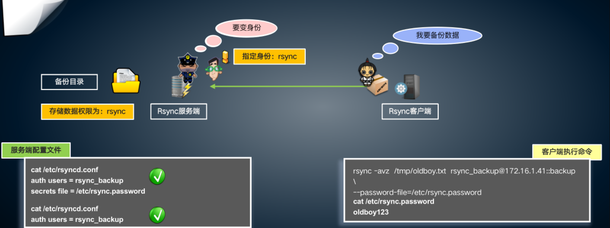

## rsync介绍

rsync是类unix系统下的数据镜像备份工具——remote sync。一款快速增量备份工具 Remote Sync，远程同步支持本地复制，或者与其他SSH、rsync主机同步。

它的特性如下：

- 可以镜像保存整个目录树和文件系统。
- 可以很容易做到保持原来文件的权限、时间、软硬链接等等。
- 无须特殊权限即可安装。
- 快速：第一次同步时 rsync 会复制全部内容，但在下一次只传输修改过的文件。rsync 在传输数据的过程中可以实行压缩及解压缩操作，因此可以使用更少的带宽。
- 安全：可以使用scp、ssh等方式来传输文件，当然也可以通过直接的socket连接。
- 支持匿名传输，以方便进行网站镜象。

| IP           | 角色         | 安装软件 | 目录  | 目的                                                         |
| :----------- | :----------- | :------- | :---- | :----------------------------------------------------------- |
| 192.168.6.22 | Rsync 服务端 | rsync    | /data | 将192.168.6.22 rsync 客户端上的/data下目录实时推送到192.168.6.23 rsync服务器端/data下 |
| 192.168.6.23 | Rsync 客户端 | serync   | /data |                                                              |

## rsync的安装

```
yum install -y rsync
```

## rsync通过ssh认证传输

### 将数据发送到远端(push)

> 语法：

```
rsync -avz -P 本地目录 -e 'ssh -p 端口号'
```

> 远端用户名@远端IP:远端路径

```bash
[root@rsync01 data]# cat rsync.txt 
我是rsync测试文件

[root@rsync01 data]# rsync -avzP /data/rsync.txt  -e 'ssh -p 22' root@192.168.6.23:/tmp

The authenticity of host '192.168.6.23 (192.168.6.23)' can't be established.
ECDSA key fingerprint is SHA256:7MfAwOCNKHOqLUmuO9ohityQkAuQP0pcL/ukr5lvrQI.
ECDSA key fingerprint is MD5:02:a6:fd:23:b8:58:b2:ca:f7:ff:25:8c:f5:e5:b6:e5.
Are you sure you want to continue connecting (yes/no)? yes
Warning: Permanently added '192.168.6.23' (ECDSA) to the list of known hosts.
root@192.168.6.23's password: 
sending incremental file list
rsync.txt
             24 100%    0.00kB/s    0:00:00 (xfr#1, to-chk=0/1)

sent 120 bytes  received 35 bytes  13.48 bytes/sec
total size is 24  speedup is 0.15
```

### rsync详细参数：

```
Rsync命令参数详解

在对rsync服务器配置结束以后，下一步就需要在客户端发出rsync命令来实现将服务器端的文件备份到客户端来。rsync是一个功能非常强大的工具，其命令也有很多功能特色选项，我们下面就对它的选项一一进行分析说明。Rsync的命令格式可以为以下六种：

　　rsync [OPTION]... SRC DEST
　　rsync [OPTION]... SRC [USER@]HOST:DEST
　　rsync [OPTION]... [USER@]HOST:SRC DEST
　　rsync [OPTION]... [USER@]HOST::SRC DEST
　　rsync [OPTION]... SRC [USER@]HOST::DEST
　　rsync [OPTION]... rsync://[USER@]HOST[:PORT]/SRC [DEST]
　　对应于以上六种命令格式，rsync有六种不同的工作模式：
　　1)拷贝本地文件。当SRC和DES路径信息都不包含有单个冒号":"分隔符时就启动这种工作模式。如：rsync -a /data /backup
　　2)使用一个远程shell程序(如rsh、ssh)来实现将本地机器的内容拷贝到远程机器。当DST路径地址包含单个冒号":"分隔符时启动该模式。如：rsync -avz *.c foo:src
　　3)使用一个远程shell程序(如rsh、ssh)来实现将远程机器的内容拷贝到本地机器。当SRC地址路径包含单个冒号":"分隔符时启动该模式。如：rsync -avz foo:src/bar /data
　　4)从远程rsync服务器中拷贝文件到本地机。当SRC路径信息包含"::"分隔符时启动该模式。如：rsync -av root@172.16.78.192::www /databack
　　5)从本地机器拷贝文件到远程rsync服务器中。当DST路径信息包含"::"分隔符时启动该模式。如：rsync -av /databack root@172.16.78.192::www
    6)列远程机的文件列表。这类似于rsync传输，不过只要在命令中省略掉本地机信息即可。如：rsync -v rsync://172.16.78.192/www

rsync参数的具体解释如下：

-v, --verbose 详细模式输出
-q, --quiet 精简输出模式
-c, --checksum 打开校验开关，强制对文件传输进行校验
-a, --archive 归档模式，表示以递归方式传输文件，并保持所有文件属性，等于-rlptgoD
-r, --recursive 对子目录以递归模式处理
-R, --relative 使用相对路径信息
-b, --backup 创建备份，也就是对于目的已经存在有同样的文件名时，将老的文件重新命名为~filename。可以使用--suffix选项来指定不同的备份文件前缀。
--backup-dir 将备份文件(如~filename)存放在在目录下。
-suffix=SUFFIX 定义备份文件前缀
-u, --update 仅仅进行更新，也就是跳过所有已经存在于DST，并且文件时间晚于要备份的文件。(不覆盖更新的文件)
-l, --links 保留软链结
-L, --copy-links 想对待常规文件一样处理软链结
--copy-unsafe-links 仅仅拷贝指向SRC路径目录树以外的链结
--safe-links 忽略指向SRC路径目录树以外的链结
-H, --hard-links 保留硬链结     -p, --perms 保持文件权限
-o, --owner 保持文件属主信息     -g, --group 保持文件属组信息
-D, --devices 保持设备文件信息    -t, --times 保持文件时间信息
-S, --sparse 对稀疏文件进行特殊处理以节省DST的空间
-n, --dry-run现实哪些文件将被传输
-W, --whole-file 拷贝文件，不进行增量检测
-x, --one-file-system 不要跨越文件系统边界
-B, --block-size=SIZE 检验算法使用的块尺寸，默认是700字节
-e, --rsh=COMMAND 指定使用rsh、ssh方式进行数据同步
--rsync-path=PATH 指定远程服务器上的rsync命令所在路径信息
-C, --cvs-exclude 使用和CVS一样的方法自动忽略文件，用来排除那些不希望传输的文件
--existing 仅仅更新那些已经存在于DST的文件，而不备份那些新创建的文件
--delete 删除那些DST中SRC没有的文件
--delete-excluded 同样删除接收端那些被该选项指定排除的文件
--delete-after 传输结束以后再删除
--ignore-errors 及时出现IO错误也进行删除
--max-delete=NUM 最多删除NUM个文件
--partial 保留那些因故没有完全传输的文件，以是加快随后的再次传输
--force 强制删除目录，即使不为空
--numeric-ids 不将数字的用户和组ID匹配为用户名和组名
--timeout=TIME IP超时时间，单位为秒
-I, --ignore-times 不跳过那些有同样的时间和长度的文件
--size-only 当决定是否要备份文件时，仅仅察看文件大小而不考虑文件时间
--modify-window=NUM 决定文件是否时间相同时使用的时间戳窗口，默认为0
-T --temp-dir=DIR 在DIR中创建临时文件
--compare-dest=DIR 同样比较DIR中的文件来决定是否需要备份
-P 等同于 --partial
--progress 显示备份过程
-z, --compress 对备份的文件在传输时进行压缩处理
--exclude=PATTERN 指定排除不需要传输的文件模式
--include=PATTERN 指定不排除而需要传输的文件模式
--exclude-from=FILE 排除FILE中指定模式的文件
--include-from=FILE 不排除FILE指定模式匹配的文件
--version 打印版本信息
--address 绑定到特定的地址
--config=FILE 指定其他的配置文件，不使用默认的rsyncd.conf文件
--port=PORT 指定其他的rsync服务端口
--blocking-io 对远程shell使用阻塞IO
-stats 给出某些文件的传输状态
--progress 在传输时现实传输过程
--log-format=formAT 指定日志文件格式
--password-file=FILE 从FILE中得到密码
--bwlimit=KBPS 限制I/O带宽，KBytes per second      
-h, --help 显示帮助信息
```

### 从远端拉取数据(pull)

> 语法:

```
rsync -avz -P -e 'ssh -p 端口号' 远端用户名@远端IP:远端路径 本地目录
```

```bash
[root@rsync01 data]# rsync -avzP -e 'ssh -p 22' root@192.168.6.23:/tmp/rsync.txt  /tmp 
root@192.168.6.23's password: 
receiving incremental file list
rsync.txt
             24 100%   23.44kB/s    0:00:00 (xfr#1, to-chk=0/1)

sent 43 bytes  received 120 bytes  25.08 bytes/sec
total size is 24  speedup is 0.15

[root@rsync01 tmp]# cat rsync.txt 
我是rsync测试文件
```

## 通过rsync认证传输(守护进程)

### **守护进程备份原理图**



**rsync服务端配置步骤**

```
1.确认Rsync程序是否安装
2.修改Rsync配置文件信息
3.创建负责Rsync服务的虚拟用户
4.创建Rsync服务备份数据的目录，进行对虚拟用户授权
5.配置Rsync服务安全相关密钥，且对密钥文件授权600
6.启动Rsync服务，开机自启
```

### rsync备份服务器配置

也就是服务器端192.168.6.22

#### 创建rsync同步用户

```bash
[root@rsync01 tmp]# useradd -M -s /sbin/nologin rsync

[root@rsync01 tmp]# grep rsync /etc/passwd
rsync:x:1001:1001::/home/rsync:/sbin/nologin
```

#### 修改配置文件

```
vim /etc/rsyncd.conf
```

```bash
[root@rsync01 backup]# cat /etc/rsyncd.conf 
# /etc/rsyncd: configuration file for rsync daemon mode

uid = rsync		#此时用户可以是别的，但是只要有管理服务端下/data的权限即可,不一定非得要用root
gid = rsync
fake super = yes		# 无需让rsync以root身份运行即可保存文件完整属性
use chroot = no		#内网设置为no
max connections = 200		#最大连接数默认为0无限大，负数为关闭
timeout = 300		#超时默认为0 notimeout无超时时间 建议200-600（5-10分钟）
pid file = /var/run/rsyncd.pid
lock file = /var/run/rsync.lock
log file = /var/log/rsyncd.log
ignore errors		#忽略错误
read only = false		 #禁止只读可写
list = false		 #禁止列表
hosts allow = 192.168.6.0/24		#指定可以连接的客户端ip或地址段
hosts deny = 0.0.0.0/32		#指定不可以连接的ip或地址段
auth users = rsync_backup		 #客户端同步的虚拟用户
secrets file = /etc/rsync.password		 #客户端同步的虚拟机用户的密码

[backup]		 #新建的模块名
comment = This is yzh backup!		#注释部分
path = /backup/		 #默认上传和下载的路径

     

#快速写入
cat >>/etc/rsyncd.conf<<EOF
uid = rsync
gid = rsync
fake super = yes 
use chroot = no
max connections = 200
pid file = /var/run/rsyncd.pid
lock file = /var/run/rsync.lock
log file = /var/log/rsyncd.log
ignore errors
read only = false
list = false
hosts allow = 192.168.6.0/24
hosts deny = 0.0.0.0/32
auth users = rsync_backup
secrets file = /etc/rsync.password
[backup]
comment = This is yzh backup!
path = /backup/
EOF
```

#### 添加密码文件

```bash
#添加账户和密码，前面是同步时候的虚拟账号和密码
[root@rsync01 data]# echo 'rsync_body:yzh' > /etc/rsync.password
[root@rsync01 data]# cat /etc/rsync.password 
rsync_body:yzh

#给密码文件设置权限必须是600
[root@rsync01 data]# chmod 600 /etc/rsync.password 
[root@rsync01 data]# ll /etc/rsync.password 
-rw------- 1 root root 17 Mar  3 23:27 /etc/rsync.password

#rsync服务端以守护进程方式启动，且端口是tcp协议的873
[root@rsync01 data]# rsync --daemon  

[root@rsync01 data]# ps -ef|grep rsync
root        792      1  0 Mar02 ?        00:00:00 /usr/bin/rsync --daemon --no-detach
root      81134  45698  0 23:31 pts/0    00:00:00 grep --color=auto rsync

[root@rsync01 data]# netstat -tunlp |grep 873
tcp        0      0 0.0.0.0:873             0.0.0.0:*               LISTEN      792/rsync           
tcp6       0      0 :::873                  :::*                    LISTEN      792/rsync 


#符合873进程的情况
[root@rsync01 data]# lsof -i:873
COMMAND PID USER   FD   TYPE DEVICE SIZE/OFF NODE NAME
rsync   792 root    3u  IPv4  18698      0t0  TCP *:rsync (LISTEN)
rsync   792 root    5u  IPv6  18699      0t0  TCP *:rsync (LISTEN)
```

## 客户端服务器配置

### 配置密码文件

```bash
#客户端只需要配置密码文件即可，因为在同步的时候会指定虚拟同步账号
[root@web02 tmp]# echo "yzh" > /etc/rsync.password
[root@web02 tmp]# cat /etc/rsync.password 
yzh

#给密码文件设置权限，必须是600否则会报错
[root@web02 tmp]# chmod 600 /etc/rsync.password 
[root@web02 tmp]# ll /etc/rsync.password 
-rw-------. 1 root root 6 Mar  3 10:44 /etc/rsync.password

#配置特殊变量RSYNC_PASSWORD，可以替代密码文件
export RSYNC_PASSWORD=yzh    #临时生效
echo "export RSYNC_PASSWORD=yzh" >> /etc/bashrc    #永久开机生效

[root@web02 opt]# source /etc/bashrc 
```

### 向备份服务器发送数据

!>注意：是从客户端(没有配置配置文件的服务器)发送到备份服务器(配置过配置文件的服务器)

> rsync -avz -P 本地目录或文件 rsync_backup@服务端地址::模块名--password-file=/etc/rsync.pwd

```bash
[root@web02 opt]# rsync -avz /tmp rsync_backup@192.168.6.22::backup --password-file=/etc/rsync.password
sending incremental file list
rsync: chgrp "tmp" (in backup) failed: Operation not permitted (1)
tmp/
tmp/rsync.txt
```

```
rsync -avz /tmp rsync_backup@192.168.6.22::backup
```

> 说明rsync 服务端和客户端是OK的

### 从备份服务器拉取

> rsync -avz -P rsync_backup@服务端地址::模块名 本地目录或文件--password-file=/etc/rsync.password

```
[root@web02 opt]# rsync -avz rsync_backup@192.168.6.22::backup /tmp --password-file=/etc/rsync.password
```


