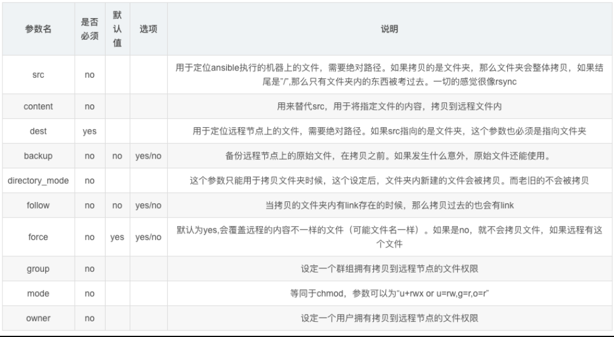
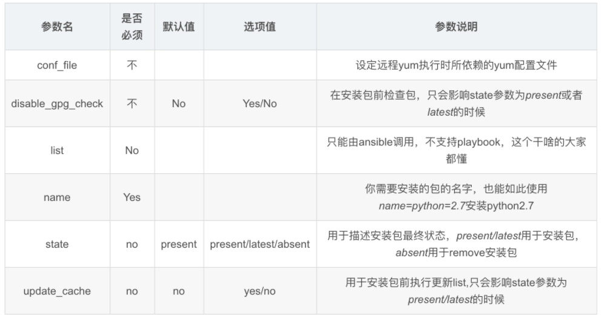
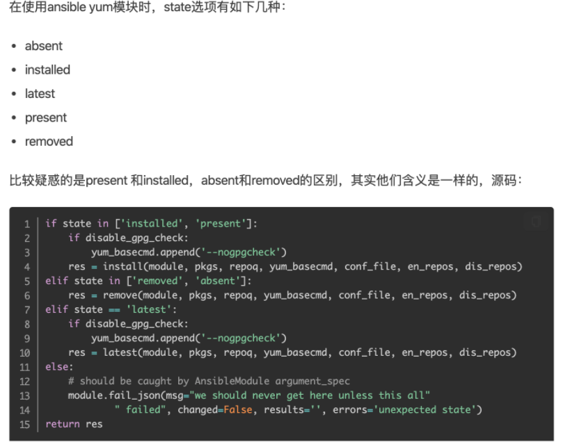

## command模块

> 作用:在远程执行一个命令

| 选项参数          | 选项说明                                                     |
| ----------------- | ------------------------------------------------------------ |
| chdir             | 在执行命令执行，通过cd命令进入指定目录                       |
| creates           | 定义一个文件是否存在，若不存在，则运行相应命令；存在则跳过   |
| free_form（必须） | 参数信息中可以输入任何系统命令，实现远程管理                 |
| removes           | 定义一个文件是否存在，如果存在，则运行相应命令；如果不存在则跳过 |

command模块是ansible命令基本模块，可以不用指定，其次要注意的是

- 使用command模块执行远程命令，命令不得用变量（$HOME）、不得出现特殊符号`< 、>、|、；、&`，否则无法识别，需要则使用shell模块实现

### 案例

**获取所有被管控机器负载信息**

```
[root@sql ~]# ansible client -a 'uptime'
192.168.6.23 | CHANGED | rc=0 >>
 04:56:07 up  7:07,  2 users,  load average: 0.03, 0.02, 0.05
192.168.6.22 | CHANGED | rc=0 >>
 17:56:07 up 1 day, 10:32,  2 users,  load average: 0.00, 0.01, 0.05
```

**切换到/tmp目录，然后输出当前目录**

```
[root@sql ~]# ansible client -a "pwd chdir=/tmp"
192.168.6.23 | CHANGED | rc=0 >>
/tmp
192.168.6.22 | CHANGED | rc=0 >>
/tmp
```

**creates实践**

`creates=/etc`作用是，判断该目录是否存在，存在则跳过动作

```
#存在跳过
[root@sql ~]# ansible client -a "pwd creates=/tmp"
192.168.6.23 | SUCCESS | rc=0 >>
skipped, since /tmp exists
192.168.6.22 | SUCCESS | rc=0 >>
skipped, since /tmp exists

#不存在执行
[root@sql ~]# ansible client -a "pwd creates=/asfddf"
192.168.6.23 | CHANGED | rc=0 >>
/root
192.168.6.22 | CHANGED | rc=0 >>
/root
```

**removes实践**

removes判断当该目录存在则执行对应操作，与create相反

```
[root@sql ~]# ansible client -a "ls /opt removes=/yzh"
192.168.6.23 | SUCCESS | rc=0 >>
skipped, since /yzh does not exist
192.168.6.22 | SUCCESS | rc=0 >>
skipped, since /yzh does not exist
[root@sql ~]# ansible client -a "ls /opt removes=/opt"
192.168.6.23 | CHANGED | rc=0 >>
alldb_2022-03-01.sql.gz
sersync
192.168.6.22 | CHANGED | rc=0 >>
aa
aa.txt
alldb_2022-03-01.sql.gz
discuz
sersync
sersync2.5.4_64bit_binary_stable_final.tar.gz
```

## shell模块

> 在远程服务器执行复杂命令

常用参数

| 选项参数          | 选项说明                                                     |
| ----------------- | ------------------------------------------------------------ |
| chdir             | 在执行命令执行，通过cd命令进入指定目录                       |
| creates           | 定义一个文件是否存在，若不存在，则运行相应命令；存在则跳过   |
| free_form（必须） | 参数信息中可以输入任何系统命令，实现远程管理                 |
| removes           | 定义一个文件是否存在，如果存在，则运行相应命令；如果不存在则跳过 |

### 案例

批量查询mysql进程

```
[root@sql ~]# ansible client -m shell -a "ps -ef|grep mysql"
192.168.6.23 | CHANGED | rc=0 >>
root       8844   8843  0 06:12 pts/2    00:00:00 /bin/sh -c ps -ef|grep mysql
root       8846   8844  0 06:12 pts/2    00:00:00 /bin/sh -c ps -ef|grep mysql
192.168.6.22 | CHANGED | rc=0 >>
mysql      2588      1  0 Mar03 ?        00:01:05 /tools/mysql/bin/mysqld --defaults-file=/etc/my.cnf
root     109064 109059  0 19:12 pts/0    00:00:00 /bin/sh -c ps -ef|grep mysql
root     109066 109064  0 19:12 pts/0    00:00:00 /bin/sh -c ps -ef|grep mysql
```

批量执行远程脚本

> 该脚本要在客户端存在

通过一条命令

- 创建文件夹
- 生成sh脚本文件
- 赋予脚本可执行权限
- 执行脚本
- 忽略warning信息

```
[root@sql ~]# ansible client -m shell -a "mkdir -p /server/scripts/;echo 'hostname' > /server/scripts/hostname.sh;chmod +x /server/scripts/hostname.sh;/usr/bin/bash /server/scripts/hostname.sh warn=False"
192.168.6.23 | CHANGED | rc=0 >>
web02
192.168.6.22 | CHANGED | rc=0 >>
rsync01
```

## script模块

> 本地脚本传输到远程节点运行

scripts模块的功能参数

| 选项参数          | 选项说明                                                     |
| ----------------- | ------------------------------------------------------------ |
| creates           | 定义一个文件是否存在，若不存在，则运行相应命令；存在则跳过   |
| free_form（必须） | 参数信息中可以输入任何系统命令，实现远程管理                 |
| removes           | 定义一个文件是否存在，如果存在，则运行相应命令；如果不存在则跳过 |

### 案例

批量执行远程脚本

```
1.在管理机创建脚本
# -e ，开启转义功能
[root@sql ~]# echo -e "pwd\nhostname" > /usr/local/scripts/pwd.sh
[root@sql ~]# cat /usr/local/scripts/pwd.sh 
pwd
hostname

[root@sql ~]# chmod +x /usr/local/scripts/pwd.sh 

2.在客户端运行脚本
[root@sql ~]# ansible client -m script -a "/usr/local/scripts/pwd.sh"
```

## 文件类型模块

### copy模块

> 该模块功能，复制文件到远程主机,推送给远程主机，无法拉取

copy模块重要功能参数



### 案例

批量远程复制文件

```
1.批量远程创建用户
[root@sql ~]# ansible client -a "useradd  ansiblecopy"
192.168.6.23 | CHANGED | rc=0 >>

192.168.6.22 | CHANGED | rc=0 >>

2.批量拷贝文件，发送至客户端节点
[root@sql ~]# ansible client -m copy -a "src=/etc/passwd dest=/opt/etc.pwd owner=ansiblecopy group=ansiblecopy mode=0755"

3.查看客户端节点的文件信息
[root@sql ~]# ansible client -a "ls -l /opt/etc.pwd"
192.168.6.23 | CHANGED | rc=0 >>
-rwxr-xr-x 1 ansiblecopy ansiblecopy 1544 Mar  4 06:47 /opt/etc.pwd
192.168.6.22 | CHANGED | rc=0 >>
-rwxr-xr-x 1 ansiblecopy ansiblecopy 1544 Mar  4 19:47 /opt/etc.pwd
```

远程批量复制文件、备份、追加内容

```
[root@sql ~]# ansible client -m copy -a "content='hello,i am yzh' dest=/opt/test.txt backup=yes"
```

```
批量对服务器文件拷贝操作，把content参数定义的内容，写入到test.txt文件中，并且对test.txt旧文件内容备份
```

远程检查命令执行结果

> 这里使用shell模块方便些

```
[root@sql ~]# ansible client -m shell -a "ls -l /opt/test*"
192.168.6.23 | CHANGED | rc=0 >>
-rw-r--r-- 1 root root 14 Mar  4 07:05 /opt/test.txt
192.168.6.22 | CHANGED | rc=0 >>
-rw-r--r-- 1 root root 14 Mar  4 20:05 /opt/test.txt
```

### file模块

> file模块主要用于创建文件、目录数据，以及对现有的文件、目录权限进行修改

```
file模块可以帮助我们完成一些对文件的基本操作，比如，创建文件或目录、删除文件或目录、修改文件权限等


path参数 ：必须参数，用于指定要操作的文件或目录，在之前版本的ansible中，使用dest参数或者name参数指定要操作的文件或目录，为了兼容之前的版本，使用dest或name也可以。

state参数 ：此参数非常灵活，此参数对应的值需要根据情况设定，比如，当我们需要在远程主机中创建一个目录的时候，我们需要使用path参数指定对应的目录路径，假设，我想要在远程主机上创建/testdir/a/b目录，那么我则需要设置path=/testdir/a/b，但是，我们无法从"/testdir/a/b"这个路径看出b是一个文件还是一个目录，ansible也同样无法单单从一个字符串就知道你要创建文件还是目录，所以，我们需要通过state参数进行说明，当我们想要创建的/testdir/a/b是一个目录时，需要将state的值设置为directory，"directory"为目录之意，当它与path结合，ansible就能知道我们要操作的目标是一个目录，同理，当我们想要操作的/testdir/a/b是一个文件时，则需要将state的值设置为touch，当我们想要创建软链接文件时，需将state设置为link，想要创建硬链接文件时，需要将state设置为hard，当我们想要删除一个文件时（删除时不用区分目标是文件、目录、还是链接），则需要将state的值设置为absent，"absent"为缺席之意，当我们想让操作的目标"缺席"时，就表示我们想要删除目标。

src参数 ：当state设置为link或者hard时，表示我们想要创建一个软链或者硬链，所以，我们必须指明软链或硬链链接的哪个文件，通过src参数即可指定链接源。

force参数  :  当state=link的时候，可配合此参数强制创建链接文件，当force=yes时，表示强制创建链接文件，不过强制创建链接文件分为两种情况，情况一：当你要创建的链接文件指向的源文件并不存在时，使用此参数，可以先强制创建出链接文件。情况二：当你要创建链接文件的目录中已经存在与链接文件同名的文件时，将force设置为yes，回将同名文件覆盖为链接文件，相当于删除同名文件，创建链接文件。情况三：当你要创建链接文件的目录中已经存在与链接文件同名的文件，并且链接文件指向的源文件也不存在，这时会强制替换同名文件为链接文件。

owner参数 ：用于指定被操作文件的属主，属主对应的用户必须在远程主机中存在，否则会报错。

group参数 ：用于指定被操作文件的属组，属组对应的组必须在远程主机中存在，否则会报错。

mode参数：用于指定被操作文件的权限，比如，如果想要将文件权限设置为"rw-r-x---"，则可以使用mode=650进行设置，或者使用mode=0650，效果也是相同的，如果你想要设置特殊权限，比如为二进制文件设置suid，则可以使用mode=4700，很方便吧。

recurse参数：当要操作的文件为目录，将recurse设置为yes，可以递归的修改目录中文件的属性。
```

### 案例

远程创建文件夹

```
[root@sql ~]# ansible client -m file -a "dest=/opt/test_file state=directory"

#远程检查文件夹是否生成
[root@sql ~]# ansible client -m shell -a "ls -ld /opt/test_file"
192.168.6.23 | CHANGED | rc=0 >>
drwxr-xr-x 2 root root 6 Mar  4 07:17 /opt/test_file
192.168.6.22 | CHANGED | rc=0 >>
drwxr-xr-x 2 root root 6 Mar  4 20:17 /opt/test_file
```

远程批量生成文件

```
[root@sql ~]# ansible client -m file -a "dest=/opt/yzh666 state=touch owner=yzh group=yzh mode=777"

2.远程批量检查文件
[root@sql ~]# ansible client -m shell -a "ls /opt/yzh666"
192.168.6.23 | CHANGED | rc=0 >>
/opt/yzh666
192.168.6.22 | CHANGED | rc=0 >>
/opt/yzh666
```

远程创建软连接文件

```
[root@sql ~]# ansible client -m file -a "src=/etc/hosts dest=/tmp/hosts_link state=link"

#远程检查软链接属性
[root@sql ~]# ansible client -a "ls -l /tmp/hosts_link"
192.168.6.23 | CHANGED | rc=0 >>
lrwxrwxrwx 1 root root 10 Mar  4 07:28 /tmp/hosts_link -> /etc/hosts
192.168.6.22 | CHANGED | rc=0 >>
lrwxrwxrwx 1 root root 10 Mar  4 20:28 /tmp/hosts_link -> /etc/hosts
```

## 软件管理模块

### yum模块

yum模块常用参数





#### 案例

yum模块批量安装rsync

```
#检查客户端是否安装了rsync
[root@sql ~]# ansible client -m shell -a "rpm -qa rsync warn=false"
192.168.6.23 | CHANGED | rc=0 >>
rsync-3.1.2-10.el7.x86_64
192.168.6.22 | CHANGED | rc=0 >>
rsync-3.1.2-10.el7.x86_64

#yum模块批量安装rsync
[root@sql ~]# ansible client -m yum -a "name=rsync state=installed"

#远程查看结果
[root@sql ~]# ansible client -m shell -a "rpm -qa rsync warn=false"
192.168.6.23 | CHANGED | rc=0 >>
rsync-3.1.2-10.el7.x86_64
192.168.6.22 | CHANGED | rc=0 >>
rsync-3.1.2-10.el7.x86_64

#远程删除软件包
ansible client -m yum -a "name=rsync state=absent"

#远程升级nginx软件包
ansible client -m yum -a "state=latest name=rsync"

#升级系统所有软件包，排除某些服务
ansible client -m yum -a "state=latest name='*' exclude='rsync'"
```

## Ansible服务管理模块

### service/systemd模块

该模块作用是针对yum包管理

service适用于centos6前的系统

systemd命令应用于centos7系统

```
如果使用systemctl 管理程序的话，可以使用systemd模块，systemctl 可以 控制程序启/停，reload，开机启动，观察程序状态（status）等，掌握使用后管理就更方便了

主要参数
daemon_reload：在执行任何其他操作之前运行守护进程重新加载，以确保systemd已经读取其他更改
enabled：服务是否开机自动启动yes|no。enabled和state至少要有一个被定义
masked：是否将服务设置为masked状态，被mask的服务是无法启动的
name：必选项，服务名称
no_block(2.3后新增)：不要同步等待操作请求完成
state：对当前服务执行启动，停止、重启、重新加载等操作（started,stopped,restarted,reloaded）
user：使用服务的调用者运行systemctl，而不是系统的服务管理者
```

#### 案例

管理crond定时任务服务

```
#检查 所有客户端机器，crond服务是否启动
[root@sql ~]# ansible client -m shell -a "systemctl status crond"|grep Active
   Active: active (running) since Fri 2022-03-04 09:26:41 EST; 3min 18s ago
   Active: active (running) since Fri 2022-03-04 09:26:34 EST; 3min 25s ago
   
#检查所有crond服务是否开机自启
[root@sql ~]# ansible client -m shell -a "systemctl list-unit-files"|grep crond
crond.service                                 enabled 
crond.service                                 enabled 

#systemd管理服务
 ansible client -m systemd -a "name=crond state=started"
  ansible client -m systemd -a "name=crond state=stopped"
  ansible client -m systemd -a "name=crond state=restarted"
  ansible client -m systemd -a "name=crond state=reloaded"
```

管理nginx服务，启动nginx，添加至开机自启

```
1.命令如下
[root@m01 ~]# ansible chaoge -m systemd -a "name=nginx enabled=yes state=started"

停止服务
ansible chaoge -m systemd -a "name=nginx state=stopped"

重启
ansible chaoge -m systemd -a "name=nginx state=restarted"

重载
ansible chaoge -m systemd -a "name=nginx state=reloaded"

2.检查命令执行结果
服务器是否启动
[root@m01 ~]# ansible chaoge -m shell -a "systemctl status nginx" |grep Active
   Active: active (running) since 二 2020-03-17 17:14:35 CST; 4min 20s ago
   Active: active (running) since 二 2020-03-17 17:13:14 CST; 5min ago

服务是否开机自启
[root@m01 ~]# ansible chaoge -m shell -a "systemctl list-unit-files" | grep nginx
nginx.service                                 enabled
nginx.service                                 enabled
```

### cron模块

> 管理定时任务条目，和系统crontab一样

常用参数：

```
minute参数：此参数用于设置计划任务中分钟设定位的值，比如，上述示例1中分钟设定位的值为5，即 minute=5，当不使用此参数时，分钟设定位的值默认为”*”。

hour参数：此参数用于设置计划任务中小时设定位的值，比如，上述示例1中小时设定位的值为1，即 hour=1，当不使用此参数时，小时设定位的值默认为”*”。

day参数：此参数用于设置计划任务中日设定位的值，当不使用此参数时，日设定位的值默认为”*”。

month参数：此参数用于设置计划任务中月设定位的值，当不使用此参数时，月设定位的值默认为”*”。

weekday参数：此参数用于设置计划任务中周几设定位的值，当不使用此参数时，周几设定位的值默认为”*”。

special_time参数：在上述示例3与示例4中，计划任务的时间设定格式为 @reboot 或者@hourly。@reboot 表示重启时执行，@hourly 表示每小时执行一次，相当于设置成”0 0 * * *” ，这种@开头的时间设定格式则需要使用 special_time 参数进行设置，special_time 参数的可用值有 reboot(重启后)、yearly(每年)、annually(每年，与yearly相同)、monthly(每月)、weekly(每周)、daily(每天)、hourly(每时)。

注意：当上述时间单位设定参数都未指定时，计划任务的时间设定默认会被设定为”* * * * *”，这样表示每秒都会执行一次计划任务，所以，在使用cron模块时，我们应该确定对应的时间参数设置正确。

user参数：此参数用于设置当前计划任务属于哪个用户，当不使用此参数时，默认为管理员用户。

job参数：此参数用于指定计划的任务中需要实际执行的命令或者脚本，比如上例中的 “echo test” 命令。

name参数：此参数用于设置计划任务的名称，计划任务的名称会在注释中显示，当不指定计划任务的名称时，ansible 会默认为计划任务加入注释，注释的内容为 #Ansible: None，假设指定计划任务的名称为 test，那么注释的内容为#Ansible: test，在一台机器中，计划任务的名称应该具有唯一性，方便我们以后根据名称修改或删除计划任务。

state参数：当计划任务有名称时，我们可以根据名称修改或删除对应的任务，当删除计划任务时，需要将 state 的值设置为 absent。

disabled参数：当计划任务有名称时，我们可以根据名称使对应的任务”失效”（注释掉对应的任务）。注意，使用此参数时，除了需要指定任务的名称，还需要同时指定任务的job 以及任务的时间设定，而且任务的时间设定必须和对应任务完全相同，否则在注释任务的同时，任务的时间设定会被修改，除非你确定这样做。

backup参数：如果此参数的值设置为 yes，那么当修改或者删除对应的计划任务时，会先对计划任务进行备份，然后再对计划任务进行修改或者删除，cron 模块会在远程主机的 /tmp 目录下创建备份文件，以 crontab 开头并且随机加入一些字符，具体的备份文件名称会在返回信息的 backup_file 字段中看到，推荐将此此参数设置为 yes。
```

#### 案例

ansible批量添加定时任务

```
[root@sql ~]# ansible client -m cron -a "name=yzh_cron job='usr/sbin/ntpdate ntp.aliyun.com > /dev/null 2>&1' minute=*/5"

#检查定时任务
[root@sql ~]# ansible client -a "crontab -l"
192.168.6.23 | CHANGED | rc=0 >>
*/1 * * * * /bin/bash /opt/sersync/log/rsync_log.sh  > /dev/null 2>&1
#Ansible: yzh_cron
*/5 * * * * usr/sbin/ntpdate ntp.aliyun.com > /dev/null 2>&1
192.168.6.22 | CHANGED | rc=0 >>


#Ansible: yzh_cron
*/5 * * * * usr/sbin/ntpdate ntp.aliyun.com > /dev/null 2>&1
```

删除定时任务

```
[root@sql ~]# ansible client -m cron -a "name='yzh_cron' state=absent"

#验证是否被删除了
[root@sql ~]# ansible client -a "crontab -l"
```

## Ansible用户和组模块

### user模块

> 管理系统用户

常用参数

```
模块参数	        参数描述
create_home	       创建家目录，设置no则不创建家目录
group	           创建用户组
name	           创建用户的名字
password		   创建用户的密码
uid				   创建用户的UID
shell	
```

#### 案例

创建test用户,UID设置8888，禁止登录，禁止家目录生成

```
[root@sql ~]# ansible client -m user -a "name=test uid=8888 shell=/sbin/nologin create_home=no"
```

验证创建是否成功

```
[root@sql ~]# ansible client -m shell -a "egrep 'test' /etc/passwd"
192.168.6.23 | CHANGED | rc=0 >>
test:x:8888:8888::/home/test:/sbin/nologin
192.168.6.22 | CHANGED | rc=0 >>
test:x:8888:8888::/home/test:/sbin/nologin
```

### group模块

> 管理系统用户组

常用参数

```
模块参数     参数描述
name    	创建指定的组名
gid        	组的GID
state       absent，移除远程主机的组
            present，创建远端主机的组
```

#### 案例

创建一个test组,组id为123

```
[root@sql ~]# ansible client -m group -a "name=test gid=123"
```

查看客户端创建组的信息

```
[root@sql ~]# ansible client -m shell -a "cat /etc/group|grep test"
192.168.6.23 | CHANGED | rc=0 >>
test:x:123:
192.168.6.22 | CHANGED | rc=0 >>
test:x:123:
```

