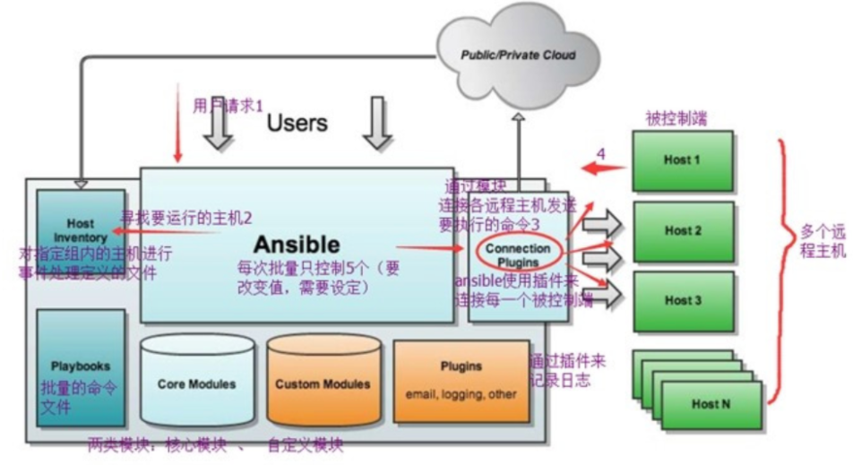

## 人工运维到自动化运维

### 人工运维

运维人员大多需要维护数量众多的机器，反复重复的劳动力，很多机器需要同时部署相同的服务或是执行命令，还得反复登录不同的机器执行。

例如在backup服务器上部署Rsync服务，需要在所有其他的服务器上部署Rsync客户端配置一遍。

一台台机器登录执行命令实在太繁琐，运维人员也常用Xshell、SecureCRT之类的工具添加多个服务器的标签，提高快速连接服务器的效率。

### 自动化运维时代

SSH自动化运维时代是指2003~2012年，当时SSH自动化运维是很流行的，通过再管理机器统一创建秘钥对，将私钥留在管理机上，公钥发到所有被管理的机器，然后开发脚本实现批量管理。

系统管理员日常会进行大量的重复性操作，例如安装软件，修改配置文件，创建用户，批量执行命令等等。如果主机数量庞大，单靠人工维护实在让人难以忍受。

早期运维人员会根据自己的生产环境来写特定脚本完成大量重复性工作，这些脚本复杂且难以维护。

系统管理员面临的问题主要是1、系统配置管理，2、远程执行命令，因此诞生了很多开源软件，系统维护方面有fabric、puppet、chef、ansible、saltstack等，这些软件擅长维护系统状态或方便的对大量主机进行批量的命令执行。

其中有两款软件都是用Python语言开发的，也就是`saltstack`、`ansible`，学习简单，功能强大。

### 自动化运维趋势

如今的自动化运维，不再是一个批量自动化管理软件就可以解决所有问题了，运维管理高速发展，从人肉运维到自动化运维，再到数据化运维、可视化运维、到AI智能运维，运维界倡导DevOps、AIOps运维，前景十分广阔，给用户更广阔的施展空间。

### 自动化运维好处

- 提高工作效率，减少重复性工作
- 大大减少人为出错的可能性
- 数据化管理、数据化汇报、问题可追溯

## Ansible介绍

Ansible是一个同时管理多个远程主机的软件（任何可以通过SSH协议登录的机器），因此Ansible可以管理`远程虚拟机`、`物理机`，也可以是本地主机。

Ansible通过SSH协议实现`管理节点`、`远程节点`的通信。只要是能够SSH登录的主机完成的操作，都可以通Ansible自动化操作，比如批量复制、批量删除、批量修改、批量查看、批量安装、重启、更新等。

## Ansible特点

> Ansible基于Python开发，由主要的Paramiko和PyYAML两个关键模块构建

- 安装部署简单，支持多台主机并行管理
- 无客户端，基于ssh服务
- 推送式，区别于拉取式
- 丰富的module，1W+不用自己去写
- 远程执行安全
- 基于yaml的playbook，playbook定义规则和顺序做事，丢到客户机，yaml语法类似与xml

### Ansible缺点

效率低，容易挂起，基于ssh通信，串行的并发性差。

## Ansible软件架构

Ansible是基于模块工作的，本身没有批量部署的能力。

真正具有批量部署的是Ansible所运行的模块，Ansible只是提供一种框架。

## 其他自动化运维工具对比

- saltstack
- ansible
- puppet

| 名称         | Puppet                                       | SaltStack                          | Ansible                              |
| :----------- | :------------------------------------------- | :--------------------------------- | :----------------------------------- |
| 开发语言     | Ruby                                         | Python                             | Python                               |
| 客户端       | 有                                           | 有                                 | 无                                   |
| 二次开发     | 不支持                                       | 支持                               | 支持                                 |
| 通信验证     | 是                                           | 是                                 | 是                                   |
| 同学加密     | 标准SSL协议                                  | AES加密                            | OpenSSH                              |
| 平台支持     | AIX,BSD,HP-UX,Linux,Mac OS X,Solaris,Windows | BSD,Linux,Mac OS X,Solaris,Windows | AIX,BSD,HP-UX,Linux,Mac OS X,Solaris |
| 配置文件格式 | Ruby语法格式                                 | YAML                               | YAML                                 |
| Web UI       | 提供                                         | 提供                               | 提供（商业版本）                     |
| 命令执行     | 不支持（配置模块可实现）                     | 支持                               | 支持                                 |

### 优缺点对比

| 名称      | 优势                                                         | 劣势                                                         | 成本                                                         |
| :-------- | :----------------------------------------------------------- | :----------------------------------------------------------- | :----------------------------------------------------------- |
| Puppet    | 模块由Ruby或Ruby子集编写push命令可以即可触发变更Web界面生成处理报表、资源清单、实时节点管理代理运行端进行详细、深入的报告和对节点进行配置 | 相对其他工具较复杂，需学习Puppet的DSL或Ruby安装过程缺少错误校验和产生错误报表 | 开源软件免费SaltStack企业版每年内个节点花费约￥100           |
| Saltstack | 状态文件可用简单YAML配置模块或复杂的Python/PyDSL脚本与客户端可以基于SSH或在被管节点安装代理Web界面可看到运行的工作、minion状态、事件日志、可在客户端执行命令扩展能力极强 | Web界面像毒药竞争产品不稳定与相对不完善缺乏生成深度报告的能力 | 开源软件免费SaltStack企业版每年内个节点花费约￥150，随着数量增加相应的会有折扣 |
| Ansible   | 模块可以用任何语言开发备管节点不需要安装代理软件有Web管理界面、可配置用户、组、资源清单和执行Playbook安装、运行极其简单 | 对备管理节点为Windows有待加强Web管理界面是内置的Ansible的一部分需导入资源清单执行效率较低 | 开源版本免费Ansible Tower小于10台被管理节点免费超过10太后没年每台需支付￥100~$250的支持服务费用 |
