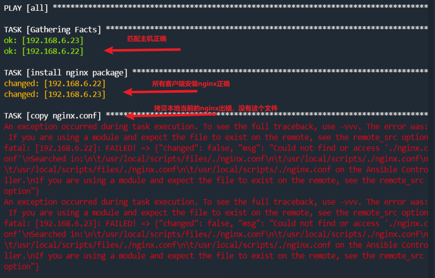

## 核心组件playbook

Ansible核心功能点就在于`playbook`，Ansible主要的工作都是在于`配置管理`，它在实际的工作中会大量编写和使用剧本。

如果说ansible 模块 是你车间里的工具，那么playbooks 是你的说明书／使用手册，并且资源清单上的主机是你的原材料。

在ansible 上使用Playbooks是一种完全不同于adhoc的任务执行模式，并且特别强大。

简单地说，playbooks是一个非常简单的配置管理和多机器部署系统的基础，以及非常适合部署复杂应用程序的系统。

Playbooks可以对任务进行编排，就像我们要安装一个程序，写个安装shell脚本一样，在哪一步复制配置文件，最后一步启动服务。

虽然/usr/bin/ansible 可以运行一些临时任务，但是针对复杂的配置，并且可以将配置标准化，这个时候就需要Playbooks了。

## Playbook剧本语法

> Anisble剧本

> ansible软件的playbook编写需要遵循`YAML`语法

**playbook安装nginx**

```
1.先批量卸载客户端的nginx
ansible client -m yum -a "name=nginx state=absent"

ansible client -m shell -a "rpm -qa nginx warn=false"
```

**编写一个yaml文件的playbook剧本**

- 语法要严谨，不能多少空格
- 输入法保证英文

```
[root@sql scripts]# cat -n nginx.yaml 
     1      #install nginx yaml
     2      #by yzh
     3      #2022-3-4
     4      - hosts: all
     5        tasks:
     6            - name: install nginx package
     7              yum: name=nginx state=present
     8            - name: copy nginx.conf
     9              copy: src=./nginx.conf dest=/etc/nginx/nginx.conf mode=0644
```

解释

```
123.表示注释信息，可以用#，也可以用 ---  三个短横线
4.定义playbook管理的目标主机，all表示所有的主机，也可以写 主机组名
5.定义playbok所有的任务集合信息，比如该文件，定义了2个任务  ，安装nginx，拷贝nginx配置文件
6.定义了任务的名词，自定义的帮助信息
7.定义任务的具体操作，比如这里用yum模块实现nginx的安装
8.
9.第8、第9两行作用是使用copy模块，把本地当前的nginx.conf配置文件，分发给其他所有客户端机器，且授权
```

## playbook内容组成规范

剧本就像演员演戏，导演提供的文字资料，因此剧本重要的就是定义`演员的信息`，`演员的任务`

而Ansible的剧本也是由最基本的两个部分组成

- hosts定义剧本管理的主机信息（演员有哪些）
- tasks定义被管理的主机需要执行的任务动作（演员需要做什么事）

### 剧本&hosts部分

定义剧本的hosts部分，可以有如下多种方式，常见的有

```
# 方式一：定义所管理的主机IP地址
- hosts: 192.168.178.111
  tasks: 
    动作...

# 方式二：定义所管理主机的名字
- hosts: backup01
  tasks:
    动作...

# 方式三：定义管理主机
- hosts: 192.168.178.111, rsync01
  tasks:
    动作...

# 方式四：管理所有主机
- hosts: all
  tasks:
    动作...
```

定义剧本前必须在管理机的`/etc/ansible/hosts`清单文件中配置主机ip

### 剧本&tasks部分

- 变量形式定义task任务
- 字典形式定义任务

```
# 方式一：采用变量格式设置任务
tasks:
  - name: make sure apache is running
    service: name=https state=running
# 当传入的参数列表过长时，可以将其分割到多行
tasks:
  - name: copy ansible inventory(清单) file to client
    copy: src=/etc/ansible/hosts dest=/etc/ansible/hosts
          owner=root group=root mode=0644

# 方式二：采用字典格式设置多任务
tasks:
   - name: copy ansible inventory file to client
     copy:
         src: /etc/ansible/hosts
         dest: /etc/ansible/hosts
         owner: root
         group: root
         mode: 0644
```

## yaml语法

```
json xml yaml 数据序列化格式
yaml容易被解析，应用于配置文件

salt的配置文件是yaml配置文件，不能用tab
saltstack,k8s,ansible都用的yaml格式配置文件


语法规则
    大小写敏感
    使用缩进表示层级关系   
    缩进时禁止tab键，只能空格
    缩进的空格数不重要，相同层级的元素左侧对其即可
    # 表示注释行
yaml支持的数据结构
    对象： 键值对，也称作映射 mapping 哈希hashes 字典 dict    冒号表示 key: value   key冒号后必须有
    数组： 一组按次序排列的值，又称为序列sequence 列表list     短横线  - list1
    纯量： 单个不可再分的值

对象：键值对
yaml
    first_key:
      second_key:second_value

python
    {
        'first_key':{
            'second_key':'second_value',
        }
    }
```

## playbook执行命令

> 加载剧本中的功能，可以使用`ansible-playbook`命令：
>
> 可以用绝对和相对路径

```
ansible-playboook nginx.yaml
```

查看剧本执行详细输出

```
ansible-playbook nginx.yml --verbose
```

查看剧本执行影响的主机列表

```
ansible-playbook nginx.yml --list-hosts
```

执行playbook指定加载的主机清单文件

```
ansible-playbook nginx.yml -i /etc/ansible/hosts
```

执行playbook时检查剧本语法

```
ansible-playbook nginx.yml --syntax-check
```

调试playbook任务，模拟执行，不影响主机配置

```
ansible-playbook nginx.yml -C
```

## playbook的输出信息

剧本执行过程中会产生响应的输出，根据输出的信息可以掌握剧本是否正确执行，根据输出的措施信息，可以掌握剧本中编写的逻辑错误。



```
当本地执行了任务，会得到返回值changed
如果不需要执行了，得到返回值ok
```

**准备一个copy剧本**

```
[root@sql scripts]# cat copy_hosts.yml 
- hosts: all
  tasks:
      - name: copy the /etc/hosts
        copy: src=/etc/hosts dest=/etc/hosts
```

测试两次，这里我是测试执行的

```
[root@sql scripts]# ansible-playbook copy_hosts.yml  -C

PLAY [all] *************************************************************************************
TASK [Gathering Facts] *************************************************************************ok: [192.168.6.23]
ok: [192.168.6.22]

TASK [copy the /etc/hosts] *********************************************************************changed: [192.168.6.23]
changed: [192.168.6.22]

PLAY RECAP *************************************************************************************192.168.6.22               : ok=2    changed=1    unreachable=0    failed=0    skipped=0    rescued=0    ignored=0   
192.168.6.23               : ok=2    changed=1    unreachable=0    failed=0    skipped=0    rescued=0    ignored=0   
```

第二次执行，ansible会根据文件属性避免重复复制。

> 剧本输出的字段信息

```
字段	                     输出解释
play[all]	            显示执行过程中加载的客户端主机或组信息
TASK[Gathering Facts]	显示对客户端主机执行的任务信息，默认是是先收集主机信息
TASK[xxxx]	       显示对客户端主机具体执行的任务，默认加载模块命令，显示name定义的值
PLAY RECAP	       剧本执行结果汇总，对主机的改动次数，出现的错误等信息
```

