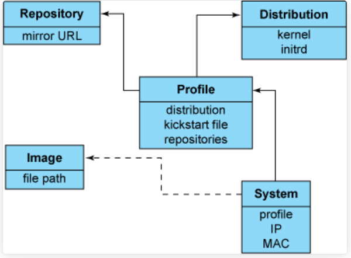
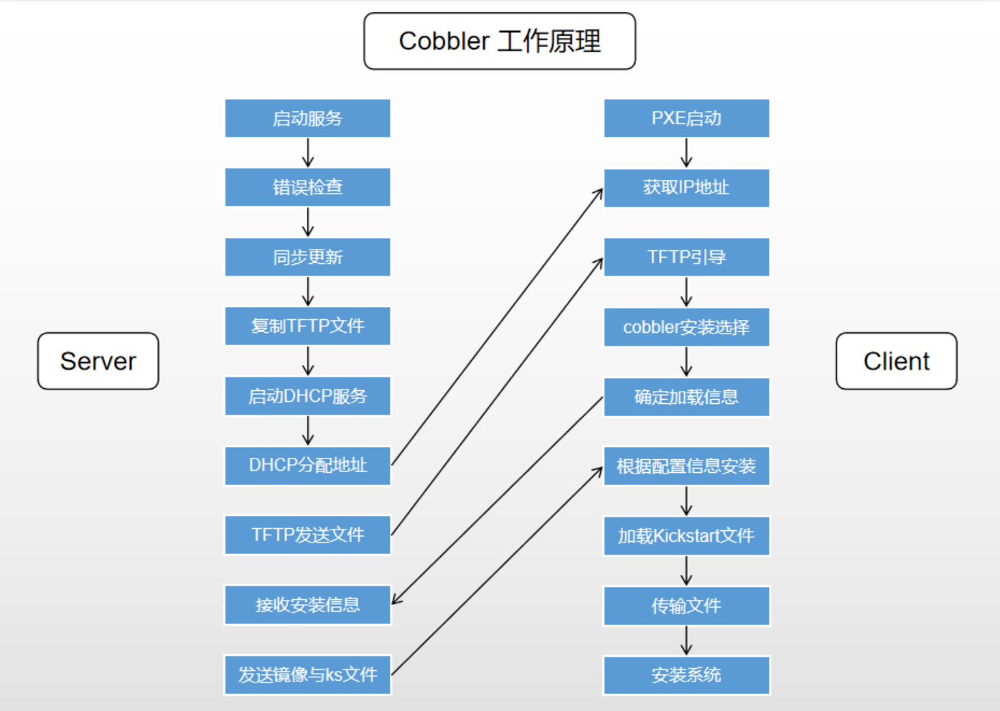
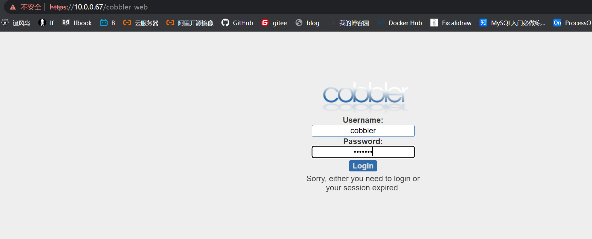

## Cobbler简介

1、`Cobbler`是一个`Linux`服务器安装的服务，可以通过网络启动（`PXE`）的方式来快速安装、重装物理服务器和虚拟机，同时还可以管理`DHCP`，`DNS`等。


2、`Cobbler`可以使用命令行方式管理，也提供了基于Web的界面管理工具（`cobbler-web`），还提供了`API`接口，可以方便二次开发使用。


3、`Cobbler`是较早前的`kickstart`的升级版，优点是比较容易配置，还自带web界面比较易于管理。


4、`Cobbler`内置了一个轻量级配置管理系统，但它也支持和其它配置管理系统集成，如`Puppet`。


> 官网：https://cobbler.github.io/

> kickstart参考：https://www.linuxidc.com/Linux/2017-08/146168.htm

## cobbler对应关系




`Cobbler`的配置结构基于一组注册的对象。每个对象表示一个与另一个实体相关联的实体。当一个对象指向另一个对象时，它就继承了被指向对象的数据，并可覆盖或添加更多特定信息。

- 发行版(`distros`)： 表示一个操作系统。它承载了内核和`initrd`的信息，以及内核参数等其他数据。
- 配置文件(`profiles`)：包含一个发行版、一个`kickstart`文件以及可能的存储库，还包括更多特定的内核参数等其他数据。
- 系统(`systems`)：表示要配给的机器。它包括一个配置文件或一个镜像、`IP`和`MAC`地址、电源管理（地址、凭据、类型）以及更为专业的数据等信息。
- 镜像(`images`)：可以替换一个保函不屑于此类别的文件的发行版对象（例如，无法分为内核和`initrd`的对象）。

## cobbler集成的服务

- PXE服务支持
- DHCP服务管理
- DNS服务管理
- 电源管理
- Kickstart服务支持
- YUM仓库管理
- TFTP
- Apache

## cobbler工作原理




**Server端**

- 启动`Cobbler`服务
- 进行`Cobbler`错误检查，执行`cobbler check`命令
- 进行配置同步，执行`cobbler sync`命令
- 复制相关启动文件到`TFTP`目录中
- 启动`DHCP`服务，提供地址分配
- `DHCP`服务分配IP地址
- `TFTP`传输启动文件
- `Server`端接收安装信息
- `Server`端发送`ISO`镜像与`Kickstart`文件

**Client端**

- 客户端以`PXE`模式启动
- 客户端获取`IP`地址
- 通过`TFTP`服务器获取启动文件
- 进入`Cobbler`安装选择界面
- 根据配置信息准备安装系统
- 加载`Kickstart`文件
- 传输系统安装的其它文件
- 进行安装系统

## cobbler安装

**说明：**虚拟机网卡采用NAT模式或者仅主机模式，不要使用桥接模式，因为后面会搭建`DHCP`服务器，在同一个局域网多个`DHCP`服务会有冲突。
`VMware`的NAT模式的`dhcp`服务也关闭，避免干扰。

### 环境准备

```
#关闭防火墙，selinux
```

### 安装cobble

```
# 安装cobbler及dhcp httpd xinetd cobbler-web
[root@cobbler ~]# yum -y install cobbler cobbler-web tftp-server dhcp httpd xinetd

# 启动cobbler及httpd并加入开机启动
[root@cobbler ~]# systemctl start httpd cobblerd
[root@cobbler ~]# systemctl enable httpd cobblerd
```

查看安装后相关文件

```
[root@cobbler ~]# rpm -ql cobbler
/etc/cobbler                  # 配置文件目录
/etc/cobbler/settings         # cobbler主配置文件，这个文件是YAML格式，Cobbler是python写的程序。
/etc/cobbler/dhcp.template    # DHCP服务的配置模板
/etc/cobbler/tftpd.template   # tftp服务的配置模板
/etc/cobbler/rsync.template   # rsync服务的配置模板
/etc/cobbler/iso              # iso模板配置文件目录
/etc/cobbler/pxe              # pxe模板文件目录
/etc/cobbler/power            # 电源的配置文件目录
/etc/cobbler/users.conf       # Web服务授权配置文件
/etc/cobbler/users.digest     # 用于web访问的用户名密码配置文件
/etc/cobbler/dnsmasq.template # DNS服务的配置模板
/etc/cobbler/modules.conf     # Cobbler模块配置文件
/var/lib/cobbler              # Cobbler数据目录
/var/lib/cobbler/config       # 配置文件
/var/lib/cobbler/kickstarts   # 默认存放kickstart文件
/var/lib/cobbler/loaders      # 存放的各种引导程序
/var/www/cobbler              # 系统安装镜像目录
/var/www/cobbler/ks_mirror    # 导入的系统镜像列表
/var/www/cobbler/images       # 导入的系统镜像启动文件
/var/www/cobbler/repo_mirror  # yum源存储目录
/var/log/cobbler              # 日志目录
/var/log/cobbler/install.log  # 客户端系统安装日志
/var/log/cobbler/cobbler.log  # cobbler日志
```

### 配置cobbler

检查`Cobbler`的配置，如果看不到下面的结果，再次重启`cobbler`

```
[root@cobbler ~]# cobbler check
The following are potential configuration items that you may want to fix:

1 : The 'server' field in /etc/cobbler/settings must be set to something other than localhost, or kickstarting features will not work.  This should be a resolvable hostname or IP for the boot server as reachable by all machines that will use it.
2 : For PXE to be functional, the 'next_server' field in /etc/cobbler/settings must be set to something other than 127.0.0.1, and should match the IP of the boot server on the PXE network.
3 : change 'disable' to 'no' in /etc/xinetd.d/tftp
4 : Some network boot-loaders are missing from /var/lib/cobbler/loaders, you may run 'cobbler get-loaders' to download them, or, if you only want to handle x86/x86_64 netbooting, you may ensure that you have installed a *recent* version of the syslinux package installed and can ignore this message entirely.  Files in this directory, should you want to support all architectures, should include pxelinux.0, menu.c32, elilo.efi, and yaboot. The 'cobbler get-loaders' command is the easiest way to resolve these requirements.
5 : enable and start rsyncd.service with systemctl
6 : debmirror package is not installed, it will be required to manage debian deployments and repositories
7 : ksvalidator was not found, install pykickstart
8 : The default password used by the sample templates for newly installed machines (default_password_crypted in /etc/cobbler/settings) is still set to 'cobbler' and should be changed, try: "openssl passwd -1 -salt 'random-phrase-here' 'your-password-here'" to generate new one
9 : fencing tools were not found, and are required to use the (optional) power management features. install cman or fence-agents to use them

Restart cobblerd and then run 'cobbler sync' to apply changes.
```

看到上面出现的问题，然后一个一个的进行解决，先进行设置为可以动态配置，也可以直接更改配置文件。

```
[root@cobbler ~]# sed -ri '/allow_dynamic_settings:/c\allow_dynamic_settings: 1' /etc/cobbler/settings
[root@cobbler ~]# grep allow_dynamic_settings /etc/cobbler/settings 
allow_dynamic_settings: 1
[root@cobbler ~]# systemctl restart cobblerd
```

一个个解决：

```
#配置文件中配置
1. server
[root@cobbler ~]# 10.0.0.68

2. next_server
[root@cobbler ~]# 10.0.0.68

3. tftp_server
[root@cobbler ~]# sed -ri '/disable/c\disable = no' /etc/xinetd.d/tftp
[root@cobbler ~]# systemctl enable xinetd
[root@cobbler ~]# systemctl restart xinetd

4. boot-loaders
[root@cobbler ~]# cobbler get-loaders

5. rsyncd
[root@cobbler ~]# systemctl start rsyncd
[root@cobbler ~]# systemctl enable rsyncd

6. debmirror [optional]
# 这个是可选项的，可以忽略。这里就忽略了

7. pykickstart
[root@cobbler ~]# yum -y install pykickstart

8. default_password_crypted  #注意：这里设置的密码，也就是后面安装完系统的初始化登录密码
[root@cobbler ~]# openssl passwd -1 -salt `openssl rand -hex 4` 'admin'
$1$30df51b7$2VM5ytJVHTBAvQreNVCvn1
[root@cobbler ~]# cobbler setting edit --name=default_password_crypted --value='$1$30df51b7$2VM5ytJVHTBAvQreNVCvn1'

9. fencing tools [optional]
[root@cobbler ~]# yum -y install fence-agents
```

解决完成再次查看

```
[root@cobbler ~]# cobbler check
```

### 配置DHCP

```
[root@cobbler ~]# cobbler setting edit --name=manage_dhcp --value=1

# 修改cobbler的dhcp模块，不要直接修改dhcp本身的配置文件，因为cobbler会覆盖
[root@node01 ~]# cat /etc/cobbler/dhcp.template 

subnet 10.0.0.0 netmask 126.255.255.0 {  #这里改为分配的网段和掩码
     option routers             10.0.0.2; #如果有网关，这里改为网关地址
     option domain-name-servers 114.114.114.114; #如果有DNS，这里改为DNS地址
     option subnet-mask         255.255.255.0; #改为分配的IP的掩码
     range dynamic-bootp        10.0.0.100 10.0.0.254; #改为分配的IP的范围

```

### 同步cobbler配置

同步cobbler配置，它会根据配置自动修改dhcp等服务。

```
[root@cobbler ~]# cobbler sync
```

重启检查cobbler配置

```
systemctl restart cobblerd httpd.service 

[root@cobbler ~]# systemctl is-active cobblerd httpd tftp.socket rsyncd.service 
active
active
active
active

```

## 访问网址

> https://10.0.0.67/cobbler_web
>
> 账号密码都是 cobbler





