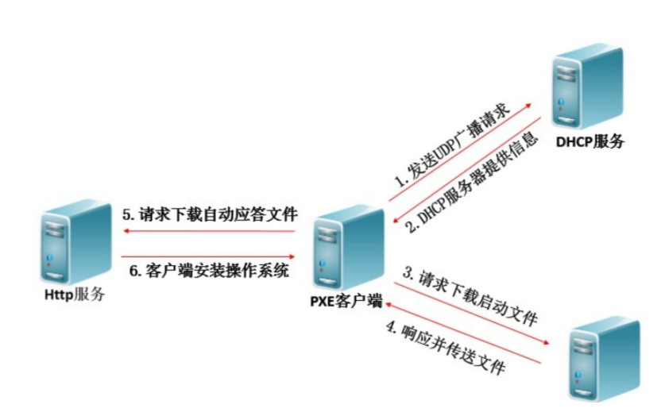
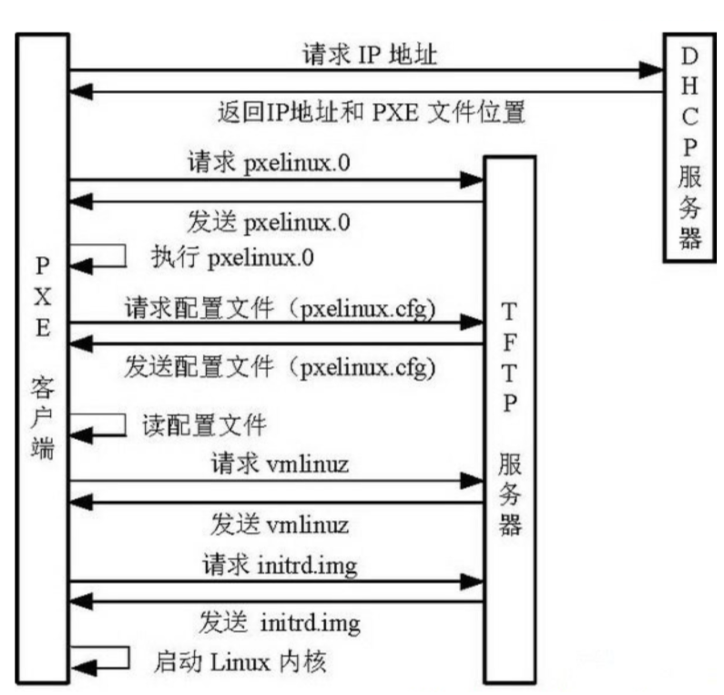

## 环境准备

### 前提

作为运维我们经常会遇到一些重复性机械式的工作，比如同时上线几十台服务器。我们如何在短时间内批量安装呢？

- Kickstart
- Cobbler

### PXE

- PXE，全名Pre-boot Execution Environment，预启动执行环境；
- 通过 **网络接口** 启动计算机，不依赖本地存储设备（如硬盘）或本地已安装的操作系统；
- 由Intel和Systemsoft公司于1999年9月20日公布的技术；
- Client/Server的工作模式；
- PXE客户端会调用网际协议(IP)、用户数据报协议(UDP)、动态主机设定协议(DHCP)、小型文件传输协议(TFTP)等网络协议；
- PXE客户端(client)这个术语是指机器在PXE启动过程中的角色。一个PXE客户端可以是一台服务器、笔记本电脑或者其他装有PXE启动代码的机器（我们电脑的网卡）。

1. PXE Client向DHCP发送请求 PXE Client从自己的PXE网卡启动，通过PXE BootROM(自启动芯片)会以UDP(简单用户数据报协议)发送一个广播请求，向本网络中的DHCP服务器索取IP。
2. DHCP服务器提供信息 DHCP服务器收到客户端的请求，验证是否来至合法的PXE Client的请求，验证通过它将给客户端一个“提供”响应，这个“提供”响应中包含了为客户端分配的IP地址、pxelinux启动程序(TFTP)位置，以及配置文件所在位置。
3. PXE客户端请求下载启动文件 客户端收到服务器的“回应”后，会回应一个帧，以请求传送启动所需文件。这些启动文件包括：pxelinux.0、pxelinux.cfg/default、vmlinuz、initrd.img等文件。
4. Boot Server响应客户端请求并传送文件 当服务器收到客户端的请求后，他们之间之后将有更多的信息在客户端与服务器之间作应答, 用以决定启动参数。BootROM由TFTP通讯协议从Boot Server下载启动安装程序所必须的文件(pxelinux.0、pxelinux.cfg/default)。default文件下载完成后，会根据该文件中定义的引导顺序，启动Linux安装程序的引导内核。
5. 请求下载自动应答文件 客户端通过pxelinux.cfg/default文件成功的引导Linux安装内核后，安装程序首先必须确定你通过什么安装介质来安装linux，如果是通过网络安装(NFS, FTP, HTTP)，则会在这个时候初始化网络，并定位安装源位置。接着会读取default文件中指定的自动应答文件ks.cfg所在位置，根据该位置请求下载该文件。
6. 客户端安装操作系统 将ks.cfg文件下载回来后，通过该文件找到OS Server，并按照该文件的配置请求下载安装过程需要的软件包。OS Server和客户端建立连接后，将开始传输软件包，客户端将开始安装操作系统。安装完成后，将提示重新引导计算机。

### 批量装机软件

Redhat系主要有两种Kickstart和Cobbler。

Kickstart是一种无人值守的安装方式。它的工作原理是在安装过程中记录人工干预填写的各种参数，并生成一个名为ks.cfg的文件。如果在自动安装过程中出现要填写参数的情况，安装程序首先会去查找ks.cfg文件，如果找到合适的参数，就采用所找到的参数；如果没有找到合适的参数，便会弹出对话框让安装者手工填写。所以，如果ks.cfg文件涵盖了安装过程中所有需要填写的参数，那么安装者完全可以只告诉安装程序从何处下载ks.cfg文件，然后就去忙自己的事情。等安装完毕，安装程序会根据ks.cfg中的设置重启/关闭系统，并结束安装。

Cobbler集中和简化了通过网络安装操作系统需要使用到的DHCP、TFTP和DNS服务的配置。Cobbler不仅有一个命令行界面，还提供了一个Web界面，大大降低了使用者的入门水平。Cobbler内置了一个轻量级配置管理系统，但它也支持和其它配置管理系统集成，如Puppet，暂时不支持SaltStack。

**简单的说，Cobbler是对kickstart的封装，简化安装步骤、使用流程，降低使用者的门槛**

### 环境准备

准备好一台用于部署kickstart服务端的机器

**注意：虚拟机网卡连接方式，采用NAT模式，不要用桥接，且关闭VM网卡中的DHCP服务**

做好相关优化

### 主机IP设置方式

每一台主机的IP地址可以通过以下两种方法来设置：

1：手动输入、这种方式比较容易因为输入错误而影响到主机的网络通信，而且可能会因为占用其他主机的IP地址而干扰到该主机的运行，因为会加重系统管理员的负担。

2：自动向DHCP服务器申请、用户的计算机会自动向DHCP服务器申请IP地址，接收到此请求的DHCP服务器会分配IP地址给用户的计算机。他可以减轻管理负担，避免因手动输入错误而造成的困扰。

我们将手动输入的IP地址为静态IP地址（static IP address），而向DHCP服务器租用的IP地址为动态IP地址（dynamic IP address）。