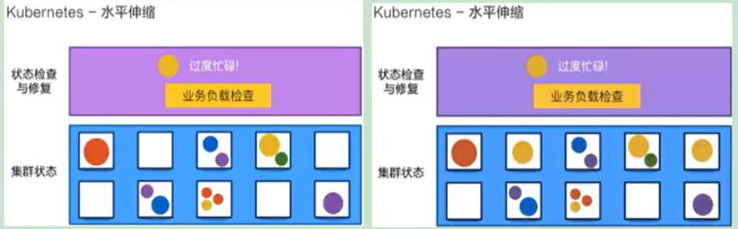
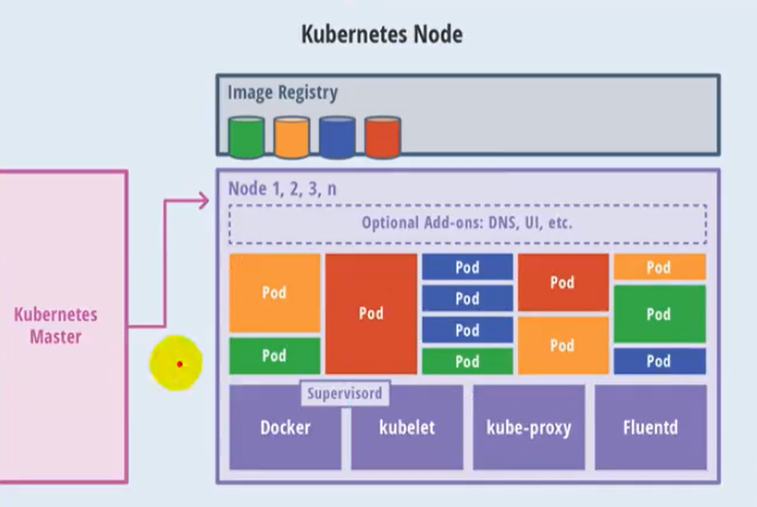
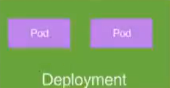
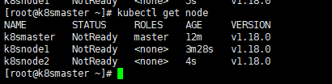
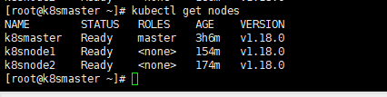
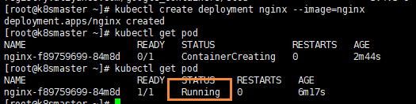
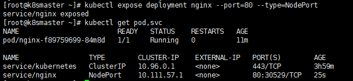

# Kubernetes简介

## 来源

bilibili尚硅谷K8S视频：https://www.bilibili.com/video/BV1GT4y1A756

中文官网：https://kubernetes.io/zh

中文社区：https://www.kubernetes.org.cn/

## 介绍

K8S主要讲的就是Kubernetes，首先Kubernetes首字母为K，末尾为s，中间一共有8个字母，所以简称K8s

## 前置知识

- Linux操作系统
- Docker

## 课程简介

- K8s概念和架构
- 从零搭建K8s集群
  - 基于客户端工具kubeadm搭建（简单，最多半小时）
  - 基于二进制包方式（能看到内部的架构）

- K8s核心概念
  - Pod：K8s管理的最小单位级，是所有业务类型的基础
  - Controller：控制器，有状态，无状态，一次任务，定时任务，守护进程
  - Service Ingress：对外暴露端口
  - RBAC：安全机制，权限模型
  - Helm：下载机制
  - 持久化存储

- 搭建集群监控平台系统
- 从零搭建高可用K8s集群
- 在集群环境部署项目

## K8S概念和特性

### 部署发展历程

我们的项目部署也在经历下面的这样一个历程

> 传统部署 -> 虚拟化部署时代 -> 容器部署时代


- **传统部署时代**：早期，组织在物理服务器上运行应用程序。无法为物理服务器中的应用程序定义资源边界，这会导致资源分配问题。例如，如果在物理服务器上运行多个应用程序，则可能会出现-一个应用程序占用大部分资源的情况，结果可能导致其他应用程序的性能下降。--种解决方案是在不同的物理服务器上运行每个应用程序，但是由于资源利用不足而无法扩展，并且组织维护许多物理服务器的成本很高。
- **虚拟化部署时代**：作为解决方案，引入了虚拟化功能，它允许您在单个物理服务器的CPU.上运行多个虚拟机（VM）。虚拟化功能允许应用程序在VM之间隔离，并提供安全级别，因为一一个应用程序的信息不能被另一应用程序自由地访问。因为虚拟化可以轻松地添加或更新应用程序、降低硬件成本等等，所以虚拟化可以更好地利用物理服务器中的资源，并可以实现更好的可伸缩性。每个VM是一台完整的计算机，在虚拟化硬件之上运行所有组件，包括其自己的操作系统。
- **容器部署时代**：容器类似于VM，但是它们具有轻量级的隔离属性，可以在应用程序之间共享操作系统
  （OS），因此，容器被认为是轻量级的。容器与VM类似，具有自己的文件系统、CPU、内存、进程空间等。由于它们与基础架构分离，因此可以跨云和OS分发进行移植。

容器因具有许多优势而变得流行起来。下面列出了容器的一些好处：

- 敏捷应用程序的创建和部署：与使用VM镜像相比，提高了容器镜像创建的简便性和效率。
- 持续开发、集成和部署：通过简单的回滚（由于镜像不可变性），提供可靠且频繁的容器镜像构建和部署。
- 关注开发与运维的分离：在构建/时而不是在部署时创建应用程序容器镜像，将应用程序与基础架构分离。
- 可观察性：不仅可以显示操作系统级别的信息和指标，还可以显示应用程序的运行状况和其他指标信号。
- 跨开发、测试和生产的环境一致性：在便携式计算机上与在云中相同地运行。
- 云和操作系统分发的可移植性：可在Ubuntu、RHEL、RHEL、CoreOS、本地、Google Kubernetes Engine和其它任何其它地方运行。
- 以应用程序为中心的管理：提高抽象级别，从在虚拟硬件上运行OS到使用逻辑资源在OS上运行应用程序。
- 松散耦合、分布式、弹性、解放的微服务：应用程序被分解成较小的独立部分，并且可以动态部署和管理-而不是在一台大型单机上器体运行。
- 资源隔离：可预测的应用程序性能。

### K8S概述

kubernetes，简称K8s，是用8 代替8 个字符“ubernete”而成的缩写。是一个开源的，用于管理云平台中多个主机上的容器化的应用，Kubernetes 的目标是让部署容器化的应用简单并且高效（powerful）,Kubernetes 提供了应用部署，规划，更新，维护的一种机制。

传统的应用部署方式是通过插件或脚本来安装应用。这样做的缺点是应用的运行、配置、管理、所有生存周期将与当前操作系统绑定，这样做并不利于应用的升级更新/回滚等操作，当然也可以通过创建虚拟机的方式来实现某些功能，但是虚拟机非常重，并不利于可移植性。

新的方式是通过部署容器方式实现，每个容器之间互相隔离，每个容器有自己的文件系统，容器之间进程不会相互影响，能区分计算资源。相对于虚拟机，容器能快速部署，由于容器与底层设施、机器文件系统解耦的。

> 总结：
>
> - K8s是谷歌在2014年发布的容器化集群管理系统
> - 使用k8s进行容器化应用部署
> - 使用k8s利于应用扩展
> - k8s目标实施让部署容器化应用更加简洁和高效

### K8S概述

Kubernetes 是一个轻便的和可扩展的开源平台，用于管理容器化应用和服务。通过Kubernetes 能够进行应用的自动化部署和扩缩容。在Kubernetes 中，会将组成应用的容器组合成一个逻辑单元以更易管理和发现。

Kubernetes 积累了作为Google 生产环境运行工作负载15 年的经验，并吸收了来自于社区的最佳想法和实践。

### K8S功能

#### 自动装箱

基于容器对应用运行环境的资源配置要求自动部署应用容器

#### 自我修复(自愈能力)

当容器失败时，会对容器进行重启

当所部署的Node节点有问题时，会对容器进行重新部署和重新调度

当容器未通过监控检查时，会关闭此容器直到容器正常运行时，才会对外提供服务


如果某个服务器上的应用不响应了，Kubernetes会自动在其它的地方创建一个


#### 水平扩展

通过简单的命令、用户UI 界面或基于CPU 等资源使用情况，对应用容器进行规模扩大或规模剪裁

> 当我们有大量的请求来临时，我们可以增加副本数量，从而达到水平扩展的效果

当黄色应用过度忙碌，会来扩展一个应用



#### 服务发现

用户不需使用额外的服务发现机制，就能够基于Kubernetes 自身能力实现服务发现和负载均衡

> 对外提供统一的入口，让它来做节点的调度和负载均衡， 相当于微服务里面的网关？


#### 滚动更新

可以根据应用的变化，对应用容器运行的应用，进行一次性或批量式更新

> 添加应用的时候，不是加进去就马上可以进行使用，而是需要判断这个添加进去的应用是否能够正常使用

#### 版本回退

可以根据应用部署情况，对应用容器运行的应用，进行历史版本即时回退

> 类似于Git中的回滚

#### 密钥和配置管理

在不需要重新构建镜像的情况下，可以部署和更新密钥和应用配置，类似热部署。

#### 存储编排

自动实现存储系统挂载及应用，特别对有状态应用实现数据持久化非常重要

存储系统可以来自于本地目录、网络存储(NFS、Gluster、Ceph 等)、公共云存储服务

#### 批处理

提供一次性任务，定时任务；满足批量数据处理和分析的场景

## K8S架构组件

### 完整架构图


### 架构细节

K8S架构主要包含两部分：Master（主控节点）和 node（工作节点）

master节点架构图


Node节点架构图



k8s 集群控制节点，对集群进行调度管理，接受集群外用户去集群操作请求；

- **master**：主控节点
  - API Server：集群统一入口，以restful风格进行操作，同时交给etcd存储
    - 提供认证、授权、访问控制、API注册和发现等机制
  - scheduler：节点的调度，选择node节点应用部署
  - controller-manager：处理集群中常规后台任务，一个资源对应一个控制器
  - etcd：存储系统，用于保存集群中的相关数据
  
- **Work node**：工作节点
  
  - Kubelet：master派到node节点代表，管理本机容器
    - 一个集群中每个节点上运行的代理，它保证容器都运行在Pod中
    - 负责维护容器的生命周期，同时也负责Volume(CSI) 和 网络(CNI)的管理
  - kube-proxy：提供网络代理，负载均衡等操作
  
- 容器运行环境【**Container Runtime**】

  - 容器运行环境是负责运行容器的软件
  - Kubernetes支持多个容器运行环境：Docker、containerd、cri-o、rktlet以及任何实现Kubernetes CRI (容器运行环境接口) 的软件。

- fluentd：是一个守护进程，它有助于提升 集群层面日志

  

## K8S核心概念

### Pod

- Pod是K8s中最小的单元
- 一组容器的集合
- 共享网络【一个Pod中的所有容器共享同一网络】
- 生命周期是短暂的（服务器重启后，就找不到了）

### Volume

- 声明在Pod容器中可访问的文件目录
- 可以被挂载到Pod中一个或多个容器指定路径下
- 支持多种后端存储抽象【本地存储、分布式存储、云存储】

### Controller

- 确保预期的pod副本数量【ReplicaSet】
- 无状态应用部署【Deployment】
  - 无状态就是指，不需要依赖于网络或者ip
- 有状态应用部署【StatefulSet】
  - 有状态需要特定的条件
- 确保所有的node运行同一个pod 【DaemonSet】
- 一次性任务和定时任务【Job和CronJob】

### Deployment

- 定义一组Pod副本数目，版本等
- 通过控制器【Controller】维持Pod数目【自动回复失败的Pod】
- 通过控制器以指定的策略控制版本【滚动升级、回滚等】



### Service

- 定义一组pod的访问规则
- Pod的负载均衡，提供一个或多个Pod的稳定访问地址
- 支持多种方式【ClusterIP、NodePort、LoadBalancer】


可以用来组合pod，同时对外提供服务

### Label

label：标签，用于对象资源查询，筛选


### Namespace

命名空间，逻辑隔离

- 一个集群内部的逻辑隔离机制【鉴权、资源】
- 每个资源都属于一个namespace
- 同一个namespace所有资源不能重复
- 不同namespace可以资源名重复

### API

我们通过Kubernetes的API来操作整个集群

同时我们可以通过 kubectl 、ui、curl 最终发送 http + json/yaml 方式的请求给API Server，然后控制整个K8S集群，K8S中所有的资源对象都可以采用 yaml 或 json 格式的文件定义或描述

如下：使用yaml部署一个nginx的pod


## 完整流程


- 通过Kubectl提交一个创建RC（Replication Controller）的请求，该请求通过APlserver写入etcd
- 此时Controller Manager通过API Server的监听资源变化的接口监听到此RC事件
- 分析之后，发现当前集群中还没有它所对应的Pod实例
- 于是根据RC里的Pod模板定义一个生成Pod对象，通过APIServer写入etcd
- 此事件被Scheduler发现，它立即执行执行一个复杂的调度流程，为这个新的Pod选定一个落户的Node，然后通过API Server讲这一结果写入etcd中
- 目标Node上运行的Kubelet进程通过APiserver监测到这个"新生的Pod.并按照它的定义，启动该Pod并任劳任怨地负责它的下半生，直到Pod的生命结束
- 随后，我们通过Kubectl提交一个新的映射到该Pod的Service的创建请求
- ControllerManager通过Label标签查询到关联的Pod实例，然后生成Service的Endpoints信息，并通过APIServer写入到etod中，
- 接下来，所有Node上运行的Proxy进程通过APIServer查询并监听Service对象与其对应的Endponts信息，建立一个软件方式的负载均衡器来实现Service访问到后端Pod的流量转发功能

# 搭建K8S集群

## 搭建k8s环境平台规划

### 单master集群

单个master节点，然后管理多个node节点


### 多master集群

多个master节点，管理多个node节点，同时中间多了一个负载均衡的过程


## 服务器硬件配置要求

### 测试环境

master：2核  4G  20G

node：   4核  8G  40G

### 生产环境

master：8核  16G  100G

node：   16核  64G  200G

目前生产部署Kubernetes集群主要有两种方式

### kubeadm

kubeadm是一个K8S部署工具，提供kubeadm init 和 kubeadm join，用于快速部署Kubernetes集群

官网地址：[点我传送](https://kubernetes.io/zh/docs/setup/production-environment/tools/kubeadm/install-kubeadm/)

### 二进制包

从github下载发行版的二进制包，手动部署每个组件，组成Kubernetes集群。

Kubeadm降低部署门槛，但屏蔽了很多细节，遇到问题很难排查。如果想更容易可控，推荐使用二进制包部署Kubernetes集群，虽然手动部署麻烦点，期间可以学习很多工作原理，也利于后期维护。

## Kubeadm部署集群

kubeadm 是官方社区推出的一个用于快速部署kubernetes 集群的工具，这个工具能通过两条指令完成一个kubernetes 集群的部署：

- 创建一个Master 节点kubeadm init
- 将Node 节点加入到当前集群中$ kubeadm join <Master 节点的IP 和端口>

## 安装要求

在开始之前，部署Kubernetes集群机器需要满足以下几个条件

- 一台或多台机器，操作系统为Centos7.X
- 硬件配置：2GB或更多GAM，2个CPU或更多CPU，硬盘30G
- 集群中所有机器之间网络互通
- 可以访问外网，需要拉取镜像
- 禁止swap分区

# kubeadm方式搭建K8S集群

kubeadm是官方社区推出的一个用于快速部署kubernetes集群的工具。

这个工具能通过两条指令完成一个kubernetes集群的部署：

```bash
# 创建一个 Master 节点
kubeadm init

# 将一个 Node 节点加入到当前集群中
kubeadm join <Master节点的IP和端口 >
```

## Kubeadm方式搭建K8S集群

使用kubeadm方式搭建K8s集群主要分为以下几步

- 准备三台虚拟机，同时安装操作系统CentOS 7.x
- 对三个安装之后的操作系统进行初始化操作
- 在三个节点安装 docker kubelet kubeadm kubectl
- 在master节点执行kubeadm init命令初始化
- 在node节点上执行 kubeadm join命令，把node节点添加到当前集群
- 配置CNI网络插件，用于节点之间的连通【失败了可以多试几次】
- 通过拉取一个nginx进行测试，能否进行外网测试

## 安装要求

在开始之前，部署Kubernetes集群机器需要满足以下几个条件：

- 一台或多台机器，操作系统 CentOS7.x-86_x64
- 硬件配置：2GB或更多RAM，2个CPU或更多CPU，硬盘30GB或更多【注意master需要两核】
- 可以访问外网，需要拉取镜像，如果服务器不能上网，需要提前下载镜像并导入节点
- 禁止swap分区

## 准备环境

| 角色   | IP        |
| ------ | --------- |
| master | 10.0.0.66 |
| node1  | 10.0.0.67 |
| node2  | 10.0.0.68 |

然后开始在每台机器上执行下面的命令

```bash
# 关闭防火墙
systemctl stop firewalld
systemctl disable firewalld

# 关闭selinux
# 永久关闭
sed -i 's/enforcing/disabled/' /etc/selinux/config  
# 临时关闭
setenforce 0  

# 关闭swap
# 临时
swapoff -a 
# 永久关闭
sed -ri 's/.*swap.*/#&/' /etc/fstab

# 根据规划设置主机名【master节点上操作】
hostnamectl set-hostname k8smaster
# 根据规划设置主机名【node1节点操作】
hostnamectl set-hostname k8snode1
# 根据规划设置主机名【node2节点操作】
hostnamectl set-hostname k8snode2

# 在master添加hosts
cat >> /etc/hosts << EOF
10.0.0.66 k8smaster
10.0.0.67 k8snode1
10.0.0.68 k8snode2
EOF


# 将桥接的IPv4流量传递到iptables的链
cat > /etc/sysctl.d/k8s.conf << EOF
net.bridge.bridge-nf-call-ip6tables = 1
net.bridge.bridge-nf-call-iptables = 1
EOF
# 生效
sysctl --system  

# 时间同步
yum install ntpdate -y
ntpdate time.windows.com
```

## 安装Docker/kubeadm/kubelet

所有节点安装Docker/kubeadm/kubelet ，Kubernetes默认CRI（容器运行时）为Docker，因此先安装Docker

### 安装Docker

首先配置一下Docker的阿里yum源

```bash
cat >/etc/yum.repos.d/docker.repo<<EOF
[docker-ce-edge]
name=Docker CE Edge - \$basearch
baseurl=https://mirrors.aliyun.com/docker-ce/linux/centos/7/\$basearch/edge
enabled=1
gpgcheck=1
gpgkey=https://mirrors.aliyun.com/docker-ce/linux/centos/gpg
EOF
```

然后yum方式安装docker

```bash
# yum安装
yum -y install docker-ce

# 查看docker版本
docker --version  

# 启动docker
systemctl enable docker
systemctl start docker
```

配置docker的镜像源

```bash
cat >> /etc/docker/daemon.json << EOF
{
  "registry-mirrors": ["https://b9pmyelo.mirror.aliyuncs.com"]
}
EOF
```

然后重启docker

```bash
systemctl restart docker
```

### 添加kubernetes软件源

然后我们还需要配置一下yum的k8s软件源

```bash
cat > /etc/yum.repos.d/kubernetes.repo << EOF
[kubernetes]
name=Kubernetes
baseurl=https://mirrors.aliyun.com/kubernetes/yum/repos/kubernetes-el7-x86_64
enabled=1
gpgcheck=0
repo_gpgcheck=0
gpgkey=https://mirrors.aliyun.com/kubernetes/yum/doc/yum-key.gpg https://mirrors.aliyun.com/kubernetes/yum/doc/rpm-package-key.gpg
EOF
```

###  安装kubeadm，kubelet和kubectl

由于版本更新频繁，这里指定版本号部署：

```bash
# 安装kubelet、kubeadm、kubectl，同时指定版本
yum install -y kubelet-1.18.0 kubeadm-1.18.0 kubectl-1.18.0
# 设置开机启动
systemctl enable kubelet
```

## 部署Kubernetes Master【master节点】

在   10.0.0.66  执行，也就是master节点

```bash
kubeadm init \
--apiserver-advertise-address=10.0.0.66 \
--image-repository registry.aliyuncs.com/google_containers \
--kubernetes-version v1.18.0 --service-cidr=10.96.0.0/12 \
--pod-network-cidr=10.244.0.0/16


#报错的话关闭swap
[root@k8s-master ~]# swapoff  -a
[root@k8s-master ~]# sed -ri 's/.*swap.*/#&/' /etc/fstab
```

由于默认拉取镜像地址k8s.gcr.io国内无法访问，这里指定阿里云镜像仓库地址，【执行上述命令会比较慢，因为后台其实已经在拉取镜像了】，我们 docker images 命令即可查看已经拉取的镜像


当我们出现下面的情况时，表示kubernetes的镜像已经安装成功


使用kubectl工具 【master节点操作】

```bash
mkdir -p $HOME/.kube
sudo cp -i /etc/kubernetes/admin.conf $HOME/.kube/config
sudo chown $(id -u):$(id -g) $HOME/.kube/config
```

执行完成后，我们使用下面命令，查看我们正在运行的节点

```bash
kubectl get nodes
```


能够看到，目前有一个master节点已经运行了，但是还处于未准备状态

下面我们还需要在Node节点执行其它的命令，将node1和node2加入到我们的master节点上

## 加入Kubernetes Node【Slave节点】

下面我们需要到 node1 和 node2服务器，执行下面的代码向集群添加新节点

执行在kubeadm init输出的kubeadm join命令：

> 注意，以下的命令是在master初始化完成后，每个人的都不一样！！！需要复制自己生成的

```bash
kubeadm join 10.0.0.66:6443 --token gbgvkv.05yf3xntsxhboej4 \
    --discovery-token-ca-cert-hash sha256:68c7051d58dadd1190ba2d061dae44a3c0422d08f775a800631f2a2438dfa2ad 
```

默认token有效期为24小时，当过期之后，该token就不可用了。这时就需要重新创建token，操作如下：

```
kubeadm token create --print-join-command
```

当我们把两个节点都加入进来后，我们就可以去Master节点 执行下面命令查看情况

```bash
kubectl get node
```



## 部署CNI网络插件

上面的状态还是NotReady，下面我们需要网络插件，来进行联网访问

```
# 下载网络插件配置
wget https://raw.githubusercontent.com/coreos/flannel/master/Documentation/kube-flannel.yml
```

默认镜像地址无法访问，sed命令修改为docker hub镜像仓库。

```
# 添加
kubectl apply -f https://raw.githubusercontent.com/coreos/flannel/master/Documentation/kube-flannel.yml

##首先下载v0.13.1-rc2-amd64 镜像
##参考博客：https://www.cnblogs.com/pyxuexi/p/14288591.html
##导入镜像，命令，，特别提示，3个机器都需要导入，3个机器都需要导入，3个机器都需要导入，3个机器都需要导入，重要的事情说3遍。不然抱错。如果没有操作，报错后，需要删除节点，重置，在导入镜像，重新加入才行。本地就是这样操作成功的！

docker load < flanneld-v0.13.1-rc2-amd64.docker

#####下载本地，替换将image: quay.io/coreos/flannel:v0.13.1-rc2 替换为 image: quay.io/coreos/flannel:v0.13.1-rc2-amd64

# 查看状态 【kube-system是k8s中的最小单元】
kubectl get pods -n kube-system
```

运行后的结果


运行完成后，我们查看状态可以发现，已经变成了Ready状态了



如果上述操作完成后，还存在某个节点处于NotReady状态，可以在Master将该节点删除

```bash
# master节点将该节点删除

##20210223 yan 查阅资料添加###kubectl drain k8snode1 --delete-local-data --force --ignore-daemonsets

kubectl delete node k8snode1
 
# 然后到k8snode1节点进行重置
 kubeadm reset
# 重置完后在加入
kubeadm join 192.168.177.130:6443 --token 8j6ui9.gyr4i156u30y80xf     --discovery-token-ca-cert-hash sha256:eda1380256a62d8733f4bddf926f148e57cf9d1a3a58fb45dd6e80768af5a500
```

## 测试kubernetes集群

我们都知道K8S是容器化技术，它可以联网去下载镜像，用容器的方式进行启动

在Kubernetes集群中创建一个pod，验证是否正常运行：

```bash
# 下载nginx 【会联网拉取nginx镜像】
kubectl create deployment nginx --image=nginx
# 查看状态
kubectl get pod
```

如果我们出现Running状态的时候，表示已经成功运行了



下面我们就需要将端口暴露出去，让其它外界能够访问

```bash
# 暴露端口
kubectl expose deployment nginx --port=80 --type=NodePort
# 查看一下对外的端口
kubectl get pod,svc
```

能够看到，我们已经成功暴露了 80端口  到 30529上



我们到我们的宿主机浏览器上，访问如下地址

```bash
http://192.168.177.130:30529/
```

发现我们的nginx已经成功启动了


到这里为止，我们就搭建了一个单master的k8s集群


## 错误汇总

### 错误一

在执行Kubernetes  init方法的时候，出现这个问题

```bash
error execution phase preflight: [preflight] Some fatal errors occurred:
	[ERROR NumCPU]: the number of available CPUs 1 is less than the required 2
```

是因为VMware设置的核数为1，而K8S需要的最低核数应该是2，调整核数重启系统即可

### 错误二

我们在给node1节点使用 kubernetes join命令的时候，出现以下错误

```bash
error execution phase preflight: [preflight] Some fatal errors occurred:
	[ERROR Swap]: running with swap on is not supported. Please disable swap
```

错误原因是我们需要关闭swap

```bash
# 关闭swap
# 临时
swapoff -a 
# 临时
sed -ri 's/.*swap.*/#&/' /etc/fstab
```

### 错误三

在给node1节点使用 kubernetes join命令的时候，出现以下错误

```bash
The HTTP call equal to 'curl -sSL http://localhost:10248/healthz' failed with error: Get http://localhost:10248/healthz: dial tcp [::1]:10248: connect: connection refused
```

解决方法，首先需要到 master 节点，创建一个文件

```bash
# 创建文件夹
mkdir /etc/systemd/system/kubelet.service.d

# 创建文件
vim /etc/systemd/system/kubelet.service.d/10-kubeadm.conf

# 添加如下内容
Environment="KUBELET_SYSTEM_PODS_ARGS=--pod-manifest-path=/etc/kubernetes/manifests --allow-privileged=true --fail-swap-on=false"

# 重置
kubeadm reset
```

然后删除刚刚创建的配置目录

```bash
rm -rf $HOME/.kube
```

然后 在master重新初始化

```bash
kubeadm init --apiserver-advertise-address=202.193.57.11 --image-repository registry.aliyuncs.com/google_containers --kubernetes-version v1.18.0 --service-cidr=10.96.0.0/12  --pod-network-cidr=10.244.0.0/16
```

初始完成后，我们再到 node1节点，执行 kubeadm join命令，加入到master

```bash
kubeadm join 202.193.57.11:6443 --token c7a7ou.z00fzlb01d76r37s \
    --discovery-token-ca-cert-hash sha256:9c3f3cc3f726c6ff8bdff14e46b1a856e3b8a4cbbe30cab185f6c5ee453aeea5
```

添加完成后，我们使用下面命令，查看节点是否成功添加

```bash
kubectl get nodes
```

### 错误四

我们再执行查看节点的时候，  kubectl get nodes 会出现问题

```bash
Unable to connect to the server: x509: certificate signed by unknown authority (possibly because of "crypto/rsa: verification error" while trying to verify candidate authority certificate "kubernetes")
```

这是因为我们之前创建的配置文件还存在，也就是这些配置

```bash
mkdir -p $HOME/.kube
sudo cp -i /etc/kubernetes/admin.conf $HOME/.kube/config
sudo chown $(id -u):$(id -g) $HOME/.kube/config
```

我们需要做的就是把配置文件删除，然后重新执行一下

```bash
rm -rf $HOME/.kube
```

然后再次创建一下即可

```bash
mkdir -p $HOME/.kube
sudo cp -i /etc/kubernetes/admin.conf $HOME/.kube/config
sudo chown $(id -u):$(id -g) $HOME/.kube/config
```

这个问题主要是因为我们在执行 kubeadm reset 的时候，没有把 $HOME/.kube 给移除掉，再次创建时就会出现问题了

### 错误五

安装的时候，出现以下错误

```bash
Another app is currently holding the yum lock; waiting for it to exit...
```

是因为yum上锁占用，解决方法

```bash
yum -y install docker-ce
```

### 错误六

在使用下面命令，添加node节点到集群上的时候

```bash
kubeadm join 192.168.177.130:6443 --token jkcz0t.3c40t0bqqz5g8wsb  --discovery-token-ca-cert-hash sha256:bc494eeab6b7bac64c0861da16084504626e5a95ba7ede7b9c2dc7571ca4c9e5
```

然后出现了这个错误

```bash
[root@k8smaster ~]# kubeadm join 192.168.177.130:6443 --token jkcz0t.3c40t0bqqz5g8wsb     --discovery-token-ca-cert-hash sha256:bc494eeab6b7bac64c0861da16084504626e5a95ba7ede7b9c2dc7571ca4c9e5
W1117 06:55:11.220907   11230 join.go:346] [preflight] WARNING: JoinControlPane.controlPlane settings will be ignored when control-plane flag is not set.
[preflight] Running pre-flight checks
	[WARNING IsDockerSystemdCheck]: detected "cgroupfs" as the Docker cgroup driver. The recommended driver is "systemd". Please follow the guide at https://kubernetes.io/docs/setup/cri/
error execution phase preflight: [preflight] Some fatal errors occurred:
	[ERROR FileContent--proc-sys-net-ipv4-ip_forward]: /proc/sys/net/ipv4/ip_forward contents are not set to 1
[preflight] If you know what you are doing, you can make a check non-fatal with `--ignore-preflight-errors=...`
To see the stack trace of this error execute with --v=5 or higher
```

出于安全考虑，Linux系统**默认是禁止数据包转发**的。所谓**转发即当主机拥有多于一块的网卡时，其中一块收到数据包，根据数据包的目的ip地址将包发往本机另一网卡，该网卡根据路由表继续发送数据包**。这通常就是路由器所要实现的功能。也就是说  **/proc/sys/net/ipv4/ip_forward** 文件的值不支持转发

- 0：禁止
- 1：转发

所以我们需要将值修改成1即可

```bash
echo “1” > /proc/sys/net/ipv4/ip_forward
```

修改完成后，重新执行命令即可

# Kubeadm和二进制方式对比

## Kubeadm方式搭建K8S集群

- 安装虚拟机，在虚拟机安装Linux操作系统【3台虚拟机】
- 对操作系统初始化操作
- 所有节点安装Docker、kubeadm、kubelet、kubectl【包含master和slave节点】
  - 安装docker、使用yum，不指定版本默认安装最新的docker版本
  - 修改docker仓库地址，yum源地址，改为阿里云地址
  - 安装kubeadm，kubelet 和 kubectl
    - k8s已经发布最新的1.19版本，可以指定版本安装，不指定安装最新版本
    - `yum install -y kubelet kubeadm kubectl`
- 在master节点执行初始化命令操作
  - `kubeadm init`
  - 默认拉取镜像地址 K8s.gcr.io国内地址，需要使用国内地址

- 安装网络插件(CNI)
  - `kubectl apply -f kube-flannel.yml`
  - 
- 在所有的node节点上，使用join命令，把node添加到master节点上
- 测试kubernetes集群


## 二进制方式搭建K8S集群

- 安装虚拟机和操作系统，对操作系统进行初始化操作
- 生成cfssl 自签证书
  - `ca-key.pem`、`ca.pem`
  - `server-key.pem`、`server.pem`
- 部署Etcd集群
  - 部署的本质，就是把etcd集群交给 systemd 管理
  - 把生成的证书复制过来，启动，设置开机启动
- 为apiserver自签证书，生成过程和etcd类似
- 部署master组件，主要包含以下组件
  - apiserver
  - controller-manager
  - scheduler
  - 交给systemd管理，并设置开机启动
  - 如果要安装最新的1.19版本，下载二进制文件进行安装
- 部署node组件
  - docker
  - kubelet
  - kube-proxy【需要批准kubelet证书申请加入集群】
  - 交给systemd管理组件- 组件启动，设置开机启动
- 批准kubelet证书申请 并加入集群
- 部署CNI网络插件
- 测试Kubernets集群【安装nginx测试】

