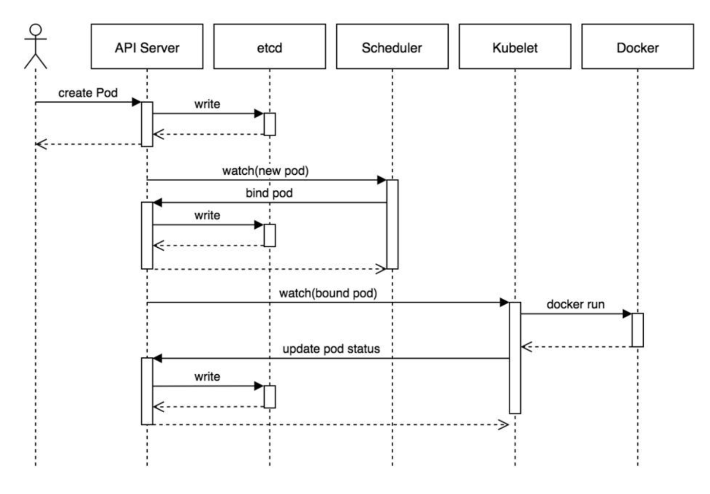

### 工作流程

1. 用户准备一个资源文件（记录了业务应用的名称、镜像地址等信息），通过调用APIServer执行创建Pod
2. APIServer收到用户的Pod创建请求，将Pod信息写入到etcd中
3. 调度器通过list-watch的方式，发现有新的pod数据，但是这个pod还没有绑定到某一个节点中
4. 调度器通过调度算法，计算出最适合该pod运行的节点，并调用APIServer，把信息更新到etcd中
5. kubelet同样通过list-watch方式，发现有新的pod调度到本机的节点了，因此调用容器运行时，去根据pod的描述信息，拉取镜像，启动容器，同时生成事件信息
6. 同时，把容器的信息、事件及状态也通过APIServer写入到etcd中

#### 架构设计的几点思考

1. 系统各个组件分工明确(APIServer是所有请求入口，CM是控制中枢，Scheduler主管调度，而Kubelet负责运行)，配合流畅，整个运行机制一气呵成。
2. 除了配置管理和持久化组件ETCD，其他组件并不保存数据。意味`除ETCD外`其他组件都是无状态的。因此从架构设计上对kubernetes系统高可用部署提供了支撑。
3. 同时因为组件无状态，组件的升级，重启，故障等并不影响集群最终状态，只要组件恢复后就可以从中断处继续运行。
4. 各个组件和kube-apiserver之间的数据推送都是通过list-watch机制来实现。