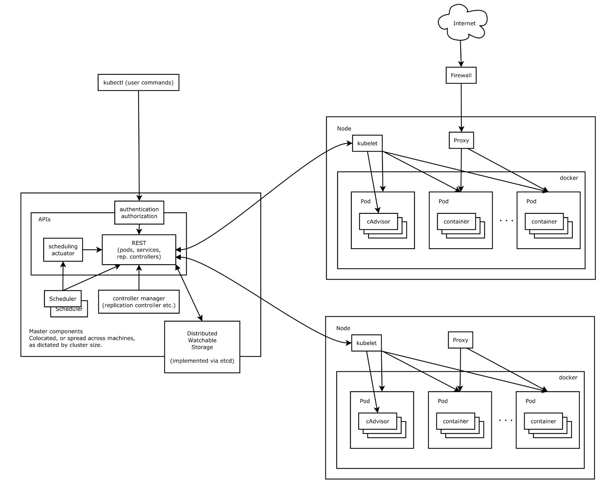

#### 纯容器模式的问题

1. 业务容器数量庞大，哪些容器部署在哪些节点，使用了哪些端口，如何记录、管理，需要登录到每台机器去管理？
2. 跨主机通信，多个机器中的容器之间相互调用如何做，iptables规则手动维护？
3. 跨主机容器间互相调用，配置如何写？写死固定IP+端口？
4. 如何实现业务高可用？多个容器对外提供服务如何实现负载均衡？
5. 容器的业务中断了，如何可以感知到，感知到以后，如何自动启动新的容器?
6. 如何实现滚动升级保证业务的连续性？

#### 架构图

如何设计一个容器管理平台？

- 集群架构，管理节点分发容器到数据节点
- 如何部署业务容器到各数据节点
- N个数据节点，业务容器如何选择部署在最合理的节点
- 容器如何实现多副本，如何满足每个机器部署一个容器的模型
- 多副本如何实现集群内负载均衡

分布式系统，两类角色：管理节点和工作节点

1.Scheduler-----负责调度的组件(选择把服务部署分发到哪些工作节点)

2.etcd-----------负责存储的组件(服务放在什么位置，记录工作节点启动哪些服务)

3.proxy-----提供负载均衡能力的组件(对外提供服务端口访问)

4.controller manager----提供副本管理的组件(某个工作节点挂了，自动迁移到其他节点)

5.跨节点通信的组件(不同的工作节点之间，可以跨节点通信)



#### 核心组件

- ETCD：分布式高性能键值数据库,存储整个集群的所有元数据
- ApiServer: API服务器,集群资源访问控制入口,提供restAPI及安全访问控制
- Scheduler：调度器,负责把业务容器调度到最合适的Node节点
- Controller Manager：控制器管理,确保集群资源按照期望的方式运行
  - Replication Controller
  - Node controller
  - ResourceQuota Controller
  - Namespace Controller
  - ServiceAccount Controller
  - Token Controller
  - Service Controller
  - Endpoints Controller
- kubelet：运行在每个节点上的主要的“节点代理”，脏活累活
  - pod 管理：kubelet 定期从所监听的数据源获取节点上 pod/container 的期望状态（运行什么容器、运行的副本数量、网络或者存储如何配置等等），并调用对应的容器平台接口达到这个状态。
  - 容器健康检查：kubelet 创建了容器之后还要查看容器是否正常运行，如果容器运行出错，就要根据 pod 设置的重启策略进行处理.
  - 容器监控：kubelet 会监控所在节点的资源使用情况，并定时向 master 报告，资源使用数据都是通过 cAdvisor 获取的。知道整个集群所有节点的资源情况，对于 pod 的调度和正常运行至关重要
- kube-proxy：维护节点中的iptables或者ipvs规则
- kubectl: 命令行接口，用于对 Kubernetes 集群运行命令 https://kubernetes.io/zh/docs/reference/kubectl/

### 理解集群资源

组件是为了支撑k8s平台的运行，安装好的软件。

资源是如何去使用k8s的能力的定义。比如，k8s可以使用Pod来管理业务应用，那么Pod就是k8s集群中的一类资源，集群中的所有资源可以提供如下方式查看：

```bash
$ kubectl api-resources
```

如何理解namespace：

命名空间，集群内一个虚拟的概念，类似于资源池的概念，一个池子里可以有各种资源类型，绝大多数的资源都必须属于某一个namespace。集群初始化安装好之后，会默认有如下几个namespace：

```bash
$ kubectl get namespaces
NAME                   STATUS   AGE
default                Active   84m
kube-node-lease        Active   84m
kube-public            Active   84m
kube-system            Active   84m
kubernetes-dashboard   Active   71m
```

- 所有NAMESPACED的资源，在创建的时候都需要指定namespace，若不指定，默认会在default命名空间下
- 相同namespace下的同类资源不可以重名，不同类型的资源可以重名
- 不同namespace下的同类资源可以重名
- 通常在项目使用的时候，我们会创建带有业务含义的namespace来做逻辑上的整合

### kubectl的使用

类似于docker，kubectl是命令行工具，用于与APIServer交互，内置了丰富的子命令，功能极其强大。https://kubernetes.io/docs/reference/kubectl/overview/

```
$ kubectl -h
$ kubectl get -h
$ kubectl create -h
$ kubectl create namespace -h
```

