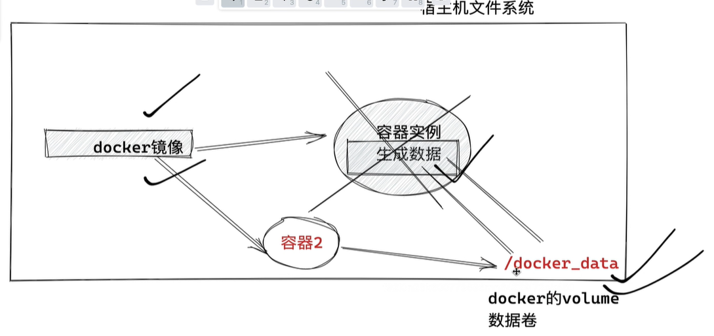
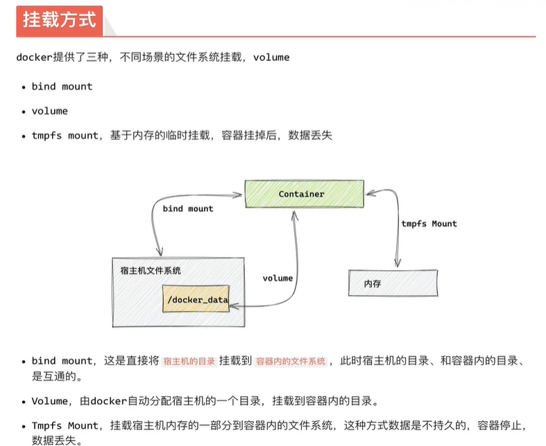
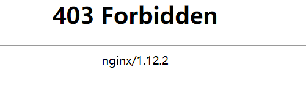
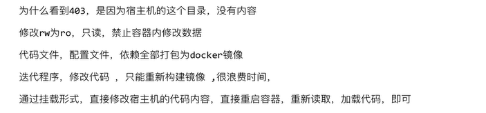

## Docker存储

## 数据卷Data Volumes

我们使用docker容器，也需要关注容器内的存储

Data Volumes是一个可供一个或多个容器使用的特殊目录

- 数据卷可以在容器内共享和重用
- 数据卷的修改会立即生效
- 数据卷的更新，不回影响镜像
- 数据卷会一直存在，即使容器被删除

数据卷的用法类似于Linux的mount挂载操作



**镜像中被指定为挂载点的目录**

其中文件会被隐藏，显示挂载的数据卷。


## 数据卷容器Data Volume Containers

数据卷容器涉及容器间共享的持久化、序列化的数据。

数据卷容器就是一个普通的容器，专门用于提供数据卷供给其他容器挂载使用。




## bind mount 模式

通过创建容器时，添加 -v --volume参数，容器内部，容器外部的目录，或文件

- 必须是绝对路径

```
-v host-path:container-path
```

1.运行nginx容器，查看数据卷挂载使用，通过宿主机的目录，修改容器内nginx程序

```
docker run -d -p 9090:80 --name yzh_nginx -v /my_docker_nginx:/usr/share/nginx/html nginx:1.12
```

2.尝试访问后403



3.查看容器具体信息找到数据卷相关

```
[root@docker01 /]#docker inspect yzh_nginx  

  "Mounts": [
            {
                "Type": "bind",
                "Source": "/my_docker_nginx",
                "Destination": "/usr/share/nginx/html",
                "Mode": "",
                "RW": true,
                "Propagation": "rprivate"
            }
        ],

```

4./my_docker_nginx在创建测试页面

```
[root@docker01 my_docker_nginx]# cat index.html 
<meta charset=utf-8>
测试页面
```


5.进入nginx容器看一下

```
[root@docker01 my_docker_nginx]# docker exec -it yzh_nginx bash
```

```
root@dab4e8b69d7c:/usr/share/nginx/html# cat index.html 
<meta charset=utf-8>
测试页面
```



```
#在镜像路径最后添加只读权限
[root@docker01 dockernginx]# docker run -d -P -p 8001:80 --name webnginx -v /dockernginx:/usr/share/nginx/html:ro nginx:1.12
```

然后我们查看mount挂载情况，发现编程只读了

```
     "Mounts": [
            {
                "Type": "bind",
                "Source": "/dockernginx",
                "Destination": "/usr/share/nginx/html",
                "Mode": "ro",
                "RW": false,
                "Propagation": "rprivate"
            }
        ],

```

## volume类型挂载

通过-v --volume参数挂载

-v 容器内的目录

```
[root@docker01 dockernginx]# docker run -p 8010:80 -d -v /usr/share/nginx/html nginx:1.12
```

查看容器详细信息

```
[root@docker01 dockernginx]# docker inspect cdf

	"Mounts": [
            {
                "Type": "volume",
                "Name": 
                //docker自动生成数据卷的名字
                "4025880e38c2543dfe7f74101a06292fa356a0d50a1f4307160032105d91ec27",
                "Source": "/var/lib/docker/volumes/4025880e38c2543dfe7f74101a06292fa356a0d50a1f4307160032105d91ec27/_data",
                "Destination": "/usr/share/nginx/html",
                "Driver": "local",
                "Mode": "",
                "RW": true,
                "Propagation": ""
            }
        ],

```

## 添加额外的volume参数

```
#第一个宿主机的数据卷命令
#设置只读
[root@docker01 _data]# docker run -p 8011:80 --name yzh_nginx2 -d -v \
> yzh_docker_data:/usr/share/nginx/html:ro nginx:1.12
d855623a54db92fb976b64c9a4f1347ccf256003ecdfed604c547cce9ed1d60e

docker inspect yzh_nginx2
```

查看容器信息

```
  "Mounts": [
            {
                "Type": "volume",
                "Name": "yzh_docker_data",
                "Source": "/var/lib/docker/volumes/yzh_docker_data/_data",
                "Destination": "/usr/share/nginx/html",
                "Driver": "local",
                "Mode": "ro",
                "RW": false,
                "Propagation": ""
            }
        ],

```

## --volumes-from 参数

读取某个容器的数据卷

```
运行第一个容器
docker run -d -p 6061:80 --name nginx01 -v nginx_html:/usr/share/nginx/html nginx:1.12

通过--volumes-from读取容器数据卷
docker rum -d -p 6062:80 --name nginx02 --volumes-from nginx01 nginx:1.12
```


## 查看数据卷

```
docker volume ls
```

## 删除数据卷

> 容器创建数据卷 数据是持久化的即使容器被删除，数据卷依然存在，确认无用即可删除这些数据

```
docker volume rm 存储卷名
```